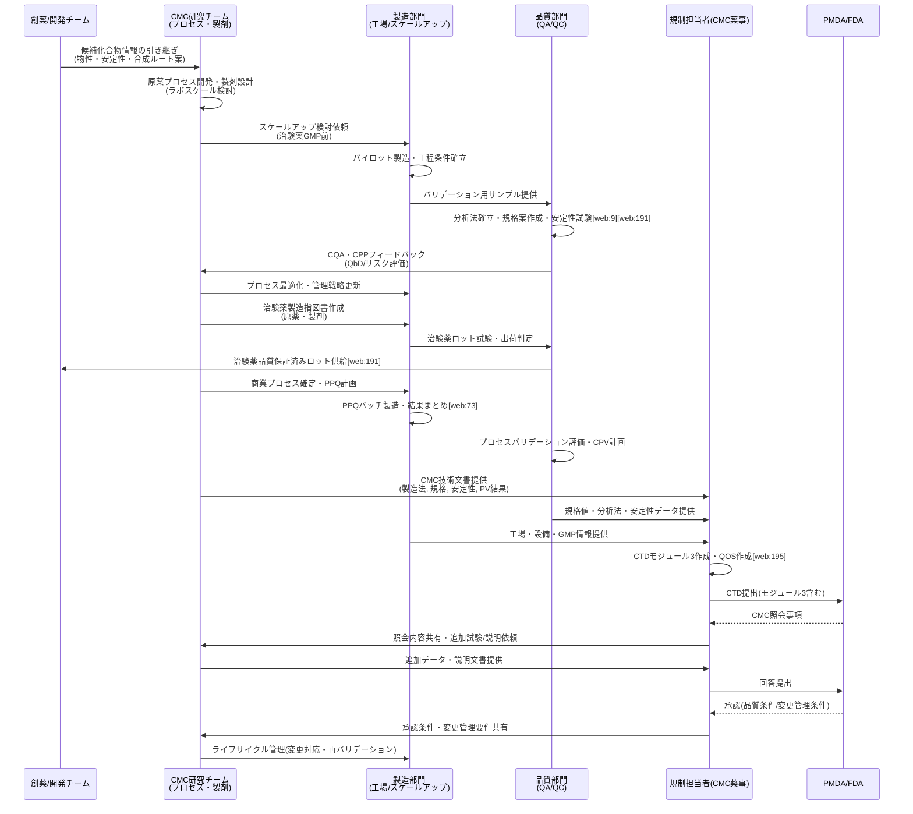
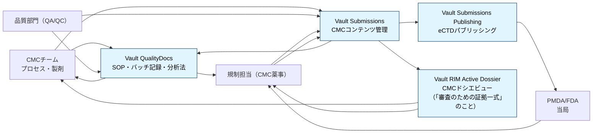
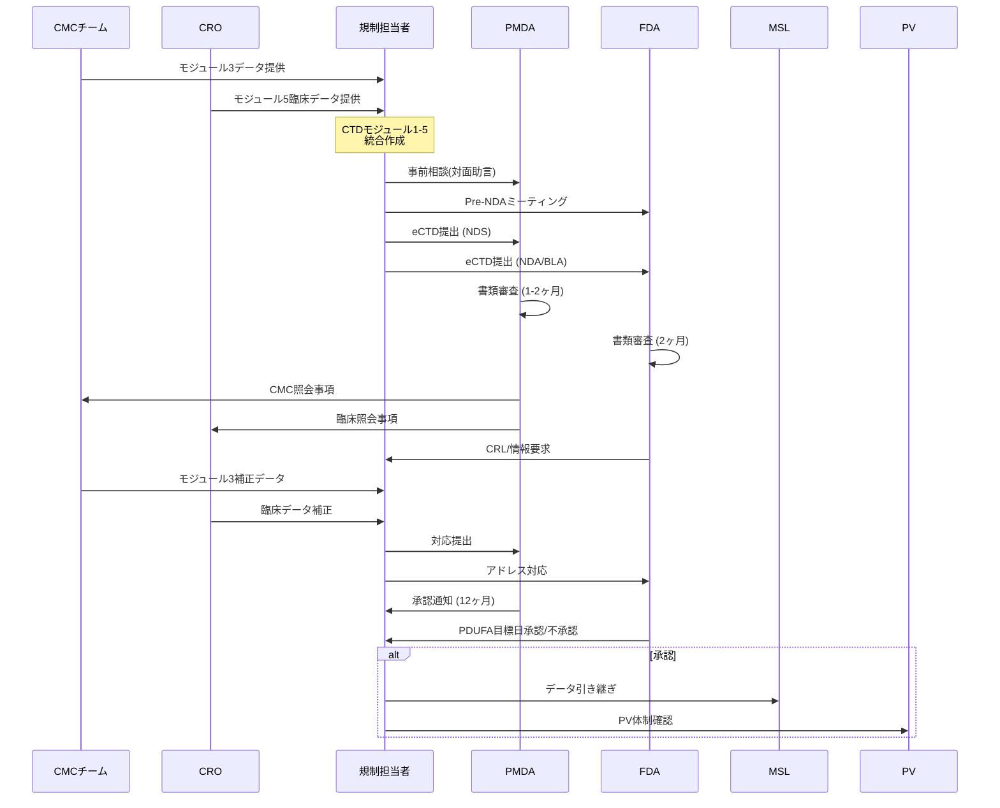
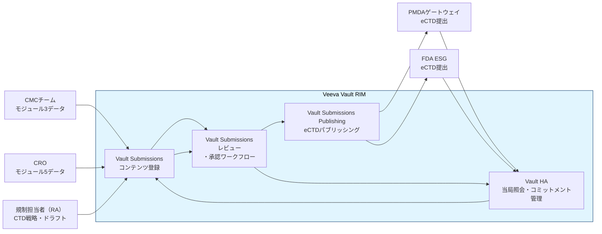
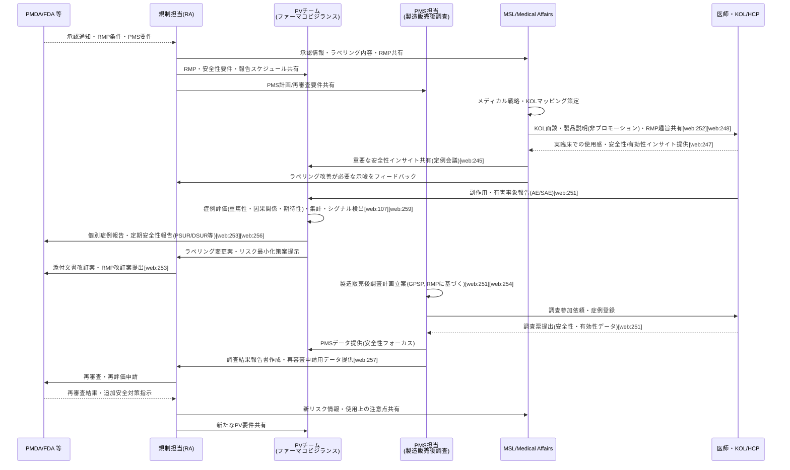
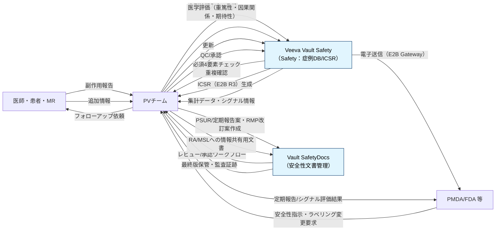

# 創薬プロセスとVeevaVault

- 創薬プロセスは、基礎研究から新薬の上市・市販後調査まで約10〜15年を要する多段階の流れです。
- 主に6つのフェーズに分かれ、各段階で安全性と有効性を厳格に検証します。

## 全体の流れ

- 創薬は「探索・非臨床・臨床・承認・上市・市販後」のステップで進み、数千の候補から1つが製品化される厳しい選別プロセスです。

### 各フェーズの概要

| フェーズ | 英語表記 | 内容 | 期間目安 |
|----------|----------|------|----------|
| 基礎研究 | Target Identification & Drug Discovery | 研究者が疾患標的を特定し、化合物ライブラリから有望候補を探索（化学合成・バイオ技術）。 | 2〜3年 |
| 非臨床試験 | Nonclinical Studies | CMCチームが動物・細胞実験で薬効・毒性・薬物動態（ADME）を評価し、CMCを開始。 | 2〜6年 |
| 臨床試験（I相） | Phase I Clinical Trial | CROが少数の健康人に安全性・薬物動態を確認。 | 1年 |
| 臨床試験（II相） | Phase II Clinical Trial | CROが少数の患者で有効性・用量・安全性を検証。 | 2年 |
| 臨床試験（III相） | Phase III Clinical Trial | CROが多数患者で既存薬比較、統計的有意性を証明。 | 3年 |
| 承認申請・審査 | Regulatory Approval (Submission & Review) | 規制担当者がPMDA/FDAにCTD（CMC含む）提出、審査対応。 | 1〜2年 |
| 上市・市販後 | Launch & Post-Marketing Surveillance (PMS) | MA/MSLが販売開始後、副作用監視（PMS）、KOLとの交流、教育、RWE収集を実施。 | 継続 |
| PhaseIV試験＊1 | Phase IV Clinical Trial | MSLが承認後に長期安全性・稀な副作用・適応拡大を検証（CRO支援）。 | 継続 |
| ファーマコビジランス（PV）＊2 | Pharmacovigilance | PVチームが上市後、副作用・有害事象を継続収集・評価・PMDA報告、添付文書改訂を実施（PMSと連携）。 | 継続 |

---
 

- ＊1：PhaseIVは育薬フェーズとして独立し、MSLがKOL連携で企画・推進します。
- ＊2：PVは全フェーズに横断しますが、特に上市後でMSL・PMSと密接に連携します。

 

## 創薬におけるCMC

- 創薬におけるCMCは、「候補化合物を、患者に届けられる“医薬品”として安定・安全に作れる状態にするための仕組み・技術・データ一式」を指す領域です。 

### CMCとは何か

- CMCは「Chemistry, Manufacturing and Controls（化学・製造・品質管理）」の略
- 新薬候補を研究段階から患者に届く製品へ橋渡しする役割を担います
- 安定して製造でき、安全性と品質が保証されなければ、どんなに優れた候補でも医薬品として承認・上市できないため、CMCは創薬開発の要 とみなされています

### 創薬プロセスの中での位置づけ

- 探索研究で見つかった「医薬品のタネ」を、効率よく、高品質で作れ、製剤化し、大量生産できるようにするプロセス全体を設計・構築するのがCMC開発の仕事です。 
- 創薬側（レシピの発明）と商業製造側（大量調理）の間で、「工場で再現できるレシピ」に落とし込む技術・設計がCMCと表現されます

### CMCの主な業務領域

- 原薬プロセス研究：原薬の合成ルート設計、スケールアップ、安全で再現性ある製造法の確立、原薬の品質属性の把握など
- 製剤開発研究：剤形（錠剤、注射剤など）の設計、添加剤選定、製造条件検討、安定性を考慮した処方設計など
- 品質評価・分析：構造確認、純度・不純物プロファイル、溶出性、物性評価、安定性試験などの分析法を確立し、規格と試験方法を設定
- スケールアップ・工業化：ラボスケールから治験薬製造、さらに商業生産ラインへとスケールアップし、GMP下で再現できる工程に仕上げ
- 技術移転と変更管理：開発部門から製造部門や CDMO（開発受託）/CMO（製造受託） への技術移転、サイト変更や設備変更時の品質同等性評価などを行う

### 規制・薬事（CMC薬事）の観点

- 承認申請ではCTDのCMCパートとして、原薬・製剤の特性、製造方法、品質管理、安定性などの情報を詳細に記載し、科学的根拠を示す必要があります
- 日本ではPMDA/MHLWの要求がICHガイドライン（例：安定性のICH Q1A(R2)など）と整合しており、製造工程の重要パラメータや製品の品質特性（CQA）を明確にして、変更時にどの程度の手続きが必要かも含めて戦略的に整理します。
- CMC薬事担当は、品質面の専門家として、規格値・試験法・安定性データ等の妥当性を示し、申請・照会対応を技術的にリードします。

### 創薬CMCと製薬CMC・CDMO/CMO

- 創薬CMCは「開発フェーズの設計者」として、治験薬レベルまで含めたプロセスと分析をつくり込みます。
- 製薬CMCは「商業フェーズの品質管理者」として、市販後も含めた品質一貫性やライフサイクル全体の変更管理を担います。
- CDMO（開発受託） はスケールアップや工程設計・分析法確立を共に行うパートナー、CMO（製造受託） は確立済みプロセスを安定して作る請負者として機能し、その橋渡しにCMCが深く関与します。

 

## バイオ医薬品CMC

- バイオ医薬品CMCは、抗体や融合タンパクなどの生物由来医薬品を対象としたCMCで、低分子薬と異なり細胞培養・精製中心の複雑プロセスを管理します。

### バイオ医薬品CMCの特徴

- バイオ医薬品は遺伝子組み換え細胞で生産されるため、CMCチームがロット間不均一性や不純物（宿主細胞タンパク質、ウイルス）をQbD（品質設計）で管理し、CQA（重要品質特性）を特定します。
- 低分子薬の化学合成に対し、バイオは生細胞依存で再現性確保が難しく、ICH Q8-11ガイドラインに基づくプロセスバリデーション（Stage1-3）が必須です。 

### 主なプロセスフロー

| 工程 | 内容 |
|------|------|
| セルライン開発 | CMCチームが目的遺伝子を導入した安定生産細胞（CHO細胞等）を作成、MCB/WCBをGMP下で構築 |
| アップストリーム（培養） | CMCチームがシード培養→本培養でタンパク生産を最適化（培地、pH、溶存酸素などのCPP制御） |
| ダウンストリーム（精製） | CMCチームが遠心/ろ過→Protein Aクロマト→低pH処理→イオン交換→ウイルス除去ろ過→UF/DFで精製、ウイルス安全性確保  |
| 製剤・充填 | CMCチームが安定化剤添加、最終無菌充填、安定性試験を実施 |
 

### 低分子CMCとの違い

| 項目 | 低分子CMC | バイオ医薬品CMC |
|------|-----------|----------------|
| 生産方式 | 化学合成（単純再現性高い）  | 細胞培養・精製（生物変動大）  |
| 品質課題 | 不純物・結晶多形  | 糖鎖異性体、凝集、細胞由来不純物 |
| 管理重点 | 合成ルート最適化 | プロセス耐性（頑健性）、CPV（継続的検証） |
| 規制 | ICH Q7等  | ICH Q5系＋Q8-11（QbD）  |

 

## 業務プロセス

### CMCの業務工程

- 上流（DS→CMC）：候補受け取りからプロセス・製剤設計。
- 中流（CMC↔MFG↔QA/QC）：治験薬〜商業生産のプロセス確立と品質管理。 
- 下流（CMC/QA/QC→RA）：CTDモジュール3作成とPMDA/FDA照会対応までがCMC業務のコアです。

### CMC業務プロセス

- CMC業務プロセスを、「候補取得〜治験薬供給〜商業生産〜CTD作成」までの流れとしてシーケンス図にしました。
- 主なアクターは CMC研究、製造部門、品質部門、規制担当者 です。

 

### CMC視点でのVault利用フロー

#### 各アプリのCMC向け役割

- Vault QualityDocs：  
  - 製造SOP、試験法、バリデーション報告書、バッチ記録などGMP/品質文書の単一の真実のソース。
  - CMC・QAが参照し、改訂管理や監査対応の基盤になります。

- Vault Submissions（RIM）：  
  - CTDモジュール3用のCMC関連文書（製造法記述、規格・分析法、安定性報告など）を収集・レビュー・承認する場。
  - QualityDocsにあるGxP文書をリンクしつつ、「申請用に整形されたバージョン」を管理します。

- Vault Submissions Publishing：  
  - Submissionsで承認されたCMCコンテンツから、eCTDに適合したモジュール3パッケージを自動レンダリングし、PMDA/FDA提出用に整形。

- Active Dossier（RIM）：  
  - 特定製品×市場に対して「現在有効なCMC文書セット」を一覧化し、ライフサイクル（変更影響・バージョン）を俯瞰するビュー。
  - CMC/RAが変更管理・再申請時に「どのドキュメントが効いているか」を即座に把握できます。

- これらを組み合わせることで、CMC業務の実務(GxP)＝QualityDocs、規制提出(CMCドシエ)＝RIM(Submissions/Publishing/Active Dossier)という役割分担になります。

 
 

## CRO（Contract Research Organization）

- CROは、製薬企業から臨床試験（治験）業務を委託される専門機関で、開発効率化とデータ信頼性を支えます。

### CROの定義と役割

- CROが、製薬企業から治験（I〜III相）や市販後調査を請け負い、GCP遵守のもと試験の質・スピードを確保します。
- 主にCROがプロジェクト全体をマネジメントし、内製コスト削減を実現します。

### 主な業務領域

| 業務 | 内容 |
|------|------|
| 試験計画立案 | CROが プロトコル作成、医療機関選定・契約、IRB申請を支援 |
| モニタリング | CRA（CRO所属）が 現場監視、SDV（原資料確認）、GCP遵守を検証 |
| データ管理 | CROが CRF収集、データベース化、統計解析、総括報告書を作成 |
| 薬事支援 | CROが PMDA相談、ファーマコビジランス、メディカルライティングを実施 |
 

### 創薬プロセスとの関連（バイオ医薬品含む）

- バイオ医薬品CMC完了後、CROが臨床試験を担い、MSL（Medical Affairs）が上市後交流を補完します。
- 日本市場ではグローバル試験支援が増え、CRO活用が標準化しています。

 

## PMDAとFDA

- PMDAとFDAは、新薬承認審査の主要規制当局です。
- PMDAが日本、FDAが米国を管轄し、CTD提出先となります。

### PMDA（Pharmaceuticals and Medical Devices Agency）

- 2004年設立の独立行政法人で、厚生労働省所管下に医薬品・医療機器の承認審査、安全対策、健康被害救済の3業務を担います。
- 創薬表の「承認申請・審査」で規制担当者が提出するCTDを審査し、約12ヶ月で承認判断します。
- 公式サイト: https://www.pmda.go.jp/about-pmda/outline/0001.html

### FDA（Food and Drug Administration）

- 米国保健福祉省下の連邦機関で、医薬品・食品・医療機器等の安全性・有効性を規制します。
- NDA（低分子）/BLA（バイオ）をPriority（6-10ヶ月）/Standard（10ヶ月）で審査し、グローバル承認の金字塔です。

### 創薬プロセス表での役割

| 機関 | 役割 | 審査期間 |
|------|------|----------|
| PMDA | 日本国内承認（CTD/eCTD審査） | 12ヶ月 |
| FDA | 米国・グローバル承認（NDA/BLA） | 6-10ヶ月 |

 

- 両者ともICHガイドライン準拠で、CMCチームのモジュール3データを厳格に検証し、PV・MSLの市販後体制も確認します。

#### モジュール3データ

- CMCチームのモジュール3データは、CTD（Common Technical Document）の品質（Quality）モジュールで、製造・品質管理の全データを体系的にまとめたものです。
- 原薬・製剤の科学的根拠を詳細に記述し、PMDA/FDA審査で「製品が安定・均一・安全に製造可能」を証明します。

| サブモジュール | 内容 |
|----------------|------|
| 3.2.S（原薬） | CMCチームが原薬製造工程、規格・分析法、不純物管理、安定性データを作成（バイオ医薬品はセルライン・培養・精製詳細）。 |
| 3.2.P（製剤） | CMCチームが最終製剤の処方、製造工程、容器包装、溶出・安定性試験を記載。 |
| 3.2.R（地域特異） | 規制担当者が日本特有の実行管理基準（GMP適合性調査）等を追加。 |

 

## PMDA/FDAへのCTD提出

- PMDA/FDAへのCTD提出は、新薬承認申請の核心で、国際標準化された包括的データセットを電子提出（eCTD形式）します。

### CTD（Common Technical Document）

- 品質・非臨床・臨床データを5モジュールで整理した標準申請書類で、ICHガイドライン（M4）に基づきます。
- 日本PMDA・米国FDA間で共通形式で、CMCはモジュール3に集約されます。

### CTDのモジュール構成

| モジュール | 内容 | 担当主語 |
|------------|------|----------|
| 1（地域特異） | 申請書・目次・日本特有書類（PMDA用） | 規制担当者が作成 |
| 2（サマリー） | 品質・非臨床・臨床の要約（QOS等） | 規制担当者が全体統括 |
| 3（品質/CMC） | 原薬・製剤の製造・規格・安定性データ（バイオ医薬品は細胞・精製詳細） | CMCチームが詳細作成 |
| 4（非臨床） | 動物試験・毒性データ | CMCチームが要約 |
| 5（臨床） | Phase I-IIIデータ・プロトコル | CROがデータ提供 |
---
 

## 提出プロセス（PMDA/FDA共通）

1. 規制担当者がCTDをeCTD形式に変換、事前相談（PMDA：対面助言）でフィージビリティ確認。
2. CMCチームがモジュール3（3.2.S原薬、3.2.P製剤）を中心にQbDデータ・安定性陳述書を充実。
3. PMDA（日本）へ電子申請→約12ヶ月審査、FDAへNDA/BLA提出→10ヶ月Priority/Standard審査。
4. 承認後、PV・MSLへデータ引き継ぎ。

#### 提出・審査プロセス概要

 

### 提出・審査プロセスとVeeva Vault

- Veeva Vault RIMのうち、「提出〜審査対応」のプロセスに直接効く部分（Submissions / Submissions Publishing / HA）だけに絞ったフローチャート

 
 

## MSL（Medical Science Liaison）とMA（Medical Affairs）

- Medical affairsは、製薬企業の中で「科学・医療の立場から製品価値をつくり、外部と対話し、社内にインサイトを戻す専門職チーム」です。
- MSLは、Medical Affairs部門の主力人材で、上市後フェーズで科学的交流を担います。

### 何をする人たちか

- 科学的エビデンスを理解し、それを医師・KOL・ペイヤーなどに正確かつ非プロモーションで伝える。  
- 実臨床での使われ方やアンメットニーズをKOLとの対話から拾い、開発・マーケ・PV・RAにフィードバックする。  
- 上市後も含め、適正使用・RWE・追加エビデンス（観察研究等）を通じて「育薬」に関わる。

### コアな役割

| 軸 | Medical affairsがすること |
|----|--------------------------|
| 外向き（Outside-in） | MSLがKOL/HCPと科学的ディスカッションを行い、未充足ニーズ・実臨床の課題・安全性/有効性インサイトを収集 |
| 内向き（Inside-out） | 得られたインサイトを開発戦略・エビデンス計画・ラベリング検討に反映し、社内に科学的観点から助言 |
| エビデンス | 観察研究やRWE、IIT支援など、Phase III以降の追加データ創出を企画・サポート |
| 教育・情報提供 | 学会発表、メディカルミーティング、社内トレーニング等を通じて、疾患・治療・データに関する教育を実施 |
| コンプライアンス | 営業部門とは独立し、プロモーションではなく科学的・中立的立場で活動することで、倫理・規制要件を担保 |

### MAとMSLとの関係

- Medical affairs部門の「現場（フィールド）担当」がMSLで、KOLと直接会い、双方向の科学コミュニケーションを行います。
- Headquarters側のMA（戦略・プランニング）と、Field側のMSLがセットで「医療現場と会社をつなぐ科学窓口」を構成しているイメージです。

### MSLの定義と役割

- MSLが、KOL（キーオピニオンリーダー：影響力ある医師・研究者）と対等な立場で科学的議論を行い、アンメットニーズ（未解決医療課題）やインサイトを収集・社内共有します。
- MR（営業）とは異なり、非プロモーションの純粋科学的活動に限定され、医薬品の適正使用と育薬（ライフサイクル価値向上）を推進します。

### MSLの主な業務内容

| 業務 | 内容 |
|------|------|
| KOL交流 | MSLが定期面談・アドバイザリーボードでデータ共有、フィードバック収集（エンゲージメントプラン策定） |
| 情報収集・分析 | MSLが学会参加・文献調査で最新知見を把握、メディカルインサイトをR&Dに還元 |
| 研究支援 | MSLがPhase IV試験・IIT（医師主導研究）の企画支援、論文作成・発表サポート |
| 社内連携 | MSLが臨床開発・マーケティングにインサイト提供、メディカル戦略立案に貢献 |

 

### 創薬プロセスとの位置づけ

- 前表の「上市・市販後」フェーズでMSLが中心的に活動し、CRO（臨床試験実施）→規制承認→MSLのKOL交流・PMS支援の流れを補完します。
- バイオ医薬品でも同様で、複雑な作用機序のエビデンス生成に強みを発揮します。

 

## 申請承認後の業務プロセス

- 承認後は、RAから引き継いで MSLが「科学コミュニケーションとRWE」、PVが「安全性監視とPMS」 を中心に動きます。
- 以下に、PMDA/FDA承認後〜市販後フォローまでのシーケンスを示します（Phase IVは省略）。

 

## PV視点でのユースケース（自発報告が来た場合）

1. 症例受付・トリアージ  
   - HCPや患者からメール・電話・MR経由で副作用の疑いが報告されます。  
   - PV担当者が「有効症例か（必須4要素：患者・報告者・疑義薬・事象）」「重篤性・期限（7/15日報告対象か）」を判定します。

2. ケース登録・データ入力
   - PV担当者が安全性データベースに新規ケースを登録し、既存症例との重複チェックを行います（フォローアップか新規か）。
   - 報告内容を詳細に入力し、MedDRAでイベントをコーディング、薬剤情報・用量・経路・併用薬・既往歴などを記録します。

3. 医学評価（重篤性・因果関係・期待性）  
   - PVの医師・薬剤師が事象の重篤性（死亡・入院等）、因果関係（関連あり/なし）、既知か未知か（添付文書との比較）を評価します。
   - 不足情報があれば、報告者へのフォローアップ問い合わせを作成し、追跡します。

4. ICSR作成・当局報告  
   - 規制要件に従い、個別症例安全性報告（ICSR）をE2B(R3)形式で生成し、QC後にPMDA/FDA等へ電子送信します。
   - 重篤かつ予期せぬ症例は「迅速報告」（7〜15日以内）、それ以外は定期報告やPMS集計に組み込みます。

5. シグナル検出・リスク評価  
   - 累積データとして同種の症例を集計し、頻度や重篤性から安全性シグナルの有無を評価します。
   - 新しいリスクが疑われる場合、RMP上の重要な潜在的リスク/既知のリスクとして再評価します。

6. ラベリング・リスク最小化への反映  
   - PVチームが添付文書の副作用欄・警告・用量制限などの改訂案を作成し、RAに提案します。
   - RAがPMDA等と協議し改訂を行い、その内容をMSLがKOL/HCPにメディカルコミュニケーションとして展開します。

このユースケース全体で、PVは「1症例」を形式的に処理するだけでなく、累積データの中で安全性シグナルに昇華させ、最終的にラベリング・RMP更新までつなげる役割を担います。

 

### 症例報告のユースケースとVeeva Vault

- **Vault Safety**：症例受付・ICSR作成・E2B送信・シグナル検出など、PVのケース処理の中核システム。
- **Vault SafetyDocs**：PSMF/RMP/PVA/PSUR等の安全性関連文書とワークフローを一元管理し、PV業務の「コンテンツ側」を支えます。
