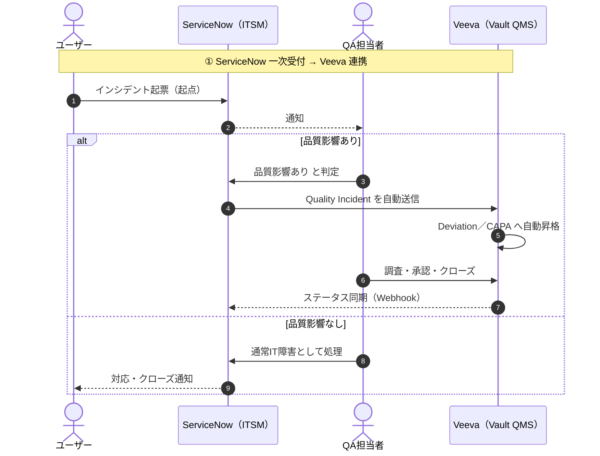
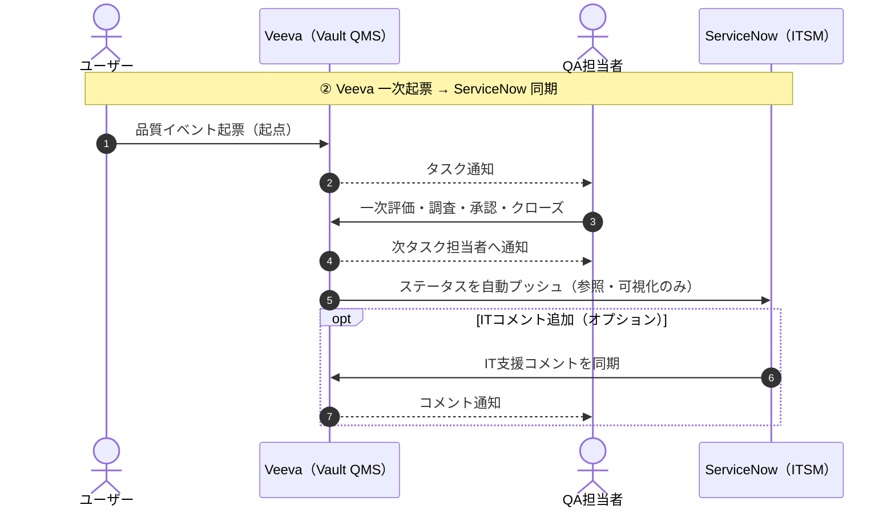

# ITSMにおけるServiceNow と Veeva Systems の比較

---

## Introduction

ライフサイエンス業界におけるITサービス管理（ITSM）は、一般的なIT運用の枠を超え、GxP規制（Good Practice）への準拠という特有の要件を伴う。製造・品質・薬事・安全性などのプロセスをITシステム上で管理する場合、FDA 21 CFR Part 11やEU GMP Annex 11をはじめとする規制要件への対応が不可欠であり、システム選定と運用設計の両面で慎重なアプローチが求められる。

本文書では、ITSMの中核を担う **ServiceNow** と、GxP品質管理に特化した **Veeva Systems（Vault QMS等）** を比較・考察する。両システムの特性・役割・GxP対応レベルを整理したうえで、インシデント管理・問題管理・変更管理・品質イベント管理における実務的な導入パターンを示す。

特に、以下の観点を中心に論じる。

- ServiceNow の GxP対応における前提条件とバリデーション（CSV）アプローチ
- Veeva QMS における標準品質フロー（逸脱・CAPA・変更管理等）
- 両システムの役割分担と連携パターンの比較
- 自社状況に応じた最適な導入・運用方針の選択

本文書が、ライフサイエンス企業のIT・品質部門における意思決定の参考となることを目的とする。

---

<br>

## 目次

1. [ServiceNow の GxP 対応](#1-servicenow-の-gxp-対応)
   - 1.1 [基本スタンス（何が「GxP対応」か）](#11-基本スタンス何がgxp対応か)
   - 1.2 [GxP対応で押さえるべき機能・設定のポイント](#12-gxp対応で押さえるべき機能設定のポイント)
   - 1.3 [バリデーション（CSV）の進め方の考え方](#13-バリデーションcsvの進め方の考え方)
   - 1.4 [運用上の注意点（ドリフト・マルチインスタンス）](#14-運用上の注意点ドリフトマルチインスタンス)
   - 1.5 [実務で検討すべきトピック例](#15-実務で検討すべきトピック例)

2. [ServiceNow と Veeva の基本的な違い](#2-servicenow-と-veeva-の基本的な違い)
   - 2.1 [ざっくりした違いのイメージ](#21-ざっくりした違いのイメージ)
   - 2.2 [導入しやすさの比較（GxP前提）](#22-導入しやすさの比較gxp前提)
   - 2.3 [GxP観点での「導入しやすさ」の分解](#23-gxp観点での導入しやすさの分解)
   - 2.4 [現実的な進め方](#24-現実的な進め方)

3. [Veeva QMS における品質イベントの標準フロー](#3-veeva-qms-における品質イベントの標準フロー)
   - 3.1 [逸脱（Deviation）の基本フロー](#31-逸脱deviationの基本フロー)
   - 3.2 [CAPA（Corrective and Preventive Action）の基本フロー](#32-capacorrective-and-preventive-actionの基本フロー)
   - 3.3 [変更管理（Change Control）の基本フロー](#33-変更管理change-controlの基本フロー)
   - 3.4 [監査指摘・苦情などその他イベント](#34-監査指摘苦情などその他イベント)
   - 3.5 [ServiceNow との「考え方の違い」の補足](#35-servicenow-との考え方の違いの補足)

4. [ServiceNow と Veeva の連携パターン](#4-servicenow-と-veeva-の連携パターン)
   - 4.1 [連携が必要な理由と技術的根拠](#41-連携が必要な理由と技術的根拠)
   - 4.2 [パターン①：ServiceNow 一次受付 → Veeva 連携](#42-パターン①servicenow-一次受付--veeva-連携)
   - 4.3 [パターン②：Veeva 一次起票 → ServiceNow ステータス同期](#43-パターン②veeva-一次起票--servicenow-ステータス同期)
   - 4.4 [GxP観点の注意点](#44-gxp観点の注意点)

5. [3つの導入パターンの総合比較](#5-3つの導入パターンの総合比較)
   - 5.1 [全体比較表](#51-全体比較表)
   - 5.2 [各案の詳細プロコン](#52-各案の詳細プロコン)
   - 5.3 [推奨案](#53-推奨案)

6. [ServiceNow 完全一本化の検討](#6-servicenow-完全一本化の検討)
   - 6.1 [なぜ可能だが非推奨か](#61-なぜ可能だが非推奨か)
   - 6.2 [実現方法の概要](#62-実現方法の概要)
   - 6.3 [メリット・デメリット比較](#63-メリットデメリット比較)
   - 6.4 [いつ検討する価値があるか](#64-いつ検討する価値があるか)
   - 6.5 [結論](#65-結論)

7. [品質イベントの報告・管理運用](#7-品質イベントの報告管理運用)
   - 7.1 [品質イベントとは（定義・範囲）](#71-品質イベントとは定義範囲)
   - 7.2 [報告の流れ（ユーザーが正しく登録できる仕組み）](#72-報告の流れユーザーが正しく登録できる仕組み)
   - 7.3 [ユーザーが正しく登録できる理由（実務対策）](#73-ユーザーが正しく登録できる理由実務対策)
   - 7.4 [顧客苦情の位置づけ](#74-顧客苦情の位置づけ)
   - 7.5 [ITSMチケットと品質イベントの違い](#75-itsmチケットと品質イベントの違い)
   - 7.6 [品質イベントの用語整理（段階別）](#76-品質イベントの用語整理段階別)

---

<br>

## 1. ServiceNow の GxP 対応

### 1.1 基本スタンス（何が「GxP対応」か）

ServiceNowは「GxP対応済み製品」ではなく、「GxPコンパチブルなPaaS」であり、GxPに適用するためのバリデーション設計・運用が前提になります。

- ServiceNow自体はGxPシステムとして**事前バリデーションされていない**が、設定次第でGxP要求（21 CFR Part 11など）を満たせると公式コミュニティでも明言。
- GxP影響のあるワークフロー（製造・品質・薬事・安全性など）を載せた瞬間に、GAMPカテゴリ4/5相当のシステムとして扱われ、顧客側でCSV（コンピュータ化システムバリデーション）が必須になる。

### 1.2 GxP対応で押さえるべき機能・設定のポイント

- 監査証跡（sys_audit・sys_audit_deleteなど）を有効化し、GxP対象テーブルでの作成・更新・削除を完全追跡する設計。削除禁止テーブルでは削除検知時にアラートを上げる実装が推奨。
- ロールベースアクセス制御（RBAC）で、GxPデータへの参照・更新を最小権限にすること。権限変更自体も監査対象に含める。
- 電子署名・電子記録（21 CFR Part 11）については、ワークフロー内での承認ステップ、e-sign相当の認証（再認証、署名理由の記録など）を設計し、Part 11マッピングドキュメント（ServiceNow CORE資料）を用いて要件紐づけを行う。
- データ完全性（ALCOA+）を満たすため、テーブル設計・フォーム設計時に必須項目、デフォルト値、参照整合性を明確化し、設定内容に対するConfig Qualification（CQ）テストを用意する。

### 1.3 バリデーション（CSV）の進め方の考え方

- Quality部門（QA、CSVチーム）を初期段階から巻き込み、GxP対象プロセスの範囲定義、リスク評価、必要なバリデーションレベル（GAMPカテゴリ、テスト網羅度）を合意することが重要とされている。
- Vモデル／ライフサイクルとして、ユーザ要求仕様（URS）→機能仕様（FS）→設定仕様（DS）→CQ/IQ/OQ/PQ相当のテスト・証跡を用意する一般的なCSVアプローチが推奨されている。
- アップグレードや継続的開発に対しては、回帰テスト自動化ツール（AutomateProなど）や、GxP向けに事前バリデーションされた拡張プラットフォーム（ProcessXなど）を組み合わせる事例も多い。

### 1.4 運用上の注意点（ドリフト・マルチインスタンス）

- QA/検証環境と本番環境の設定ドリフトは、「バリデーション崩壊」の典型的リスクとされており、クローン戦略・変更管理・デプロイパイプラインの統制が極めて重要。
- GxPワークロードとNon-GxPワークロードを同一Platform上でどう住み分けるか（インスタンス分離、スコープアプリ分離、Role／DataSegregationなど）は、リスク評価に基づき設計することが一般的。

### 1.5 実務で検討すべきトピック例

- GxP対象プロセス：Change/Release for GxPシステム、Deviations・CAPA、監査指摘・是正、製造・品質関連の申請・承認フローなど。
- どこまでをServiceNowでやり、どこからを既存のQMS/文書管理/実験系システムに任せるかの分界。
- 自社CSV標準（SOP群）とServiceNow特有の開発運用（スクラム、CI/CD、ストアアプリ）との整合をどう取るか。

---

<br>

### 何が難しいのか：機能 vs. バリデーション

- 機能自体はServiceNowの標準機能で実現できます。
- ポイントは「機能があるかどうか」ではなく、**「GxP規制に準拠した形で設定・証明する責任が顧客側にある」** という点です。
- FDA査察や内部監査で問われるのは「この設定は要件を満たしているか？」ではなく、「**それをどうやって検証・文書化したか？**」です。
- Veevaはその証明責任の大半をベンダーが負っているのに対し、ServiceNowはすべて顧客側の責任になる、というのが本質的な違いです。

<br>

| 項目 | ServiceNowの標準機能 | GxP文脈で追加で必要なこと |
|------|-------------------|------------------------|
| **監査証跡** | sys_auditテーブルは標準で存在 | 「どのテーブルを対象にするか」「削除をどう検知するか」をGxP要件として**文書化・資格証明（CQ）**する必要がある |
| **RBAC** | ロール・権限管理は標準機能 | 「最小権限の根拠」「権限変更の承認フロー」を**SOPとして整備し、定期レビューの証跡**を残す必要がある |
| **電子署名** | 承認ステップは標準ワークフローで実装可能 | 21 CFR Part 11の要件（再認証・署名理由の記録・否認防止など）に**一つひとつ対応していることをマッピング文書で証明**する必要がある |
| **データ完全性** | 必須項目・デフォルト値はフォーム設計で対応可能 | ALCOA+（Attributable / Legible / Contemporaneous / Original / Accurate +α）の各要件を**設定仕様書に落とし込み、テスト証跡を残す**必要がある |

---

<br>

### バリデーションの本来の意味

> **「システムが意図した目的に対して、一貫して期待通りに機能することを、文書化された証拠によって確立するプロセス」** （FDA定義より）

#### 3つの概念の関係

| 概念 | 意味 |
|------|------|
| **バリデーション** | 「このシステムは要件通りに動くか」を計画的に検証し、証跡を残すプロセス全体 |
| **証跡（Evidence）** | バリデーションを実施した結果として残るドキュメント（テスト結果・仕様書など） |
| **証明責任** | 査察・監査で「バリデーションをやった」と示す義務。証跡があって初めて果たせる |

#### 具体的なイメージ

たとえば「監査証跡が正しく記録される」ことをバリデーションするとは、

1. **計画**：どのテーブルを対象に、何を記録するかをURS（ユーザー要求仕様）に書く
2. **実施**：実際にレコードを作成・更新・削除し、監査ログに正しく残るかをテストする
3. **記録**：テスト手順・結果・合否を文書として保管する

この①〜③のプロセス全体がバリデーションであり、証明責任はその文書があることで果たされます。

#### Veevaとの違いに戻ると

- **Veeva**：①〜③をベンダーがあらかじめ実施済み（**事前バリデーション**）。顧客は追加設定部分だけ検証すればよい
- **ServiceNow**：①〜③をすべて顧客が自前で設計・実施・記録する必要がある

なので「ServiceNowはバリデーションが大変」というのは、「機能を作ること」ではなく「検証プロセスを一から自分で回すこと」が大変、という意味になります。

<br>

## 2. ServiceNow と Veeva の基本的な違い

### 2.1 ざっくりした違いのイメージ

**ServiceNow ITSM**
- 汎用ITSM基盤として強力だが、GxP対応は「自社でルール設計＆CSVする前提」のプラットフォーム型。
- 既にITSMを運用している場合、インシデント〜問題管理への拡張自体はスムーズ。ただし「GxPとして使う」場合は、プロセス設計とCSVの追加工数が乗るイメージ。

**Veeva（Vault QMS/QualityDocsなど）**
- GxP/品質系業務に特化したSaaSで、Part 11やAnnex 11を見据えた機能・テンプレート・ベストプラクティスが最初から厚い。
- その代わり、ITインシデントや汎用ITSMというより「品質イベント／CAPA／変更管理／文書管理」などQuality主導領域にフィット。

### 2.2 導入しやすさの比較（GxP前提）

#### 1. インシデント〜障害対応（今やっている範囲＋α）

**ServiceNow ITSM**
- 既に運用中のため、「GxPインシデント」を区別するためのカテゴリ／フラグ・専用ワークフロー・監査証跡強化（監査テーブル・権限制御）の追加で対応可能。
- CSV観点では、「GxP関連インシデント管理プロセス（URS）」を定義し、それに対する設定仕様・テスト（OQ/PQ）を作る必要あり。

**Veeva**
- ITインシデント用途というより、「品質イベント／苦情／逸脱」として扱う領域が主で、IT障害そのものをVeevaでさばくケースは少ない。

> → IT部門中心のチケット受付〜障害対応であれば、GxPであっても「ServiceNowを拡張してCSVする方が現実的に導入しやすい」ケースが多いです。

#### 2. 問題管理（根本原因分析・CAPA連携）

**ServiceNow ITSM（Problem Management）**
- ITIL準拠の問題管理は標準機能で、インシデントデータからの傾向分析→問題→恒久対策という流れを作りやすい。
- GxP的には、問題管理の一部が「ITシステムに起因する品質リスク／逸脱の原因分析」に繋がるなら、問題レコードと品質CAPA／変更管理（たとえばVeeva側）をどうリンクさせるかが論点。

**Veeva QMS**
- もともとCAPA／変更管理／逸脱／監査指摘などをGxP前提で標準化しているため、「品質問題管理」という意味では導入しやすい。
- ただしITインシデント起点の技術的な問題管理まですべてVeeva側に載せると、IT運用としては扱いにくくなる可能性あり。

> → 「ITのProblem」はServiceNow、「GxP品質イベント／CAPA」はVeevaという役割分担にし、連携（チケット連番やリンク、インターフェース）で繋ぐのが導入しやすいパターンです。

### 2.3 GxP観点での「導入しやすさ」の分解

| 観点 | ServiceNow ITSM（既存） | Veeva（Vault QMS等） |
|------|------------------------|---------------------|
| 想定ドメイン | 汎用ITSM（インシデント／問題／変更） | 品質・GxPプロセス（CAPA／変更管理／逸脱／監査／文書） |
| GxP対応レベル | プラットフォームとしては対応可能だが、要件定義・設定・CSVは自社で設計 | GxP前提の機能とテンプレートが厚く、ベンダーバリデーションも前提にしやすい |
| 既存資産活用 | 既にITSM運用中のため、プロセス拡張とCSVの追加で対応しやすい | 新規導入になるため、部門巻き込みとプロセス移行が必要 |
| 導入初期工数 | IT側は低め、GxP要件整理とCSV工数が別途発生 | 品質・QA主体でのFit/Gapと移行プロジェクトが必要だが、GxPテンプレがある分、設計は楽 |
| 将来拡張 | IT運用全般、SCMや他システムのITSM窓口として横展開しやすい | QMS・文書・トレーニングなどライフサイエンス品質領域へ縦深展開しやすい |

### 2.4 現実的な進め方

- 「チケット受付～障害対応（インシデント）」「IT起因の問題管理」については、既存ServiceNow ITSMをベースに、GxPリスク評価＋CSVを追加していく方が導入しやすいと思われます。
- 同時に、Veevaは「品質・GxP本丸（CAPA／逸脱／変更管理／文書／トレーニング）」として導入を進め、ITインシデント・問題との連携ポイント（例えば、重大インシデント→Veeva側の品質イベント自動起票など）をインターフェースで結ぶ構成が、SCMや製造現場とも整合しやすい形です。

---

<br>

## 3. Veeva QMS における品質イベントの標準フロー

VeevaのGxP側は「品質イベントを一元管理するQMS」で、典型パターン（逸脱・CAPA・変更管理など）ごとに標準フローが用意されています。以下、代表パターンごとに整理します（用語は一般GMP＋Veeva QMSベース）。

---

### 3.1 逸脱（Deviation）の基本フロー

「SOPどおりにできなかった」「規格から外れた」などの出来事を扱う流れです。

1. **発生・起票** — オペレーターや担当者が、画面から「逸脱レコード」を起票（何が・いつ・どこで・どう起きたかを入力）。
2. **受付・一次評価** — QAまたは品質担当が内容を確認し、「重大度」「影響範囲」「GxP影響の有無」を評価。重大度が高ければ、後続でCAPAや変更管理を必須にするルールを設定可能。
3. **調査・原因究明** — 関係部署（製造／品質／設備など）にタスクが自動割り当てされ、原因調査を実施。関連ドキュメント（SOP、バッチ記録など）をVeeva内の文書とリンクして参照。
4. **処置・方針決定** — その場しのぎの暫定処置（影響ロットの隔離など）と、恒久対策（CAPA実施の要否）を決定。
5. **承認・クローズ** — QAが逸脱レコードの調査内容・結論をレビュー、電子署名で承認してクローズ。

---

### 3.2 CAPA（Corrective and Preventive Action）の基本フロー

「再発防止・是正のための正式なアクション管理」の流れで、通常は逸脱・監査指摘・苦情などからトリガーされます。

1. **トリガー発生** — 重大な逸脱、監査指摘、苦情などから「CAPAが必要」と判断されると、逸脱レコードなどからCAPAが自動／手動で起票される。
2. **調査・根本原因分析** — CAPAレコード上で、原因分析（5Why、魚骨など）を記録し、真因を特定。
3. **CAPA計画立案** — 「是正措置（Corrective）」と「予防措置（Preventive）」の具体的なタスク（手順改訂、訓練、設備改造、サプライヤ監査など）を列挙し、担当と期日を設定。必要に応じて、変更管理や文書改訂を同時に紐づける。
4. **実行・フォロー** — 設定されたタスクが各担当者に割り当てられ、実行結果・エビデンス（記録、ログ、トレーニング完了など）を添付。
5. **効果確認（Effectiveness Check）** — 定めた期間後に、「CAPAが本当に効いているか」を検証するタスクが自動でスケジュールされる（KPI確認、再発有無の確認など）。
6. **承認・クローズ** — 効果確認を含めて問題なしと判断されれば、QAが最終承認しCAPAをクローズ。

---

### 3.3 変更管理（Change Control）の基本フロー

製造プロセス・設備・SOP・システム変更など、「品質に影響する変更」を統制する流れです。

1. **変更の提案・起票** — 担当部門が「変更要求（Change Control）」を起票（何を・なぜ・どう変更したいかを記載）。
2. **影響評価・リスク評価** — クロスファンクショナルな品質チームが、製品品質・バリデーション・規制申請などへの影響を評価。
3. **変更計画の策定** — 必要な手順改訂、設備変更、検証・再バリデーション、トレーニング、CAPA連携などを計画として分解し、タスクを定義。
4. **承認（実施前）** — QA／QC／バリデーション／生産など必要なレビュー者が、電子署名で「この計画で実施してよい」と承認。
5. **実施・検証** — 計画にそって変更を実施、必要なIQ/OQ/PQや試運転結果を添付し、計画どおりに完了したことを記録。
6. **実施後レビュー・クローズ** — 変更の結果が問題ないか、想定外の影響がないかを確認し、最終的にQAがクローズ。必要に応じてCAPAや追加トレーニングへ接続。

---

### 3.4 監査指摘・苦情などその他イベント

Veeva QMSでは、「品質イベント」という共通枠として監査指摘・苦情・OOS/OOTなども管理し、そこから逸脱・CAPA・変更をつなぐのが基本思想です。

- **監査指摘（Finding）** — 監査結果として指摘事項を記録 → 重大度評価 → 必要に応じてCAPA・変更管理起票。
- **顧客・市場苦情（Complaint）** — 苦情を受付 → 評価（真正性・リスク） → 重大なら逸脱／CAPA／リコールプロセス等へ連携。

### 3.5 ServiceNow との「考え方の違い」の補足

| システム | 思想 |
|----------|------|
| **ServiceNow** | 「インシデント／問題／変更」というITILプロセスを、IT運用視点で柔軟に設計できるPaaS |
| **Veeva QMS** | 「逸脱／CAPA／変更／監査／苦情」などGxP品質イベントを前提にしたQMSで、標準フローが最初から揃っている |

そのため、
- IT障害・ITインシデントは **ServiceNow**
- 製造・品質イベント（逸脱、CAPA、変更管理、監査指摘など）は **Veeva**

という住み分けをしたうえで、重大ITインシデントが品質イベントを引き起こす場合だけ、Veeva側に「品質イベント（逸脱／CAPA／変更）」を連携するという形を取ることが多いです。

---

<br>

## 4. ServiceNow と Veeva の連携パターン

ServiceNowを「一次受付の窓口（ITSM）」として使い、品質イベント判定後にVeeva QMSへ自動連携し、Veeva側からのステータス更新も双方向で返す、というパターンはライフサイエンス企業でよく見られます。

### 4.1 連携が必要な理由と技術的根拠

**ServiceNow側**：Integration Hub（REST API、SOAP、MID Server経由）でVeeva Vault APIを呼び出し、インシデントデータをVeevaの「Quality Incident」オブジェクトへプッシュ可能。

**Veeva側**：Vault API（RESTful）が充実しており、Quality Incidentから逸脱／CAPAへ自動昇格する機能が標準搭載。外部からのデータインポートもサポート。

**双方向性**：ServiceNowのBusiness RuleやFlow Designerでトリガーし、VeevaのWebhookやコールバックでステータス更新をServiceNowに返す。

### 4.2 パターン①：ServiceNow 一次受付 → Veeva 連携

**具体的な実装フロー：**

1. **ServiceNowでインシデント受付** — ユーザー（IT／製造／現場など）がチケットを起票（例：LIMS障害、製造設備停止）。インシデントフォームに「GxP影響フラグ」「品質イベント判定用カテゴリ（逸脱／CAPA要否）」を追加。
2. **品質イベント判定** — 一次対応者が「品質影響あり」と判定したら、自動で「Veeva連携」ステートへ移行（スクリプトやFlowで）。判定基準はルールベース（例：製造／品質領域のインシデント、重大度Highなど）。
3. **Veevaへ自動連携** — ServiceNowからVeevaの **Quality Incidentオブジェクト** へデータ送信（インシデント内容、添付ファイル、担当者、重大度など）。Veeva側でQuality Incidentが作成され、自動で「逸脱（Deviation）」や「CAPA」へ昇格（Veevaのライフサイクル機能）。
4. **Veeva側で品質プロセス実行** — QAチームがVeeva内で調査／承認／CAPA立案などを実施。
5. **Veeva → ServiceNow ステータス連携** — VeevaのQuality Eventステータス変更（例：調査中 → 承認 → クローズ）で、Webhookや定期ポーリングでServiceNowインシデントを更新（例：インシデントのNotesやStateを同期）。

```
ServiceNow インシデント ──(判定後)──> Veeva Quality Incident ──(自動昇格)──> Veeva Deviation/CAPA
 ↑                                                           ↓
 └───────────(ステータス同期)────────────────────────────────┘
```



<br>

**実装の工数・ツールの目安：**

| コンポーネント | ツール／方法 | 工数目安（標準実装） |
|--------------|------------|-------------------|
| ServiceNow → Veeva | Integration Hub Spoke（REST Message）またはWorkato/MuleSoftなどのiPaaS | 1-2週間（APIマッピング＋テスト） |
| Veeva → ServiceNow | Veeva Vault API + ServiceNow Inbound Web Service | 1週間（Webhook設定＋双方向同期） |
| GxP対応 | インターフェース仕様書（IFD）、インターフェース資格（IQ/OQ） | +2-4週間（CSV文書化） |
| 拡張ツール | ProcessX（ServiceNow＋GxP特化）やStarfishETLでノーコード化 | 工数半減 |

### 4.3 パターン②：Veeva 一次起票 → ServiceNow ステータス同期

現場の運用を変えずに「Veevaで品質イベントを起票し、チケットの基本情報＋ステータスをServiceNowに随時プッシュする」方法です。現場抵抗が少なく、ITSMの可視化というメリットも得られます。

**具体的な実装フロー：**

1. **Veevaで品質イベント起票（現場運用そのまま）** — 現場／QAがVeeva QMSで逸脱／CAPA／変更管理を従来通り起票・運用。
2. **Veeva → ServiceNow 自動プッシュ（作成時）** — Veevaのライフサイクル変更（例：起票 → 調査中）で、トリガーが発火。基本情報（イベントID、タイトル、説明、重大度、担当者、添付ファイル）とステータスをServiceNowの「インシデント」へ送信 → 専用カテゴリ「品質イベント連動」で自動作成。
3. **随時ステータス同期** — Veevaのステータス更新（例：調査完了 → QA承認 → クローズ）ごとに、ServiceNowインシデントのState／Notes／Work Notesを自動更新。ServiceNow側でダッシュボード表示（品質イベントの進捗をITPMやステークホルダーに可視化）。

```
Veeva 品質イベント ──(起票/ステータス変更)──> ServiceNow インシデント（基本情報＋ステータス）
 ↑                                                            ↓（オプション）
 └───────────(ITコメント追加時同期)──────────────────────────────┘
```



<br>

**実装の工数・ツールの目安：**

| コンポーネント | ツール／方法 | 工数目安（標準実装） |
|--------------|------------|-------------------|
| Veeva → ServiceNow | Veeva Vault API + ServiceNow Inbound REST / Import Set | 1週間（マッピング＋テスト） |
| ステータス同期 | Veeva Workflow Action + ServiceNow Transform Map | +3-5日（定期／Webhook） |
| GxP対応 | インターフェース仕様（IFD）、ログ追跡、IQ/OQ | +1-2週間（文書化） |
| 拡張ツール | Workato（ノーコードiPaaS）で双方向化 | 工数半減 |

**メリット（現場運用を変えない観点）：**
- **現場抵抗ゼロ**：Veevaのフロー・入力項目・承認者を一切変えず、裏でServiceNowに「影のチケット」を作成。
- **ITSM価値向上**：ServiceNowで全品質イベントを一元可視化（レポート、SLA監視、クロス参照）。
- **拡張容易**：将来、ServiceNowからコメント追加（IT支援依頼）してVeevaに戻す双方向も追加可能。

### 4.4 GxP観点の注意点

- **一貫性**：ServiceNowインシデントは「参照専用」にし、更新をVeeva起点のみに制限（Business Ruleで制御）。
- **監査証跡**：両システムの連携ログを残し、タイムスタンプ／ユーザー／変更内容を同期。
- **エラー処理**：同期失敗時はVeevaで通知、ServiceNowでエラーチケット自動作成。

---

<br>

## 5. 3つの導入パターンの総合比較

3つの案（①ServiceNow一次受付→Veeva連携、②Veeva一次起票→ServiceNow同期、③ServiceNow完全一本化）を、現場状況（ITSM既存、Veeva導入予定、現場運用変更抵抗）を考慮して比較します。

### 5.1 全体比較表

| 評価軸 | ① ServiceNow一次受付→Veeva品質イベント | ② Veeva一次起票→ServiceNow同期（推奨） | ③ ServiceNow完全一本化 |
|--------|--------------------------------------|--------------------------------------|----------------------|
| **現場運用変更** | 中（一次受付をServiceNowに集約） | **低（Veevaフローそのまま）** | 高（Veeva→ServiceNow全移行） |
| **導入工数** | 中（単方向インターフェース＋判定ルール）1-2ヶ月 | **低（ステータス同期のみ）3-6週間** | 高（QMSアプリ設計／CSV）半年～1年 |
| **CSV／GxP負担** | 中（インターフェース資格、ServiceNow設定CSV） | **低（Veeva標準活用、軽量同期）** | 高（逸脱／CAPAフロー全自作資格） |
| **可視化／一元性** | **高（ServiceNow窓口で全把握）** | 中（ServiceNowで品質進捗表示） | **最高（シングル画面）** |
| **Veevaライセンス活用** | 高（QMS本丸担当） | **最高（フル活用）** | 低（無駄発生） |
| **拡張性** | 高（ITSM＋QMS連携） | 高（将来的双方向化容易） | 中（自前開発限界） |
| **コスト（ライセンス＋開発）** | 中 | **低** | 高（アドオン／開発費） |
| **推奨度** | ★★★☆☆（現場巻き込み次第） | **★★★★★（現場抵抗最小）** | ★☆☆☆☆（非現実的） |

### 5.2 各案の詳細プロコン

#### ① ServiceNow一次受付 → Veeva連携

**Pros**：全チケットをITSM窓口に集約し、品質イベントを自動昇格。IT全体の可視化向上。

**Cons**：現場がServiceNowに慣れる必要あり。判定ミスリスク。

**適したケース**：ITガバナンス強化、現場デジタルシフト意欲あり。

#### ② Veeva一次起票 → ServiceNow同期（推奨）

**Pros**：**現場運用ゼロ変更**、VeevaのGxPテンプレートフル活用、ServiceNowで進捗ダッシュボード化。最小工数でWin-Win。

**Cons**：一次受付が分散（Veeva直）。

**適したケース**：**現場抵抗強い場合**、Veeva投資回収優先。

#### ③ ServiceNow完全一本化

**Pros**：究極の一元化、インターフェース不要。

**Cons**：**車輪再発明（逸脱／CAPAフロー自作）**、Veevaライセンス無駄、CSV工数爆増、現場反発必至。

**適したケース**：Veeva未導入の小規模企業のみ。

### 5.3 推奨案

**② Veeva起点＋ServiceNow同期** を推奨します。現場の「運用を変えたくない」を尊重しつつ、ServiceNow ITSMの価値（全品質イベント可視化）を最大化。CSVも最小で済み、VeevaのGxP強みを活かせます。

---

<br>

## 6. ServiceNow 完全一本化の検討

「ServiceNowに品質イベント（逸脱／CAPA／変更管理など）を完全に一本化する」のは**技術的には可能**ですが、**車輪の再発明**で、Veevaライセンスをお持ちの企業では非推奨です。

### 6.1 なぜ可能だが非推奨か

ServiceNowはITSMを超えた「コンプライアントなワークフローエンジン」として使えますが、QMS専用ツールの深みに欠けます。

### 6.2 実現方法の概要

- **カスタムアプリ構築**：ServiceNow上で「ライフサイエンスCORE」やCompliant Contact Center（CCC）のようなアドオンを活用し、逸脱／CAPA／変更管理のテーブル・ワークフロー・監査証跡をゼロから設計。
- **標準機能活用**：Incident/Problem/Changeを拡張し、Quality Incident相当のテーブルを作成。Flow Designerで逸脱→CAPA自動昇格フロー、電子署名、ALCOA+監査ログを実装。

### 6.3 メリット・デメリット比較

**メリット（限定的）**
- シングルプラットフォームでITSM＋QMSを一元化、インターフェース不要。
- 自社CSVノウハウがあれば、柔軟にカスタマイズ可能。

**デメリット（Veevaありの場合）**

| 観点 | ServiceNow一本化 | Veeva QMS（標準） |
|------|----------------|----------------|
| **テンプレート/ベストプラクティス** | 自社でGMP/GxPフローを車輪の再発明（逸脱評価、CAPA効果確認など） | ライフサイエンス特化の標準フロー（逸脱→CAPA→変更管理）が最初から揃う |
| **規制対応（Part11/Annex11）** | 監査証跡・電子署名を自前実装／資格 | ベンダー事前バリデーション済み、監査実績豊富 |
| **拡張性** | 文書管理／サプライヤ／監査管理も追加開発必要 | QualityDocs／Supplier／Auditモジュールがネイティブ連携 |
| **ライセンスコスト** | ServiceNow拡張＋アドオン（CCCなど）で高額化、Veeva無駄に | Veeva活用で投資回収、ServiceNowはITSM特化 |
| **導入工数** | 設計／開発／CSVで半年～1年級 | 数ヶ月で運用開始、Fit/Gap最小 |
| **現場抵抗** | 従来Veevaユーザーから「なぜ変える？」の反発必至 | 運用継続＋ServiceNow可視化でWin-Win |

### 6.4 いつ検討する価値があるか

- **Veeva未導入**で、ITガバナンスに強い企業が、ServiceNowのIRM（Integrated Risk Management）＋ライフサイエンスアドオンでQMSを構築する場合。
- **小規模／スタートアップ**で、フルQMS不要なケース。
- **ProcessX/CCCのような特化アドオン**を導入し、ServiceNowを「GxPワークフローエンジン」に特化する場合（ただしVeevaライセンス在庫があると勿体ない）。

### 6.5 結論

- Veevaライセンス購入済みなら、**「Veeva起点＋ServiceNow同期」** が最適（運用変更ゼロ、投資活用）。
- ServiceNow一本化は「究極の統合」を目指す場合のみで、CSV専門チーム＋開発リソース＋現場説得工数がネック。
- むしろ、Veevaの強みを活かした「ハイブリッド運用（Veeva QMS主体＋ServiceNow ITSM窓口）」を推奨します。

---

<br>

## 7. 品質イベントの報告・管理運用

### 7.1 品質イベントとは（定義・範囲）

品質イベントとは、**製品品質／患者安全／データ完全性に潜在影響のある「逸脱・不適合・異常事象」** の総称で、誰でも報告義務がありますが、QAが一次評価でフィルタリングします。

- **定義**：GMP手順／規格／期待値からの「逸脱」で、品質影響の可能性があるもの（例: 製造ミス、設備故障、データ不整合）。監査指摘も含む。
- **誰が対象**：全員（オペレーター、現場担当者、目撃者、監査担当）。「知ったら即報告」がルール。
- **主観の扱い**：ユーザーは「疑わしい事象」を報告 → QAが「逸脱か否か」「重大度」を客観評価。

### 7.2 報告の流れ（ユーザーが正しく登録できる仕組み）

GMP／Veeva標準では、**シンプルフォーム＋ガイダンス＋トレーニング** でユーザーブレインを防ぎます。

1. **誰でも起票（一次報告）** — 画面で「何が（現象）」「いつ・どこで」「誰が目撃／関与」「影響疑い（製品／患者／データ）」を入力。
2. **QA一次評価（主観フィルタ）** — QAが24-48時間以内に受付、影響評価（Minor/Major/Critical）、逸脱として継続かクローズかを決定。主観事例：「たまたまのミスか？系統的か？」を証拠（ログ／インタビュー）で検証。
3. **後続プロセス** — 継続なら調査チーム編成 → 根本原因 → CAPA／変更管理。

```
誰でも（目撃者／監査担当） → Veeva起票（簡易フォーム） → QA評価 → 逸脱/CAPAへ
```

### 7.3 ユーザーが正しく登録できる理由（実務対策）

| 課題 | GMP/Veeva対策 | トレーニング例 |
|------|-------------|-------------|
| **主観が入る** | 報告時は「疑い」でOK、QAが客観判定。重大度マトリクスでガイド。 | 「逸脱とは？（手順違反／規格外れ）」のeラーニング |
| **誰が報告？** | 全員義務、匿名可。ホットライン／アプリで気軽に。 | ロールプレイング（目撃→報告シミュ） |
| **監査指摘の場合** | 監査担当者が即報告、指摘内容／証拠添付。 | 監査対応トレーニング（指摘→即起票） |
| **過剰報告** | QAでフィルタ、低重大度は即クローズ。 | 「報告すべき事例リスト」（例: ラベルミス、温度逸脱） |
| **登録ミス** | 必須項目／ドロップダウン／テンプレートでエラー防止。 | VRシミュレーション（正誤判定訓練） |

- **トレーニング実績**：デジタルQMS導入で非適合30%減の事例あり。初回オンボーディングで必須。
- **文化醸成**：「報告褒賞制度」「No Blame文化」で心理的安全性を確保。

### 7.4 顧客苦情の位置づけ

**顧客苦情（Customer Complaint）は品質イベントとして扱われます。** GMP/GxP規制（21 CFR 211.198、EU GMP Annex 13）で、苦情は「潜在的な逸脱／品質問題のトリガー」と位置づけられ、専用プロセスで管理します。

**なぜ品質イベントか（位置づけ）**
- **定義**：製品／包装／ラベル／配送に関する不満（例: 異物混入、効能不足、外見不良）。これが製造／品質逸脱を示唆する場合、逸脱調査／CAPAへ直結。
- **報告義務**：即時受付 → リスク評価 → 必要に応じて逸脱／リコールへエスカレーション。

**苦情の典型フロー（Veeva QMSでの扱い）**

1. **受付／分類** — コールセンター／メール／ホットラインで即記録。製品ロット／詳細を必須入力。
2. **初期評価（24-48時間内）** — QAがリスク分類（Low: 配送トラブル、High: 異物／効能不良）。
3. **調査／根本原因** — ロット確認、製造記録照合 → 逸脱トリガーならDeviation/CAPAへ自動連携。
4. **対応／クローズ** — 顧客へ返答、CAPA実施、効果確認。

```
苦情受付 ──(リスクHigh)──> 品質イベント（逸脱/CAPA） ──> 調査／是正
          ↓(Low)
       即クローズ／謝罪
```

**ServiceNow/Veeva連携での位置づけ**：Veevaで苦情起票 → ServiceNowインシデント自動作成（ステータス同期）。苦情も「品質イベント」なので、前述の同期対象に自然包含。

### 7.5 ITSMチケットと品質イベントの違い

**ITSMの汎用「チケット起票」と品質イベントは明確に異なります。**

| 項目 | ITSMチケット（ServiceNow標準） | 品質イベント（GxP/QMS） |
|------|------------------------------|----------------------|
| **範囲** | IT障害、依頼、ハードウェア、アクセス権限などサービス全般 | 逸脱、苦情、監査指摘など**品質影響事象のみ** |
| **目的** | ITサービス回復／提供（SLA中心） | 品質是正／再発防止／規制報告（CAPA／逸脱プロセス） |
| **報告者** | 主に社内ユーザー（ITユーザー） | 全員（現場／目撃者／監査担当） |
| **追跡要件** | 一般監査ログ | **ALCOA+完全証跡、Part11準拠** |
| **エスカレーション** | エスカレーション／クローズ | QA評価 → 逸脱/CAPA/変更管理へ自動昇格 |
| **例** | 「PC故障」「Teamsアクセス不可」 | 「製造ラベルミス」「異物混入苦情」 |

**なぜ同じに呼べないか（実務的理由）**
- **コンプライアンスリスク**：ITSMチケットを「品質イベント」と呼ぶと、GxP監査で逸脱見逃しリスク（例: 品質影響チケットを通常IT障害扱い）。
- **プロセス差**：チケットは「解決で終わり」だが、品質イベントは「根本原因分析 → CAPA効果確認」が必須。
- **ServiceNow実務**：GxPでは専用テーブル／フローを使い、通常Incidentと分離（ライフサイエンスCORE準拠）。

品質イベントをITSMチケットに「紛れ込ませない」設計が重要です。混同防止のため、ServiceNowで「品質フラグ／専用ビュー」を推奨。

### 7.6 品質イベントの用語整理（段階別）

QMS担当（QA）が品質影響を評価・認定したものが正式な「**品質イベント（Quality Event）／逸脱（Deviation）**」となり、それ以前の誰でも起票できるものは「**初期報告（Initial Report）／インシデント（Incident）／潜在逸脱報告（Potential Deviation）**」と呼びます。

| 段階 | 呼び名（標準用語） | 内容／担当 | Veeva例 |
|------|----------------|----------|--------|
| **誰でも起票** | **Quality Incident** / **Initial Deviation Report** / **Preliminary Report** | 疑わしい事象を簡易記録（現象／日時／場所）。品質影響未評価。 | **Quality Incidentオブジェクト**で起票 → 写真／動画添付可 |
| **QMS認定後** | **Quality Event** / **Deviation** / **正式逸脱** | QAが影響評価後、継続認定。調査／CAPAへ移行。 | Incidentを「Requires Quality Event」に変更 → **Deviation自動作成** |

- **Quality Incident**：Veevaの専用オブジェクトで、「トリアージ用一次報告」。逸脱要件未満の事象も記録し、メトリクス汚染を防ぐ。
- **Deviation**：QA認定後の正式記録。CAPA必須。

**フロー例（Veeva GMP準拠）**

```
誰でも（現場／目撃者） → Quality Incident起票 → QAトリアージ → Deviation認定 → 調査/CAPA
                                           ↓(非逸脱)
                                        即クローズ
```

- **主観対策**：Incidentは「疑い報告」でOK。QAが24-48時間以内に分類（逸脱か軽微インシデントか）。
- この「Incident → Deviation」区別が、ユーザーの正しい登録と過剰負担を防ぎます。

---

