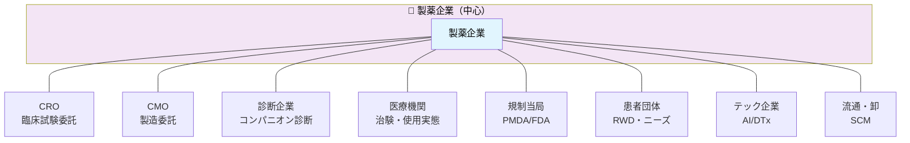

# DCの製薬企業DX戦略への適用

ダイナミック・ケイパビリティのフレームワーク（センシング・シージング・トランスフォーミング）を基に、製薬バリューチェーンに特化したDX戦略を論じる。

## Ⅰ. 製薬産業を取り巻く環境変化

### 1. 特許クリフの加速

状況：
- 主要製品の特許満了が集中し、2025〜2030年にかけてグローバル売上の30〜50%がジェネリック競争に晒される見通しである。収益基盤の急減がR&D投資余力を低下させ、パイプライン後継不足という悪循環を生む構造的リスクとなっている。

旧来の対応方法：
- Patent Thicket（特許の厚み出し）：製造法・剤形・投与方法など100件超の補助特許でバイオシミラー参入を遅延（AbbVie Humira事例：7年延長で追加680億ドル売上）
- 価格・販促戦略：DTCマーケティング強化、認可ジェネリック展開、複雑なリベート体系（Pfizer Lipitor：特許切れ後もブランド維持）

限界：
- 法的・商業的対抗策は一時しのぎに過ぎず、根本的な収益源再構築には繋がらず。

 

### 2. 創薬成功率の低迷

状況：
- Phase Iから承認までの成功率は10%未満、Phase II失敗率は70%以上と慢性的に低迷する。開発期間は15年、1剤あたり20〜30億ドルのコストがかかる中、パイプライン枯渇と投資回収期間の短縮圧力が同時に高まっている。

旧来の対応方法：
- パイプライン補充のためのバイオテクM&A：後期候補品や技術プラットフォーム買収で穴埋め（2010年代の業界トレンド） 
- 高リスク領域への集中投資：未充足ニーズ領域にリソース集中も、失敗率高止まり（分子還元主義・大規模スクリーニング偏重） 

限界：
- R&D生産性低下を加速させ、構造的失敗率改善に至らず。

 

### 3. ICH-GCP・GxP規制の改訂頻発

状況：
- デジタル化対応を背景に、ICH E6(R3)・FDA デジタルヘルス・21 CFR Part 11 改訂が相次いでいる。電子データバリデーションやAIガバナンスに関する規制整備が急ピッチで進み、既存プロセスの全廃リスクと規制対応コストの増大が課題となっている。

旧来の対応方法：
- 紙ベース・施設集中型プロセスの維持：紙CRF、手動データ入力、単一施設での治験実施を継続
- 個別対応・逐次改修：改訂ごとに既存SOPを部分修正、システム刷新を先送り

限界：
- デジタル化の波に追いつけず、コスト増・スピード低下を招く。

 

### 4. 医療費抑制圧力の強まり

状況：
- 日本では「疑似保険者」負担増、欧米ではHTAによるIR設定・HEOR評価の厳格化、Outcome-Based契約の拡大が進む。価格ダンピング・在庫回転率低下・短期収益圧迫が重なり、バリューチェーン全体のコスト構造見直しが急務となっている。

旧来の対応方法：
- Reference Pricing・コストシェア：後発品基準価格設定、患者自己負担増（欧州・カナダの1990年代施策） 
- 内部コストカット：R&D遅延、製造拠点集約、販促費圧縮（短期収益防衛優先）

限界：
- 薬剤利用抑制や予防医療機会損失を招き、長期成長阻害。

 

### 5. デジタルヘルス企業の参入

状況：
- Apple Health・Google DeepMindをはじめとするテック企業が、DTx・ウェアラブル・リアルワールドデータ事業に本格参入している。製薬企業もM&A・提携攻勢を強めており、従来のプロダクト中心モデルから患者アウトカム中心のビジネスモデルへの転換圧力が高まっている。

旧来の対応方法：
- 守りの提携・小規模投資：テック企業への少数出資、限定的PoC（2010年代初期）
- 従来MR中心のディテーリング継続：デジタルツールを補助的にしか活用せず

限界：
- エコシステム主導権をテック企業に奪われ、プロダクト優位性喪失。

 

## 旧来対応法の構造的限界

| 対応パターン | 特徴   | 限界 |
|---|---------------|--|
| 守りの法務・商業戦術 | 特許延長、価格防衛 | 一時しのぎ、抜本革新なし     |
| M&A・外部依存  | バイオテク買収、パイプライン補充 | R&D生産性根本解決せず |
| 逐次改修 | 規制対応の部分最適、システム先送り | デジタル化遅れ、競争力低下   |
| 内部コストカット| 短期収益防衛優先   | 成長投資抑制、イノベーション停滞   |

 

#### DCへの示唆

静態的・局所的対応では「環境変化の予測・機会捕捉・組織変革」が不十分であり、動態的・全社的アプローチが必要

---

 

## Ⅱ. DCフレームワークの製薬業への適用可能性

### 1. フレームワークの親和性

ティースのDCフレーム（センシング／シージング／トランスフォーミング）は、R&D・臨床・製造・MR・MA・PVまで製薬の全バリューチェーンに適用可能である。また「部分最適偏重、全体最適・新事業創出が弱い」という課題は、日本の製薬DXが抱える部門縦割り・Silo化の問題に直結しており、製造業一般からのフレームを製薬へブリッジしやすい条件が揃っている。

 

### 2. 製薬特化のDC要素

#### 規制・GxP環境下でのDC

「規制が変革を阻む」という議論を逆手に取り、GxP・PV・レギュレーションを前提としたうえでセンシング・シージング・トランスフォーミングを組み立てることが重要である。

- センシング：規制変更・ガイダンス改訂のリアルタイム追跡（AIモニタリング）
- シージング：eCTDデジタル提出、電子署名・監査トレイル基盤の構築
- トランスフォーミング：バリデーション済みクラウド移行、GxP Cloud原則の徹底

#### エコシステム・パートナーシップ

AI創薬ベンチャー・デジタルヘルス企業・プラットフォームとの連携は、DC（特にシージング＋トランスフォーミング）の典型的な実践形態である。自社内完結型から業界標準API・データ交換プロトコルを活用したエコシステム設計へのシフトが求められる。製造業における「Catena-X」に相当する医薬品業界のデータ連携基盤構築が、今後の競争優位の焦点となる。

 

### 3. 製薬バリューチェーン×DC×DXマッピング

| 領域 | センシング例 | シージング例 | トランスフォーミング例 |
|------|------------|------------|-----|
| 研究・創薬 | 文献・特許・リアルワールドデータから新標的やアンメットニーズを検知（AIスクリーニング） | クラウド＋AI創薬プラットフォーム投資、外部AIベンチャー共創 | 創薬プロセスをクラウド前提＋データ駆動に再設計（組織・指標・人材） |
| 開発・臨床 | 治験失敗要因・プロトコル複雑性・競合開発動向をリアルタイム把握 | 分散型臨床試験（DCT）、ePRO・リモートモニタリング導入 | PoCからデジタル前提臨床開発モデルへ移行、CRO役割再定義 |
| 製造・品質 | 設備故障兆候・歩留まり低下・需給変動をセンシング（IoT＋予測分析） | デジタルツインでライン最適化、電子バッチ記録で逸脱即時活用 | DX前提のグローバル工場網への転換 |
| サプライチェーン | 在庫・需要・物流リスクの早期検知（MEIO、可視化ダッシュボード） | マルチ拠点在庫最適化、コールドチェーン監視高度化 | S&OP/IBPプロセスで企画・SCM・営業・ファイナンスを貫通 |
| コマーシャル | HCP・患者チャネル選好・行動変容検知（デジタルタッチポイント分析） | ハイブリッドMR、オムニチャネル、デジタルコンテンツ活用 | プロダクト中心→患者アウトカム中心ビジネスモデルへの変革 |
---

 

### 4. 製薬業における環境変化と対応優先度マトリクス

| 環境変化 | センシング | シージング | トランスフォーミング | 対応期限 |
|---------|-----------|-----------|----|---------|
| 特許クリフ加速 | ● | ● | | 2026年まで |
| 創薬成功率低迷 | ● | ● | ● | 2027年まで |
| ICH-GCP・GxP改訂 | | | ● | 即時対応 |
| 医療費抑制圧力 | | ● | ● | 2026年中 |
| デジタルヘルス参入 | ● | ● | ● | 2028年まで |

---

 

## Ⅲ. 業界における先進事例

### 事例 1｜武田薬品工業：Factory of the Future

対象領域：製造・品質

武田薬品工業は「Factory of the Future」構想のもと、グローバル製造拠点のDX変革を推進している。IoTと予測分析による設備故障・歩留まり低下のリアルタイムセンシング、デジタルツインを活用した生産ライン最適化（シージング）を経て、DXを前提としたグローバル工場網の再設計（トランスフォーミング）を実現した事例である。GxP規制の下でバリデーション済みクラウドを活用し、「規制を前提としたDC発揮」の代表例として位置付けられる。

| DCの3能力 | 取組内容 |
|----------|---------|
| センシング | IoT・予測分析による設備故障兆候・需給変動の早期検知 |
| シージング | デジタルツインによるライン最適化、電子バッチ記録の即時活用 |
| トランスフォーミング | DX前提のグローバル工場網への転換、GxP Cloud原則の徹底 |

 

### 事例 2｜製薬業界全体：分散型臨床試験（DCT）の導入

対象領域：開発・臨床

コロナ禍を契機に、従来の施設集中型臨床試験から分散型臨床試験（DCT: Decentralized Clinical Trial）への移行が加速した。ePRO（電子患者報告アウトカム）・リモートモニタリング・電子同意の活用により、治験参加負担の軽減と試験効率化が同時に実現されている。これは、治験失敗要因や競合動向を感知したうえで（センシング）、デジタル技術で機会を捉え（シージング）、臨床開発モデル全体を刷新する（トランスフォーミング）DCの典型的な展開である。

| DCの3能力 | 取組内容 |
|----------|---------|
| センシング | 治験失敗要因・競合開発動向・患者負担課題のリアルタイム把握 |
| シージング | DCT・ePRO・リモートモニタリングの導入 |
| トランスフォーミング | デジタル前提の臨床開発モデルへ移行、CROとの役割再定義 |

 

### 事例 3｜AI創薬エコシステム：外部ベンチャーとの共創

対象領域：研究・創薬

大手製薬企業を中心に、AI創薬ベンチャーとのアライアンス・共同研究・出資が急速に拡大している。文献・特許・リアルワールドデータからAIが新標的やアンメットニーズを検知し（センシング）、クラウド＋AI創薬プラットフォームへの投資と外部ベンチャーとの共創（シージング）を経て、創薬プロセス全体をデータ駆動型に再設計する（トランスフォーミング）流れが定着しつつある。自社単独の研究体制から、エコシステム型の創薬モデルへの転換が「共特化」の実践例として注目される。

| DCの3能力 | 取組内容 |
|----------|---------|
| センシング | AIによる文献・特許・RWDスクリーニングで新標的・アンメットニーズを検知 |
| シージング | AI創薬プラットフォームへの投資、外部ベンチャーとの共創体制構築 |
| トランスフォーミング | 創薬プロセスのクラウド前提・データ駆動型への再設計（組織・指標・人材） |

 
 

---

# 補足説明：なぜDCを必要とするのか

## 1. 旧来対応が共有する「構造的欠陥」の正体

Ⅰ章で整理した5つの環境変化に対する旧来対応（Patent Thicket、M&A、逐次改修、内部コストカット）は、個別の文脈では一定の合理性を持つ。しかし、これらに共通する根本的な欠陥は「既存の能力・資産・プロセスの延長線上で対応しようとすること」にある。

戦略論の言葉を借りれば、これは「オーディナリー・ケイパビリティ（OC）」による対応に過ぎない。OCとは、既存の業務を効率的に遂行する能力であり、安定した競争環境では有効だが、環境変化の速度・複雑性・不確実性が高まる局面では本質的に限界を迎える。

| 旧来対応 | 依拠するOC | 限界の本質 |
|---------|-----------|-----------|
| Patent Thicket | 法務・知財管理能力 | 競合参入を「遅らせる」だけで新価値を生まない |
| バイオテクM&A | 資本調達・PMI能力 | 外部資産の取得であり、内部R&D生産性は不変 |
| 逐次的規制改修 | コンプライアンス管理能力 | デジタル変革の本質（プロセス再設計）に未対応 |
| 内部コストカット | 財務管理・オペレーション効率化能力 | 成長投資余力を削ぎ、将来の変革能力を毀損 |

 

つまり、旧来対応の限界は「やり方が悪い」のではなく、「そもそも異なる種類の能力が求められている局面に、誤った種類の能力で対応し続けていること」にある。

---

 

## 2. 環境変化が「不連続」であることの意味

製薬産業が直面している5つの環境変化に共通するのは、いずれも非連続的な変化である点だ。

- 特許クリフ：従来の収益モデルが一定期間後に崩壊するという構造的断絶
- 創薬成功率の低迷：分子還元主義的アプローチの限界という、パラダイムレベルの問題
- GxP規制の改訂：デジタル化を前提とした規制体系への転換という不可逆なシフト
- 医療費抑制：「製品の価値」から「患者アウトカムの価値」への評価軸の転換
- デジタルヘルス参入：産業の境界線そのものの溶解

連続的変化であれば、既存能力の漸進的改善（Continuous Improvement）で対応可能だ。しかし不連続な変化に直面した場合、企業は「何を、どのように、なぜ行うか」というビジネスモデルの根本を問い直す能力を必要とする。これこそが、ティースのいうダイナミック・ケイパビリティ（DC）の本質である。

> DCとは「急速に変化する環境に対処するために、内外のコンピタンスを統合・構築・再配置する能力」（Teece, 1997）

---

 

## 3. 「静態的対応の限界」から「DCの必要性」への論理接続

旧来対応の限界を踏まえると、製薬企業に求められる能力転換は以下の3段階で理解できる。

### ステップ① 感知できていない（センシングの欠如）

旧来のPharma企業は、環境変化の「シグナル」を感知するアンテナが弱い。特許法務部門は競合の特許動向をウォッチするが、デジタルヘルス企業の動向や規制当局のAIガイダンス改訂をリアルタイムで追う仕組みは整っていない。結果として、変化に「気づいたときには手遅れ」という後手対応が常態化する。

→ センシング能力の構築が第一の要件

 

### ステップ② 機会を捉える意思決定ができない（シージングの欠如）

仮に変化を感知できたとしても、既存の資源配分プロセス・意思決定構造のままでは、新たな機会への迅速な投資判断ができない。製薬企業の予算サイクルは年次・中計ベースであり、AI創薬ベンチャーへの素早いアライアンス締結や、DCT（分散型臨床試験）への全社的なピボットには、意思決定のスピードと権限移譲が不可欠だ。

→ シージング能力の構築が第二の要件

 

### ステップ③ 変革を維持・組織化できない（トランスフォーミングの欠如）

個別のDXプロジェクトが成功しても、組織全体の文化・プロセス・指標・人材が変わらなければ、変革は局所的なPoCにとどまる。製薬企業でよく見られる「デジタル部門の孤立」「Silo間の連携不全」「KPIと現場行動の乖離」は、まさにトランスフォーミング能力の欠如が生む症状である。

→ トランスフォーミング能力の構築が第三の要件

---

 

## 4. DCが製薬業において特に有効な理由

一般的な製造業と比較して、製薬業においてDCフレームが特に有効な理由は以下の3点にある。

① バリューチェーンの複雑性と長期性

創薬から上市まで15年超というタイムスパンは、環境変化が複数回到来することを意味する。単一の戦略や能力では対応できず、継続的に「感知→捕捉→変革」のサイクルを回す能力そのものが競争優位の源泉となる。

② 規制という「制約」を逆手に取る可能性

GxP・ICH規制は一見すると変革の障壁に見えるが、DCの視点ではこれを「新たな標準化の機会」として捉えられる。規制変更をいち早くセンシングし、自社のデジタル基盤をその新標準に対応した形でシージングできれば、競合に対する参入障壁を逆に高めることができる。

③ エコシステム依存性の高さ

製薬業は、CRO・CMO・診断企業・医療機関・規制当局・患者団体など多様なアクターとの協働なしには成立しない。ティースのDC論が強調する「共特化資産（co-specialized assets）」の概念は、このエコシステム依存性の高い製薬業に極めて適合的である。外部パートナーとの関係性そのものを戦略資産として構築・管理する能力が、持続的競争優位の核となる。

 

#### 各アクターとの関係性（共特化の観点）

- CRO（臨床試験委託）  
  開発スピード・コスト・質を決定。DCT時代ではデジタル対応力も必須。共特化：共同プロトコル開発・リアルタイムデータ共有基盤

- CMO（製造委託）  
  供給安定性・品質保証・スケーラビリティの要。共特化：専用生産ライン・技術移転・品質管理システムの相互認証

- 診断企業（コンパニオン診断）  
  精密医療・バイオマーカー薬の成否を左右。共特化：共同開発・同時承認・リアルタイム検査データ連携

- 医療機関（治験・使用実態）  
  治験実施・RWE生成・KOLネットワークの中核。共特化：電子カルテ連携・患者リクルートメント・共同研究契約

- 規制当局（PMDA/FDA）  
  承認プロセス・市販後監視のゲートキーパー。共特化：事前相談・リアルタイムeCTD・AIガバナンス共同指針策定

- 患者団体（RWD・ニーズ）  
  アンメットニーズ特定・HEOR・Outcome-Based契約の基盤。共特化：患者レジストリ共同運営・PROMs開発・患者参加型臨床試験

- テック企業（AI/DTx）  
  創薬加速・デジタルセラピューティクス・データ基盤提供。共特化：API連携・共同アルゴリズム開発・データプライバシー契約

- 流通・卸（SCM）  
  在庫最適化・コールドチェーン・リアルタイムトレーサビリティ。共特化：EDI連携・需要予測共有・緊急時優先供給契約

---
