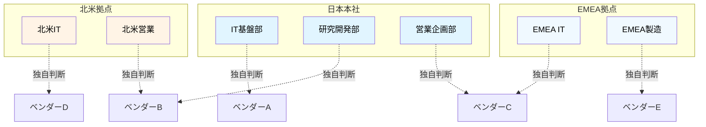
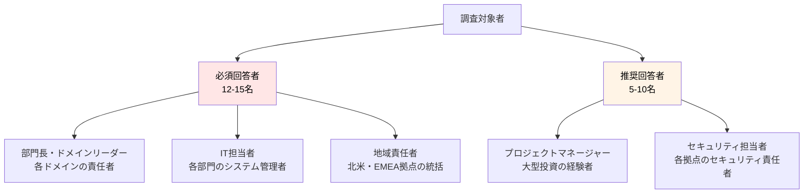
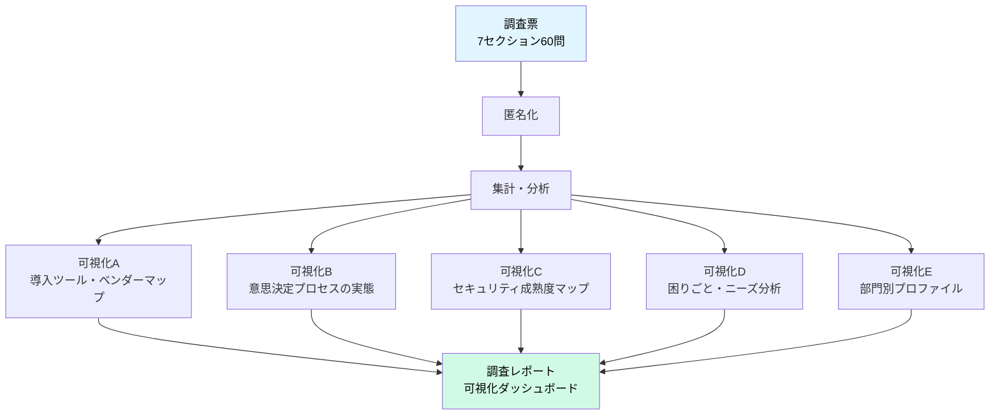
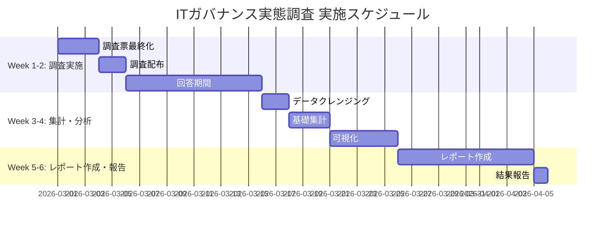
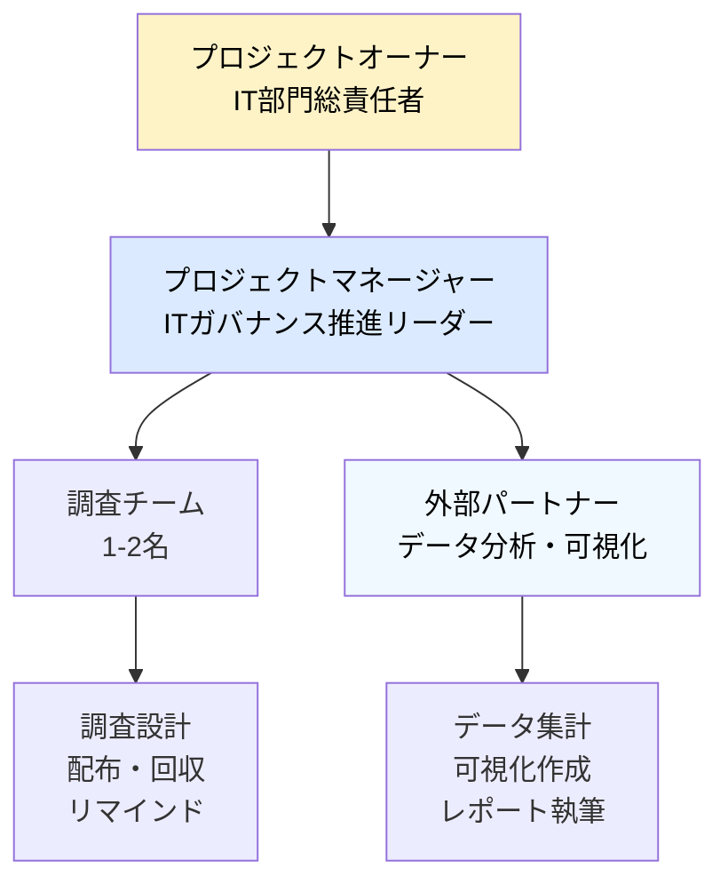
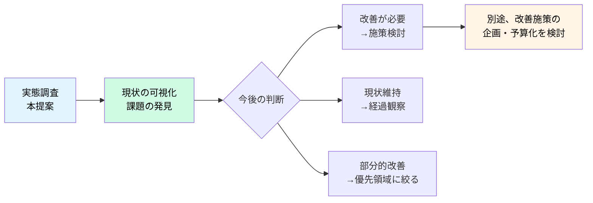

# ITガバナンス実態調査 企画提案書

**提案日**: 2026年2月14日  
**提案先**: IT部門 総責任者  
**提案者**: ITガバナンス推進チーム

---

## エグゼクティブサマリー

### 背景

当社は現在、各部門・地域が独自にIT投資とシステム運用を行う**分散型**の状態にあります。この状態が以下のような課題を引き起こしている可能性があります：

- IT投資の重複や非効率
- セキュリティ・コンプライアンス対応のバラつき
- 判断基準の不明確さ
- 部門間・地域間の連携における課題

しかし、**現時点では具体的な実態を把握できていません**。

### 提案内容

**ITガバナンス実態調査**を実施し、現状を正確に把握します。本調査は、今後のガバナンス体制を検討する上での**基礎データ収集**を目的とします。

### 調査の成果物

- 各ドメインのIT運用実態の可視化
- 部門・地域間のバラつきの把握
- 現場の困りごと・ニーズの整理
- 今後の改善検討のための基礎資料

### 必要予算・期間

- **調査期間**: 6週間
- **実施コスト**: 約200万円
  - 外部支援: 200万円（データ分析・可視化支援）

---

## 1. 調査の目的

### 1.1 なぜ今、実態調査が必要か

現在、当社のIT運用は各部門・地域が独自に判断・実行する**分散型**の状態です。これは以下のような状況を示唆しています：

**想定される課題**:
- 同種のツール・サービスを複数部門が個別に契約している可能性
- セキュリティ対策の実施レベルにバラつきがある可能性
- 判断基準が不明確で、現場が迷っている可能性
- 部門間・地域間での調整に時間がかかっている可能性

しかし、**これらはあくまで仮説**です。改善を検討する前に、まず**実態を正確に把握する必要**があります。

### 1.2 調査の3つの目的

本調査は以下の3つを明らかにすることを目的とします：

#### 目的1: 現状の可視化

**何を明らかにするか**:
- 各部門・地域のIT投資、導入ツール、契約ベンダーの実態
- 意思決定プロセス、判断基準、承認ルートの実態
- セキュリティ・データ管理の実施状況
- 変更管理・トラブル対応の体制

**なぜ必要か**:
- 全社横断での可視化ができていない
- 「なんとなく非効率」を定量的に把握したい
- 改善の優先順位を判断するための根拠が欲しい

#### 目的2: バラつき・ギャップの特定

**何を明らかにするか**:
- 部門間・地域間でのプロセス・基準の違い
- セキュリティ成熟度の格差
- 予算管理・コスト管理の実施レベル差
- ベンダー管理の実施状況の違い

**なぜ必要か**:
- 統一すべき領域と多様性を認める領域を見極めたい
- 成熟度の高い部門のベストプラクティスを発見したい
- リスクが高い領域を特定したい

#### 目的3: 現場の声の収集

**何を明らかにするか**:
- 現場が実際に困っていること
- どんな支援・基準があれば役立つか
- 他部門・他地域との連携での課題

**なぜ必要か**:
- トップダウンの改善ではなく、現場のニーズに基づきたい
- 「あったら良い」支援策を具体化したい
- 改善施策の受容性を高めたい

---

## 2. 調査設計

### 2.1 調査票の構成

本調査は**7セクション、約60問**で構成されています：

| セクション | 目的 | 主要質問例 |
|-----------|------|----------|
| **1. 新しい技術・システムの導入** | 意思決定プロセスの実態把握 | ・過去12ヶ月の導入事例 ・判断プロセス ・金額による承認ルート ・困っていること |
| **2. セキュリティ** | セキュリティ成熟度の把握 | ・Security-by-Designの実装 ・認証方式（MFA/SSO等） ・データ保護設計 ・脆弱性診断の有無 |
| **3. データの取扱い** | データガバナンスの実態 | ・データ共有時の判断 ・機密分類の実施状況 ・品質管理 ・バックアップ |
| **4. システム変更・トラブル対応** | 変更管理・インシデント対応 | ・変更時のプロセス ・承認の有無 ・トラブル対応体制 ・振り返りの実施 |
| **5. 予算・コスト管理** | 予算プロセスの実態 | ・予算の決まり方 ・クラウドコストの管理 ・予算超過時の対応 |
| **6. ベンダー・外部サービス** | ベンダー管理の実態 | ・契約中のベンダー一覧 ・選定プロセス ・パフォーマンス評価 |
| **7. その他** | 組織間連携と要望 | ・他部門・他地域との調整課題 ・欲しい支援 ・自由意見 |
---

 

### 2.2 調査票の設計思想

#### （得られる情報）

| カテゴリ | 具体的な内容 |
|---------|------------|
| **意思決定プロセスの実態** | ・誰が何を決めているか（提案者、承認者、関与者） ・金額による判断基準の違い（閾値、承認ルート） ・判断にかかる時間、相談先の有無 |
| **セキュリティ・コンプライアンスの実施状況** | ・Security-by-Designの実践度 ・認証方式（MFA、SSO、パスワード管理） ・データ保護設計（暗号化、ログ、マスキング） ・脆弱性診断・レビューの実施状況 |
| **導入ツール・ベンダーの棚卸し** | ・部門ごとに契約中のベンダー・SaaS ・用途、年間コスト、契約期間 ・重複契約の可能性がある領域 |
| **現場の困りごと・ニーズ** | ・何に困っているか（判断基準不明、承認遅延等） ・どんな支援が欲しいか（推奨リスト、チェックリスト等） ・部門・地域による課題の違い |
| **プロセスの有無・実施状況** | ・変更管理、トラブル対応、品質管理の実施状況 ・予算管理、ベンダー評価の仕組み |

 

#### （得られない情報）

| カテゴリ | 具体的な内容 | 補完方法 |
|---------|------------|---------|
| **定量的な損失額・効果** | ・重複投資の正確な無駄額 ・インシデントによる実損失 ・判断遅延による機会損失 | ベンダー契約書レビュー、ログ分析等で別途調査 |
| **根本原因・背景** | ・なぜプロセスが統一されていないのか ・なぜ特定の部門だけ成熟度が低いのか | 調査後のインタビュー、ワークショップで深掘り |
| **プロセスの質・実効性** | ・「ある」と答えたプロセスが実際に機能しているか ・セキュリティ対策の技術的な正確性 | 監査、技術的レビューで検証 |
| **ベストプラクティスの詳細** | ・成熟度の高い部門の具体的な工夫 ・横展開可能なノウハウ | 成功事例の詳細ヒアリング |
---

 

**調査の位置づけ**: 
本調査は「網羅的な現状把握」を目的とし、詳細分析や改善策の実行は**調査後に判断**します。

 

### 2.3 調査対象

**選定基準**:
- 年間50万円以上のIT予算執行実績を持つ
- システム導入・ベンダー選定を担当している
- その他部門・地域のIT状況を一定程度把握している立場

**目標回収**: 12-15名の回答（全社の主要ドメインをカバー）

### 2.4 調査実施方法

| 項目 | 詳細 |
|------|------|
| **配布方法** | オンラインフォーム（Microsoft Forms） |
| **回答期間** | 2週間 |
| **所要時間** | 約15-20分 |
| **リマインド** | 1週間後、3日前の2回 |
| **匿名性** | 統計処理のみ、個人特定されない旨を明記 |
| **質問受付** | 調査事務局のメールアドレスを案内 |

---

## 3. 調査結果の可視化

### 3.1 可視化の目的

調査結果は単なるデータの羅列ではなく、**意思決定に使える形**に加工します：

- 経営層への報告（全体像の把握）
- ドメインリーダーへのフィードバック（自部門の状況）
- 今後の改善検討のための基礎資料

### 3.2 5つの可視化アウトプット

 

### 3.3 可視化でわかること・わからないこと

| 可視化 | 目的 | わかること | わからないこと | データソース |
|--------|------|-----------|---------------|-------------|
| **A: 導入ツール・ベンダーマップ** | 全社のツール・ベンダー利用状況を一覧化 | ・同じカテゴリで複数ツールが存在する領域 ・部門ごとの契約状況 ・年間コストの全体像 | ・統合した場合の正確な削減額（契約条件の詳細が必要） ・なぜそのツールを選んだのか（個別ヒアリングが必要） | セクション1 Q1 セクション6 Q1 |
| **B: 意思決定プロセスの実態** | 判断プロセスのバラつきを把握 | ・金額基準の部門間のバラつき ・実際にどういうプロセスで決めているか ・何に困っているか | ・なぜバラついているのか（歴史的経緯、組織文化） ・判断の質（良い判断ができているか） | セクション1 Q2, Q4, Q5 |
| **C: セキュリティ成熟度マップ** | セキュリティ対策の実施状況を部門別に把握 | ・部門別のセキュリティ成熟度 ・特に対応が遅れている項目 ・共通アカウント利用など明らかな問題 | ・実装の技術的な正確性（監査が必要） ・実際のインシデント発生状況（ログ分析が必要） | セクション2 Q1-Q4 |
| **D: 困りごと・ニーズ分析** | 現場が求める支援を特定 | ・現場が最も求めている支援 ・共通する困りごと ・部門・地域による違い | ・支援策の具体的な設計内容（別途検討が必要） | 全セクションの「困ること」 セクション7 Q3 |
| **E: 部門別プロファイル** | 各部門の特徴を一覧化 | ・部門ごとの全体像 ・ベストプラクティスを持つ部門 ・支援が必要な部門 | （記載なし） | 全セクションの統合 |
---

 

## 4. 実施計画

### 4.1 スケジュール（6週間案）

**マイルストーン**:
- Week 2末: 回答回収完了（目標回答率80%以上）
- Week 4末: 可視化完成
- Week 6末: 実施結果の報告

### 4.2 実施体制

### 4.3 必要リソース

#### 人的リソース

| 役割 | 工数 | 人件費（想定） |
|------|------|--------------|
| プロジェクトマネージャー | 30% × 6週間 | -- |
| 調査チーム | 1-2名 × 20% × 6週間 | -- |
| **内部人件費 小計** | | -- |
| 外部パートナー（データ分析） | 1名専任 × 4週間 | 200万円 |
| **総コスト** | | **200万円** |

#### ツール・インフラ

| 項目 | 用途 | コスト |
|------|------|-------|
| オンライン調査ツール | Microsoft Forms | 既存ライセンス利用 |
| データ分析・可視化 | Power BI / Excel | 既存ライセンス利用 |
| プロジェクト管理 | Planner / Excel | 既存ライセンス利用 |

**総予算**: **約200万円**

### 4.4 リスク管理

| リスク | 発生確率 | 対策 |
|-------|---------|------|
| 回答率が低い（60%未満） | 中 | 経営層からの協力依頼、個別フォロー、回答期間延長 |
| 回答の質が低い | 中 | 質問数の最適化、所要時間明記、質問受付窓口設置 |
| 組織政治的な抵抗 | 低 | 「評価ではなく現状把握」を強調、匿名性保証 |
| データ分析の遅延 | 中 | バッファ確保、外部パートナーとの密な連携 |
| 期待される成果が得られない | 低 | 調査設計段階での十分な検討、パイロット実施 |

---
 

## 5. 調査後の活用

### 5.1 調査結果の位置づけ

本調査は**現状把握**が目的であり、**改善策の実行は別途判断**します：

### 5.2 想定される次のステップ（参考）

調査結果を受けて、以下のような検討が考えられます（本提案のスコープ外）：

**パターン1: 改善施策の検討**
- 重複投資削減プロジェクト
- セキュリティ基準の策定
- 判断基準・承認プロセスの標準化

**パターン2: 部分的な改善**
- 特定領域（例：セキュリティのみ）に絞った改善
- 高リスク部門への個別支援

**パターン3: 現状維持**
- 想定より問題が少ない場合
- 改善よりも現状の多様性を優先する判断

**パターン4: 追加調査**
- より詳細な分析が必要と判断された領域
- ベストプラクティスの深掘りヒアリング

### 5.3 調査データの活用可能性

本調査で得られたデータは、今後以下のような場面で活用できます：

- 年次でのフォローアップ調査（変化の追跡）
- 新規施策の効果測定（Before/After比較）
- 他部門とのベンチマーク
- 経営層への報告資料
- 監査対応資料

---
 

## 6. 意思決定のお願い

### 6.1 承認いただきたい事項

本提案について、以下の承認をお願いいたします:

✅ **調査実施の承認**
- ITガバナンス実態調査の実施
- 6週間のプロジェクト期間
- 対象者（15部門・地域）への協力依頼

✅ **予算承認**
- 総額: **200万円**
  - 外部支援: 200万円
  - ツールライセンス: 既存利用

✅ **体制承認**
- プロジェクトマネージャーの任命
- 調査チームの編成
- 外部パートナーの選定・契約

