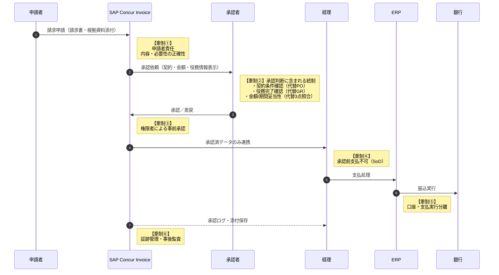

## PTPプロセスの主な流れ（基本8ステップ）
```
① 購買要求（Purchase Requisition）
現場や部門が「これが必要です」と申請
例：PC、原材料、サービスなど

② 承認
上長や購買部門が内容・予算をチェック
ルール違反や無駄遣いを防ぐ重要ポイント

③ 発注（Purchase Order / PO）
承認後、仕入先に**発注書（PO）**を発行
数量・価格・納期を明確化

④ 納品・サービス提供
モノが届く、またはサービスが実施される

⑤ 検収（受入確認）
発注内容どおりかチェック
数量・品質・金額が合っているか確認

⑥ 請求書受領
仕入先から請求書が届く

⑦ 照合（3点照合）
PO（発注書）
納品書／検収情報
請求書
この3つが一致しているかを確認
👉 不正・ミス防止の要

⑧ 支払い
問題なければ期日どおり支払い
```

### PTPプロセスの目的・メリット

- コスト管理の徹底
- 不正・ミスの防止
- 支出の可視化
- 業務効率化（特にシステム化）
```
🤝 仕入先との信頼関係向上
```

<br>

## SAP Concurでできること／できないこと

### ✅ SAP Concurでできる領域（PTPの一部）

Concurはもともと経費・出張管理に強いSaaSです。

#### 購買申請・事前申請

- 出張申請
- 立替経費の事前承認

#### 請求書処理（Concur Invoice）

- 請求書の電子受領
- 承認ワークフロー
- 会計連携用データ作成

#### 支出の可視化

- 経費・間接費の分析
```
👉 「経費精算＋間接費の請求書処理」型PTPは可能
```

### ❌ SAP Concurでは弱い／できない領域

- フルPTPで必須の以下は 不得意 or 対象外 です。

- PO発行（本格的な購買管理）
- GR（入庫・検収）
- 3点照合（PO・GR・IR）
- 在庫管理・原材料購買
```
👉 直接材・在庫型購買のPTPは不可
```

<br>

### Summary

| 領域        | SAP Concur |
| --------- | ---------- |
| 購買申請      | △（簡易）      |
| PO発行      | ❌          |
| GR（検収）    | ❌          |
| 請求書受領（IR） | ✅          |
| 承認WF      | ✅          |
| 支払い       | ❌（会計連携）    |
| フルPTP     | ❌（単体）      |
---

<br>

## なぜ三点／二点照合が求められるのか

### 本来の目的

- 発注していないものに払っていないか
- 金額・数量・内容が合っているか
- 不正や誤請求を防げているか

```
👉 「リスクが低ければ、やり方は柔軟」 というのが内部統制の考え方
```

### 定額請求が「照合省略」できる理由

#### 定額請求の特徴

- 毎月（毎年）金額が固定
- 契約内容が明確
- 数量・検収の概念が薄い（SaaS、保守費、クラウドの最低利用料など）
```
👉 GR（検収）をやっても実質意味が薄い
```

### 内部統制的にOKとされる典型パターン（重要）

#### ✅ 三点照合なしでもOKな代替統制

- 以下が揃っていれば、監査で指摘されにくいです。
```
1️⃣ 契約書／マスター契約が存在
    - 金額
    - 請求周期
    - 契約期間

2️⃣ 事前承認（契約時）
    - 金額・期間・更新条件を承認
    - 情シス／法務／経理が関与

3️⃣ 請求書チェック（形式＋金額）
    - 契約どおりの金額か
    - 期間ズレがないか

4️⃣ 定期的な契約棚卸
    - 不要なSaaSを止める
    - 年1回など
```
```
👉 これが 「三点照合の代替統制」 です。
```

<br>

#### 二点照合すら省略できるケースは？
```
- かなり限定的ですが、あります。
    - 家賃
    - 通信回線基本料
    - 定額SaaS（低額）

- 条件：
    - 金額が完全固定
    - 長期契約
    - 自動更新＋上限なし変更不可
```
```
👉 この場合は「契約 × 請求書」確認のみ（実質1.5点照合みたいな運用）
```

#### 逆に「NG」になりやすいケース
```
❌ 定額と言いながら 利用量で変動（クラウド、従量SaaS）

❌ 契約更新が自動で気づかない

❌ 事前承認なしで請求だけ処理

❌ 情シス関与なし
```
```
👉 この場合、「定額だから照合不要」は ほぼ確実に指摘されます
```

<br>

### 監査でよく聞かれる質問
```
「POを発行しない合理性は？」
「誰が契約内容を管理していますか？」
「請求金額が正しいとどう担保していますか？」
「不要契約をどう検知していますか？」
```
👉 これに説明できればOK


### まとめ

- 定額請求でも 三点／二点照合は“不要”ではない
- ただし 代替統制があれば省略可能
- カギは, 契約管理＋事前承認＋定期見直し
- Concur Invoiceは
```
👉 この代替統制を作りやすい
```

<br>

## SAP ConcurによるPTPプロセスと牽制機能



<br>
<br>

**APPENDIX**

## PTP牽制とConcurによる代理統制の対応表

| PTPの牽制ポイント | 本来の統制（フルPTP） | 統制目的    | Concurでの代理（代替）統制 | 監査的な評価ポイント   |
| ---------- | ------------ | ------- | ---------------- | ------------ |
| 発注の正当性     | PO発行＋承認      | 無断発注防止  | 事前申請／契約承認WF      | 発注前に権限者承認がある |
| 取引条件の固定    | PO金額・数量      | 過剰支払防止  | 契約書添付＋金額固定       | 契約内容が明確か     |
| 受領確認       | GR（検収）       | 未受領支払防止 | 役務完了前支払不可＋利用部門承認 | 検収に代わる合理性    |
| 請求正当性      | 3点照合         | 誤請求防止   | 契約×請求書の突合        | 金額・期間チェック    |
| 金額逸脱検知     | PO vs 請求     | 過払防止    | 金額閾値・例外承認        | 例外が可視化されている  |
| 支払先妥当性     | ベンダーマスタ統制    | 振込不正防止  | 口座登録制限＋変更承認      | SoDが守られている   |
| 職務分掌       | PO/GR/支払分離   | 単独不正防止  | 登録・承認・支払分離       | 一人完結不可       |
| 証跡管理       | PO/GR/照合ログ   | 事後検証    | 承認ログ・添付保存        | 改ざん不可・追跡性    |
| 不要支出検知     | PO残分析        | 無駄防止    | 契約棚卸・レポート        | 定期見直しがある     |
| 継続統制       | 定期レビュー       | 統制維持    | 契約期限アラート         | 更新統制が機能      |
---

### ポイント解説（監査で刺さる視点）

#### 「牽制」は“形”ではなく“目的”
- PO・GR・3点照合は 手段
- Concurは 同じ目的を別の方法で達成
```
👉 これが「代理統制」と評価される理由
```

#### 役務・定額取引にGRは形式化しやすい
- SaaS・保守・外注は
- 「何をもって受領か」が曖昧
- 部門承認＋契約確認の方が合理的

#### 最大の監査リスクは「口座」
- Concur外（ERP／銀行）との二重統制
- 口座変更時の追加承認

<br>

## 契約管理が不十分な場合のPTP牽制とConcur代理統制

| PTP牽制ポイント | 本来の統制      | 統制目的      | Concurでの代理統制（契約管理不十分） | 統制評価 | 監査での想定指摘   |
| --------- | ---------- | --------- | --------------------- | ---- | ---------- |
| 発注の正当性    | PO発行・承認    | 無断発注防止    | 請求ベース承認WF             | △    | 契約根拠が不明確   |
| 取引条件の固定   | PO金額・数量    | 過剰支払防止    | 請求書金額の目視確認            | △    | 金額妥当性の根拠は？ |
| 受領確認      | GR（検収）     | 未提供役務支払防止 | 利用部門の承認               | △    | 完了判断基準が曖昧  |
| 請求正当性     | 3点照合       | 誤請求防止     | 過去請求との比較              | △    | 初回・変更時に弱い  |
| 金額逸脱検知    | PO vs 請求   | 過払防止      | 金額閾値アラート              | △    | 上限設定根拠不足   |
| 支払先妥当性    | ベンダーマスタ統制  | 振込不正防止    | 口座登録制限・承認             | ○    | 口座統制は有効    |
| 職務分掌      | PO/GR/支払分離 | 単独不正防止    | 登録・承認・支払分離            | ○    | 形式的にはOK    |
| 証跡管理      | PO/GRログ    | 事後検証      | 承認ログ保存                | ○    | 判断根拠が弱い    |
| 不要支出検知    | 契約残・PO残    | 無駄防止      | レポート分析                | △    | 契約単位で見えない  |
| 継続統制      | 契約更新管理     | 支払継続防止    | 定期レビュー（任意）            | △    | 更新統制が不十分   |
---

### 評価の要点（かなり重要）

#### ○と評価されるもの
- 職務分掌
- 口座統制
- 承認ログの存在
```
👉 「不正を一人で完結させにくい」点は担保
```

#### △が並ぶ理由（監査の本音）
契約書が管理されていない場合：
-「なぜこの金額を払っているのか」
- 「なぜこの期間続いているのか」
- 「変更に気づけるのか」
```
👉 すべて“説明できない”
```

<br>

## 役割定義が不明確な場合のPTP牽制とConcur代理統制（評価付き）

| PTP牽制ポイント | 本来の統制         | 統制目的    | Concurでの代理統制（役割不明確） | 統制評価 | 監査での想定指摘 |
| --------- | ------------- | ------- | ------------------- | ---- | -------- |
| 発注起点の牽制   | 申請者＝要求、承認者＝判断 | 無断発注防止  | 同一人物が申請・承認可能        | ×    | 職務分掌が未定義 |
| 承認の実効性    | 権限者のみ承認       | 不適切支出防止 | 承認行為が形式化            | ×    | 実質的牽制なし  |
| 金額妥当性判断   | 承認者が責任判断      | 過剰支払防止  | 判断観点が人任せ            | △    | 判断基準が不明  |
| 内容妥当性判断   | 利用部門承認        | 不要支出防止  | 承認者の責任不明            | ×    | 誰が責任者か不明 |
| GR代替統制    | 検収者明確化        | 未提供支払防止 | 完了判断者不明             | ×    | 検収責任不在   |
| 例外判断      | 権限者承認         | 逸脱統制    | 例外でも承認可能            | △    | 例外統制未定義  |
| 支払先統制     | 経理確認          | 振込不正防止  | 口座統制は有効             | ○    | 限定的に有効   |
| 職務分掌      | 申請／承認／支払分離    | 単独不正防止  | 分離が形骸化              | ×    | 一人完結リスク  |
| 証跡管理      | 判断者明確         | 事後検証    | ログはある               | △    | ログの意味が薄い |
| 継続支払統制    | 定期レビュー        | 不要支払防止  | レビュー責任不明            | △    | 統制責任者不在  |

---

### 評価の読み方

#### ❌「×」が多い理由
- 役割が明文化されていない場合：
    - システム上は承認されている
    - でも 「誰が・何を・なぜ判断したか」が説明できない
```
👉 これは監査的には
「統制が存在しない」扱い になります。
```

#### ○でも安心できないポイント
- 口座統制だけは機能
- しかし PTPの核心（支出妥当性）を守れていない
