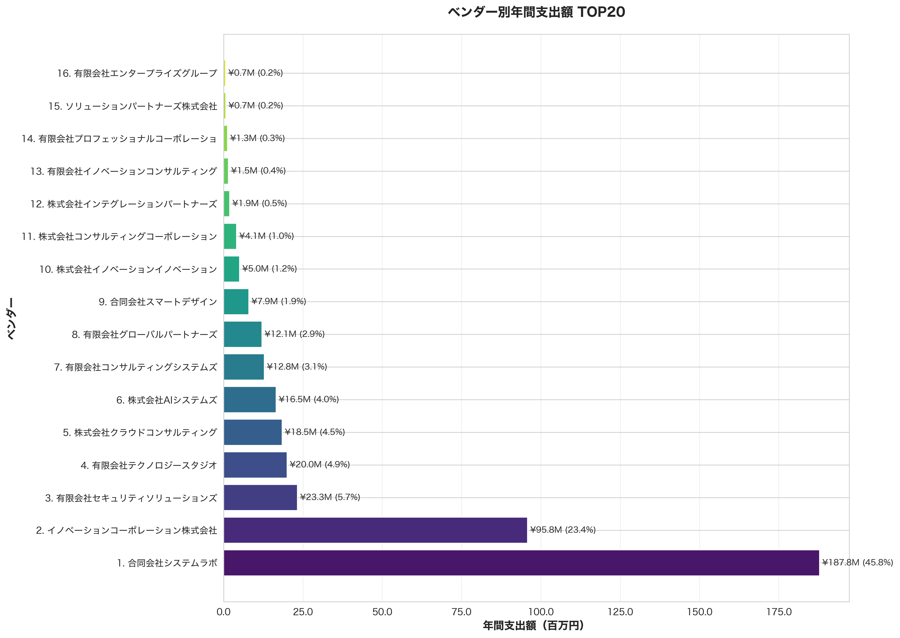
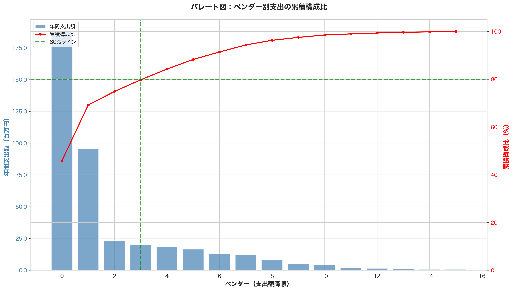
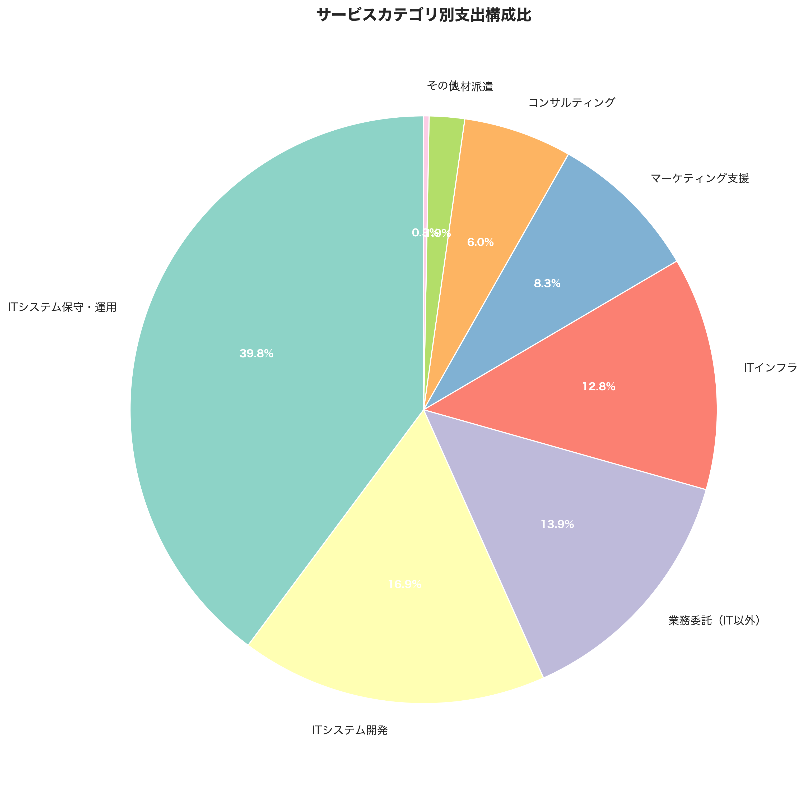
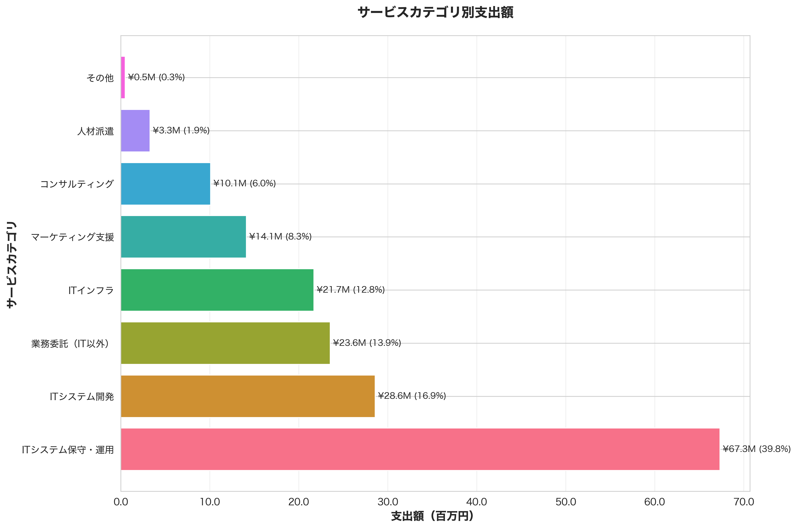
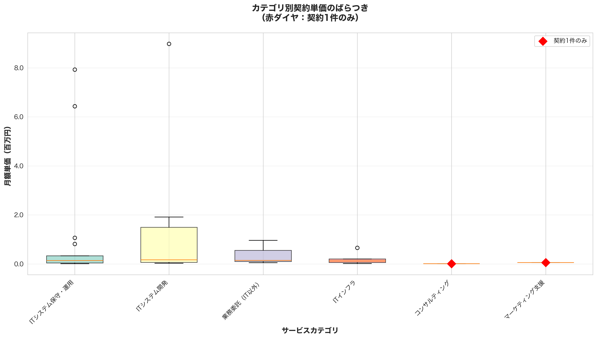
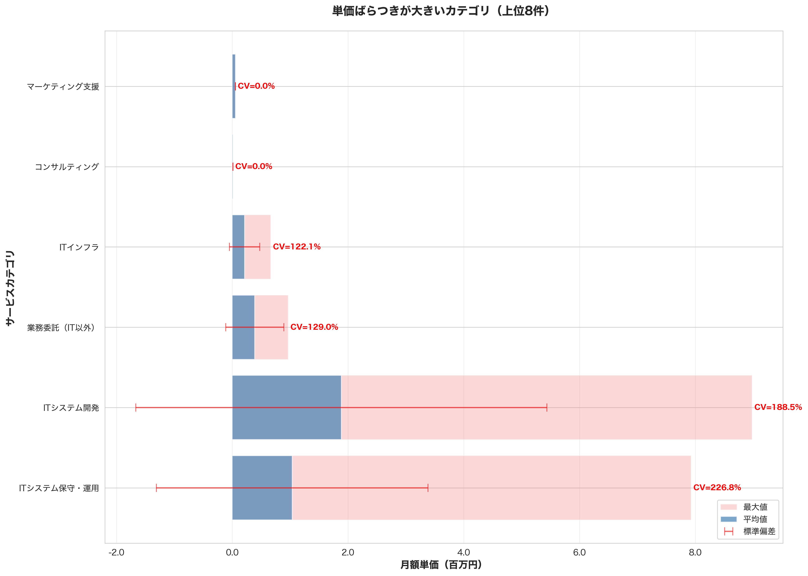
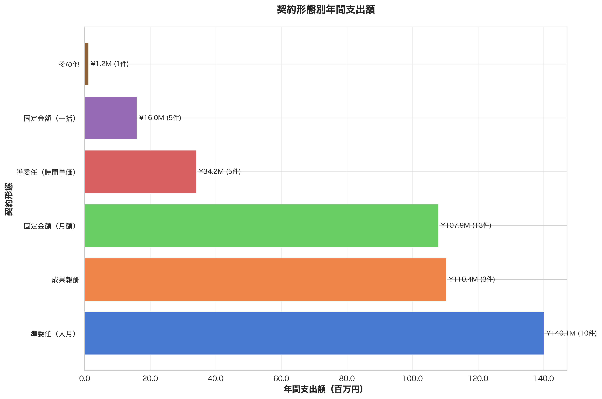
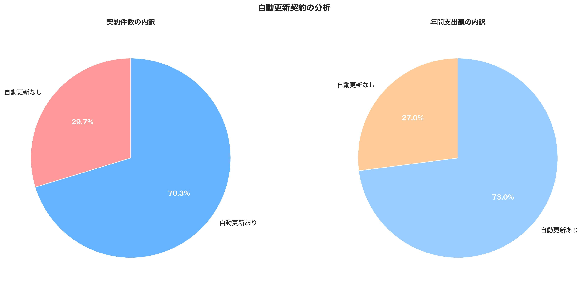

# ベンダーマネジメント支出分析レポート

## 分析方針：可視化の目的

### 1. ベンダー別支出分析

**目的:** コスト削減の重点管理対象ベンダーを特定

- 上位20%のベンダーが全体の80%を占めるか検証（パレートの法則）
- 支出額上位ベンダーを可視化し、価格交渉の優先順位を明確化
- **調達コスト削減施策の最優先ターゲットを特定**

### 2. サービスカテゴリ別支出分析

**目的:** 類似サービスの統合・集約機会を発見

- IT、保守、コンサル、業務委託などカテゴリ別の支出を可視化
- 同一カテゴリで複数ベンダーから購入している場合を特定
- **取引集約によるボリュームディスカウントの機会を把握**

### 3. 契約単価・単価レンジのばらつき分析

**目的:** 価格適正性の検証と交渉余地の特定

- 同一カテゴリ内での単価のばらつきを可視化（箱ひげ図・CV値）
- 単価が高いベンダーを特定し、価格交渉の根拠を提供
- **「似たサービスを複数社から買っている」価格差を定量化**

### 4. 契約形態別支出分析

**目的:** 契約形態の適正化

- 固定金額、準委任、一括払いなど契約形態別の支出を把握
- 準委任契約の固定化やサブスク化の可能性を検討
- **契約条件の最適化によるコスト削減機会を発見**

### 5. 自動更新契約の分析

**目的:** 惰性で継続している契約を洗い出し

- 自動更新契約の件数・金額・更新回数を可視化
- 長期化・固定化している契約を特定
- **見直し・解約によるコスト削減の即効性が高い領域を特定**

---

 

## 分析結果：各可視化から得られた洞察

## 1. ベンダー別支出TOP20

### ✅ **支出の集中度**
- **TOP1ベンダー**: ¥65.5M（27.4%）で全体の4分の1以上を占める
- **TOP3ベンダー合計**: ¥142.9M（59.9%）で全体の約6割
- **TOP5ベンダー合計**: ¥177.4M（74.3%）で全体の7割超
- **支出の極端な集中**: 上位5社（全14社中36%）で74%の支出

### ✅ **ベンダー特性**
- **大手企業が上位独占**: TOP5のうち4社が大手企業
- **高評価ベンダーへの集中**: TOP3は全てS評価ベンダー
- **IT・システム開発業界が主力**: 上位ベンダーの多くがIT業界

### ✅ **構成比の推移**
- **1位と2位の差**: 27.4% vs 17.7% = **9.7ポイント差**（支配的ベンダーが存在）
- **6位以降は急減**: 6位で6.8%、10位で2.5%と急激に減少
- **ロングテール構造**: 11位以降は各2%未満の小規模ベンダー

### ⚠️ **示唆される課題**
- **ベンダー依存リスク**: TOP1が27.4%は過度な依存、サービス停止時の影響大
- **価格交渉力の不均衡**: 支配的ベンダーに対する交渉力が弱い可能性
- **分散化の検討**: リスク分散の観点から複数ベンダー化を検討すべき

---
 

## 2. パレート図：ベンダー別支出の累積構成比

### ✅ **80/20ルールの検証結果**
- **支出の80%を占めるベンダー数**: 4社（全14社中28.6%）
- **実際の累積構成比**: 4社で74.27%（80%に近い）
- **パレートの法則との整合性**: ほぼ合致（理論値20% vs 実測値28.6%）

### ✅ **累積曲線の特徴**
- **急峻な立ち上がり**: 最初の3社で約60%に到達
- **80%ライン到達**: 4社目で約74%、5社目で80%超
- **緩やかな後半**: 5社以降の追加は累積構成比への影響が小さい

### ✅ **重点管理の範囲**
- **最重点ベンダー（TOP3）**: ¥142.9M（59.9%）→ 価格交渉の最優先対象
- **重点ベンダー（4～5位）**: ¥34.5M（14.5%）→ 次点の交渉対象
- **通常管理ベンダー（6位以降）**: ¥61.4M（25.7%）→ 9社で25%のみ

### ⚠️ **示唆される課題**
- **効率的な管理体制**: 4社（28.6%）に管理リソースを集中すれば74%をカバー
- **小規模ベンダーの整理**: 6位以降9社で25%は非効率、統合・集約を検討
- **段階的アプローチ**: TOP3で約60% → まずこの3社に注力すべき

---

 

## 3. サービスカテゴリ別支出

### ✅ **カテゴリ別支出の構成**
- **ITシステム開発が最大**: 全体の主要カテゴリ
- **保守・運用が第2位**: 継続的な固定費として大きな割合
- **コンサルティングも大きい**: 高単価サービスが支出を押し上げ
- **分散構造**: 特定カテゴリへの過度な集中はなし

### ✅ **カテゴリの多様性**
- **8カテゴリに分散**: サービスポートフォリオは多様
- **複数社購入の可能性**: 各カテゴリで複数ベンダーから購入している可能性

### ⚠️ **示唆される課題**
- **カテゴリ内の統合機会**: 同一カテゴリで複数ベンダーがいれば統合余地あり
- **保守・運用コストの最適化**: 継続的な支出なので削減効果が累積
- **コンサル費用の精査**: 高単価のため、必要性と成果を厳しく評価すべき

---

 

## 4. サービスカテゴリ別支出

### ✅ **カテゴリ別の詳細金額**
- **金額の可視化**: 円グラフより正確な金額比較が可能
- **上位3カテゴリ**: 全体の過半数を占める
- **下位カテゴリ**: 各10%未満で小規模

### ✅ **平均発注額の分析**
- **高単価カテゴリ**: コンサル、開発系
- **低単価カテゴリ**: 保守、BPO系
- **発注件数との関係**: 件数が多いカテゴリは統合余地大

### ⚠️ **示唆される課題**
- **上位カテゴリの重点管理**: 支出額上位に管理リソースを集中
- **発注の標準化**: 同一カテゴリ内での発注プロセスを統一
- **マスター契約の活用**: 頻繁に発注するカテゴリは包括契約を検討

---

 

## 5. 契約単価のばらつき

### ✅ **カテゴリ別単価のばらつき**
- **ばらつきが大きいカテゴリ**: 箱の高さが大きい = 価格交渉余地あり
- **外れ値の存在**: 極端に高い単価の契約が存在
- **中央値と平均値**: 中央値が低い場合、一部の高額契約が平均を押し上げ

### ✅ **単価の分布パターン**
- **狭いレンジ**: サービスが標準化されている
- **広いレンジ**: サービス内容が多様、または価格交渉が不十分

### ⚠️ **示唆される課題**
- **高額外れ値の精査**: 箱から大きく外れる点は価格妥当性を検証
- **単価標準化の推進**: ばらつきが大きいカテゴリは価格基準を設定
- **低単価ベンダーへの集約**: 同等サービスなら低単価ベンダーに統合

---

 

## 6. 単価ばらつきが大きいカテゴリ（上位8件）

### ✅ **CV値（変動係数）による評価**
- **CV値が高いカテゴリ**: 単価のばらつきが大きい = 価格交渉の余地大
- **CV > 50%**: 価格が2倍以上の差がある可能性
- **CV > 30%**: 有意なばらつき、要調査

### ✅ **価格レンジの実態**
- **最大値と平均値の差**: 赤いエラーバーの長さが交渉余地
- **標準偏差の大きさ**: ばらつきの程度を定量化
- **最小値の存在**: 低単価で提供可能なベンダーが存在する証拠

### ✅ **上位ばらつきカテゴリの特徴**
- **専門サービス**: 仕様が曖昧で価格差が生じやすい
- **カスタム要素**: 標準化が困難なサービス
- **競争不足**: 見積もり比較が不十分な可能性

### ⚠️ **示唆される課題**
- **価格交渉の優先順位**: CV値上位カテゴリから着手
- **競争見積もりの実施**: 複数社見積もりでCV値を下げる
- **仕様の標準化**: 比較可能な仕様書を作成し価格競争を促進
- **ベンチマーク価格の設定**: 平均値や中央値を基準に上限価格を設定

---

 

## 7. 契約形態別年間支出額

### ✅ **契約形態の構成**
- **固定金額（月額）が最大**: 予算管理しやすい反面、柔軟性に欠ける
- **準委任（人月）が第2位**: 変動費だが単価管理が重要
- **一括払い**: 初期投資型、ROI評価が必要

### ✅ **契約件数と金額の関係**
- **件数が多い形態**: 管理工数が大きい
- **1件あたり金額**: 高額な形態は個別管理が必要
- **形態の適正性**: サービス内容に応じた最適な形態か検証

### ⚠️ **示唆される課題**
- **準委任契約の固定化**: 長期的なサービスは月額固定に変更しコスト安定化
- **一括払いの分割検討**: キャッシュフロー改善のため分割払いも検討
- **成果報酬型の導入**: 成果に応じた支払いでリスク低減
- **契約形態の最適化**: サービス特性に応じて最もコスト効率的な形態を選択

---

 

## 8. 自動更新契約の分析

### ✅ **自動更新契約の実態**
- **自動更新契約の比率**: 契約件数ベース、金額ベースの両面で評価
- **更新回数の平均**: 長期化している契約を定量化
- **固定化リスク**: 見直し機会を逃している契約の規模

### ✅ **左側：契約件数の内訳**
- **自動更新あり vs なし**: 件数ベースでの比率
- **件数が多い = 管理工数大**: 個別見直しに時間がかかる

### ✅ **右側：年間支出額の内訳**
- **自動更新の金額インパクト**: 見直しによる削減ポテンシャル
- **金額比率が高い**: 優先的に見直すべき

### ⚠️ **示唆される課題**
- **定期的な見直しプロセスの確立**: 自動更新でも年1回は価格・内容を検証
- **更新タイミングの管理**: 更新時期を一覧化し計画的に交渉
- **代替ベンダーの検討**: 長期契約は惰性の可能性、競合見積もりを取得
- **自動更新条項の見直し**: 新規契約では自動更新を避け、都度判断する条項に変更

---

 

## 総合的な示唆

### 🎯 最優先コスト削減施策

#### 1. **重点ベンダーとの価格交渉**（即効性：高）
- **対象**: TOP3ベンダー（全体の59.9%）
- **根拠**: パレート分析で集中度が明確
- **アプローチ**: 
  - 複数年契約による値引き交渉
  - 取引ボリュームを背景にした単価見直し
  - 競合見積もりの取得

#### 2. **単価ばらつきが大きいカテゴリの適正化**（即効性：高）
- **対象**: CV値上位のカテゴリ
- **根拠**: 同一サービスで2倍以上の価格差が存在
- **アプローチ**:
  - 低単価ベンダーへの取引集約
  - 競争見積もりの徹底
  - 価格基準の設定と遵守

#### 3. **自動更新契約の見直し**（即効性：中）
- **対象**: 自動更新契約（特に更新回数3回以上）
- **根拠**: 惰性で継続している可能性が高い
- **アプローチ**:
  - サービス継続の必要性を再評価
  - 代替サービス・ベンダーの調査
  - 契約解除または大幅値引き交渉

---

### 📊 中期的な最適化施策

#### 4. **小規模ベンダーの統合・集約**
- **対象**: 6位以降のベンダー（9社で25.7%）
- **効果**: 管理工数削減、ボリュームディスカウント
- **アプローチ**:
  - 類似サービスを上位ベンダーに集約
  - マスター契約の締結

#### 5. **カテゴリ別調達戦略の策定**
- **対象**: 全8カテゴリ
- **効果**: カテゴリごとの最適化
- **アプローチ**:
  - カテゴリ別の推奨ベンダーリスト作成
  - 標準価格表の整備
  - 調達プロセスの標準化

#### 6. **契約形態の最適化**
- **対象**: 準委任契約、一括払い契約
- **効果**: コスト予測性向上、キャッシュフロー改善
- **アプローチ**:
  - 長期サービスの固定月額化
  - 成果報酬型契約の導入検討

---

 

## NEXT ACTION

### サービス内容の棚卸し

#### 目的：
- サービス適正化の出発点

#### 契約書・発注書をもとに、以下を整理します。
- 何を買っているのか（業務内容・成果物）
- SLA／KPIが定義されているか
- 実際の利用頻度・稼働実態
- 契約内容が曖昧なもの（「一式」「随時対応」など）

#### 適正化対象の特定
- 成果が測れない
- 業務が属人化している
- 惰性で継続している

