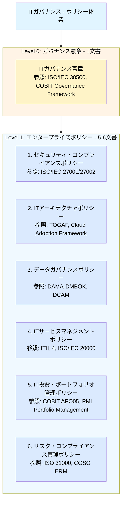
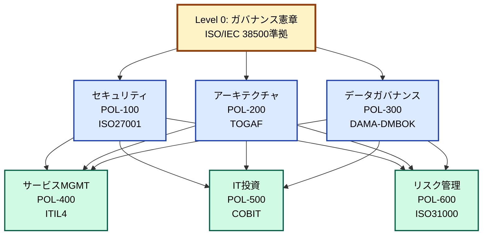

# ITポリシー体系

## 主要なITガバナンスフレームワーク

### 1. COBIT（Control Objectives for Information and Related Technologies）
**発行**: ISACA
**対象**: IT全般統制
**カバー範囲**: 戦略、投資、運用、モニタリング全般

### 2. ITIL（IT Infrastructure Library）
**対象**: ITサービスマネジメント
**カバー範囲**: サービスライフサイクル全般

### 3. ISO/IEC 38500
**対象**: ITガバナンスの原則
**カバー範囲**: 経営層のIT統治フレームワーク

### 4. データガバナンス関連
- **DAMA-DMBOK**: データマネジメント知識体系
- **DCAM**: EDM Council のデータ管理能力評価

<br>

## ポリシー体系案

これらの標準を参考に、連邦型に適したポリシー構造を提案します：



<br>

## 各ポリシーの詳細構成

### POL-100: セキュリティ・コンプライアンスポリシー
**参照標準**: ISO/IEC 27001/27002, NIST CSF

```
1. 情報セキュリティ管理体制（ISMS準拠）
2. アクセス制御原則
3. 暗号化・データ保護
4. 脆弱性・パッチ管理
5. インシデント・事業継続
6. 物理的・環境的セキュリティ
7. 第三者管理
8. コンプライアンス（GDPR、業界規制等）
```

### POL-200: ITアーキテクチャポリシー
**参照標準**: TOGAF, AWS Well-Architected Framework, Cloud Adoption Framework

```
1. エンタープライズアーキテクチャ原則
   - ビジネス・データ・アプリケーション・技術の4層
   
2. クラウド戦略
   - マルチクラウド/ハイブリッド方針
   - クラウドネイティブ原則
   
3. 技術標準化
   - 技術スタック承認プロセス
   - レガシー近代化方針
   
4. 統合・相互運用性
   - API標準（REST/GraphQL/gRPC）
   - データ交換フォーマット
   - イベント駆動アーキテクチャ
   
5. アーキテクチャガバナンス
   - アーキテクチャレビュー委員会（ARB）
   - 技術負債管理
   - イノベーション vs 標準化のバランス
   
6. 設計原則
   - スケーラビリティ、回復性、可観測性
   - セキュリティバイデザイン
   - コスト最適化
```

**連邦型での決定権限**:
- **中央EA**: 原則定義、技術戦略、承認プロセス設計
- **ARB**: 新技術評価、アーキテクチャパターン承認
- **ドメイン**: 詳細設計、承認済み技術の選択・実装

---

### POL-300: データガバナンスポリシー
**参照標準**: DAMA-DMBOK, DCAM (Data Management Capability Assessment Model)

```
1. データガバナンス組織
   - データガバナンス評議会
   - データオーナー、スチュワード、カストディアンの役割
   - ドメインデータオーナーシップモデル
   
2. データアーキテクチャ
   - データメッシュ原則（該当する場合）
   - データレイク/ウェアハウス戦略
   - マスタデータ管理（MDM）
   
3. データ品質管理
   - データ品質ディメンション（正確性、完全性、一貫性、適時性等）
   - 品質測定・監視フレームワーク
   - データプロファイリング要件
   
4. メタデータ管理
   - ビジネス・技術・運用メタデータ
   - データカタログ要件
   - データ系譜（lineage）追跡
   
5. データライフサイクル管理
   - 保持期間ポリシー
   - アーカイブ・削除基準
   - データ最小化原則
   
6. データセキュリティ・プライバシー
   - データ分類（Public/Internal/Confidential/Restricted）
   - 個人データ保護（GDPR, CCPA等準拠）
   - データマスキング・匿名化
   
7. データ共有・相互運用性
   - ドメイン間データ契約（Data Contract）
   - APIによるデータアクセス
   - データ製品（Data Product）公開基準
```

**連邦型での決定権限**:
- **中央データオフィス**: フレームワーク定義、品質基準、カタログ基盤
- **ドメインデータオーナー**: データ定義、品質目標、アクセス権限
- **データガバナンス評議会**: 横断的課題の調整、標準承認

---

### POL-400: ITサービスマネジメントポリシー
**参照標準**: ITIL 4, ISO/IEC 20000

```
1. サービスマネジメント原則
   - サービス価値体系（SVS: Service Value System）
   - 継続的改善
   
2. サービス戦略・設計
   - サービスカタログ管理
   - SLA/OLA/UC管理
   - キャパシティ・可用性管理
   
3. サービス移行
   - 変更管理（Change Management）
     * 変更タイプ（Standard/Normal/Emergency）
     * 変更諮問委員会（CAB）運営
     * ドメインCAB vs 中央CAB
   - リリース・デプロイメント管理
   - 構成管理（CMDB）
   
4. サービス運用
   - インシデント管理
     * 優先度マトリクス（影響度×緊急度）
     * エスカレーション基準
     * 重大インシデント対応
   - 問題管理
   - イベント・モニタリング管理
   
5. サービスデスク
   - サポートモデル（中央 vs ドメイン）
   - チケットルーティング
   - ナレッジ管理
   
6. 継続的改善
   - サービスレビュー（月次/四半期）
   - ポストモーテム文化
   - メトリクス・KPI測定
```

**連邦型での決定権限**:
- **中央IT運用**: フレームワーク、ツール、プロセステンプレート
- **ドメイン**: SLA定義、インシデント対応、日常運用
- **中央CAB**: 全社影響変更の承認
- **ドメインCAB**: ドメイン内変更の承認

---

### POL-500: IT投資・ポートフォリオ管理ポリシー
**参照標準**: COBIT APO05 (Manage Portfolio), PMI Portfolio Management

```
1. IT投資ガバナンス
   - 投資意思決定プロセス
   - ステアリングコミッティ構成
   - 投資カテゴリ（Run/Grow/Transform）
   
2. ポートフォリオ管理
   - プロジェクト優先順位付け基準
     * ビジネス価値
     * 戦略適合性
     * リスク
     * ROI/NPV
   - ポートフォリオバランシング
   - リソース配分原則
   
3. 予算管理
   - 予算策定プロセス（年次/四半期）
   - CapEx vs OpEx方針
   - 予算配分モデル（中央 vs ドメイン）
   - チャージバック/ショーバック
   
4. FinOps（クラウド財務管理）
   - コスト可視化・配分
   - コスト最適化目標
   - リザーブドインスタンス/Savings Plans戦略
   - 異常検知・アラート
   
5. ベネフィット実現管理
   - 投資効果測定
   - ビジネスケース検証
   - ポスト実装レビュー
   
6. プロジェクト・プログラム管理標準
   - PMOモデル（中央PMO vs ドメインPMO）
   - プロジェクトゲート承認基準
   - ガバナンスチェックポイント
```

**連邦型での決定権限**:
- **IT投資委員会**: 大規模投資承認、全社優先順位
- **中央FinOps**: コスト可視化、全社最適化、契約交渉
- **ドメイン**: 予算内での投資判断、詳細プロジェクト管理
- **PMO**: プロセス標準化、プロジェクト健全性監視

---

### POL-600: リスク・コンプライアンス管理ポリシー
**参照標準**: ISO 31000, COSO ERM, COBIT Risk Management

```
1. リスク管理フレームワーク
   - リスク管理プロセス（識別・評価・対応・監視）
   - リスク選好（Risk Appetite）
   - リスク許容度（Risk Tolerance）
   - スリーラインモデル（3 Lines of Defense）
   
2. ITリスク評価
   - リスクカテゴリ
     * サイバーセキュリティリスク
     * 運用リスク
     * コンプライアンスリスク
     * 技術リスク（技術的負債等）
     * ベンダーリスク
   - リスク評価マトリクス（発生可能性×影響度）
   - リスクレジストリ管理
   
3. リスク対応
   - リスク対応戦略（回避/低減/移転/受容）
   - 統制（Control）設計・実装
   - リスクオーナーシップ
   
4. 第三者リスク管理
   - ベンダー評価・選定基準
   - SaaSセキュリティ評価
   - ベンダーモニタリング
   - 契約条項標準（SLA、データ保護、監査権等）
   
5. コンプライアンス管理
   - 適用法規制の特定・追跡
   - コンプライアンス評価（定期/臨時）
   - 内部統制（SOX IT統制等）
   - 監査対応プロセス
   
6. 事業継続・災害復旧
   - BCP/DR戦略
   - RTO/RPO目標設定
   - 復旧優先順位
   - 定期的な訓練・テスト
   
7. リスク報告・監視
   - リスクダッシュボード
   - 経営層への報告（月次/四半期）
   - KRI（Key Risk Indicators）
```

**連邦型での決定権限**:
- **CRO/リスク委員会**: リスク選好定義、重大リスク承認
- **中央リスク管理**: フレームワーク、リスク評価支援、統合報告
- **ドメイン**: リスク識別・評価、対策実装、リスクオーナー
- **内部監査**: 独立した保証（第3ライン）

---

<br>

## ポリシー間の関係性と統合



