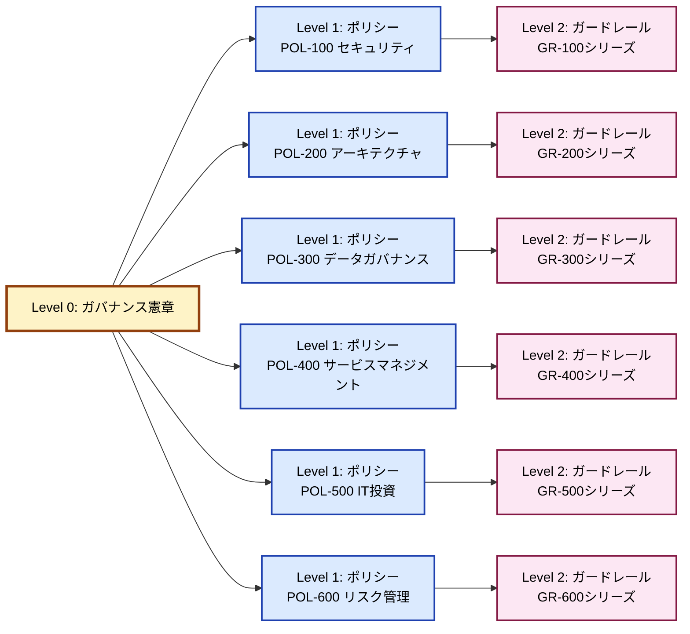

# ガバナンス文書体系



---

<br>

## ガードレール文書の定義

**ガードレールとは**：
1. 具体的な基準（測定可能）
2. 自律判断の境界線
3. エスカレーション基準

の3つを含む文書

<br>

## ガードレール文書の標準構成（全文書共通）

すべてのガードレール文書は以下の構造を持ちます：

| セクション | 内容 |
|-----------|------|
| 1. メタデータ | ID、対応ポリシー、バージョン、更新日 |
| 2. 目的とスコープ | このガードレールが実現するポリシー要件 |
| 3. 具体的基準 | 測定可能な数値・条件・定義 |
| 4. 自律判断の境界（グリーンゾーン） | ドメインが自由に判断できる範囲、条件、必要なアクション |
| 5. 承認必要な範囲（イエローゾーン） | 中央への相談・承認が必要なケース、承認者、期限 |
| 6. 禁止・エスカレーション（レッドゾーン） | 絶対禁止事項、技術的強制、違反時の措置 |
| 7. 例外プロセス | 例外申請条件、承認者、リスク評価要件 |
| 8. モニタリングと報告 | 遵守状況測定方法、報告要件、KPI |
| 9. 関連文書 | 上位ポリシー、関連ガードレール、外部標準 |

---

<br>

## ガードレール文書例

### POL-500の文書体系

```
POL-500: IT投資・ポートフォリオ管理ポリシー
├─ GR-501: IT投資意思決定ガードレール
├─ GR-502: ビジネスケース・ベネフィット測定ガードレール
├─ GR-503: 予算管理・執行ガードレール
└─ GR-504: クラウドFinOpsガードレール

合計:
- ポリシー: 1文書
- ガードレール: 4文書
```

<br>

### POL-500: IT投資・ポートフォリオ管理ポリシー

```markdown
原則:
- ビジネス価値に基づく投資判断
- ポートフォリオバランスの最適化
- 透明性のある予算配分
- クラウドコストの最適化

範囲:
1. IT投資ガバナンス
   - 投資意思決定プロセス
   - ステアリングコミッティ構成
   - 投資カテゴリ（Run/Grow/Transform）
   
2. ポートフォリオ管理
   - プロジェクト優先順位付け基準
     * ビジネス価値
     * 戦略適合性
     * リスク
     * ROI/NPV
   - ポートフォリオバランシング
   - リソース配分原則
   
3. 予算管理
   - 予算策定プロセス（年次/四半期）
   - CapEx vs OpEx方針
   - 予算配分モデル（中央 vs ドメイン）
   - チャージバック/ショーバック
   
4. FinOps（クラウド財務管理）
   - コスト可視化・配分
   - コスト最適化目標
   - リザーブドインスタンス/Savings Plans戦略
   - 異常検知・アラート
   
5. ベネフィット実現管理
   - 投資効果測定
   - ビジネスケース検証
   - ポスト実装レビュー
   
6. プロジェクト・プログラム管理標準
   - PMOモデル（中央PMO vs ドメインPMO）
   - プロジェクトゲート承認基準
   - ガバナンスチェックポイント
```
<br>

### GR-501: IT投資意思決定ガードレール（例）

```markdown
# GR-501: IT投資意思決定ガードレール

## 1. 投資分類基準（具体的基準）

### 1.1 投資カテゴリ定義
- **Run（維持）**: 既存システム維持・運用、障害対応
- **Grow（成長）**: 既存事業の拡大・改善
- **Transform（変革）**: 新規ビジネス・イノベーション

### 1.2 投資規模分類
| 分類 | 金額範囲 |
|------|---------|
| 大型 | 1,000万円以上 |
| 中型 | 100万円〜1,000万円 |
| 小型 | 100万円未満 |

## 2. 評価基準（具体的基準）

### 2.1 定量評価必須項目
- **ROI**: 投資回収期間3年以内を推奨
- **NPV**: 正の値必須（大型投資）
- **コスト削減額**: Run投資の場合は明示

### 2.2 定性評価
- 戦略適合度: 5段階評価
- リスク評価: 高/中/低
- 緊急性: 即座/3ヶ月/6ヶ月/1年

### 2.3 ポートフォリオバランス目標
- Run: 50-60%
- Grow: 25-35%
- Transform: 10-20%

## 3. 自律判断の境界

### ドメイン自律判断可能（グリーンゾーン）
**条件**: 以下すべてを満たす場合
- 投資額が100万円未満
- 既存予算内
- 既存システムの改善（新規構築でない）
- 技術スタック承認リスト内

**必要なアクション**:
- 四半期レポートでの事後報告のみ
- 投資台帳への登録

**判断者**: ドメインリーダー

---

### 中央承認必要（イエローゾーン）
**条件**: 以下いずれかに該当
- 投資額が100万円〜1,000万円
- 新規技術スタックの採用
- 複数ドメインに影響
- 外部ベンダー契約（1年以上）

**必要なアクション**:
- ビジネスケース（簡易版1-2ページ）提出
- CTO承認
- 技術評価委員会でのレビュー（新技術の場合）

**承認期限**: 申請から2週間以内に可否回答

**判断者**: CTO + CFO

---

### IT投資委員会承認必須（レッドゾーン）
**条件**: 以下いずれかに該当
- 投資額が1,000万円以上
- 全社基盤への影響
- 戦略的重要性が高い（Transform投資）
- 複数年契約（500万円以上）

**必要なアクション**:
- フルビジネスケース提出（テンプレート準拠）
- リスク評価・代替案比較
- IT投資委員会での承認（月1回開催）
- 四半期毎の進捗報告義務

**承認期限**: 次回委員会（最大1ヶ月）

**判断者**: IT投資委員会（CTO, CFO, 事業部長）

---

### 禁止事項
以下は承認プロセス違反として禁止:
- ビジネスケースなしの大型投資実施
- 承認前の契約締結
- 予算未確保での投資着手
- 分割発注による承認回避（年度内で合算評価）

**違反時の措置**:
- 投資即時停止
- ドメインリーダーへの警告
- 次年度予算査定への影響

## 4. 優先順位付けプロセス

### 4.1 スコアリング基準（大型・中型投資）
| 評価項目 | 配点 | 評価方法 |
|---------|------|---------|
| ビジネス価値 | 40点 | ROI、売上/コスト影響 |
| 戦略適合度 | 30点 | 経営戦略との整合性 |
| リスク | 20点 | 技術・ビジネスリスク評価 |
| 実現可能性 | 10点 | スキル、リソース、期間 |

**合計70点以上**: 承認推奨
**50-70点**: 条件付き承認
**50点未満**: 却下または再検討

### 4.2 ポートフォリオレビュー
- **頻度**: 四半期毎
- **参加者**: IT投資委員会
- **実施事項**: 
  - ポートフォリオバランス確認
  - 進行中プロジェクトの健全性チェック
  - 投資の優先順位再評価

## 5. 例外プロセス

### 緊急投資（セキュリティ、障害対応等）
**条件**: 
- 事業継続に即座の影響
- セキュリティ重大リスク

**プロセス**:
1. CTO口頭承認で着手可
2. 48時間以内に事後承認申請
3. 次回IT投資委員会で正式承認

### ガードレール例外申請
**申請条件**: 
- ガードレール逸脱の正当な理由
- リスク評価と緩和策

**承認者**: 通常の1レベル上（小型→CTO、中型→委員会）

## 6. モニタリングと報告

### 投資台帳
- 全投資を一元管理
- 月次更新必須
- 四半期レビューで活用

### 報告義務
- **小型投資**: 四半期サマリー
- **中型投資**: 月次進捗（簡易）
- **大型投資**: 月次進捗（詳細） + 四半期委員会報告

### コンプライアンス測定
- ガードレール遵守率: 目標95%以上
- 承認プロセス違反件数: 年間0件目標
```


