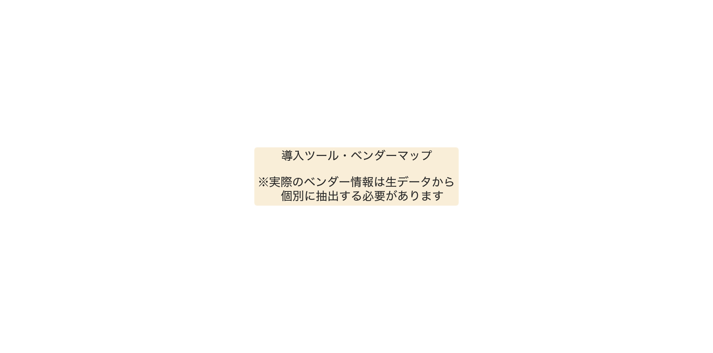
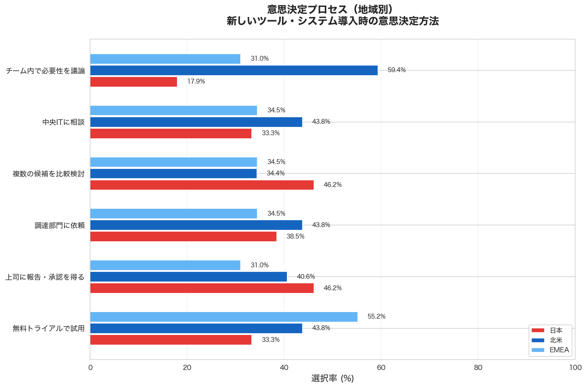
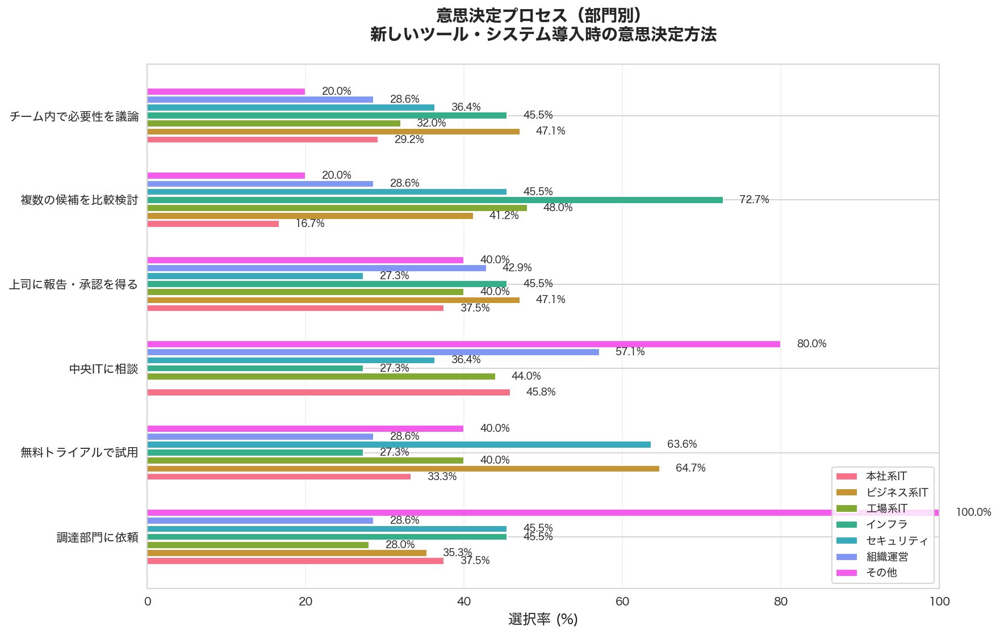
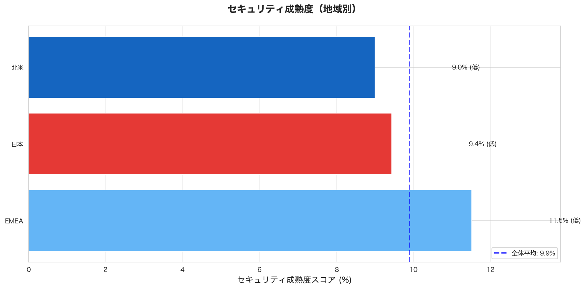
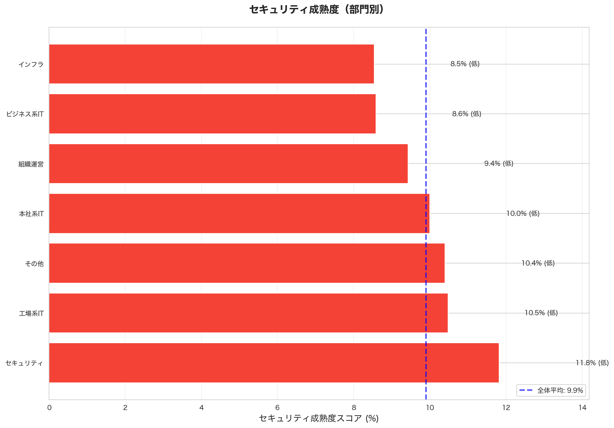
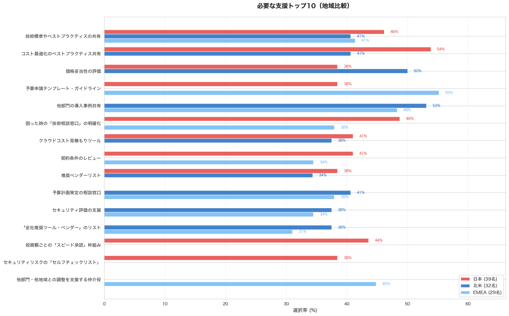
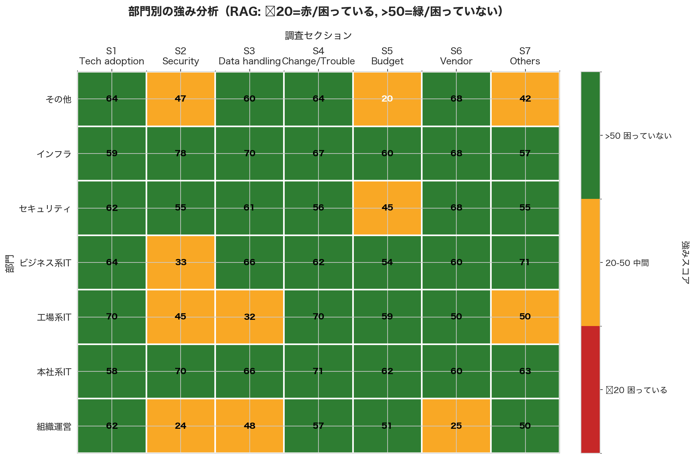

# ITガバナンス実態調査 分析レポート

**生成日時**: 2026年02月15日 12:42:24

---

## 目次

1. [エグゼクティブサマリー](#1-エグゼクティブサマリー)
2. [可視化一覧表](#2-可視化一覧表)
3. [A: 導入ツール・ベンダーマップ](#3-a-導入ツールベンダーマップ)
4. [B: 意思決定プロセスの実態](#4-b-意思決定プロセスの実態)
5. [C: セキュリティ成熟度マップ](#5-c-セキュリティ成熟度マップ)
6. [D: 困りごと・ニーズ分析](#6-d-困りごとニーズ分析)
7. [E: 部門別プロファイル](#7-e-部門別プロファイル)
8. [グラフ一覧](#8-グラフ一覧)

---

## 1. エグゼクティブサマリー

### 調査概要

- **総回答数**: 100件
- **調査項目**: 全7セクション・37問

- **セキュリティ成熟度スコア**: 9.9% (低)

---

## 2. 可視化一覧表

| 可視化 | 目的 | わかること | わからないこと | データソース |
|--------|------|-----------|---------------|-------------|
| **A: 導入ツール・ベンダーマップ** | 全社のツール・ベンダー利用状況を一覧化 | ・同じカテゴリで複数ツールが存在する領域 ・部門ごとの契約状況 ・年間コストの全体像 | ・統合した場合の正確な削減額（契約条件の詳細が必要） ・なぜそのツールを選んだのか（個別ヒアリングが必要） | セクション1 Q1 セクション6 Q1 |
| **B: 意思決定プロセスの実態** | 判断プロセスのバラつきを把握 | ・金額基準の部門間のバラつき ・実際にどういうプロセスで決めているか ・何に困っているか | ・なぜバラついているのか（歴史的経緯、組織文化） ・判断の質（良い判断ができているか） | セクション1 Q2, Q4, Q5 |
| **C: セキュリティ成熟度マップ** | セキュリティ対策の実施状況を部門別に把握 | ・部門別のセキュリティ成熟度 ・特に対応が遅れている項目 ・共通アカウント利用など明らかな問題 | ・実装の技術的な正確性（監査が必要） ・実際のインシデント発生状況（ログ分析が必要） | セクション2 Q1-Q4 |
| **D: 困りごと・ニーズ分析** | 現場が求める支援を特定 | ・現場が最も求めている支援 ・共通する困りごと ・地域による違い | ・支援策の具体的な設計内容（別途検討が必要） | 全セクションの「困ること」 セクション5,6,7の支援質問 |
| **E: 部門別プロファイル** | ベストプラクティス保有部門の特定 | ・セクション別に困っていない度合い ・ベストプラクティスを持つ可能性がある部門 ・部門間の知識共有の機会 | ・具体的なベストプラクティスの内容（個別ヒアリングが必要） | 全セクションの困りごと |

---

## 3. A: 導入ツール・ベンダーマップ

---

## 4. B: 意思決定プロセスの実態

### 地域別

### 部門別

---

## 5. C: セキュリティ成熟度マップ

### 地域別

### 部門別

---

## 6. D: 困りごと・ニーズ分析

### 困りごとトップ10（地域比較）

### 必要な支援トップ10（地域比較）

---

## 7. E: 部門別の強み分析

---

## 8. グラフ一覧

### 5つの主要可視化

1. [A: 導入ツール・ベンダーマップ](graphs/visualization_A_vendor_map.png)
2. B: 意思決定プロセスの実態
   - [地域別](graphs/visualization_B_decision_process_by_region.png)
   - [部門別](graphs/visualization_B_decision_process_by_department.png)
3. C: セキュリティ成熟度マップ
   - [地域別](graphs/visualization_C_security_maturity_by_region.png)
   - [部門別](graphs/visualization_C_security_maturity_by_department.png)
4. D: 困りごと・ニーズ分析（地域比較）
   - [困りごとトップ10](graphs/visualization_D1_pain_points_regional_comparison.png)
   - [必要な支援トップ10](graphs/visualization_D2_support_needs_regional_comparison.png)
5. [E: 部門別プロファイル](graphs/visualization_E_department_profile.png)

---

**レポート生成完了**
