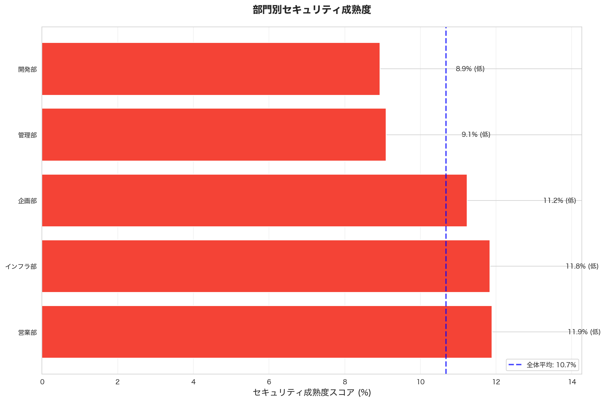
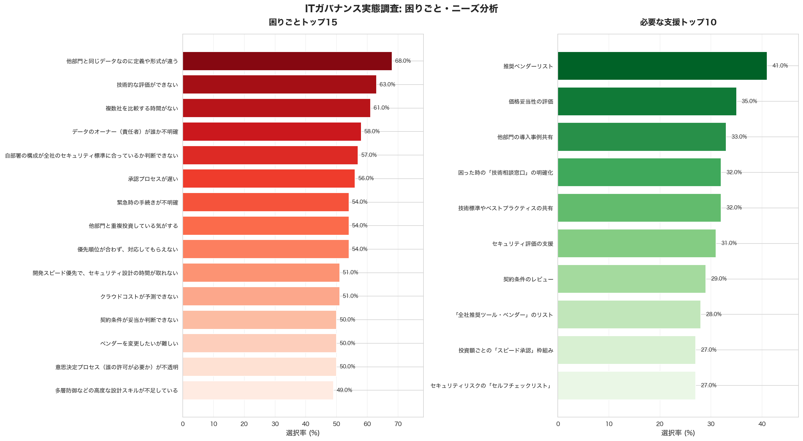
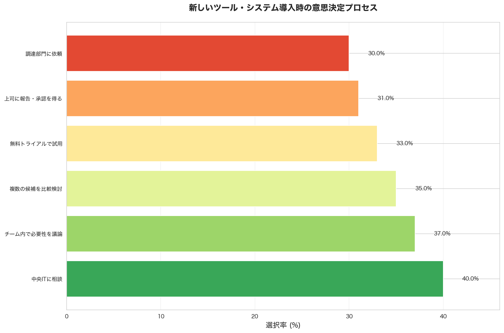
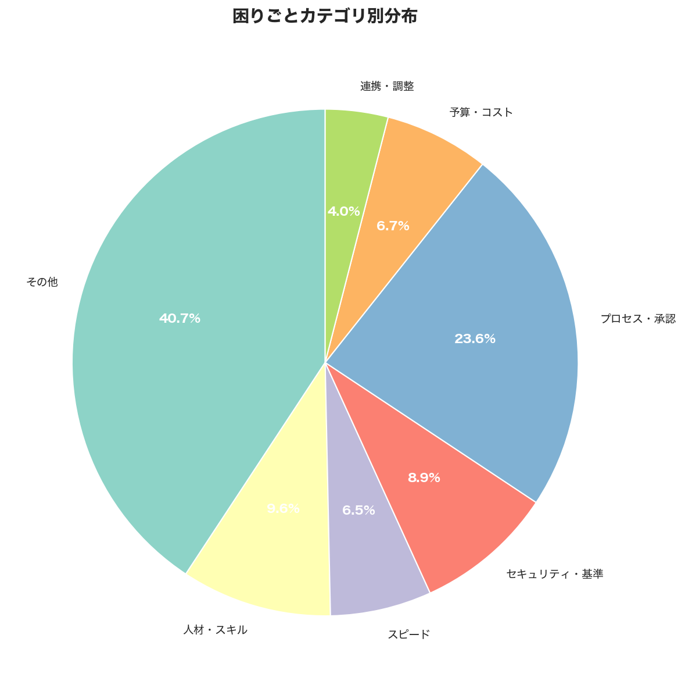

# ITガバナンス実態調査 分析レポート

**生成日時**: 2026年02月14日 18:58:34

---

## 目次

1. [エグゼクティブサマリー](#1-エグゼクティブサマリー)
2. [セキュリティ成熟度分析](#2-セキュリティ成熟度分析)
3. [意思決定プロセス分析](#3-意思決定プロセス分析)
4. [困りごと分析](#4-困りごと分析)
5. [必要な支援分析](#5-必要な支援分析)
6. [部門別プロファイル](#6-部門別プロファイル)
7. [グラフ一覧](#7-グラフ一覧)

---

## 1. エグゼクティブサマリー

### 調査概要

- **総回答数**: 100件
- **調査項目**: 全7セクション・37問

### セキュリティ成熟度スコア

- **全体スコア**: 10.7% (低)

### 困りごとトップ10

| 順位 | 困りごと | 選択率 | 件数 |
|------|---------|--------|------|
| 1 | 他部門と同じデータなのに定義や形式が違う | 68.0% | 68件 |
| 2 | 技術的な評価ができない | 63.0% | 63件 |
| 3 | 複数社を比較する時間がない | 61.0% | 61件 |
| 4 | データのオーナー（責任者）が誰か不明確 | 58.0% | 58件 |
| 5 | 自部署の構成が全社のセキュリティ標準に合っているか判断できない | 57.0% | 57件 |
| 6 | 承認プロセスが遅い | 56.0% | 56件 |
| 7 | 緊急時の手続きが不明確 | 54.0% | 54件 |
| 8 | 他部門と重複投資している気がする | 54.0% | 54件 |
| 9 | 優先順位が合わず、対応してもらえない | 54.0% | 54件 |
| 10 | 開発スピード優先で、セキュリティ設計の時間が取れない | 51.0% | 51件 |

### 必要な支援トップ10

| 順位 | 支援内容 | 選択率 | 件数 |
|------|---------|--------|------|
| 1 | 推奨ベンダーリスト | 41.0% | 41件 |
| 2 | 価格妥当性の評価 | 35.0% | 35件 |
| 3 | 他部門の導入事例共有 | 33.0% | 33件 |
| 4 | 困った時の「技術相談窓口」の明確化 | 32.0% | 32件 |
| 5 | 技術標準やベストプラクティスの共有 | 32.0% | 32件 |
| 6 | セキュリティ評価の支援 | 31.0% | 31件 |
| 7 | 契約条件のレビュー | 29.0% | 29件 |
| 8 | 「全社推奨ツール・ベンダー」のリスト | 28.0% | 28件 |
| 9 | 投資額ごとの「スピード承認」枠組み | 27.0% | 27件 |
| 10 | セキュリティリスクの「セルフチェックリスト」 | 27.0% | 27件 |

---

## 2. セキュリティ成熟度分析

### 全体スコア

- **スコア**: 10.7%
- **成熟度レベル**: 低
- **最大スコア**: 2500点中 267点

### 項目別スコア

| 項目 | スコア | 達成率 |
|------|--------|--------|
| セキュリティ設計 | 39.0点 | 5.6% |
| MFA利用 | 34.5点 | 11.5% |
| 権限管理 | 23.5点 | 7.8% |
| データ保護 | 121.0点 | 20.2% |
| リリース前検証 | 49.0点 | 8.2% |

### 部門別成熟度

| 部門 | スコア | レベル | 回答者数 |
|------|--------|--------|----------|
| 営業部 | 11.9% | 低 | 18名 |
| インフラ部 | 11.8% | 低 | 24名 |
| 企画部 | 11.2% | 低 | 21名 |
| 管理部 | 9.1% | 低 | 22名 |
| 開発部 | 8.9% | 低 | 15名 |

---

## 3. 意思決定プロセス分析

### 導入時の意思決定方法

| 方法 | 選択率 | 件数 |
|------|--------|------|
| 中央ITに相談 | 40.0% | 40件 |
| チーム内で必要性を議論 | 37.0% | 37件 |
| 複数の候補を比較検討 | 35.0% | 35件 |
| 無料トライアルで試用 | 33.0% | 33件 |
| 上司に報告・承認を得る | 31.0% | 31件 |
| 調達部門に依頼 | 30.0% | 30件 |

---

## 4. 困りごと分析

### カテゴリ別サマリー

| カテゴリ | 件数 | 構成比 |
|---------|------|--------|
| その他 | 610件 | 40.7% |
| プロセス・承認 | 354件 | 23.6% |
| 人材・スキル | 144件 | 9.6% |
| セキュリティ・基準 | 133件 | 8.9% |
| 予算・コスト | 100件 | 6.7% |
| スピード | 97件 | 6.5% |
| 連携・調整 | 60件 | 4.0% |

### 詳細リスト（全困りごと）

| 順位 | カテゴリ | 困りごと | 選択率 | 件数 |
|------|---------|---------|--------|------|
| 1 | その他 | 他部門と同じデータなのに定義や形式が違う | 68.0% | 68件 |
| 2 | 人材・スキル | 技術的な評価ができない | 63.0% | 63件 |
| 3 | スピード | 複数社を比較する時間がない | 61.0% | 61件 |
| 4 | その他 | データのオーナー（責任者）が誰か不明確 | 58.0% | 58件 |
| 5 | セキュリティ・基準 | 自部署の構成が全社のセキュリティ標準に合っているか判断できない | 57.0% | 57件 |
| 6 | プロセス・承認 | 承認プロセスが遅い | 56.0% | 56件 |
| 7 | プロセス・承認 | 緊急時の手続きが不明確 | 54.0% | 54件 |
| 8 | その他 | 他部門と重複投資している気がする | 54.0% | 54件 |
| 9 | その他 | 優先順位が合わず、対応してもらえない | 54.0% | 54件 |
| 10 | セキュリティ・基準 | 開発スピード優先で、セキュリティ設計の時間が取れない | 51.0% | 51件 |
| 11 | 予算・コスト | クラウドコストが予測できない | 51.0% | 51件 |
| 12 | その他 | 契約条件が妥当か判断できない | 50.0% | 50件 |
| 13 | その他 | ベンダーを変更したいが難しい | 50.0% | 50件 |
| 14 | プロセス・承認 | 意思決定プロセス（誰の許可が必要か）が不透明 | 50.0% | 50件 |
| 15 | 人材・スキル | 多層防御などの高度な設計スキルが不足している | 49.0% | 49件 |
| 16 | 予算・コスト | 予算執行の柔軟性がない | 49.0% | 49件 |
| 17 | プロセス・承認 | 予算取りの手続きが不明確 | 46.0% | 46件 |
| 18 | プロセス・承認 | 予算申請の手続きが不明確 | 46.0% | 46件 |
| 19 | その他 | 技術仕様や標準が異なり、話が噛み合わない | 46.0% | 46件 |
| 20 | その他 | 過去のトラブル情報が共有されていない | 45.0% | 45件 |
| 21 | その他 | 言語の壁 | 45.0% | 45件 |
| 22 | その他 | 優先順位が合わず、対応してもらえない | 43.0% | 43件 |
| 23 | その他 | 機密情報の定義が難しく、導入して良いか判断に迷う | 41.0% | 41件 |
| 24 | 連携・調整 | 時差による調整の困難 | 40.0% | 40件 |
| 25 | プロセス・承認 | 意思決定プロセス（誰の許可が必要か）が不透明 | 38.0% | 38件 |
| 26 | スピード | 比較検討する時間がない | 36.0% | 36件 |
| 27 | その他 | 技術仕様や標準が異なり、話が噛み合わない | 35.0% | 35件 |
| 28 | プロセス・承認 | 承認者が不明確（誰に判をもらえばいいか不明） | 32.0% | 32件 |
| 29 | プロセス・承認 | 承認に時間がかかりすぎる | 32.0% | 32件 |
| 30 | 人材・スキル | 技術的な評価ができる人材がいない | 32.0% | 32件 |

---

## 5. 必要な支援分析

### 全体的な支援ニーズ

| 順位 | 支援内容 | 選択率 | 件数 |
|------|---------|--------|------|
| 1 | 困った時の「技術相談窓口」の明確化 | 32.0% | 32件 |
| 2 | 技術標準やベストプラクティスの共有 | 32.0% | 32件 |
| 3 | 「全社推奨ツール・ベンダー」のリスト | 28.0% | 28件 |
| 4 | 投資額ごとの「スピード承認」枠組み | 27.0% | 27件 |
| 5 | セキュリティリスクの「セルフチェックリスト」 | 27.0% | 27件 |
| 6 | 他部門・他地域との調整を支援する仲介役 | 27.0% | 27件 |

### ベンダー管理での支援ニーズ

| 順位 | 支援内容 | 選択率 | 件数 |
|------|---------|--------|------|
| 1 | 推奨ベンダーリスト | 41.0% | 41件 |
| 2 | 価格妥当性の評価 | 35.0% | 35件 |
| 3 | 他部門の導入事例共有 | 33.0% | 33件 |
| 4 | セキュリティ評価の支援 | 31.0% | 31件 |
| 5 | 契約条件のレビュー | 29.0% | 29件 |
| 6 | ベンダー比較評価のサポート | 27.0% | 27件 |

---

## 6. 部門別プロファイル

### インフラ部

- **回答者数**: 24名
- **平均IT予算**: 5526万円

**変更管理の実施状況（上位5つ）**:

1. テスト環境で事前検証 (45.8%)
2. 変更記録を残す (45.8%)
3. チーム内でレビュー (41.7%)
4. ロールバック（切り戻し）手順を準備 (41.7%)
5. 変更計画書を作成 (33.3%)

**主な困りごと**:

- データのオーナー（責任者）が誰か不明確
- 緊急時の手続きが不明確
- 複数社を比較する時間がない

### 企画部

- **回答者数**: 21名
- **平均IT予算**: 3943万円

**変更管理の実施状況（上位5つ）**:

1. 変更計画書を作成 (52.4%)
2. 変更記録を残す (47.6%)
3. 承認を得る (42.9%)
4. テスト環境で事前検証 (42.9%)
5. チーム内でレビュー (38.1%)

**主な困りごと**:

- 他部門と同じデータなのに定義や形式が違う
- 技術的な評価ができない
- 予算執行の柔軟性がない

### 営業部

- **回答者数**: 18名
- **平均IT予算**: 5424万円

**変更管理の実施状況（上位5つ）**:

1. ロールバック（切り戻し）手順を準備 (50.0%)
2. チーム内でレビュー (44.4%)
3. 承認を得る (38.9%)
4. テスト環境で事前検証 (33.3%)
5. 変更記録を残す (33.3%)

**主な困りごと**:

- 自部署の構成が全社のセキュリティ標準に合っているか判断できない
- 他部門と同じデータなのに定義や形式が違う
- データのオーナー（責任者）が誰か不明確

### 管理部

- **回答者数**: 22名
- **平均IT予算**: 4983万円

**変更管理の実施状況（上位5つ）**:

1. ロールバック（切り戻し）手順を準備 (45.5%)
2. 変更計画書を作成 (36.4%)
3. チーム内でレビュー (31.8%)
4. 承認を得る (27.3%)
5. テスト環境で事前検証 (27.3%)

**主な困りごと**:

- 複数社を比較する時間がない
- 他部門と同じデータなのに定義や形式が違う
- 予算申請の手続きが不明確

### 開発部

- **回答者数**: 15名
- **平均IT予算**: 4797万円

**変更管理の実施状況（上位5つ）**:

1. 変更記録を残す (60.0%)
2. チーム内でレビュー (46.7%)
3. テスト環境で事前検証 (40.0%)
4. ロールバック（切り戻し）手順を準備 (40.0%)
5. 変更計画書を作成 (26.7%)

**主な困りごと**:

- 他部門と同じデータなのに定義や形式が違う
- 承認プロセスが遅い
- 開発スピード優先で、セキュリティ設計の時間が取れない

---

## 7. グラフ一覧

### 5つの主要可視化

1. [導入ツール・ベンダーマップ](graphs/visualization_A_vendor_map.png)
2. [意思決定プロセスの実態](graphs/visualization_B_decision_process.png)
3. [セキュリティ成熟度マップ](graphs/visualization_C_security_maturity.png)
4. [困りごと・ニーズ分析](graphs/visualization_D_pain_points_needs.png)
5. [部門別プロファイル](graphs/visualization_E_department_profile.png)

### 追加の可視化

- [困りごとカテゴリ別サマリー](graphs/additional_category_summary.png)

---

**レポート生成完了**
