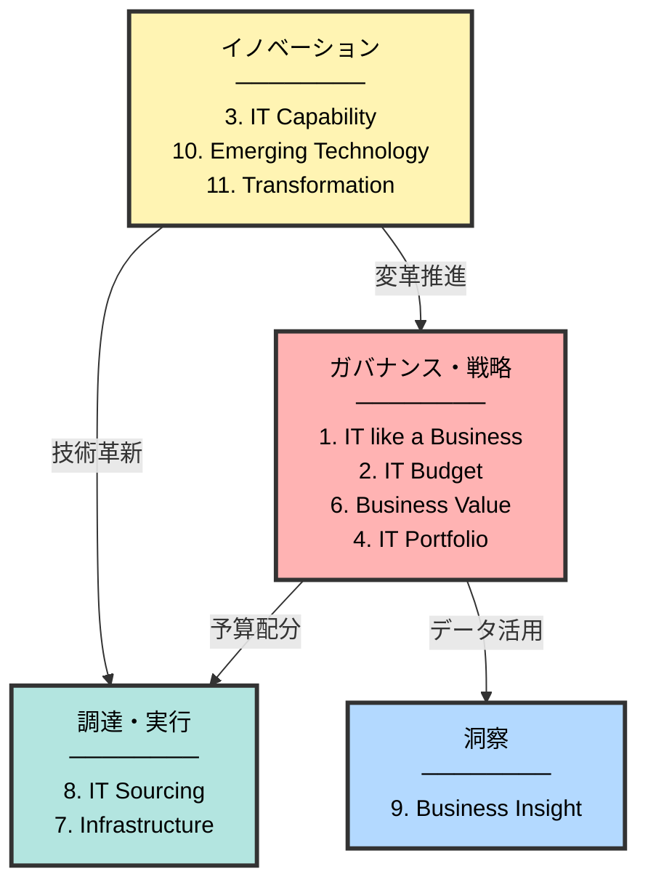
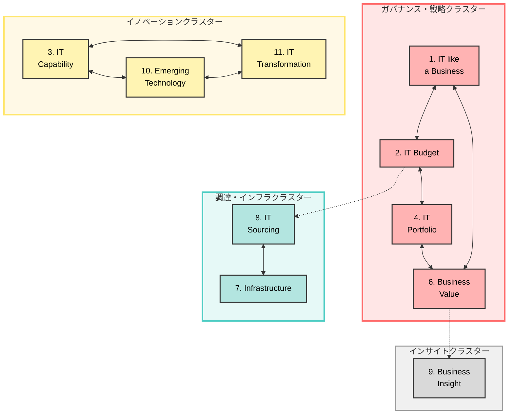

# IT-CMF

- [IT Capability Maturity Framework](https://ivi.ie/)

## 概要：IT-CMFとは何か

- IT-CMFは、ITを「コストセンター」ではなく **ビジネス価値を生むケイパビリティの集合**」として捉え、その成熟度を体系的に評価・改善するためのフレームワークです。 [nttdata-strategy](https://www.nttdata-strategy.com/knowledge/reports/archives/2016/0404/index.html)

- 正式名称は「IT Capability Maturity Framework」で、アイルランドのInnovation Value Institute（IVI）が中心となって研究・実務知見から構築したITマネジメントフレームワークです。

- 目的は「IT投資とIT機能がどれだけビジネス価値（俊敏性・イノベーション・収益・効率など）を生んでいるか」を可視化し、継続的に改善することです。 

- COBIT・ITIL・CMMIなど既存フレームと競合するのではなく、「それらを束ねてビジネス価値の観点で語るための上位フレーム」に近い位置づけです。 

 

## 特徴：他のマチュリティモデルとの違い

- ビジネス価値志向  
  - 「ITプロセスが標準化されているか」よりも、「ITがビジネス成果・競争優位にどう寄与しているか」を評価軸にしている点が特徴です。
  
- 共通言語としての設計  
  - CIO・ビジネス部門・IT部門・外部ベンダーなど多様なステークホルダーが、ITの課題と改善を議論するための共通言語・プラットフォームとして設計されています。
  
- 評価だけでなく改善ロードマップまでセット  
  - 各ケイパビリティに対して、成熟度プロファイル、アセスメント手法、改善ロードマップが一体となった「改善プログラム」を提供する点が実務的です。 
  
- 既存フレームとの整合  
  - ITILやCOBITなどがカバーする運用・ガバナンス領域とマッピングできるよう配慮されており、「IT-CMFで方向性を決め、詳細実装はITIL/COBITで」という使い方がしやすい構造になっています。 

 

## 使い方のイメージ（製造業のIT部門など）

- 例えば製造業のIT部門で「ビジネスとの共創度合い」「OT/IT統合」「ベンダー活用」などを含めてマチュリティを測りたい場合、次のようなステップが典型です。 

1. 対象範囲を決める  
   - 37 CCのうち、戦略・ポートフォリオ・ベンダー管理・セキュリティ・イノベーションなど、まず重点的に見たい10〜15領域程度に絞る。  

2. 自社の現状レベルを診断  
   - 各CCについて、1〜5レベルの定義に照らし、ワークショップやインタビューで「現状レベル」と「目標レベル（3年後など）」を決める。  

3. ギャップからロードマップを作る  
   - 例：ITポートフォリオ管理がレベル2→4を目指す場合、「投資案件の評価基準整備」「ビジネスKPIとの紐づけ」「継続的なベネフィットレビュー」などの施策を段階的に配置する。  

4. KPIと他フレームへのブレークダウン  
   - レベルアップに必要なプロセス詳細はITIL・COBIT等に落とし込み、IT-CMF側では「ビジネス価値/KPI」と「ケイパビリティの成熟度」をモニタリングする。  

 

## どんな組織に向いているか

- ある程度IT規模があり、CIO/IT部門が戦略パートナーとしてビジネス貢献を高めたい企業（製造・金融・公共など）に適合しやすいです。 

- すでにCOBIT・ITIL・ISOなどを導入済みだけれど、「バラバラな取り組みをビジネス価値の観点で束ね直したい」組織には特に使いやすいフレームです。 

---

 
 

# IT-CMF マクロケイパビリティの定義

## 1. Managing IT like a Business (MITB) - ITをビジネスとして管理する

### 定義
このマクロケイパビリティは、IT部門を単なる技術提供組織ではなく、ビジネスエンティティとして運営することに焦点を当てています。IT組織がビジネスの原則に基づいて運営され、明確なリーダーシップ、ガバナンス構造、財務管理、リスク管理、コンプライアンス管理を持つことを目指します。IT部門がビジネスパートナーとして認識され、戦略的な価値を提供できる組織へと進化するための基盤を築きます。

### 成熟した姿
IT部門が完全にビジネスパートナーとして機能し、経営層から信頼される戦略的組織となっています。明確なガバナンス体制のもと、IT投資の意思決定が透明かつデータドリブンで行われ、全てのステークホルダーが納得できるプロセスが確立されています。財務管理では、IT支出が詳細に可視化され、各投資のROIが測定可能で、CFOや経営陣に対してビジネス言語でIT価値を説明できます。リスク管理は予測的に行われ、潜在的なリスクが発生前に特定・軽減され、ビジネス継続性が常に確保されています。コンプライアンスは組織文化に組み込まれ、規制変更に迅速に対応できる体制が整っています。IT部門は単なるコストセンターではなく、明確なビジネス価値を創出するプロフィットセンターとして認識され、経営戦略の中核を担っています。

 

## 2. Managing the IT Budget (MITB) - IT予算の管理

### 定義
IT予算の計画、配分、監視、最適化に関する能力を包括するマクロケイパビリティです。限られた予算リソースを最も効果的に活用し、IT投資から最大限の価値を引き出すことを目的としています。予算のパフォーマンスを継続的に監視し、投資の優先順位付けを行い、コストと効率性のバランスを取りながら、ビジネス目標の達成を支援します。

### 成熟した姿
IT予算管理が高度に最適化され、リアルタイムで予算執行状況が可視化されています。予算配分は戦略的優先順位とビジネス価値に基づいて動的に調整され、環境変化に柔軟に対応できる仕組みが確立されています。投資判断は厳密なROI分析、TCO評価、ビジネスケースに基づいて行われ、全ての投資がビジネス成果に紐付けられています。予算超過は稀であり、発生しても早期に検出され、迅速な是正措置が取られます。コスト最適化は継続的に実施され、クラウド最適化、ライセンス管理、リソース効率化により、毎年確実なコスト削減を実現しながら、サービス品質は維持または向上しています。予算プロセスは自動化され、予測精度が非常に高く、経営陣からの信頼も厚い状態です。

 

## 3. Managing the IT Capability (MITC) - IT能力の管理

### 定義
組織のIT能力そのものを評価、開発、向上させることに焦点を当てたマクロケイパビリティです。IT組織の成熟度を測定し、継続的な改善を推進するとともに、イノベーションを促進し、知識資産を管理し、優秀な人材を確保・育成します。IT組織が長期的に競争力を維持し、ビジネスの変化に対応できる能力を構築することを目指します。

### 成熟した姿
IT組織の成熟度が業界トップクラスに達し、継続的な自己評価と改善が組織文化として定着しています。全てのプロセスがベストプラクティスに基づいて標準化され、常に最適化が図られています。イノベーションは組織のDNAとなり、新しいアイデアや技術が日常的に探索され、評価され、実験されています。失敗から学ぶ文化が醸成され、計算されたリスクテイクが奨励されています。知識管理システムは高度に発達し、AIを活用した知識の自動分類、検索、推奨が実現されています。ベストプラクティスや教訓が組織全体で即座に共有され、再利用されます。人材管理では、優秀な人材を惹きつけ、育成し、定着させる仕組みが完璧に機能しています。スキルギャップは予測的に特定され、個別化された育成プログラムが提供されます。後継者計画が確立され、キーパーソンの離脱リスクが最小化されています。IT組織は「働きたい組織」として業界で認知されています。

 

## 4. Managing the IT Portfolio (MITP) - ITポートフォリオの管理

### 定義
IT投資全体を統合的に管理し、プロジェクトやプログラムのポートフォリオを最適化するマクロケイパビリティです。個別のプロジェクトではなく、組織全体のIT投資を俯瞰的に捉え、戦略的優先順位に基づいてリソースを配分します。プロジェクトの計画、実行、監視を効果的に行い、投資から期待される便益を確実に実現することを重視します。

### 成熟した姿
組織の全IT投資が統合的に管理され、ポートフォリオ全体のバランスが最適化されています。戦略的イニシアティブ、運用維持、イノベーションへの投資配分が明確な基準に基づいて決定され、経営戦略と完全に整合しています。プロジェクトとプログラムは高い成功率で実行され、予定通りの納期と予算で確実に完遂されます。PMOは成熟し、標準化された方法論とツールが全プロジェクトで活用され、リアルタイムでポートフォリオ全体の健全性が監視されています。ベネフィット実現管理が徹底され、全ての投資について期待された便益が実際に達成されたかが測定・検証されます。達成されなかった場合は原因分析が行われ、教訓が次の投資判断に活かされます。ポートフォリオの調整は動的に行われ、ビジネス環境の変化に迅速に対応できます。

 

## 5. User Experience (UX) - ユーザーエクスペリエンス

### 定義
ITサービスの利用者であるユーザーの視点を中心に据えたマクロケイパビリティです。ユーザーとの関係を構築し、エンゲージメントを高め、優れたユーザー体験を提供することに焦点を当てています。ビジネス要件を正確に把握し、サービスレベルを適切に管理することで、ユーザー満足度を向上させ、IT投資の価値を最大化します。

### 成熟した姿
ユーザー満足度が常に高水準を維持し、ITサービスがビジネスの生産性向上に明確に貢献しています。ユーザーとIT部門の関係は真のパートナーシップとなり、双方向のコミュニケーションが活発に行われています。ユーザーのニーズは先回りして把握され、予測的なサービス提供が実現されています。デジタルワークプレイスは直感的で使いやすく、ユーザーは技術的な障壁を感じることなく業務に集中できます。要件管理は高度に洗練され、ビジネス要求が正確かつ迅速にITソリューションに反映されます。曖昧さや誤解による手戻りはほとんど発生しません。サービスレベルは常に目標を上回り、SLA違反はほぼゼロです。インシデントは発生前に予測・防止され、発生しても自動的に、またはユーザーが気づく前に解決されます。ユーザーはITを「見えないが常に機能している」インフラとして信頼しています。

 

## 6. Managing IT for Business Value (M4BV) - ビジネス価値のためのIT管理

### 定義
ITをビジネス戦略の実現手段として位置づけ、ビジネス価値の創出に直接貢献するマクロケイパビリティです。IT戦略とビジネス戦略を緊密に整合させ、エンタープライズアーキテクチャを通じて組織全体の一貫性を確保します。ビジネスインテリジェンスを活用した意思決定支援や、効果的なソリューション提供を通じて、ITがビジネスの成功に不可欠な要素となることを目指します。

### 成熟した姿
IT戦略とビジネス戦略が完全に一体化され、ITが経営戦略の実現を牽引しています。CIOは経営陣の中核メンバーとして、ビジネス戦略の策定段階から深く関与しています。エンタープライズアーキテクチャは組織全体の青写真として機能し、全ての新規投資がアーキテクチャ原則に沿って評価されます。技術的負債は最小化され、システムの柔軟性と拡張性が高く、ビジネス変化に迅速に対応できます。ビジネスインテリジェンスは経営の意思決定に不可欠なツールとなり、リアルタイムのダッシュボードで全ての重要指標が可視化されています。データドリブンな意思決定が組織文化として定着しています。ソリューション提供は高速かつ高品質で、DevOps/アジャイル手法が成熟し、継続的デリバリーが実現されています。新しいビジネス要求に対して数週間、場合によっては数日で対応できる俊敏性を持っています。

 

## 7. Managing the IT Infrastructure (MITI) - ITインフラの管理

### 定義
組織のITインフラストラクチャの計画、構築、運用、保守を包括的に管理するマクロケイパビリティです。安定的で信頼性の高いインフラ環境を提供し、ITサービスの基盤を支えます。運用の効率化、情報資産の適切な管理、セキュリティの確保を通じて、ビジネスの継続性と成長を支援します。

### 成熟した姿
ITインフラは高可用性、高性能、高セキュリティを実現し、ビジネスクリティカルなシステムのダウンタイムはほぼゼロです。計画外停止は極めて稀であり、発生しても自動フェイルオーバーにより影響が最小化されます。インフラ運用は高度に自動化され、多くのタスクが人手を介さずに実行されます。AIを活用した予測的保守により、障害が発生する前に問題が特定・解決されます。容量計画は精緻で、リソース不足や過剰投資が回避されています。ITサービス管理はITIL等のベストプラクティスに完全準拠し、インシデント、問題、変更、リリース管理が円滑に機能しています。サービスカタログは充実し、ユーザーはセルフサービスで多くの要求を処理できます。情報管理では、データのライフサイクル全体が適切に管理され、データ品質が高く維持されています。セキュリティは多層防御が実装され、ゼロトラストアーキテクチャが採用され、脅威は予測的に検出・無効化されます。セキュリティインシデントは稀であり、発生しても迅速に封じ込められます。

 

## 8. Managing IT Sourcing (MITS) - ITソーシングの管理

### 定義
IT機能やサービスの調達戦略を管理するマクロケイパビリティです。内製とアウトソーシングの最適なバランスを見極め、外部ベンダーとの関係を戦略的に管理します。複数のサービスプロバイダーを統合的に管理し、エンドツーエンドのサービス提供を実現することで、コスト最適化と価値創出の両立を図ります。

### 成熟した姿
ソーシング戦略が最適化され、各機能について内製・外部委託の判断が明確な基準に基づいて行われています。コア能力は内製し、非コア業務は戦略的にアウトソースするバランスが確立されています。ベンダー管理は成熟し、主要ベンダーとは戦略的パートナーシップが構築されています。ベンダーパフォーマンスは継続的に測定され、定期的なビジネスレビューで改善が協議されます。契約条件は公正で、win-winの関係が維持されています。複数ベンダーのサービス統合が円滑に機能し、エンドユーザーはシームレスなサービス体験を享受しています。ベンダー間の責任分界が明確で、問題発生時の責任転嫁は起こりません。ソーシング決定は継続的に見直され、市場変化や技術進化に応じて柔軟に調整されます。クラウドサービスの活用が進み、オンプレミスとクラウドのハイブリッド環境が最適に管理されています。

 

## 9. Managing IT for Business Insight (M4BI) - ビジネス洞察のためのIT管理

### 定義
データと分析を活用してビジネスの洞察を提供し、意思決定を支援するマクロケイパビリティです。データガバナンスと品質管理を確立し、高度な分析基盤を整備します。ビジネスインテリジェンスとアナリティクスを通じて、組織のパフォーマンスを測定・改善し、競争優位性を獲得するための情報を提供します。

### 成熟した姿
データは組織の最も重要な資産として認識され、包括的なデータガバナンスが確立されています。データ品質は常に高水準を維持し、信頼できる「単一の真実の情報源（Single Source of Truth）」が存在します。分析基盤は高度に発達し、ビッグデータ、AI、機械学習が日常的に活用されています。リアルタイム分析が可能で、ビジネス状況の変化が即座に検出され、経営陣に通知されます。ビジネスインテリジェンスは組織全体に浸透し、全ての従業員がデータを活用して意思決定を行っています。予測分析により、将来のトレンドや問題が事前に把握され、プロアクティブな対応が可能です。パフォーマンス管理は統合的に実施され、IT指標とビジネス指標が関連付けられています。ダッシュボードは直感的で、経営陣は一目でビジネス状況を把握できます。ベンチマーキングにより、自社のポジションが常に把握され、競争力が維持されています。

 

## 10. Managing Emerging Technology (MET) - 新興技術の管理

### 定義
新しい技術トレンドを継続的に評価し、組織に適用するためのマクロケイパビリティです。新興技術の可能性を見極め、戦略的に導入・統合することで、イノベーションを促進します。デジタル技術を活用した革新的な取り組みを推進し、組織が技術的な優位性を維持し、市場での競争力を強化することを目指します。

### 成熟した姿
新興技術の評価が組織的・継続的に実施され、技術トレンドを常に先取りしています。専門チームが最新技術を調査・評価し、ビジネス適用可能性を検討しています。技術採用のプロセスが確立され、PoC、パイロット、本格展開の各段階が明確に定義されています。失敗を恐れず、小規模な実験を繰り返し、成功したものを迅速にスケールする文化があります。デジタルイノベーションラボやイノベーションセンターが設置され、新技術を活用した革新的なソリューションが継続的に創出されています。AI、IoT、ブロックチェーン、量子コンピューティングなど、最先端技術の実用化が進んでいます。技術導入のリードタイムが短く、市場に新技術が登場してから数ヶ月以内に評価・導入判断ができます。組織は「テクノロジーリーダー」として業界で認知され、他社がベンチマーク対象とする存在となっています。

 

## 11. Managing IT Transformation (MITT) - IT変革の管理

### 定義
組織のIT変革を計画、実行、定着させるためのマクロケイパビリティです。変更管理を効果的に行い、組織全体のトランスフォーメーションを推進します。継続的改善の文化を醸成し、組織が絶えず進化し、ビジネス環境の変化に適応できる能力を構築します。IT変革を通じて、組織の持続的な成長と競争力の向上を実現します。

### 成熟した姿
変革管理が組織能力として確立され、大規模な変革プログラムが高い成功率で実行されています。変革への抵抗は最小化され、むしろ従業員が変革を期待し、積極的に参加しています。組織全体のトランスフォーメーションが継続的に推進され、デジタル化、自動化、プロセス改善が常態化しています。IT部門だけでなく、ビジネス部門も含めた全社的な変革が実現されています。継続的改善の文化が深く根付き、全ての従業員が日常業務の中で改善機会を見つけ、実行しています。改善提案は奨励され、実装された改善の効果が測定・共有されます。学習する組織として機能し、成功と失敗の両方から教訓を抽出し、次の変革に活かしています。組織は環境変化に対して高い適応力を持ち、市場の変化を脅威ではなく機会として捉えています。変革疲れは存在せず、変革が組織の新常態（New Normal）となっています。

---
 

## IT-CMF マクロケイパビリティ依存関係マトリクス

以下のマトリクスは、各マクロケイパビリティ間の依存関係の強さを示しています。

**凡例：**
- ◎ = 非常に強い依存関係（一方が他方の前提条件となる、または密接に連携が必要）
- ○ = 強い依存関係（相互に影響し合う、連携が重要）
- △ = 中程度の依存関係（間接的に関連、部分的に連携）
- − = 弱い依存関係または直接的な関連性が低い

|  | 1.MITB | 2.予算 | 3.IT能力 | 4.ポートフォリオ | 5.UX | 6.ビジネス価値 | 7.インフラ | 8.ソーシング | 9.ビジネス洞察 | 10.新興技術 | 11.変革 |
|---|---|---|---|---|---|---|---|---|---|---|---|
| **1. Managing IT like a Business** | − | ◎ | ○ | ○ | △ | ◎ | △ | ○ | ○ | △ | ○ |
| **2. Managing the IT Budget** | ◎ | − | ○ | ◎ | △ | ◎ | ○ | ◎ | △ | ○ | ○ |
| **3. Managing the IT Capability** | ○ | ○ | − | ○ | ○ | ○ | ○ | ○ | ○ | ◎ | ◎ |
| **4. Managing the IT Portfolio** | ○ | ◎ | ○ | − | ○ | ◎ | ○ | ○ | ○ | ○ | ○ |
| **5. User Experience** | △ | △ | ○ | ○ | − | ○ | ○ | △ | △ | ○ | ○ |
| **6. Managing IT for Business Value** | ◎ | ◎ | ○ | ◎ | ○ | − | ○ | ○ | ◎ | ○ | ○ |
| **7. Managing the IT Infrastructure** | △ | ○ | ○ | ○ | ○ | ○ | − | ◎ | ○ | ○ | ○ |
| **8. Managing IT Sourcing** | ○ | ◎ | ○ | ○ | △ | ○ | ◎ | − | △ | △ | ○ |
| **9. Managing IT for Business Insight** | ○ | △ | ○ | ○ | △ | ◎ | ○ | △ | − | ○ | △ |
| **10. Managing Emerging Technology** | △ | ○ | ◎ | ○ | ○ | ○ | ○ | △ | ○ | − | ◎ |
| **11. Managing IT Transformation** | ○ | ○ | ◎ | ○ | ○ | ○ | ○ | ○ | △ | ◎ | − |

---
 

## マクロケイパビリティの相関図

ありがとうございます！図2と図4が分かりやすいとのことで良かったです。

これらの図から、IT-CMFの構造について以下のことが理解できます：

## 主要な洞察

### 1. **4つの主要クラスター**
- **ガバナンス・戦略クラスター**：IT経営の中核（最も相互依存が強い）
- **イノベーションクラスター**：組織の進化を推進（三角形の強い結びつき）
- **調達・インフラクラスター**：実行基盤（2つが密接に連携）
- **インサイトクラスター**：データによる価値創出支援

### 2. **成熟化の戦略的アプローチ**
このクラスター構造から、以下のような段階的アプローチが有効です：

**ステップ1：ガバナンス・戦略クラスターの確立**
- まず1（IT like a Business）と2（IT Budget）の基盤を固める
- 次に6（Business Value）と4（IT Portfolio）を整備

**ステップ2：調達・インフラクラスターの安定化**
- 8（IT Sourcing）と7（Infrastructure）を同時に改善

**ステップ3：イノベーションクラスターの活性化**
- 3（IT Capability）を基盤に、10（Emerging Technology）と11（Transformation）を推進

**ステップ4：インサイトクラスターの高度化**
- 他のクラスターが成熟した後、9（Business Insight）で価値を最大化

 

 

## 4つのクラスター構造

 
 

**APPENDIX**

## IT-CMF マクロケイパビリティとクリティカルケイパビリティ一覧

| マクロケイパビリティ | クリティカルケイパビリティ（CC） |
|---|---|
| **1. Managing IT like a Business (MITB)** | CC1: IT Leadership and Governance CC2: Financial Management CC3: Risk Management CC4: Compliance Management |
| **2. Managing the IT Budget (MITB)** | CC5: Budget Oversight and Performance CC6: Budget Allocation and Investment Management CC7: Cost and Performance Optimization |
| **3. Managing the IT Capability (MITC)** | CC8: Capability Maturity CC9: Innovation Management CC10: Knowledge and Research Management CC11: Talent Management |
| **4. Managing the IT Portfolio (MITP)** | CC12: Portfolio Management CC13: Programme and Project Management CC14: Benefits Realization |
| **5. User Experience (UX)** | CC15: User Engagement and Experience CC16: Requirements Management CC17: Service Level Management |
| **6. Managing IT for Business Value (M4BV)** | CC18: Business Planning and Strategy CC19: Business Intelligence CC20: Enterprise Architecture CC21: Solutions Delivery |
| **7. Managing the IT Infrastructure (MITI)** | CC22: Infrastructure and Operations CC23: IT Service Management CC24: Information Management CC25: IT Security Management |
| **8. Managing IT Sourcing (MITS)** | CC26: Sourcing Strategy and Planning CC27: Vendor Management CC28: Service Integration and Management |
| **9. Managing IT for Business Insight (M4BI)** | CC29: Data Management and Analytics CC30: Business Intelligence and Analytics CC31: Performance Management |
| **10. Managing Emerging Technology (MET)** | CC32: Emerging Technology Assessment CC33: Technology Adoption and Integration CC34: Digital Innovation |
| **11. Managing IT Transformation (MITT)** | CC35: Change Management CC36: Organizational Transformation CC37: Continuous Improvement |

---

 

## IT-CMF クリティカルケイパビリティ（CC）説明一覧

| CC番号 | クリティカルケイパビリティ名 | 説明 | ビジネス価値 |
|---|---|---|---|
| CC1 | IT Leadership and Governance | IT戦略の策定とガバナンス体制の確立、意思決定プロセスの管理 | IT投資とビジネス目標の整合、透明性の高い意思決定、ステークホルダーの信頼向上 |
| CC2 | Financial Management | IT予算の計画、管理、財務報告の実施 | IT支出の可視化と最適化、予算超過の防止、CFOへの説明責任の向上 |
| CC3 | Risk Management | ITリスクの特定、評価、軽減策の実施と監視 | ビジネス継続性の確保、セキュリティインシデントの削減、法的・財務的損失の回避 |
| CC4 | Compliance Management | 法規制、業界基準、内部ポリシーへの準拠管理 | 法令違反リスクの低減、監査コストの削減、企業評判の保護 |
| CC5 | Budget Oversight and Performance | 予算執行の監視とパフォーマンス測定 | 予算逸脱の早期発見、財務規律の向上、IT投資の説明責任強化 |
| CC6 | Budget Allocation and Investment Management | IT投資の優先順位付けと予算配分の最適化 | 戦略的IT投資の実現、ROIの最大化、限られたリソースの効果的活用 |
| CC7 | Cost and Performance Optimization | コスト削減と効率性向上の推進 | 運用コストの削減、リソース効率の向上、ビジネスへの再投資原資の創出 |
| CC8 | Capability Maturity | IT能力の成熟度評価と継続的改善 | IT組織の競争力強化、ベストプラクティスの導入、ビジネス変化への対応力向上 |
| CC9 | Innovation Management | 新技術やアイデアの探索、評価、導入プロセスの管理 | 競争優位性の獲得、新規ビジネス機会の創出、市場への迅速な対応 |
| CC10 | Knowledge and Research Management | 知識資産の管理、研究開発活動の推進 | 組織的学習の促進、知識の再利用によるコスト削減、イノベーション加速 |
| CC11 | Talent Management | IT人材の採用、育成、評価、定着の管理 | 人材の質と定着率の向上、生産性の向上、後継者リスクの低減 |
| CC12 | Portfolio Management | ITプロジェクトとプログラムのポートフォリオ管理 | 戦略的プロジェクトへの集中、リソースの最適配分、投資全体のバランス改善 |
| CC13 | Programme and Project Management | プログラムおよびプロジェクトの計画、実行、監視 | プロジェクト成功率の向上、納期遵守、予算内での確実な実行 |
| CC14 | Benefits Realization | IT投資から期待される便益の実現と測定 | IT投資のビジネス価値の証明、ROIの可視化、継続的な投資判断の改善 |
| CC15 | User Engagement and Experience | ユーザーとの関係構築とエクスペリエンスの向上 | ユーザー満足度の向上、IT採用率の向上、ビジネス生産性の向上 |
| CC16 | Requirements Management | ビジネス要件の収集、分析、管理 | ビジネスニーズとソリューションの整合、手戻りの削減、プロジェクト成功率向上 |
| CC17 | Service Level Management | サービスレベル合意（SLA）の定義と管理 | サービス品質の保証、ビジネスの信頼獲得、SLA違反コストの削減 |
| CC18 | Business Planning and Strategy | IT戦略とビジネス戦略の整合 | IT投資のビジネス貢献度向上、戦略実行の加速、市場機会の獲得 |
| CC19 | Business Intelligence | ビジネス意思決定を支援する情報の提供 | データドリブン意思決定の実現、市場洞察の獲得、競争優位性の向上 |
| CC20 | Enterprise Architecture | 企業全体のアーキテクチャの設計と管理 | システムの統合性と柔軟性向上、技術的負債の削減、変革コストの低減 |
| CC21 | Solutions Delivery | ビジネスソリューションの設計、開発、展開 | 市場投入時間の短縮、ビジネス要求への迅速な対応、品質向上 |
| CC22 | Infrastructure and Operations | ITインフラの計画、構築、運用管理 | システム可用性の向上、ダウンタイムの削減、ビジネス継続性の確保 |
| CC23 | IT Service Management | ITサービスの提供と運用の管理（ITIL準拠など） | サービス品質の向上、インシデント解決時間の短縮、ユーザー生産性の向上 |
| CC24 | Information Management | データとコンテンツのライフサイクル管理 | データ品質の向上、規制遵守、情報資産の効果的活用 |
| CC25 | IT Security Management | 情報セキュリティの計画、実装、監視 | データ漏洩の防止、セキュリティインシデントコストの削減、顧客信頼の維持 |
| CC26 | Sourcing Strategy and Planning | アウトソーシング戦略の策定と計画 | 最適なソーシングミックスの実現、コスト最適化、コア業務への集中 |
| CC27 | Vendor Management | ベンダーの選定、契約管理、パフォーマンス評価 | ベンダーパフォーマンスの向上、契約コストの最適化、リスクの低減 |
| CC28 | Service Integration and Management | 複数ベンダーのサービスの統合と管理 | エンドツーエンドサービス品質の確保、ベンダー間調整コストの削減 |
| CC29 | Data Management and Analytics | データガバナンス、品質管理、分析基盤の整備 | データ品質の向上、分析基盤の確立、データドリブン経営の実現 |
| CC30 | Business Intelligence and Analytics | ビジネス分析とインサイトの創出 | ビジネス洞察の獲得、予測精度の向上、競争優位性の強化 |
| CC31 | Performance Management | IT部門とビジネスのパフォーマンス測定と改善 | IT貢献度の可視化、継続的なパフォーマンス改善、ビジネス成果の向上 |
| CC32 | Emerging Technology Assessment | 新興技術の評価と適用可能性の検討 | 技術トレンドの先取り、イノベーション機会の発見、競争優位性の獲得 |
| CC33 | Technology Adoption and Integration | 新技術の導入と既存システムへの統合 | 技術的優位性の獲得、デジタル変革の加速、ビジネスモデルの革新 |
| CC34 | Digital Innovation | デジタル技術を活用した革新的な取り組みの推進 | 新規収益源の創出、顧客体験の革新、市場での差別化 |
| CC35 | Change Management | 組織変革の計画、実施、定着化 | 変革成功率の向上、変革抵抗の低減、ROI実現の加速 |
| CC36 | Organizational Transformation | 組織全体のトランスフォーメーションの推進 | ビジネスモデルの変革、組織能力の向上、持続的競争優位性の確立 |
| CC37 | Continuous Improvement | 継続的改善文化の醸成とプロセスの最適化 | 効率性の継続的向上、イノベーション文化の醸成、長期的な競争力の強化 |
---

 

## 1〜5段階の成熟度レベル

- 各クリティカルケイパビリティは、1〜5段階の成熟度レベルで定義され、レベルごとに「典型的な状態」と「次にやるべき改善アクション」がプロファイルとして用意されています

### IT-CMF 成熟度レベルの一般的定義

| レベル | 名称 | 説明 |
|---|---|---|
| **レベル1** | Initial（初期） | プロセスが非公式で、アドホックに実施される。成功は個人の努力に依存 |
| **レベル2** | Basic（基本） | 基本的なプロセスが確立され、文書化されている。再現可能だが、標準化は限定的 |
| **レベル3** | Intermediate（中間） | プロセスが組織全体で標準化され、定義されている。一貫した実施が可能 |
| **レベル4** | Advanced（先進） | プロセスが測定・管理され、定量的に評価される。継続的な改善が実施される |
| **レベル5** | Optimizing（最適化） | プロセスが継続的に最適化され、イノベーションが組み込まれている。業界のベストプラクティス |

---

 

## IT-CMF 全CC成熟度レベル定義

### マクロケイパビリティ1: Managing IT like a Business

| CC | レベル1（Initial） | レベル2（Basic） | レベル3（Intermediate） | レベル4（Advanced） | レベル5（Optimizing） |
|---|---|---|---|---|---|
| **CC1: IT Leadership and Governance** | ITガバナンスが非公式で、リーダーシップが個人に依存。意思決定が一貫性なく行われる | 基本的なガバナンス構造が存在し、役割と責任が定義されている。ガバナンス会議が不定期に開催 | ガバナンスフレームワークが組織全体で標準化され、意思決定プロセスが確立。定期的なレビュー実施 | ガバナンスの有効性が測定され、データに基づく意思決定が行われる。ステークホルダーとの整合性が高い | ガバナンスが継続的に最適化され、ビジネス価値の最大化を実現。業界ベストプラクティスをリード |
| **CC2: Financial Management** | 財務管理が非体系的で、予算計画が不十分。コスト可視性が低い | 基本的な予算管理と財務報告が実施される。年次予算プロセスが確立 | 財務管理プロセスが標準化され、コスト配分が明確。チャージバックの仕組みが導入 | 財務パフォーマンスが定量的に測定され、予測精度が高い。TCO/ROI分析が常態化 | 財務管理が最適化され、投資対効果の最大化が実現。予測的財務計画が実施 |
| **CC3: Risk Management** | リスク管理が反応的で、リスク登録が非公式または不在 | 基本的なリスク評価プロセスが存在し、主要リスクが特定されている | リスク管理フレームワークが確立され、組織全体で一貫したプロセスを適用 | リスクが定量的に測定され、リスクベースの意思決定が実施される。統合的リスク管理 | リスク管理が継続的に最適化され、予測的リスク対応が可能。リスク文化が浸透 |
| **CC4: Compliance Management** | コンプライアンスが場当たり的で、要件の把握が不十分 | 基本的なコンプライアンス要件が特定され、対応策が実施されている | コンプライアンス管理が標準化され、定期的な監査とレビューが実施される | コンプライアンス状況が継続的に監視され、自動化されたコントロールが導入 | コンプライアンスが組織文化に統合され、予測的対応が可能。規制変更への迅速な適応 |
---
 

### マクロケイパビリティ2: Managing the IT Budget

| CC | レベル1（Initial） | レベル2（Basic） | レベル3（Intermediate） | レベル4（Advanced） | レベル5（Optimizing） |
|---|---|---|---|---|---|
| **CC5: Budget Oversight and Performance** | 予算監視が非公式で、実績追跡が不十分 | 基本的な予算実績管理が行われ、月次レポートが作成される | 予算監視プロセスが標準化され、定期的なレビューと是正措置が実施 | 予算パフォーマンスが詳細に分析され、予測モデルが活用される | 予算管理が最適化され、リアルタイムの可視性と予測的調整が可能 |
| **CC6: Budget Allocation and Investment Management** | 予算配分が恣意的で、投資優先順位が不明確 | 基本的な投資評価基準が存在し、予算配分プロセスが定義されている | 投資ポートフォリオ管理が確立され、標準化された評価基準で優先順位付け | 投資決定がデータドリブンで行われ、ポートフォリオバランスが最適化される | 投資管理が継続的に最適化され、動的なポートフォリオ調整が実現 |
| **CC7: Cost and Performance Optimization** | コスト最適化が場当たり的で、パフォーマンス測定が不十分 | 基本的なコスト削減施策が実施され、主要なパフォーマンス指標が追跡される | コスト最適化プログラムが確立され、継続的改善活動が標準化 | コストとパフォーマンスが統合的に管理され、ベンチマーキングが実施される | コスト最適化が組織文化に組み込まれ、予測的最適化が継続的に実現 |
---
 

### マクロケイパビリティ3: Managing the IT Capability

| CC | レベル1（Initial） | レベル2（Basic） | レベル3（Intermediate） | レベル4（Advanced） | レベル5（Optimizing） |
|---|---|---|---|---|---|
| **CC8: Capability Maturity** | IT能力の評価が行われておらず、改善が計画的でない | 基本的な能力評価が実施され、主要なギャップが特定されている | 能力成熟度評価が定期的に実施され、改善計画が策定・実行される | 能力成熟度が定量的に測定され、ベンチマーキングに基づく改善が実施 | 能力成熟度管理が最適化され、継続的な自己評価と革新が実現 |
| **CC9: Innovation Management** | イノベーションが偶発的で、体系的なプロセスが不在 | 基本的なイノベーション活動が行われ、アイデア収集の仕組みがある | イノベーション管理プロセスが確立され、評価・選定基準が標準化 | イノベーションパイプラインが管理され、ROI測定と優先順位付けが実施 | イノベーション文化が組織に浸透し、継続的な実験と学習が実現 |
| **CC10: Knowledge and Research Management** | 知識管理が個人依存で、ナレッジ共有が非公式 | 基本的なナレッジリポジトリが存在し、文書化が部分的に実施 | 知識管理システムが確立され、ベストプラクティスの共有が標準化 | 知識資産が測定・管理され、ナレッジマネジメントの効果が評価される | 知識管理が最適化され、AIを活用した知識活用と継続的学習が実現 |
| **CC11: Talent Management** | 人材管理が場当たり的で、採用・育成計画が不在 | 基本的な採用・育成プロセスが存在し、スキル要件が定義されている | 人材戦略が確立され、スキル開発プログラムが標準化。後継者計画が実施 | 人材パフォーマンスが測定され、データに基づく人材配置と育成が実施 | 人材管理が継続的に最適化され、学習文化とイノベーションマインドが醸成 |
---
 

### マクロケイパビリティ4: Managing the IT Portfolio

| CC | レベル1（Initial） | レベル2（Basic） | レベル3（Intermediate） | レベル4（Advanced） | レベル5（Optimizing） |
|---|---|---|---|---|---|
| **CC12: Portfolio Management** | ポートフォリオ管理が不在で、プロジェクトが個別に管理される | 基本的なプロジェクトリストが存在し、優先順位付けが部分的に実施 | ポートフォリオ管理プロセスが確立され、標準化された評価基準で管理 | ポートフォリオが統合的に管理され、リソース配分が最適化される | ポートフォリオ管理が継続的に最適化され、動的な調整とバリュー最大化が実現 |
| **CC13: Programme and Project Management** | プロジェクト管理が非公式で、方法論が一貫していない | 基本的なプロジェクト管理手法が適用され、進捗報告が実施される | プロジェクト管理方法論が標準化され、組織全体で適用。PMOが機能 | プロジェクトパフォーマンスが測定され、予測的管理と継続的改善が実施 | プロジェクト管理が最適化され、アジャイルとの統合や高度な予測分析が実現 |
| **CC14: Benefits Realization** | ベネフィット実現が追跡されず、投資効果が不明確 | 基本的なベネフィット定義が行われ、一部の測定が実施される | ベネフィット実現管理プロセスが確立され、定期的なレビューが実施 | ベネフィットが定量的に測定され、実現状況に基づく意思決定が行われる | ベネフィット管理が最適化され、予測的調整とバリュー最大化が継続的に実現 |
---
 

### マクロケイパビリティ5: User Experience

| CC | レベル1（Initial） | レベル2（Basic） | レベル3（Intermediate） | レベル4（Advanced） | レベル5（Optimizing） |
|---|---|---|---|---|---|
| **CC15: User Engagement and Experience** | ユーザーエンゲージメントが限定的で、フィードバック収集が非公式 | 基本的なユーザーサポートが提供され、満足度調査が実施される | ユーザーエンゲージメント戦略が確立され、定期的なフィードバックループが機能 | ユーザー体験が測定され、データに基づく改善が継続的に実施される | ユーザー中心文化が浸透し、予測的サービス提供とパーソナライゼーションが実現 |
| **CC16: Requirements Management** | 要件管理が非公式で、変更管理が不十分 | 基本的な要件収集プロセスが存在し、文書化が行われる | 要件管理プロセスが標準化され、トレーサビリティが確保される | 要件管理が統合的に実施され、影響分析と優先順位付けが高度化 | 要件管理が最適化され、AIを活用した要件分析と予測的管理が実現 |
| **CC17: Service Level Management** | SLAが不在または非公式で、サービスレベル測定が不十分 | 基本的なSLAが定義され、主要サービスの測定が行われる | SLA管理プロセスが標準化され、定期的なレビューと改善が実施 | サービスレベルが継続的に監視され、予測的対応と最適化が実施される | SLA管理が最適化され、動的調整とビジネス成果との整合が実現 |
---
 

### マクロケイパビリティ6: Managing IT for Business Value

| CC | レベル1（Initial） | レベル2（Basic） | レベル3（Intermediate） | レベル4（Advanced） | レベル5（Optimizing） |
|---|---|---|---|---|---|
| **CC18: Business Planning and Strategy** | IT戦略がビジネス戦略と整合しておらず、計画が短期的 | 基本的なIT戦略計画が存在し、ビジネス目標との関連付けが部分的 | IT戦略がビジネス戦略と整合し、中長期計画が確立。定期的なレビュー実施 | IT戦略が測定可能で、ビジネス成果との因果関係が明確。継続的調整 | IT戦略がビジネス変革を牽引し、予測的計画と動的調整が実現 |
| **CC19: Business Intelligence** | ビジネスインテリジェンスが限定的で、意思決定支援が不十分 | 基本的なレポーティングが実施され、主要指標が可視化される | BI基盤が確立され、セルフサービス分析が可能。標準化されたダッシュボード | 高度な分析が実施され、予測分析とデータドリブン意思決定が標準化 | BIが最適化され、AI/機械学習による予測と自動化された洞察提供が実現 |
| **CC20: Enterprise Architecture** | アーキテクチャが文書化されておらず、統一性がない | 基本的なアーキテクチャ標準が定義され、主要システムが文書化される | エンタープライズアーキテクチャフレームワークが確立され、組織全体で適用 | アーキテクチャの遵守状況が測定され、ビジネス整合性が継続的に評価 | アーキテクチャが継続的に進化し、ビジネス変革を牽引。参照モデルが確立 |
| **CC21: Solutions Delivery** | ソリューション提供が場当たり的で、標準化された手法がない | 基本的な開発手法が適用され、品質基準が定義されている | ソリューション提供プロセスが標準化され、アジャイル/DevOpsが導入 | ソリューション提供が測定され、継続的改善と自動化が実施される | ソリューション提供が最適化され、高速リリースとイノベーションが常態化 |
---
 

### マクロケイパビリティ7: Managing the IT Infrastructure

| CC | レベル1（Initial） | レベル2（Basic） | レベル3（Intermediate） | レベル4（Advanced） | レベル5（Optimizing） |
|---|---|---|---|---|---|
| **CC22: Infrastructure and Operations** | インフラ運用が反応的で、文書化が不十分 | 基本的な運用手順が確立され、主要システムが監視される | インフラ管理が標準化され、予防保守と容量計画が実施される | インフラパフォーマンスが測定され、自動化と最適化が進展 | インフラ運用が最適化され、自己修復と予測的管理が実現 |
| **CC23: IT Service Management** | サービス管理が反応的で、プロセスが非公式 | 基本的なサービスデスクとインシデント管理が存在 | ITILベースのサービス管理プロセスが標準化され、統合的に機能 | サービスレベルが測定され、継続的改善とプロセス最適化が実施 | サービス管理が最適化され、予測的・自動化された運用が実現 |
| **CC24: Information Management** | データ管理が分散的で、データ品質が低い | 基本的なデータ管理ポリシーが存在し、主要データが特定される | データガバナンスが確立され、データライフサイクル管理が標準化 | データ品質が測定され、マスターデータ管理と統合が実施される | データ管理が最適化され、AIを活用したデータ活用とガバナンスが実現 |
| **CC25: IT Security Management** | セキュリティ対策が場当たり的で、ポリシーが未整備 | 基本的なセキュリティポリシーと対策（ファイアウォール等）が実施 | セキュリティ管理が組織全体で標準化され、定期的な監査と脆弱性評価実施 | セキュリティメトリクスが測定され、リスクベースの管理と自動化が実施 | セキュリティが継続的に最適化され、予測的脅威対応とゼロトラストが実現 |
---
 

### マクロケイパビリティ8: Managing IT Sourcing

| CC | レベル1（Initial） | レベル2（Basic） | レベル3（Intermediate） | レベル4（Advanced） | レベル5（Optimizing） |
|---|---|---|---|---|---|
| **CC26: Sourcing Strategy and Planning** | ソーシング戦略が不在で、意思決定が場当たり的 | 基本的なソーシング方針が存在し、主要な調達が計画される | ソーシング戦略が確立され、標準化された評価基準で判断される | ソーシング決定がデータドリブンで行われ、TCO分析が実施される | ソーシング戦略が最適化され、動的調整とイノベーション活用が実現 |
| **CC27: Vendor Management** | ベンダー管理が非公式で、契約管理が不十分 | 基本的なベンダー評価と契約管理が実施される | ベンダー管理プロセスが標準化され、パフォーマンス評価が定期的に実施 | ベンダーパフォーマンスが測定され、関係性管理と最適化が継続的に実施 | ベンダー管理が最適化され、戦略的パートナーシップとイノベーション創出が実現 |
| **CC28: Service Integration and Management** | サービス統合が不十分で、ベンダー間調整が場当たり的 | 基本的なサービス統合が実施され、主要なインターフェースが定義される | サービス統合管理が確立され、エンドツーエンドのサービス提供が標準化 | サービス統合が測定され、最適化とオーケストレーションが実施される | サービス統合が最適化され、シームレスなマルチベンダー環境が実現 |
---
 

### マクロケイパビリティ9: Managing IT for Business Insight

| CC | レベル1（Initial） | レベル2（Basic） | レベル3（Intermediate） | レベル4（Advanced） | レベル5（Optimizing） |
|---|---|---|---|---|---|
| **CC29: Data Management and Analytics** | データ管理が断片的で、分析基盤が未整備 | 基本的なデータウェアハウスが存在し、定型レポートが作成される | データ管理基盤が確立され、セルフサービス分析が可能 | データ分析が高度化し、予測分析と機械学習が活用される | データ分析が最適化され、リアルタイム分析とAI活用が常態化 |
| **CC30: Business Intelligence and Analytics** | BI機能が限定的で、洞察提供が不十分 | 基本的なダッシュボードとレポーティングが提供される | BIプラットフォームが確立され、組織全体でデータドリブン文化が醸成開始 | 高度な分析が実施され、予測的洞察がビジネス意思決定を支援 | BIが最適化され、自動化された洞察提供とプロアクティブな推奨が実現 |
| **CC31: Performance Management** | パフォーマンス管理が非公式で、測定基準が不明確 | 基本的なKPIが定義され、定期的な報告が実施される | パフォーマンス管理フレームワークが確立され、バランストスコアカードが活用 | パフォーマンスが統合的に測定され、ベンチマーキングと継続的改善が実施 | パフォーマンス管理が最適化され、予測的調整とビジネス成果の最大化が実現 |
---
 

### マクロケイパビリティ10: Managing Emerging Technology

| CC | レベル1（Initial） | レベル2（Basic） | レベル3（Intermediate） | レベル4（Advanced） | レベル5（Optimizing） |
|---|---|---|---|---|---|
| **CC32: Emerging Technology Assessment** | 新興技術の評価が行われず、トレンド把握が不十分 | 基本的な技術調査が実施され、主要トレンドが把握される | 新興技術評価プロセスが確立され、定期的なアセスメントが実施 | 新興技術がビジネス価値で評価され、PoC/パイロットが体系的に実施 | 新興技術評価が最適化され、継続的なイノベーション探索が実現 |
| **CC33: Technology Adoption and Integration** | 技術導入が場当たり的で、統合計画が不十分 | 基本的な技術導入プロセスが存在し、主要システムとの統合が計画される | 技術導入プロセスが標準化され、ロードマップに基づく計画的導入が実施 | 技術導入が測定され、ROI評価と最適化が継続的に実施される | 技術導入が最適化され、迅速な統合とスケーラブルな展開が実現 |
| **CC34: Digital Innovation** | デジタルイノベーションが偶発的で、戦略的取り組みが不在 | 基本的なデジタル施策が実施され、パイロットプロジェクトが存在 | デジタルイノベーション戦略が確立され、組織的な取り組みが標準化 | デジタルイノベーションが測定され、ビジネス変革との整合が実現 | デジタルイノベーションが組織文化に統合され、継続的な変革が実現 |
---
 

### マクロケイパビリティ11: Managing IT Transformation

| CC | レベル1（Initial） | レベル2（Basic） | レベル3（Intermediate） | レベル4（Advanced） | レベル5（Optimizing） |
|---|---|---|---|---|---|
| **CC35: Change Management** | 変更管理が非公式で、ユーザー抵抗が高い | 基本的な変更管理プロセスが存在し、主要な変更が管理される | 変更管理手法が標準化され、ステークホルダーエンゲージメントが実施 | 変更の影響が測定され、プロアクティブな抵抗管理が実施される | 変更管理が組織文化に統合され、継続的な適応力が実現 |
| **CC36: Organizational Transformation** | 組織変革が計画的でなく、個別施策が散発的 | 基本的な変革プログラムが実施され、目標が定義される | 変革プログラムが体系的に管理され、ロードマップに基づく実行が実施 | 変革の進捗が測定され、ビジネス成果との整合が継続的に評価される | 組織変革が継続的に実施され、アジャイルな変革能力が組織に定着 |
| **CC37: Continuous Improvement** | 継続的改善が行われず、問題対応が反応的 | 基本的な改善活動が実施され、一部でPDCAサイクルが機能 | 継続的改善プログラムが確立され、組織全体で改善文化が醸成開始 | 改善活動が測定され、データに基づく優先順位付けと効果検証が実施 | 継続的改善が組織DNAに組み込まれ、学習する組織が実現 |
---
 

---

**注意事項：**
- 上記は一般的なIT-CMFの成熟度レベル定義をベースに作成したものです
- 実際のIT-CMF公式文書では、さらに詳細な評価基準やチェックリストが提供されています
- 組織は現状評価を行い、目標とする成熟度レベルに向けた段階的な改善計画を策定します
- 全てのCCで最高レベル5を目指す必要はなく、ビジネス優先順位に応じて目標レベルを設定します
