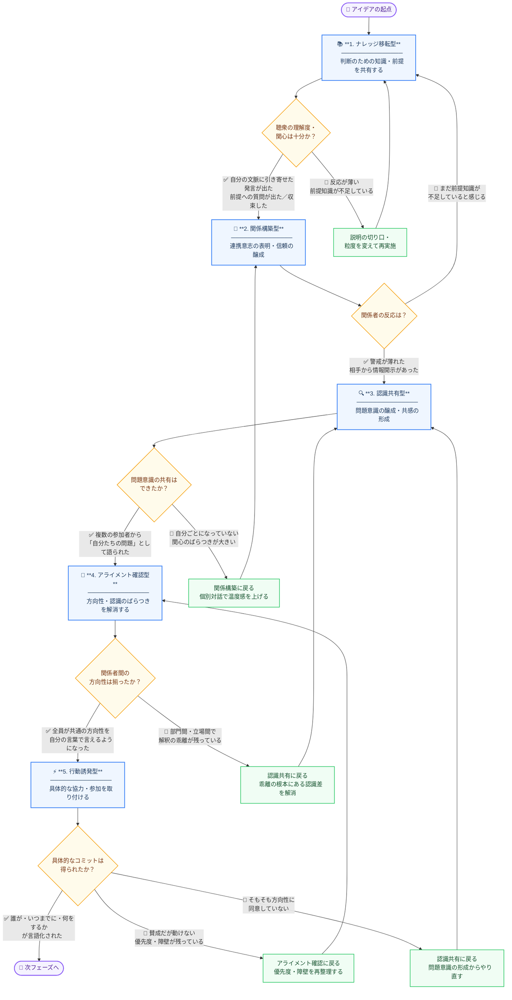

# アイデアを形にする（会議編）

## はじめに：この資料の背景

個人のアイデアを組織の中で実現しようとするとき、最大の障壁のひとつは「伝わらないこと」ではなく、「動いてもらえないこと」です。どれだけ優れたアイデアであっても、それが組織と連動しなければ形にはなりません。

そのカギを握るのが、**会議の有効活用**です。会議は単なる情報共有の場ではなく、相手の認識を変え、関係を築き、行動を引き出すための能動的なツールです。会議の効果を理解し、目的に応じた使い方を身につけることで、個人のアイデアを組織全体の動きと連動させることができます。

この資料は、会議をスキルとして捉え直すための実践的なフレームワークです。アイデアの実現を通じた組織貢献を支援することを目的としています。

---
<br>

## アイデアを実現するための会議類型

- 1〜3は「土台を作る」フェーズで、知識を渡し、関係を作り、問題意識を揃えます。
- 4〜6は「動かす」フェーズで、認識を収束させ、行動を引き出し、決定を取り付けます。
- 7・8は通常の流れには乗らない「例外介入」的な類型で、膠着や方向転換が必要な局面で使われます。

| # | 類型 | 主なゴール | 典型的な締め方 | 具体例 |
|---|---|---|---|---|
| 1 | ナレッジ移転型 | 判断のための知識・前提の共有 | 「参考にしてほしい」 | — |
| 2 | 関係構築型 | 連携意志の表明・信頼の醸成 | 「一緒に考えたい」 | ガバナンス貢献とアラインメント |
| 3 | 認識共有型 | 問題意識の醸成・共感の形成 | 「どう見えますか？」 | データガバナンス課題提起 |
| 4 | アライメント確認型 | 方向性・認識のばらつきの解消 | 「同じ方向を向いているか確認したい」 | — |
| 5 | 行動誘発型 | 具体的な協力・参加の取り付け | 「参加してほしい」 | 前払い契約見直し |
| 6 | 決裁要請型 | その場での承認・判断 | 「判断をお願いしたい」 | — |
| 7 | 課題直面型 | 回避されてきた問題の顕在化・再起動 | 「直視する必要がある」 | — |
| 8 | 異議申し立て型 | 現状方針への再考促進 | 「再考してほしい」 | — |

---

<br>

### 例：会議類型の比較表

| 比較軸 | ガバナンス貢献とアラインメント | データガバナンス課題提起 | 前払い契約見直し |
|---|---|---|---|
| **会議類型** | 2. 関係構築型<br>Relationship Building | 3. 認識共有型<br>Awareness Building | 5. 行動誘発型<br>Call to Action |
| **会議の目的** | 自分の役割・貢献意志を示し、チーム間の連携を深める | データ品質の課題認識を共有し、将来像についての対話を開く | 前払い契約のリスクへの共感を得て、ヒアリング協力を取り付ける |
| **話者のスタンス** | 「一緒に作りたい」という意志の表明 | 「一緒に考えたい」という対話の開始 | 「動いてほしい」という働きかけ |
| **提案の具体度** | 低め（方向性とジャストアイデア） | 低め（問いかけと将来像の共有） | 高め（ヒアリング・30分・個別調整） |
| **流れの特徴** | 役割定義 → アイデア提示 → 問い返し | 共感形成 → 問題の構造化 → 将来像の問いかけ | 問題提起 → リスク整理 → 共感 → 協力要請 |
| **冒頭の入り方** | 「自分が貢献できること」から始める | 「共通の課題がある」と場を設定する | 「注目してほしいことがある」と注意を引く |
| **数字・データの使い方** | なし（概念・姿勢中心） | あり（取引の約1/3、5つの名称など） | なし（3つのリスク概念で整理） |
| **参加者への問いかけ** | 「この方向性は共感できるか」＋「今困っていることはあるか」の2軸 | 「あなたのチームにとって何が楽になるか」（各自の文脈で答えられる） | 「こういう経験はあるか」（Yes/Noで答えやすい） |
| **締めのアクション** | 反応を引き出す（今日答えなくてよい） | 反応を引き出す（次のステップは言及しない） | ヒアリング参加を促す（個別調整を明示） |
| **防衛反応への対処** | 「決定事項ではなくジャストアイデア」と明示 | 「今日は解決策を求めない」と先に宣言 | 「誰かを責めているのではなく構造の問題」と先に宣言 |
| **フォローアップアクション** | 個別対話（「一緒に決めたい」と伝えた形式を相談） | 短いアンケート（「最も共感した課題はどれか」など） | 個別ヒアリング（30分・担当者ベース） |

---


<br>

## 会議開催のシグナル

| # | 類型 | Must シグナル | Should シグナル |
|---|---|---|---|
| 1 | **ナレッジ移転型**<br>Knowledge Transfer / Briefing | ・聴衆が内容を自分の文脈に引き寄せた発言をしている（「うちの場合は…」）<br>・基本的な用語・前提への質問が出た、または出なくなった<br>・「これは自分たちの話だ」という認識が言語化された | ・参加者が自分から関連する事例・経験を語り始める<br>・「資料をシェアしてほしい」など能動的な反応が出る<br>・他の参加者に説明しようとする発言が出る |
| 2 | **関係構築型**<br>Relationship Building / Alignment Meeting | ・提案者への警戒・防衛姿勢が明らかに薄れた<br>・「一緒にやれそう」「話を続けたい」という意志が言葉や態度に表れた<br>・相手側から情報・背景の自発的な開示があった | ・会議後に個別フォローや非公式な接触があった<br>・「うちのチームも同じ課題を抱えている」という開示が出た<br>・提案者の立場・動機への理解が示された |
| 3 | **認識共有型**<br>Awareness Building / Sense-making | ・問題を「自分たちの問題」として語る発言が複数の参加者から出た<br>・「確かに自分もそう感じていた」という共感が表明された<br>・問題の存在自体を否定する反応がなくなった | ・「なぜ今まで放置されていたか」という問いが出る<br>・参加者が自分のチームへの影響を具体的に語り始める<br>・「次にどうすべきか」という前向きな議論に自然に移行する |
| 4 | **アライメント確認型**<br>Alignment Check / Calibration | ・関係者全員が共通の方向性を自分の言葉で言えるようになった<br>・優先順位・スコープについて明示的な合意が得られた<br>・「それは自分の担当ではない」という離脱発言がなくなった | ・各チームが自分側のネクストアクションを自発的に語る<br>・「それなら私のチームとも話した方がよい」という横の連携が生まれる<br>・合意内容をメモ・議事録として残す動きが出る |
| 5 | **行動誘発型**<br>Call to Action / Mobilizing | ・具体的な行動（ヒアリング参加・情報提供・担当指名）のコミットが得られた<br>・「誰が・いつまでに・何をするか」が言語化された<br>・参加者が自分からネクストアクションを提案した | ・コミットの内容が自発的・具体的（「来週中に連絡します」）<br>・他の参加者を巻き込む動きが参加者側から出る<br>・「リスクや障壁はあるが、やる」という前向きな発言がある |
| 6 | **決裁要請型**<br>Decision Meeting / Approval Request | ・意思決定者が「判断できる」と感じていることが言葉・態度から確認できた<br>・承認・却下・条件付き承認のいずれかが明示された<br>・決定内容と理由が記録可能な形で言語化された | ・意思決定者が承認の根拠を自分の言葉で説明できている<br>・反対意見を持つ参加者への対応方針も合意されている<br>・決定後のコミュニケーション計画が出た |
| 7 | **課題直面型** ⚠️ 例外介入<br>Confronting / Surfacing Issues | ・「確かにこれは向き合うべき問題だ」という認識が場に生まれた<br>・問題を否定・回避しようとする反応が明らかに薄れた<br>・沈黙・緊張が「拒否」ではなく「内省」のものに変わった | ・なぜ今まで問題が放置されてきたかの構造的な説明が出る<br>・「自分にも責任の一端がある」という発言が誰かから出る<br>・問題を解消したいという意志が感情を伴って表現された |
| 8 | **異議申し立て型** ⚠️ 例外介入<br>Challenging / Pushback / Dissent | ・「見直す必要があるかもしれない」という反応が意思決定者から出た<br>・現状方針の根拠・前提への疑問が場に共有された<br>・代替案の検討に向けた合意・時間が設けられた | ・異議の内容が「感情的な反発」ではなく「論理的な問い直し」として受け取られた<br>・意思決定者が「あなたの指摘は参考になった」と言葉にした<br>・関係性の毀損なく議論が終了した |

---

- **Must** = 次の類型に進む前に確認すべき必須条件  
- **Should** = あると望ましい。なければ前の類型を強化する

<br>

## 行動誘発までの状態遷移



---

<br>

## この資料の使い方

この資料自体が、ひとつのアイデアです。

まず大前提として、**会議を順序通りに開催することが目的化しないように注意してください**。フレームワークはあくまで道具であり、それに従うことが目標になった瞬間、本来のアイデアの実現から遠ざかります。

この資料が真に役立つのは、**「次に何をすればいいかわからない」と行き詰まったとき**です。アイデアが組織の中で止まっていると感じたとき、誰かに動いてもらえないと感じたとき、その状況がどのフェーズに対応するのかを確認する道標として使ってください。

> 「今、自分はどこにいるのか」を問い直すための羅針盤として、困ったときに立ち戻る資料として活用してください。

---

<br>
<br>

## APPENDIX 
```
# アイデア実現チェックリスト

> 自分のアイデアについて、以下の問いにYes / No で答えてください。  
> Noが多いフェーズが「今、強化すべき場所」です。そのフェーズに対応する会議類型を次のアクションとして設定してください。

---

## Phase 1｜知識・前提の共有ができているか
**→ Noが多い場合：📚 ナレッジ移転型の会議を開く**

- [ ] 相手はこのアイデアの背景・前提を理解している
- [ ] 専門用語や文脈を共有できている
- [ ] 相手が「自分たちに関係する話だ」と感じている

---

## Phase 2｜関係・信頼が築けているか
**→ Noが多い場合：🤝 関係構築型の会議を開く**

- [ ] 自分がなぜこのアイデアを推進しているかを相手に伝えている
- [ ] 相手との間に、率直に話せる関係がある
- [ ] 相手は自分の動機や立場を理解している

---

## Phase 3｜問題意識が共有できているか
**→ Noが多い場合：🔍 認識共有型の会議を開く**

- [ ] 相手はこのテーマを「自分たちの問題」として捉えている
- [ ] 現状の課題や痛みについて、共感を得られている
- [ ] 「なぜ今、取り組む必要があるか」を相手が理解している

---

## Phase 4｜方向性が揃っているか
**→ Noが多い場合：🧭 アライメント確認型の会議を開く**

- [ ] 関係者の間で、目指す方向性に大きなズレがない
- [ ] 優先順位やスコープについて、暗黙の前提が一致している
- [ ] 「誰が何をするか」の役割分担に異論が出ていない

---

## Phase 5｜具体的な協力を取り付けられているか
**→ Noが多い場合：⚡ 行動誘発型の会議を開く**

- [ ] 具体的な協力・参加を依頼できている
- [ ] 「誰が・いつまでに・何をするか」が言語化されている
- [ ] 相手が動く意思を示している

---

## 例外介入が必要な状況
**→ 以下に当てはまる場合は、通常フローの前に介入が必要です**

- [ ] 議論が止まっている・同じ話が繰り返されている　→ ⚠️ **課題直面型**
- [ ] 現在の方針や前提そのものに疑問がある　→ ⚠️ **異議申し立て型**

---

## 次のアクション

| 確認項目 | 結果 |
|---|---|
| Noが最初に出たPhase | Phase ____ |
| 次に開くべき会議類型 | |
| 会議のゴール（締めの言葉） | |
| 想定参加者 | |
| 想定日程 | |
```