**Webアプリケーションセキュリティの基本**
# Part 2：認証・認可・暗号化

## 目次

5. [全体像：1回のアクセスで何が起きているか](#5-全体像1回のアクセスで何が起きているか)
   - 5.1 [4つの関門と役割](#51-4つの関門と役割)
   - 5.2 [積み重なる防御の構造](#52-積み重なる防御の構造)
6. [ハンドシェイクとTLS暗号化](#6-ハンドシェイクとtls暗号化)
   - 6.1 [ハンドシェイクとは](#61-ハンドシェイクとは)
   - 6.2 [TLSハンドシェイクの流れ](#62-tlsハンドシェイクの流れ)
7. [証明書の基礎：公開鍵暗号の仕組み](#7-証明書の基礎公開鍵暗号の仕組み)
   - 7.1 [TLS/SSL証明書（HTTPS通信の基盤）](#71-tlsssl証明書https通信の基盤)
   - 7.2 [クライアント証明書（デバイス・ユーザー認証）](#72-クライアント証明書デバイスユーザー認証)
   - 7.3 [クライアント証明書は認証を兼ねる](#73-クライアント証明書は認証を兼ねる)
8. [認証](#8-認証)
   - 8.0 [認証とは？](#80-認証とは)
   - 8.1 [認証設計：IdPへの委譲（OAuth2/OIDC）](#81-認証設計自前管理をやめてidpに委譲する)
   - [付録A：主要IdaaS 比較表](#付録a主要idaas-比較表)
   - [付録B：SAMLとは（OAuth2/OIDCとの比較）](#付録bsamlsecurity-assertion-markup-languageとは)
9. [認可](#9-認可)
   - 9.0 [認可とは？](#90-認可とは)
   - 9.1 [認可設計：サーバー側での権限確認](#91-認可設計何ができるかはサーバー側で必ず確認する)

---

 
 

## 5. 全体像：1回のアクセスで何が起きているか

このPartで扱う概念（ハンドシェイク・証明書・認証・認可）は、それぞれ独立したトピックではなく、**1回のアクセスの中で順番に積み重なる関門**です。まず全体の流れを把握してから、各関門の詳細に入ります。

---

### 5.1 4つの関門と役割

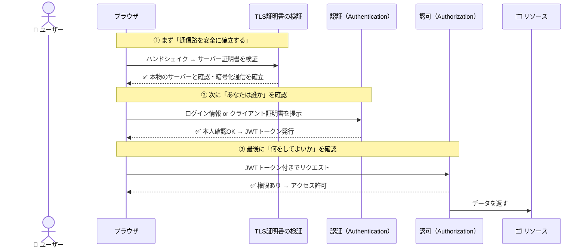

| 関門 | 問い | 使う技術 | 突破されると |
|------|------|---------|------------|
| **① ハンドシェイク・TLS** | 通信相手は本物か？通信路は安全か？ | TLS証明書（CA発行） | 通信内容が盗まれる・偽サイトに誘導される |
| **② 認証** | あなたは誰か？ | パスワード・MFA・クライアント証明書 | 不正ログインが成立する |
| **③ 認可** | 何をしてよいか？ | RBAC・ABAC・JWT | 権限外のデータにアクセスされる |

---

 

### 5.2 積み重なる防御の構造

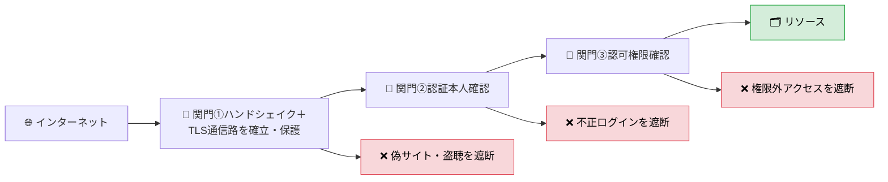

> どれか一つが欠けても安全な通信は成立しません。以降の章ではこの順番に沿って各関門を掘り下げます。

---

 
 

## 6. ハンドシェイクとTLS暗号化

### 6.1 ハンドシェイクとは

「ハンドシェイク（握手）」とは、**実際のデータ通信を始める前に、双方が「安全に話せる状態か」を確認し合う準備手続き**のことです。

人間に例えると、電話をかけたときに「もしもし、聞こえますか？」「聞こえます、どうぞ」とやり取りしてから本題に入るのと同じです。

ハンドシェイクは認証・認可よりも**さらに手前の「土台」**にあたります。この土台があって初めて、認証情報（パスワードやトークン）を安全にやり取りできます。逆に言えば、**ハンドシェイクが成立しない＝そもそも安全に通信できない**状態です。

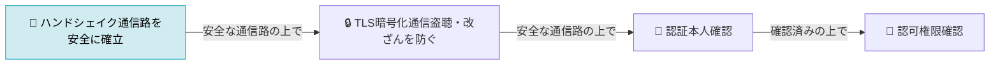

---

 

### 6.2 TLSハンドシェイクの流れ

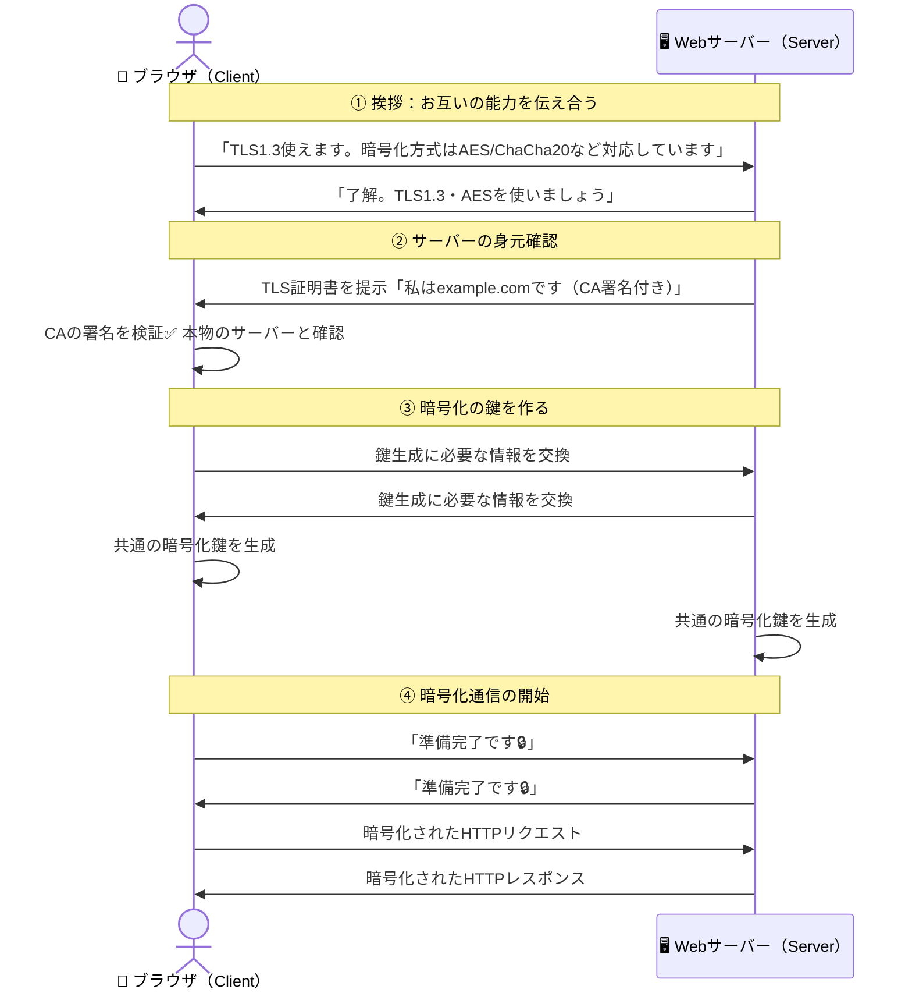

 

### まとめ

| | **内容** | **もし省略すると** |
|---|---|---|
| **ハンドシェイク** | 通信相手の確認・暗号化方式の合意・鍵の共有 | 偽サーバーと通信・通信内容が丸見え |
| **TLS暗号化** | ハンドシェイクで決めた鍵で通信を暗号化 | パスワードや個人情報が盗まれる |

---

 
 

## 7. 証明書の基礎：公開鍵暗号の仕組み

証明書を理解するには、まず前提となる「公開鍵暗号」を押さえる必要があります。

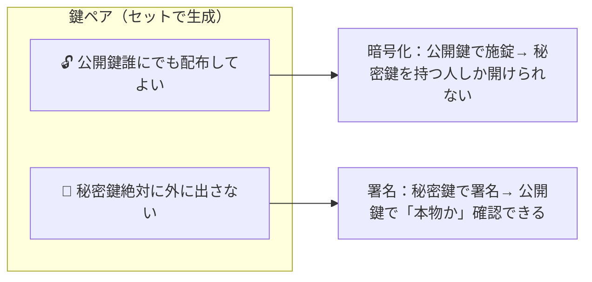

証明書とは「**この公開鍵は確かに本物です**」と第三者機関（CA）が保証した文書です。

---

 

### 7.1 TLS/SSL証明書（HTTPS通信の基盤）

#### 何のためにある？

ブラウザが「今通信している相手は本物のサーバーか」を確認するための仕組みです。これがないと、偽サイトへの誘導（中間者攻撃）を検知できません。

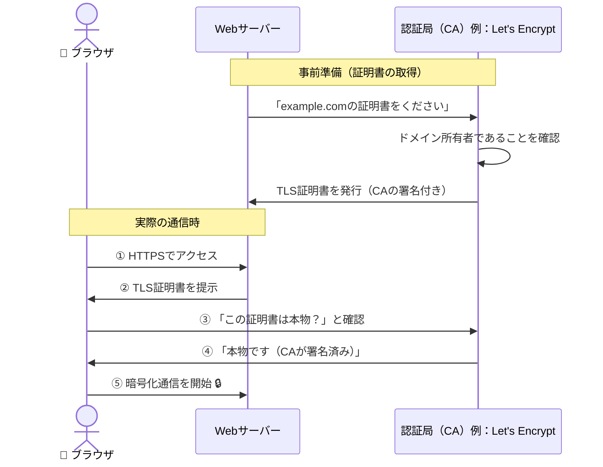

#### 証明書の種類

| 種類 | 検証レベル | 取得難易度 | 向いている用途 |
|------|----------|----------|--------------|
| **DV（ドメイン認証）** | ドメイン所有のみ確認 | 簡単・無料（Let's Encrypt）| 個人サイト・開発環境 |
| **OV（組織認証）** | 組織の実在を確認 | 中程度 | 企業サイト・業務システム |
| **EV（拡張認証）** | 組織を厳格に審査 | 高い・有償 | 金融・ECなど信頼性が重要なサービス |

#### 有効期限と失効の注意点

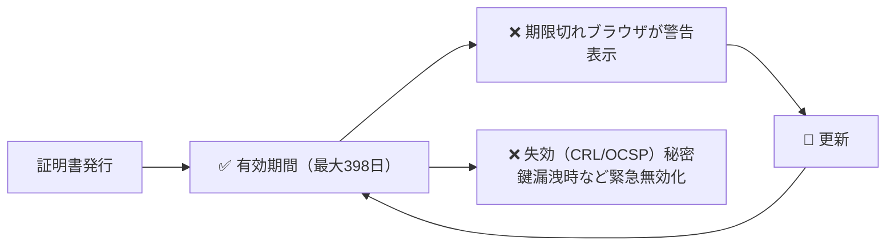

> 証明書の期限切れはサービス停止に直結します。Let's Encryptのような自動更新（ACME）の仕組みを使うか、期限監視を必ず設定しましょう。

---

 

### 7.2 クライアント証明書（デバイス・ユーザー認証）

#### 何のためにある？

TLS証明書が「サーバーの身元証明」であるのに対し、クライアント証明書は**「接続してきた端末・ユーザーの身元証明」**です。パスワードを使わずに、デバイス自体を認証できます。

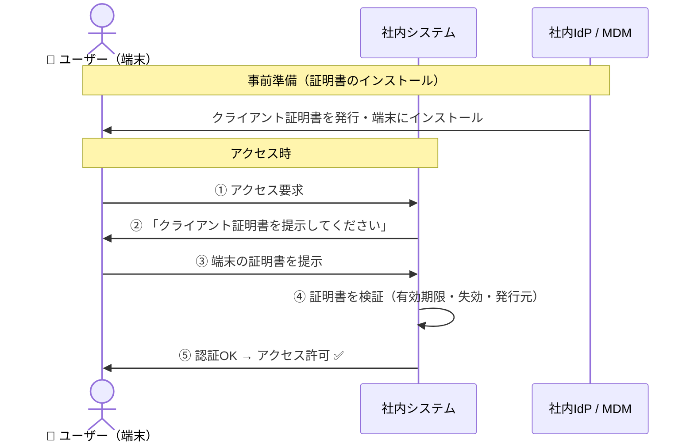

#### パスワード認証との比較

| | **パスワード認証** | **クライアント証明書認証** |
|---|---|---|
| **盗難リスク** | フィッシングで盗まれる | 端末から取り出せないため盗難困難 |
| **フィッシング耐性** | 低い | 高い（証明書はドメインに紐づく） |
| **管理コスト** | 低い | 高い（証明書の発行・失効管理が必要） |
| **ユーザー体験** | パスワード入力が必要 | 透過的（意識せずに認証される） |
| **向いている場面** | 一般ユーザー向けサービス | 社内システム・ゼロトラスト環境 |

#### ゼロトラストにおける役割

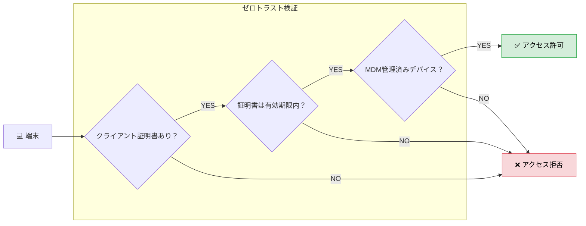

#### まとめ：2つの証明書の役割の違い

| | **TLS/SSL証明書** | **クライアント証明書** |
|---|---|---|
| **誰の証明？** | サーバー | 端末・ユーザー |
| **誰が検証？** | ブラウザ | サーバー |
| **主な目的** | 通信の暗号化・サーバー正当性確認 | デバイス認証・不正端末の排除 |
| **失効時の影響** | ブラウザ警告・サービス停止 | その端末のアクセスが即遮断 |

---

 

### 7.3 クライアント証明書は認証を兼ねる

ここが混乱しやすいポイントです。TLS証明書は常に「通信路の保護」ですが、クライアント証明書は**認証のステップを担う**こともできます。

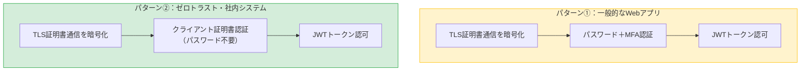

---

 
 

## 8. 認証

### 8.0 認証とは？

「あなたは誰ですか？」を確認するステップです。本人確認に成功するとトークン（JWT）が発行され、次の関門である認可（9章）へと引き渡されます。

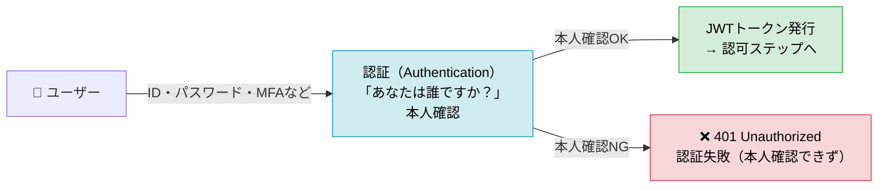

---

 

### 8.1 認証設計：自前管理をやめてIdPに委譲する（OAuth2/OIDC）

#### 考え方
パスワードの保管・MFAの実装・ブルートフォース対策などを自前で実装するのは、コストが高く脆弱性を生みやすいです。OAuth2/OpenID Connect（OIDC）を基盤に、実績あるIdP（Identity Provider）に認証を委譲するのが現代のベストプラクティスです。

> SAMLを使った認証フローについては付録Bで同じ登場人物を使って比較しています。

#### 認証フロー（OAuth2/OIDC）

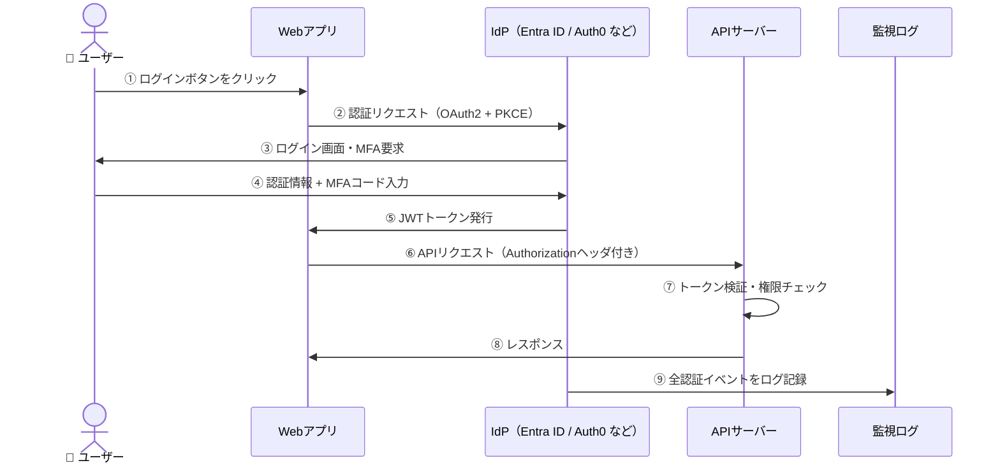

#### 自前実装 vs IdP委譲の比較

| 項目 | 自前認証 | IdP委譲（推奨） |
|------|---------|--------------|
| MFA対応 | 自分で実装が必要 | 標準サポート |
| ブルートフォース対策 | 自分で実装が必要 | IdP側で自動対処 |
| ログ・監視 | 自前で構築 | 統合監視に直結 |
| スケーラビリティ | セッション管理が複雑 | ステートレスなJWTで容易 |
| 侵害時の対応 | 自前でトークン無効化 | IdP側で一括無効化 |

---

 

### 付録A：主要IdaaS 比較表

| | **Microsoft Entra ID** | **Okta** | **Auth0** | **AWS Cognito** | **Firebase Authentication** |
|---|---|---|---|---|---|
| **提供元** | Microsoft | Okta | Okta（旧独立）| Amazon | Google |
| **主な用途** | 社員・従業員向け（B2E）| 社員・従業員向け（B2E）| アプリユーザー向け（B2C/B2B SaaS）| アプリユーザー向け（B2C）| モバイル・Webアプリ向け（B2C）|
| **得意な環境** | Microsoft 365 / Azure環境 | マルチクラウド・マルチベンダー環境 | 開発者主導のSaaSアプリ | AWS環境 | Firebase / GCP環境 |
| **導入コスト** | Microsoft 365ライセンスに含まれる場合あり・比較的低コスト | 高め（ユーザー単位課金）| 無料枠あり・スケールで高くなる | 安価（月50,000MAUまで無料）| 無料枠が広い |
| **✅ Pros** | ・M365との統合が完結・追加コスト不要なケースが多い・条件付きアクセス（ABAC）が強力・ハイブリッド環境（AD連携）に強い | ・ベンダー中立でどの環境にも対応・7,000以上のアプリ連携カタログ・UIが直感的で管理しやすい | ・開発者フレンドリーなSDK・API・ソーシャルログイン・カスタマイズが容易・B2C向けブランディングに対応 | ・AWSサービスとのネイティブ統合・低コストで大規模ユーザーに対応・サーバーレス構成と相性が良い | ・導入が非常に簡単・無料枠が広くスタートアップ向き・Google/Apple/SNSログインがすぐ使える |
| **❌ Cons** | ・Microsoft以外の環境では設定が複雑になる・UIが非技術者には分かりにくい | ・コストが高く、中小企業には重い・高度な機能は追加費用が必要 | ・大規模になるとコストが急増・ユーザー自身によるセルフサービスが限定的 | ・高度なエンタープライズ機能（SAML連携など）が弱い・UIが開発者向けで運用担当者には難しい | ・エンタープライズ向け機能（監査・ガバナンス）が不足・Google依存が強い |
| **向いている組織** | Microsoft環境を使う中〜大規模企業 | 複数クラウドを使う大規模エンタープライズ | 開発者主導のSaaS・スタートアップ | AWSを主軸にするチーム・スタートアップ | Firebase利用中のモバイルアプリ・個人開発 |

---

#### 選び方のポイント

既存の環境と用途を軸に選ぶのが最も合理的です。

- **すでにMicrosoft 365を使っている** → Entra ID一択
- **AWS環境でコストを抑えたい** → Cognito
- **マルチクラウドで本格的なエンタープライズIAMが必要** → Okta
- **開発者がゼロから認証を作りたい / B2Cアプリ** → Auth0
- **スモールスタートで素早く実装したい** → Firebase Authentication

> いずれのサービスもOAuth2/OIDCに準拠しており、後から乗り換えること自体は技術的に可能です。ただし移行コストは発生するため、最初の選定が重要です。

---

 

### 付録B：SAML（Security Assertion Markup Language）とは ― OAuth2/OIDCとの比較

#### OAuth2/OIDCとの違い

現代のWebアプリでよく使われるOAuth2/OIDCと混同されやすいですが、生まれた背景と得意な用途が異なります。

| | **SAML** | **OAuth2 / OIDC** |
|---|---|---|
| **登場年** | 2002年 | 2012年（OAuth2）/ 2014年（OIDC）|
| **主な用途** | 企業の社内システム間SSO | WebアプリやAPIの認証・認可 |
| **データ形式** | XML | JSON / JWT |
| **得意な環境** | オンプレミス・レガシーな企業システム | モバイル・クラウドネイティブアプリ |
| **設定の複雑さ** | 高い（XML証明書の管理が必要）| 比較的シンプル |
| **向いているもの** | Salesforce・SAP・社内ポータルとのSSO | Google・GitHub・SNSログインなど |

---

#### 認証フローの比較（OIDC vs SAML）

OIDCと登場人物を揃えて比較します。最大の違いは「Webアプリが最終的にJWTを受け取るか、SAMLアサーション（XML）を受け取るか」と「リダイレクトの方向」です。

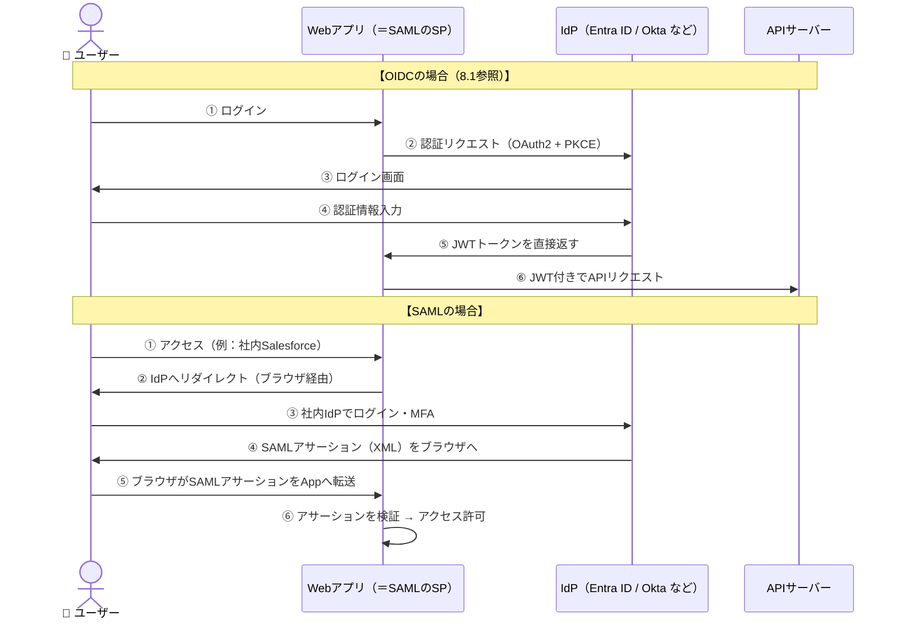

> OIDCではIdPがトークンをWebアプリに直接返しますが、SAMLではブラウザを中継してアサーションを受け渡す点が構造的に異なります。これがSAMLがオンプレ・レガシー環境と相性が良い理由です。

#### いつSAMLを選ぶべきか

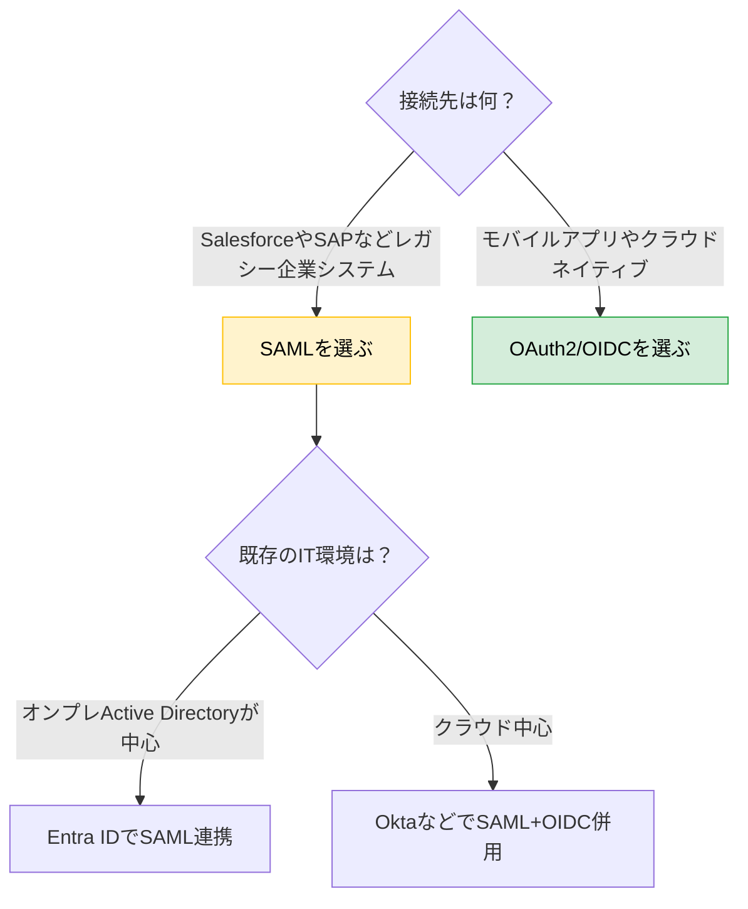

 

SAMLは「古い規格だから使わない」ではなく、**エンタープライズの既存システムとのSSO統合では今も現役の標準規格**です。新規開発ではOIDCを選びつつ、既存の社内システム連携が必要な場面でSAMLを併用するケースが実務では最も多い構成です。

---

 

### まとめ

| 設計ポイント | やること | やってはいけないこと |
|------------|---------|-----------------|
| 認証方式 | IdP（OAuth2/OIDC）に委譲 | パスワードを自前で保管・管理 |
| MFA | 高リスク時は必須化 | パスワードのみで認証を完結させる |
| 監視 | 全認証イベントをログに記録 | エラー時だけログを取る |

---

 
 

## 9. 認可

### 9.0 認可とは？

「何をしてよいですか？」を確認するステップです。8章の認証でJWTトークンが発行された後、APIリクエストのたびにサーバー側でこのトークンを検証し、要求された操作の権限があるかを確認します。

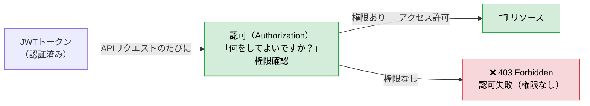

---

 

### 9.1 認可設計：「何ができるか」はサーバー側で必ず確認する

#### 考え方
認可（権限チェック）はサーバー側で行うことが絶対条件です。フロントエンドだけで「管理者メニューを非表示にする」といった制御は、開発者ツールで簡単に書き換えられてしまいます。

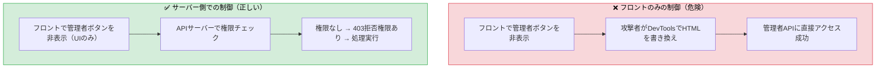

#### RBACとABACの使い分け

| | RBAC（ロールベース） | ABAC（属性ベース） |
|---|---|---|
| **制御の基準** | ユーザーの「役割」で判断 | 役割に加え、場所・時間・デバイスなど複数の「属性」で判断 |
| **具体例** | `admin`は全操作可、`user`は閲覧のみ | 日本国内・社内デバイス・営業時間内の場合のみ承認 |
| **✅ Pros** | シンプルで管理しやすい／導入コストが低い／監査しやすい | きめ細かい制御が可能／条件の組み合わせで柔軟に対応できる |
| **❌ Cons** | 条件が複雑になるとロールが爆発的に増える／状況に応じた動的制御が苦手 | 設計・管理が複雑／条件が増えるほどデバッグが難しくなる |
| **向いている場面** | 社内システム・管理画面など役割が明確なシステム | グローバルサービス・ゼロトラスト環境など状況に応じた制御が必要なシステム |

一般的には**まずRBACで設計し、より細かい制御が必要な箇所にABACを組み合わせる**のが現実的なアプローチです。

---

 

### まとめ

| 設計ポイント | やること | やってはいけないこと |
|------------|---------|-----------------|
| 認可の実施場所 | サーバー側でロール・属性を検証 | フロントエンドの表示制御だけに頼る |
| ロール設計 | まずRBACで設計し、必要に応じてABACを追加 | 最初からABACで複雑に設計しすぎる |
| 監視 | APIリクエストごとに権限チェック結果をログに記録 | エラー時だけログを取る |

