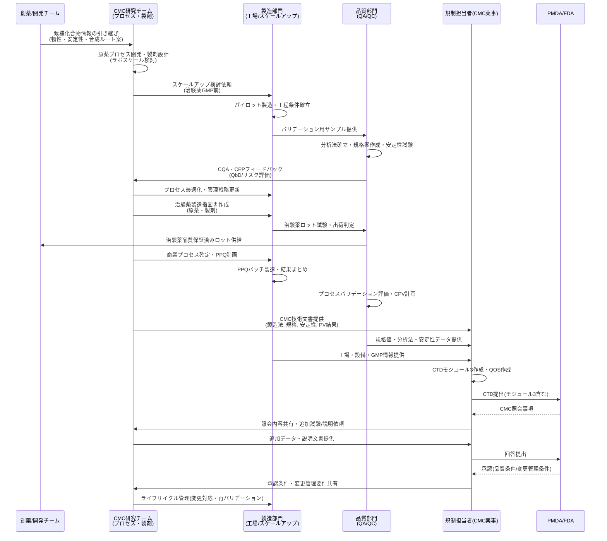
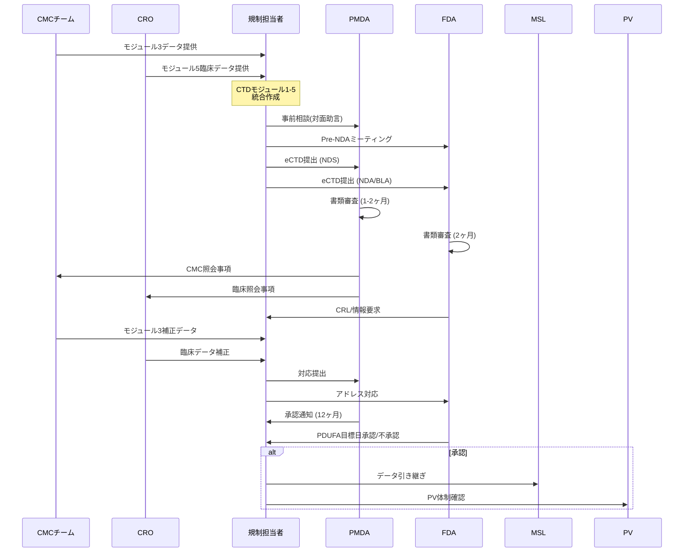
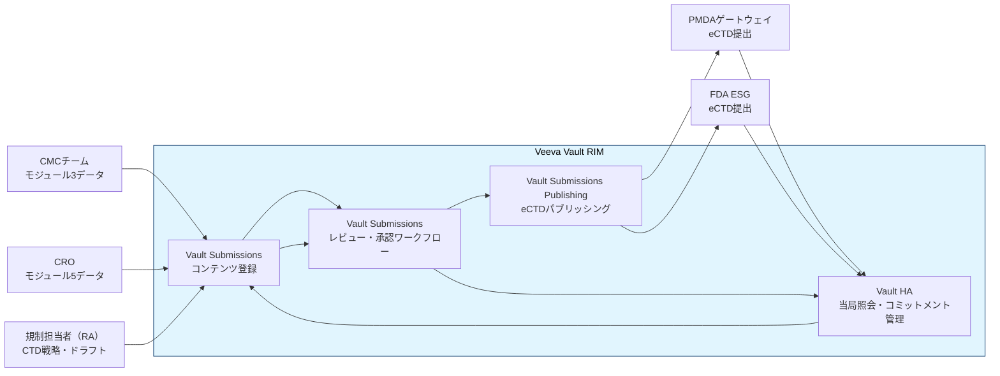

# 第一部：創薬からCMCまで

本資料は、新薬が生まれる「探索研究」から始まり、非臨床・臨床試験を経て規制当局（PMDA/FDA）への承認申請に至るまでの全プロセスと、その中核を担う **CMC（Chemistry, Manufacturing and Controls）** の役割を体系的に解説します。

第二部（上市後のSFA・CRM活動）・第三部（Veevaプラットフォームのデータ連携）との橋渡しとして、各フェーズでVeeva Vaultがどのように機能するかについても末章（1-7）で概説します。

---

## 1-1 創薬プロセス全体像

創薬プロセスは、基礎研究から新薬の上市・市販後調査まで約10〜15年を要する多段階の流れです。数千の候補化合物から1つが製品化される厳しい選別プロセスであり、「探索・非臨床・臨床・承認・上市・市販後」のステップで進みます。

### 各フェーズの概要

| フェーズ | 英語表記 | 内容 | 期間目安 |
|----------|----------|------|----------|
| 基礎研究 | Target Identification & Drug Discovery | 研究者が疾患標的を特定し、化合物ライブラリから有望候補を探索（化学合成・バイオ技術）。 | 2〜3年 |
| 非臨床試験 | Nonclinical Studies | CMCチームが動物・細胞実験で薬効・毒性・薬物動態（ADME）を評価し、CMCを開始。 | 2〜6年 |
| 臨床試験（I相） | Phase I Clinical Trial | CROが少数の健康人に安全性・薬物動態を確認。 | 1年 |
| 臨床試験（II相） | Phase II Clinical Trial | CROが少数の患者で有効性・用量・安全性を検証。 | 2年 |
| 臨床試験（III相） | Phase III Clinical Trial | CROが多数患者で既存薬比較、統計的有意性を証明。 | 3年 |
| 承認申請・審査 | Regulatory Approval (Submission & Review) | 規制担当者がPMDA/FDAにCTD（CMC含む）提出、審査対応。 | 1〜2年 |
| 上市・市販後 | Launch & Post-Marketing Surveillance (PMS) | MA/MSLが販売開始後、副作用監視（PMS）、KOLとの交流、教育、RWE収集を実施。 | 継続 |
| Phase IV試験 ※1 | Phase IV Clinical Trial | MSLが承認後に長期安全性・稀な副作用・適応拡大を検証（CRO支援）。 | 継続 |
| ファーマコビジランス（PV）※2 | Pharmacovigilance | PVチームが上市後、副作用・有害事象を継続収集・評価・PMDA報告、添付文書改訂を実施（PMSと連携）。 | 継続 |

- ※1：Phase IVは育薬フェーズとして独立し、MSLがKOL連携で企画・推進します。
- ※2：PVは全フェーズに横断しますが、特に上市後でMSL・PMSと密接に連携します。

---

## 1-2 CMC概論

### CMCとは何か

CMCは **「Chemistry, Manufacturing and Controls（化学・製造・品質管理）」** の略で、新薬候補を研究段階から患者に届く製品へ橋渡しする役割を担います。

- 探索研究で見つかった「医薬品のタネ」を、効率よく・高品質で作れ・製剤化し・大量生産できるようにするプロセス全体を設計・構築するのがCMC開発の仕事です。
- 創薬側（レシピの発明）と商業製造側（大量調理）の間で、「工場で再現できるレシピ」に落とし込む技術・設計がCMCに当たります。
- 安定して製造でき、安全性と品質が保証されなければ、どんなに優れた候補でも医薬品として承認・上市できないため、CMCは創薬開発の要とみなされています。

### CMCの主な業務領域

| 業務領域 | 内容 |
|----------|------|
| 原薬プロセス研究 | 原薬の合成ルート設計、スケールアップ、安全で再現性ある製造法の確立、原薬の品質属性の把握 |
| 製剤開発研究 | 剤形（錠剤・注射剤など）の設計、添加剤選定、製造条件検討、安定性を考慮した処方設計 |
| 品質評価・分析 | 構造確認、純度・不純物プロファイル、溶出性、物性評価、安定性試験などの分析法確立と規格・試験方法の設定 |
| スケールアップ・工業化 | ラボスケールから治験薬製造、さらに商業生産ラインへのスケールアップ、GMP下で再現できる工程への仕上げ |
| 技術移転と変更管理 | 開発部門から製造部門やCDMO/CMOへの技術移転、サイト変更や設備変更時の品質同等性評価 |

### 規制・薬事（CMC薬事）の観点

- 承認申請ではCTDのCMCパートとして、原薬・製剤の特性、製造方法、品質管理、安定性などの情報を詳細に記載し、科学的根拠を示す必要があります。
- 日本ではPMDA/MHLWの要求がICHガイドライン（例：安定性のICH Q1A(R2)など）と整合しており、製造工程の重要パラメータや製品の品質特性（CQA）を明確にして、変更時にどの程度の手続きが必要かも含めて戦略的に整理します。
- CMC薬事担当は、品質面の専門家として、規格値・試験法・安定性データ等の妥当性を示し、申請・照会対応を技術的にリードします。

### 創薬CMC・製薬CMC・CDMO/CMOの違い

| 区分 | 位置づけ | 主な役割 |
|------|----------|----------|
| 創薬CMC | 開発フェーズの設計者 | 治験薬レベルまで含めたプロセスと分析をつくり込む |
| 製薬CMC | 商業フェーズの品質管理者 | 市販後も含めた品質一貫性やライフサイクル全体の変更管理を担う |
| CDMO（開発受託） | 開発パートナー | スケールアップや工程設計・分析法確立を共に行う |
| CMO（製造受託） | 製造請負者 | 確立済みプロセスを安定して製造する |

---

## 1-3 バイオ医薬品CMC

バイオ医薬品CMCは、抗体や融合タンパクなどの生物由来医薬品を対象としたCMCで、低分子薬と異なり細胞培養・精製中心の複雑プロセスを管理します。

### バイオ医薬品CMCの特徴

- バイオ医薬品は遺伝子組み換え細胞で生産されるため、CMCチームがロット間不均一性や不純物（宿主細胞タンパク質、ウイルス）をQbD（品質設計）で管理し、CQA（重要品質特性）を特定します。
- 低分子薬の化学合成に対し、バイオは生細胞依存で再現性確保が難しく、ICH Q8-11ガイドラインに基づくプロセスバリデーション（Stage 1-3）が必須です。

### 主なプロセスフロー

| 工程 | 内容 |
|------|------|
| セルライン開発 | CMCチームが目的遺伝子を導入した安定生産細胞（CHO細胞等）を作成、MCB/WCBをGMP下で構築 |
| アップストリーム（培養） | CMCチームがシード培養→本培養でタンパク生産を最適化（培地、pH、溶存酸素などのCPP制御） |
| ダウンストリーム（精製） | CMCチームが遠心/ろ過→Protein Aクロマト→低pH処理→イオン交換→ウイルス除去ろ過→UF/DFで精製、ウイルス安全性確保 |
| 製剤・充填 | CMCチームが安定化剤添加、最終無菌充填、安定性試験を実施 |

### 低分子CMCとの比較

| 項目 | 低分子CMC | バイオ医薬品CMC |
|------|-----------|----------------|
| 生産方式 | 化学合成（単純再現性高い） | 細胞培養・精製（生物変動大） |
| 品質課題 | 不純物・結晶多形 | 糖鎖異性体、凝集、細胞由来不純物 |
| 管理重点 | 合成ルート最適化 | プロセス耐性（頑健性）、CPV（継続的検証） |
| 規制 | ICH Q7等 | ICH Q5系＋Q8-11（QbD） |

---

## 1-4 CMC業務プロセス

CMC業務は大きく3つの流れで進みます。

- **上流（DS→CMC）**：候補受け取りからプロセス・製剤設計。
- **中流（CMC↔MFG↔QA/QC）**：治験薬〜商業生産のプロセス確立と品質管理。
- **下流（CMC/QA/QC→RA）**：CTDモジュール3作成とPMDA/FDA照会対応。

主なアクターは **CMC研究チーム、製造部門（MFG）、品質部門（QA/QC）、規制担当者（RA）** です。

---

## 1-5 CROの役割

CRO（Contract Research Organization）は、製薬企業から臨床試験（治験）業務を委託される専門機関で、開発効率化とデータ信頼性を支えます。

### 定義と役割

- CROが製薬企業から治験（I〜III相）や市販後調査を請け負い、GCP遵守のもと試験の質・スピードを確保します。
- 主にCROがプロジェクト全体をマネジメントし、製薬企業側の内製コスト削減を実現します。

### 主な業務領域

| 業務 | 内容 |
|------|------|
| 試験計画立案 | CROがプロトコル作成、医療機関選定・契約、IRB申請を支援 |
| モニタリング | CRA（CRO所属）が現場監視、SDV（原資料確認）、GCP遵守を検証 |
| データ管理 | CROがCRF収集、データベース化、統計解析、総括報告書を作成 |
| 薬事支援 | CROがPMDA相談、ファーマコビジランス、メディカルライティングを実施 |

### 創薬プロセスとの連携

- バイオ医薬品CMC完了後、CROが臨床試験を担い、MSL（Medical Affairs）が上市後交流を補完します。
- 日本市場ではグローバル試験支援が増え、CRO活用が標準化しています。
- CTDのモジュール5（臨床データ）はCROが主体となってデータを提供します。

---

## 1-6 規制当局（PMDA・FDA）

### PMDA（Pharmaceuticals and Medical Devices Agency）

- 2004年設立の独立行政法人で、厚生労働省（MHLW）所管のもと、医薬品・医療機器の **承認審査・安全対策・健康被害救済** の3業務を担います。
- 規制担当者が提出するCTDを審査し、約12ヶ月で承認判断します。
- 承認申請前に「対面助言」で事前相談が可能です。

### FDA（Food and Drug Administration）

- 米国保健福祉省（HHS）下の連邦機関で、医薬品・食品・医療機器等の安全性・有効性を規制します。
- NDA（低分子）/ BLA（バイオ）をPriority（6〜10ヶ月）/ Standard（10ヶ月）で審査します。
- 承認申請前に「Pre-NDAミーティング」で事前確認が可能です。

### 審査期間の比較

| 機関 | 役割 | 審査期間 |
|------|------|----------|
| PMDA | 日本国内承認（CTD/eCTD審査） | 約12ヶ月 |
| FDA | 米国・グローバル承認（NDA/BLA） | Priority: 6〜10ヶ月 / Standard: 10ヶ月 |

両者ともICHガイドライン準拠で、CMCチームのモジュール3データを厳格に検証し、PV・MSLの市販後体制も確認します。

---

## 1-7 CTD・eCTD申請プロセス

### CTD（Common Technical Document）とは

CTDは、品質・非臨床・臨床データを5モジュールで整理した国際標準申請書類で、ICHガイドライン（M4）に基づきます。日本PMDA・米国FDA間で共通形式が採用されており、CMCはモジュール3に集約されます。

### CTDのモジュール構成

| モジュール | 内容 | 担当主語 |
|------------|------|----------|
| 1（地域特異） | 申請書・目次・日本特有書類（PMDA用） | 規制担当者が作成 |
| 2（サマリー） | 品質・非臨床・臨床の要約（QOS等） | 規制担当者が全体統括 |
| 3（品質/CMC） | 原薬・製剤の製造・規格・安定性データ（バイオ医薬品は細胞・精製詳細） | CMCチームが詳細作成 |
| 4（非臨床） | 動物試験・毒性データ | CMCチームが要約 |
| 5（臨床） | Phase I-IIIデータ・プロトコル | CROがデータ提供 |

### モジュール3（CMCパート）の詳細

CMCチームが担うモジュール3（品質/CMC）の主要サブモジュールは以下の通りです。

| サブモジュール | 内容 |
|----------------|------|
| 3.2.S（原薬） | CMCチームが原薬製造工程、規格・分析法、不純物管理、安定性データを作成（バイオ医薬品はセルライン・培養・精製詳細を含む） |
| 3.2.P（製剤） | CMCチームが最終製剤の処方、製造工程、容器包装、溶出・安定性試験を記載 |
| 3.2.R（地域特異） | 規制担当者が日本特有の実行管理基準（GMP適合性調査）等を追加 |

### 提出・審査プロセス

1. 規制担当者がCTDをeCTD形式に変換し、事前相談（PMDA：対面助言、FDA：Pre-NDA Meeting）でフィージビリティを確認。
2. CMCチームがモジュール3（3.2.S原薬、3.2.P製剤）を中心にQbDデータ・安定性データを充実させる。
3. PMDA（日本）へ電子申請（NDS）→約12ヶ月審査、FDAへNDA/BLA提出→10ヶ月Priority/Standard審査。
4. 承認後、PV・MSLへデータ引き継ぎ（→第二部へ）。

### ブリッジ：CTD申請とVeeva Vault RIM

CTD提出プロセスにおけるVeeva Vault RIMの役割は以下の通りです。Submissionsがコンテンツ管理の中核となり、Publishing→当局提出、HA→照会対応のループを形成します（詳細は **第三部 3-3** を参照）。

また、日常のGMP文書（SOP・バッチ記録・分析法など）はVault QualityDocsで管理され、申請時にSubmissionsへリンクされます。

| Vaultコンポーネント | CMC向け役割 |
|---------------------|-------------|
| Vault QualityDocs | 製造SOP・試験法・バリデーション報告書・バッチ記録などGMP/品質文書の単一ソース。CMC・QAが参照し、改訂管理・監査対応の基盤 |
| Vault Submissions（RIM） | CTDモジュール3用CMC文書（製造法記述・規格・分析法・安定性報告など）を収集・レビュー・承認する場。QualityDocsにあるGxP文書をリンクしつつ「申請用に整形されたバージョン」を管理 |
| Vault Submissions Publishing | Submissionsで承認されたCMCコンテンツからeCTD適合モジュール3パッケージを自動レンダリングし、PMDA/FDA提出用に整形 |
| Vault Active Dossier（RIM） | 特定製品×市場に対して「現在有効なCMC文書セット」を一覧化し、ライフサイクル（変更影響・バージョン）を俯瞰するビュー。変更管理・再申請時に「どのドキュメントが効いているか」を即座に把握 |
