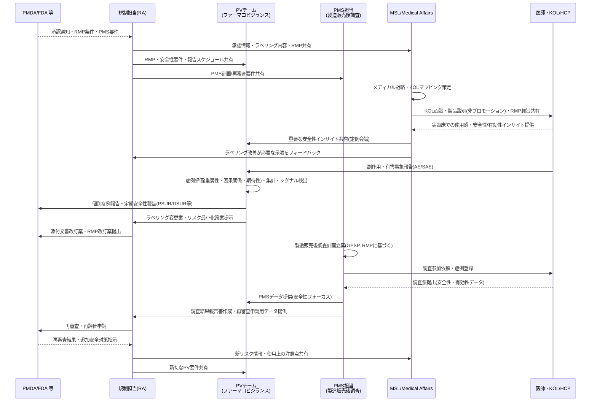
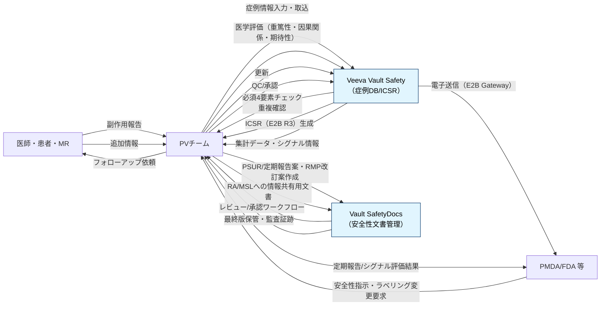
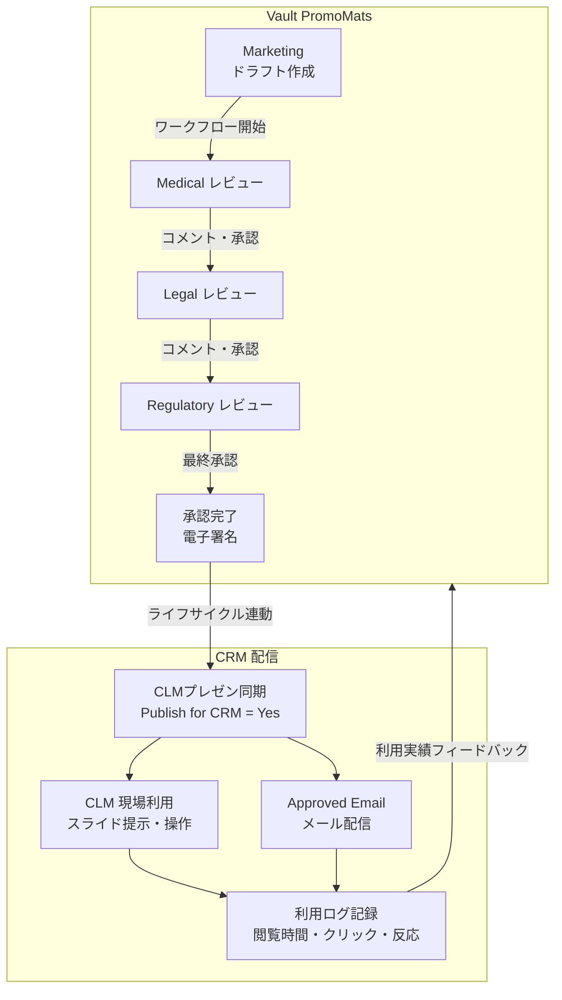

# 第二部：上市後のSFA・CRM活動

本資料は、新薬が承認・上市された後の商業活動フェーズを解説します。規制担当者（RA）からの引き継ぎを受けたMSL/Medical Affairsおよびファーマコビジランス（PV）チームの役割から始まり、MR・MSL・KAMによる現場活動、HCP/HCOデータの活用、コンテンツガバナンス、KPI管理まで体系的に整理します。

前提知識として第一部（創薬からCMCまで）を参照し、Veevaプラットフォーム側のデータ連携は **第三部** を参照してください。

---

## 2-1 MSL / Medical Affairsの役割

### Medical Affairsとは

Medical Affairs（MA）は、製薬企業の中で「科学・医療の立場から製品価値をつくり、外部と対話し、社内にインサイトを戻す専門職チーム」です。

| 軸 | Medical Affairsがすること |
|----|--------------------------|
| 外向き（Outside-in） | MSLがKOL/HCPと科学的ディスカッションを行い、未充足ニーズ・実臨床の課題・安全性/有効性インサイトを収集 |
| 内向き（Inside-out） | 得られたインサイトを開発戦略・エビデンス計画・ラベリング検討に反映し、社内に科学的観点から助言 |
| エビデンス | 観察研究やRWE、IIT（医師主導研究）支援など、Phase III以降の追加データ創出を企画・サポート |
| 教育・情報提供 | 学会発表、メディカルミーティング、社内トレーニング等を通じて疾患・治療・データに関する教育を実施 |
| コンプライアンス | 営業部門とは独立し、プロモーションではなく科学的・中立的立場で活動することで、倫理・規制要件を担保 |

### MSL（Medical Science Liaison）

Medical Affairs部門の「現場（フィールド）担当」がMSLです。KOL（キーオピニオンリーダー：影響力ある医師・研究者）と対等な立場で科学的議論を行い、アンメットニーズ（未解決医療課題）やインサイトを収集・社内共有します。MR（営業）とは異なり、**非プロモーションの純粋科学的活動** に限定されます。

| 業務 | 内容 |
|------|------|
| KOL交流 | MSLが定期面談・アドバイザリーボードでデータ共有、フィードバック収集（エンゲージメントプラン策定） |
| 情報収集・分析 | MSLが学会参加・文献調査で最新知見を把握、メディカルインサイトをR&Dに還元 |
| 研究支援 | MSLがPhase IV試験・IIT（医師主導研究）の企画支援、論文作成・発表サポート |
| 社内連携 | MSLが臨床開発・マーケティングにインサイト提供、メディカル戦略立案に貢献 |

**Headquarters側のMA（戦略・プランニング）と、Field側のMSLがセットで「医療現場と会社をつなぐ科学窓口」** を構成しています。

### MRとMSLの違い

| 観点 | MR（Medical Representative） | MSL（Medical Science Liaison） |
|------|------------------------------|--------------------------------|
| 活動性質 | プロモーション（販促） | 非プロモーション（科学交流） |
| 主な対象 | HCP/HCO（医師・病院） | KOL（キーオピニオンリーダー） |
| 主なコンテンツ | 承認済み販促資料（CLM） | 学術資料・エビデンスデータ |
| 主な目的 | 処方促進・製品理解促進 | 科学的対話・インサイト収集・育薬支援 |

---

## 2-2 承認後の業務引き継ぎと分業

PMDA/FDA承認後は、RAから引き継いでMSLが「科学コミュニケーションとRWE」、PVが「安全性監視とPMS」を中心に動きます。



---

## 2-3 ファーマコビジランス（PV）とPMS

### PVの役割

ファーマコビジランス（PV）チームは、上市後に副作用・有害事象を継続収集・評価し、PMDA等への報告と添付文書改訂を実施します。PVは全フェーズに横断しますが、特に上市後でMSL・PMSと密接に連携します。

### 自発報告が届いた場合のユースケース（6ステップ）

**1. 症例受付・トリアージ**
- HCPや患者からメール・電話・MR経由で副作用の疑いが報告されます。
- PV担当者が「有効症例か（必須4要素：患者・報告者・疑義薬・事象）」「重篤性・期限（7/15日報告対象か）」を判定します。

**2. ケース登録・データ入力**
- PV担当者が安全性データベースに新規ケースを登録し、既存症例との重複チェックを行います。
- 報告内容を詳細に入力し、MedDRAでイベントをコーディング、薬剤情報・用量・経路・併用薬・既往歴などを記録します。

**3. 医学評価（重篤性・因果関係・期待性）**
- PVの医師・薬剤師が事象の重篤性（死亡・入院等）、因果関係（関連あり/なし）、既知か未知か（添付文書との比較）を評価します。
- 不足情報があれば、報告者へのフォローアップ問い合わせを作成・追跡します。

**4. ICSR作成・当局報告**
- 規制要件に従い、個別症例安全性報告（ICSR）をE2B(R3)形式で生成し、QC後にPMDA/FDA等へ電子送信します。
- 重篤かつ予期せぬ症例は「迅速報告」（7〜15日以内）、それ以外は定期報告やPMS集計に組み込みます。

**5. シグナル検出・リスク評価**
- 累積データとして同種の症例を集計し、頻度や重篤性から安全性シグナルの有無を評価します。
- 新しいリスクが疑われる場合、RMP上の重要な潜在的リスク/既知のリスクとして再評価します。

**6. ラベリング・リスク最小化への反映**
- PVチームが添付文書の副作用欄・警告・用量制限などの改訂案を作成し、RAに提案します。
- RAがPMDA等と協議し改訂を行い、その内容をMSLがKOL/HCPにメディカルコミュニケーションとして展開します。

PVは「1症例」を形式的に処理するだけでなく、累積データの中で安全性シグナルに昇華させ、最終的にラベリング・RMP更新までつなげる役割を担います。

### 症例報告のユースケースとVeeva Vault



- **Vault Safety**：症例受付・ICSR作成・E2B送信・シグナル検出など、PVのケース処理の中核システム。
- **Vault SafetyDocs**：PSMF/RMP/PVA/PSUR等の安全性関連文書とワークフローを一元管理し、PV業務の「コンテンツ側」を支えます。

---

## 2-4 HCP/HCOセグメンテーションと日本のデータ事情

### HCP・HCOの定義

- **HCP（Healthcare Professional）**：医師、薬剤師、看護師などの医療関連専門家
- **HCO（Healthcare Organization）**：病院、クリニック、医療協会、大学などの医療組織

Veeva CRMでは、医薬品企業が接点を持つ相手としてHCP/HCOが顧客の中心であり、両者は所属関係でつながり、CRMのアカウント管理や活動記録の基盤になります。

### Veeva OpenData（グローバル）

Veeva OpenDataは、HCP/HCOのグローバルリファレンスデータを管理するサービスです。CDA（Common Data Architecture）準拠で、`first_name_cda__v` などの標準フィールド名を使い、リアルタイム更新や変更リクエストに対応します。

- HCPデータの具体例：**Veeva ID（一意識別子）、名前、住所、電話番号、NPI/License ID、専門分野、ライセンス情報、所属アフィリエーション**
- **有料サービス**：レコード数（HCP/HCO件数）と対象国数に基づくサブスクリプション制

### 日本特有の状況：Ultmarc（日本アルトマーク）

**日本版のVeeva OpenDataは提供されていません。** Veevaは日本では現地プロバイダのUltmarcと提携してHCP/HCOデータを提供しており、OpenData自体は利用できません（現在APACの韓国・オーストラリア・台湾・インドなど11カ国で提供中）。

Ultmarcは **DCF・DSF・PCF** と呼ばれる医療業界の標準マスターファイルを提供しています。

| ファイル名 | 正式名称 | カバー範囲 |
|------------|----------|-----------|
| **DCF** | Doctor Computer File | 全国の医療施設（病院・診療所）＋所属医師の基本情報。施設名・住所・診療科・病床数・DPCフラグ、医師の氏名・役職・所属部科など |
| **DSF** | Drug Store File | 全国の薬局・薬店の基本情報。店舗名・住所・代表者・チェーン本部・調剤薬局フラグなど |
| **PCF** | Pharmacist Computer File | 全国の病院内薬剤師の基本情報。氏名・役職・所属病院・資格情報など |

Ultmarcのマスターファイルは **病院約8,000件、診療所約106,000件、福祉施設約65,000件** をカバーし、195社以上の製薬・医療機器企業が会員として参加する業界共同メンテナンスモデルです。Veeva Nitro・Jitsushoka経由でCRMに連携されます。

### 日本のHCPデータ入手経路

**1. Ultmarc提携データ**
VeevaがUltmarcと提携し、HCP/HCOの基本プロファイルを提供します。Veeva Jitsushoka・Nitroでコネクタ経由で利用可能です。

**2. Veeva HCP Access**
Veeva CRM内の活動データを基にしたアクセス指標データで、四半期ごとに提供されます。業界全体の面談数・オンライン面談・メール送受信・接触企業数をブリックレベル（5人グループ集計）で取得でき、セグメンテーション・ターゲティングに使えます。

**3. 自社データ＋外部連携**
企業内の営業活動ログや電子カルテ共有（厚労省の電子カルテ情報共有サービス等）と組み合わせるケースもあります。

### 具体例：東京大学病院のHCOデータ

| データ種別 | 内容 |
|-----------|------|
| HCO（施設）| DCF施設コード、施設名（東京大学医学部附属病院）、住所（東京都文京区本郷7-3-1）、電話番号、診療科目、二次医療圏、DPC対象病院フラグ、がん診療連携拠点病院フラグ、病床数、特定機能病院フラグ |
| HCP（医師）| 個人コード（DCF医師コード）、氏名、役職（教授・講師等）、所属部科、勤務先施設コードによる紐づけ |

---

## 2-5 MR / MSL / KAMの役割分担

### 登場人物と役割（Who → Whom）

| Who（実行者） | Whom（対象） | 主な活動例 |
|---|---|---|
| **MR（Medical Representative）** | HCP/HCO | 製品ディテール、サンプリング、CLM提示、面談記録 |
| **MSL（Medical Science Liaison）** | KOL/Thought Leader | 科学交流、諮問、インサイト収集、学術議論 |
| **KAM（Key Account Manager）** | Key Account（大口病院・学会） | アカウント計画、複数HCP統括、契約交渉 |
| **Marketing Coordinator** | HCP/HCO/Key Account | イベント招待、メール配信、キャンペーン管理 |

**MRが日常接点、MSLがKOL専門、KAMがアカウント統括** の分業です。

### 活動フェーズ別マッピング

| 活動フェーズ | MR（HCP/HCO） | MSL（KOL） | KAM | Marketing |
|---|---|---|---|---|
| **計画・準備** | HCPリスト取得、テリトリー計画 | KOL特定、科学交流計画 | アカウント計画、複数HCP統括 | キャンペーン・イベント計画 |
| **コンテンツ取得** | VaultからCLM同期 | 学術資料取得 | アカウント向け資料同期 | メール・招待コンテンツ準備 |
| **活動実行** | 訪問/ビデオ面談、サンプリング、CLM提示 | 科学議論、インサイト収集 | 病院/学会交渉、CLM統括 | メール配信、イベント招待 |
| **記録・フォロー** | コールサマリー、反応ログ | 諮問記録、フォローアップ | アカウント活動ログ | 反応追跡、オプトアウト管理 |
| **分析・次回** | KPI確認、次回提案 | KOLエンゲージメント分析 | アカウントKPI、次期計画 | キャンペーン効果分析 |

### クロス機能連携

役割ごとに接点は分かれていますが、Veeva CRMではHCP/HCOデータを共有し、クロス機能連携が標準です。

- **共有データ**：NetworkでMR/MSL/KAMが同一HCP/HCOを参照
- **KAM統括**：Key Account内でMR/MSLの活動を集約し、360度ビューで計画
- **プロセス連動**：Medical InquiryでMR→MSLへ自動エスカレーション（Vault MedInquiry連携）

**「独立運用」ではなく「データ共有・統括管理」** がVeevaの強みです。

---

## 2-6 コンテンツガバナンスとMLRレビュー

### Vault PromoMatsとは

**Vault PromoMats** は、医薬品プロモーション素材の管理・承認システムです。

- **目的**：販促資料（スライド・パンフ・メール・動画）の作成・MLRレビュー・承認・配布を一元化
- **CLMの正本管理**：CRM/CLMに配信される全コンテンツの正本管理・コンプライアンス保証
- **GxP対応**：21 CFR Part 11・FDA 2253準拠、監査証跡標準

### MLRレビューとは

**MLR（Medical・Legal・Regulatory）レビュー** は、医療（Medical）・法務（Legal）・規制（Regulatory）の3部署による販促資料承認プロセスです。医薬品宣伝は薬機法・ガイドラインで厳格規制されており、MR/CLMで使う全資料が事前承認必須です。

### MLRレビューのステップ詳細

| ステップ | 内容 |
|----------|------|
| 1. 作成 | マーケティングがドラフト作成、メタデータ（製品/主張/市場）を入力 |
| 2. 初回レビュー | AIプリチェック（主張準拠）、Medical→Legal→Regulatoryの順でコメント/レッドライン |
| 3. 反復レビュー | 修正→再レビュー。電子署名で合意 |
| 4. 最終承認 | MLR全員署名、FDA 2253フォーム自動生成 |
| 5. 状態遷移 | Draft→In Review→Approved。CRM/CLMへ自動同期 |
| 6. 配布・追跡 | 承認コンテンツのみ配信、閲覧/クリックログ収集 |

Tier-Basedで再利用コンテンツは簡略化され、平均承認時間を50〜75%短縮できます。

### MLRの役割整理

MLRは「現場実行者」ではなく「バックオフィス承認者」です。

| 役割 | フローでの位置 | MLRとの関係 |
|---|---|---|
| **MR/MSL/KAM** | 現場実行者（Who） | PromoMats経由で承認資料のみ使用 |
| **MLR (Medical/Legal/Regulatory)** | バックオフィス（支援） | コンテンツ承認者・コンプライアンス責任者 |

完全フロー：**MLR承認(PromoMats) → 現場実行(CRM) → ログ還流**

### Vaultライフサイクル管理

Vaultでは文書にライフサイクルを定義し、各状態（State）に応じて編集可否・閲覧権限・次アクション・配布先が変わります。

| ライフサイクル状態 | CRM/CLMへの影響 |
|---|---|
| Draft | CRMに配信されない |
| In Review | CRMに配信されない |
| Approved | CRMに自動同期・CLMで利用可能 |
| Expired / Obsolete | CRMから自動撤回・現場で表示不可 |

この連動により、**承認外コンテンツの使用を物理的に防止し、失効資料の自動回収** を実現しています。

### 規制保証の仕組み

消費財CRMは「自由な販促」前提ですが、Veeva CRMはVaultにより「GxP承認済みコンテンツのみ保証」が最大の違いです。

- **Vault承認→CRM配信**：未承認コンテンツは物理的に表示不可
- **監査証跡**：全活動（クリック・閲覧時間）が21 CFR Part 11準拠で記録
- **サンプリング**：資格・在庫・規制をリアルタイムチェック

**「宣伝内容の法令遵守をシステムが保証」** し、MR個人の裁量を排除します。これがライフサイエンス特化の核心です。

---

## 2-7 オムニチャネル実行（CLM・Engage・Approved Email）

### CLM（Closed Loop Marketing）

CLMは、**承認済みコンテンツをHCPに提示し、利用状況を自動記録して改善に還流する** ツールです。

**CLMの操作ステップ**

1. **コンテンツ作成（Vault側）**：MarketingがPowerPoint等でスライドを作成し、製品グループ・セグメント・反応ボタンを設定。VaultでMLRレビュー・承認。
2. **CRM同期**：承認後にCLM IDが割り当てられ、自動プッシュ。端末にオフラインキャッシュ。
3. **コール開始**：HCP選択後、プレゼンを選択（全体orカスタム）。スライド遷移・ズーム・アノテーション。
4. **インタラクティブ操作**：ホットスポットクリック、動画再生、反応ボタンによりHCPの反応を記録。
5. **自動ログ**：表示時間・クリック数・反応内容がCRMに記録され、コールサマリーに反映。
6. **分析・改善**：スライドごとの利用率・HCP反応をもとにコンテンツを最適化（Vaultへ還流）。

**実務例**：MRがHCPに疾患説明スライドを提示 → HCPが「副作用」セクションをクリック → 反応がログ化 → 次回面談で副作用関連の追加資料を提案。

**キー特徴**
- **Vault連動**：状態変化（承認→配信、失効→撤回）自動
- **オフライン対応**：iPad等でキャッシュ使用
- **コンプライアンス**：承認外コンテンツ不可

### PromoMats → MLR → CLMの全体フロー



### 標準営業活動フロー（MRの1日典型）

1. **計画・準備**：Network/MDBでHCPリスト取得、AIで優先順位付け。VaultからCLMコンテンツ同期。
2. **移動・予約**：テリトリー最適ルート、Engageでビデオ/対面予約調整。
3. **接点実行**：訪問/ビデオで対話。CLMで承認資料提示、サンプリング実施。
4. **即時記録**：製品ディテール・医療相談・出席者・所要時間を入力。
5. **分析・次回**：活動データを自動集計、Pre-call Agentで次回提案・KPI確認。

---

## 2-8 Key Account Management（KAM）

### KAMの役割

KAM（Key Account Manager）は、複数のHCPを束ねるアカウント単位の活動統括者です。東京大学病院のような大規模施設を「Key Account」として管理し、MR・MSL・Marketingの各活動を統括します。

### Key Accountビジネスフロー例（東京大学病院）

```mermaid
flowchart TD
    NET_KAM[Network/MDB<br/>HCP/HCO共有データ]
    KAM_PLAN[KAM<br/>アカウント計画]
    MR_ACT[MR<br/>一般HCPへのディテール]
    MSL_ACT[MSL<br/>KOLとの科学交流]
    MKT_ACT[Marketing<br/>イベント/メール]
    SHARED[360度ビュー<br/>全活動統合]
    NEXT_Q[次四半期計画]

    NET_KAM --> KAM_PLAN
    KAM_PLAN --> MR_ACT
    KAM_PLAN --> MSL_ACT
    KAM_PLAN --> MKT_ACT
    MR_ACT --> SHARED
    MSL_ACT --> SHARED
    MKT_ACT --> SHARED
    SHARED --> NEXT_Q
    NEXT_Q -.->|フィードバック| KAM_PLAN
```



**KAMが担う具体的な活動（東大病院の例）**

1. **KAM**：東大病院をKey Account登録、**病院KPI・意思決定者マップ** 作成。
2. **MR**：一般HCP（研修医等）に製品ディテール、CLM提示。
3. **MSL**：教授/KOLに科学交流、**インサイト収集（臨床ニーズ）**。
4. **Marketing**：病院イベント招待、**反応分析**。
5. **共有・統括**：全活動をNetworkで360度ビュー、**KAMが次四半期計画** 立案。

---

## 2-9 KPI・エンゲージメント指標

### KPI体系の全体像

KAMが作成するKPIは、**活動（Leading）→ 関係性（Intermediate）→ 財務成果（Lagging）** の因果連鎖で構成されます。

| KPIカテゴリ | 代表的な指標 | 性質 | 目標例 |
|---|---|---|---|
| **活動** | MR/MSL訪問頻度、CLM利用率、イベント参加率 | Leading | 月間20回、参加率70% |
| **関係性** | ステークホルダー接点率、NPS、意思決定者カバー率 | Intermediate | 主要80%カバー、NPS+20 |
| **プロジェクト** | 共同プロジェクト数、処方プロトコル導入数 | Intermediate | 3件/年 |
| **財務** | 病院売上シェア、処方数、YoY成長率 | Lagging | シェア+10%、YoY+15% |
| **患者/品質** | 対象疾患患者数、入院日数削減影響 | Lagging | 患者数1,000人、LOS-10% |
| **コンプライアンス** | 活動記録完全率、Vault準拠率 | 通年 | 100% |

### Leading/Laggingシグナルの活用

| KPIカテゴリ | Leadingシグナル（早期警戒） | Laggingシグナル（成果確認） |
|---|---|---|
| **財務** | 処方トレンド下落、競合シェア↑ | 実際売上未達 |
| **関係性** | 訪問キャンセル率↑、NPS低下 | 関係性スコア低下 |
| **活動** | MR/MSL活動遅延、CLM利用率↓ | 目標訪問数未達 |
| **プロジェクト** | ミーティング遅延、承認率↓ | 導入数未達 |
| **患者/品質** | 患者フィードバック悪化 | LOS改善なし |

**Leadingで介入、Laggingで検証** し、**活動→関係→財務の連鎖を維持** します。

### CRMでのリアルタイム管理

- **Account Plan X-Page**：進捗・チーム活動・KPIダッシュボードを1画面表示。コール数・トレンド追跡。
- **Standard Metrics**：チャネルミックス・生産性・ベンチマークを業界標準で自動集計。
- **MyInsights**：テリトリー/アカウント洞察をリアルタイム可視化。
- **Pre-call Agent（AI）**：次回提案・優先度予測を自動生成。

### 全体ビジネスプロセスのまとめ

```
[Marketing] → ドラフト作成
               ↓
[PromoMats MLRレビュー] → Medical→Legal→Regulatory承認
               ↓
[Vault状態: Approved] → CRM/CLM自動同期
               ↓
[MR/MSL/KAM] ─── Network/MDB（HCP共有） ─── [現場活動: Engage/CLM/サンプリング]
               ↓
[活動ログ・インサイト] → Vault還流 + KAM統括
               ↓
[分析/KPI/次回計画]
```

| フェーズ | 登場人物 | ツール/システム | 成果物 |
|---|---|---|---|
| **コンテンツ準備** | Marketing + MLR | PromoMats | 承認済みCLMプレゼン |
| **対象特定** | 全役割 | Network/MDB | HCP/HCOリスト |
| **活動実行** | MR（日常）、MSL（KOL）、KAM（統括） | CRM/Engage/CLM | 面談ログ、インサイト、サンプリング |
| **統括・分析** | KAM + Marketing | Account Plan/X-Page | KPIダッシュ、次期計画 |

**MLRが前提、現場が実行、KAMが統括** の **GxP保証エンドツーエンド** です。
