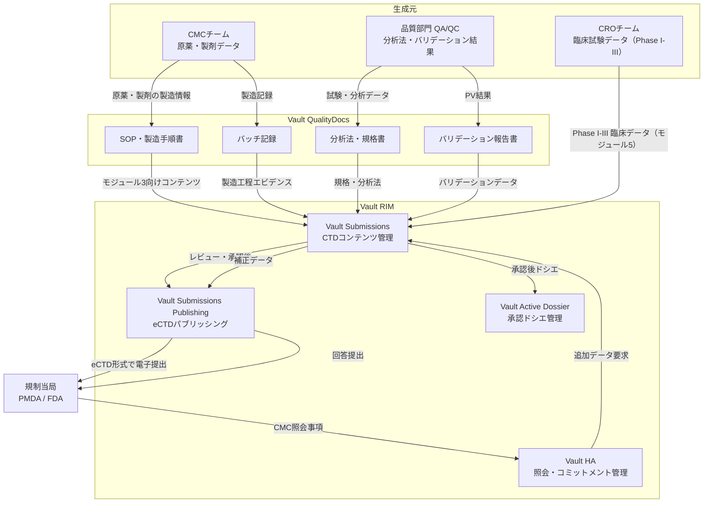
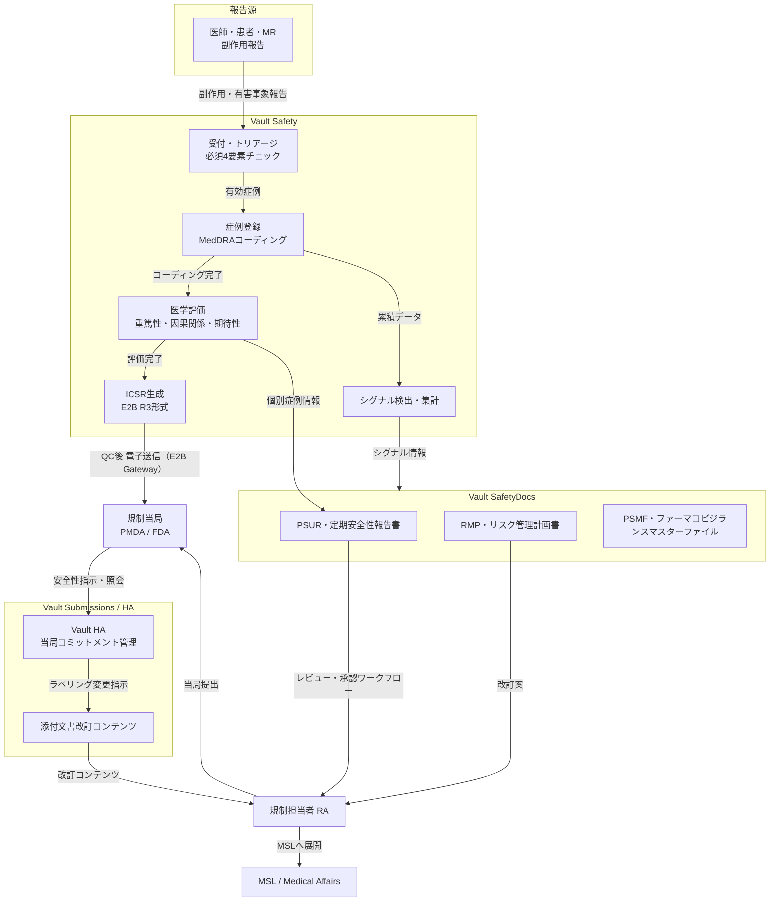
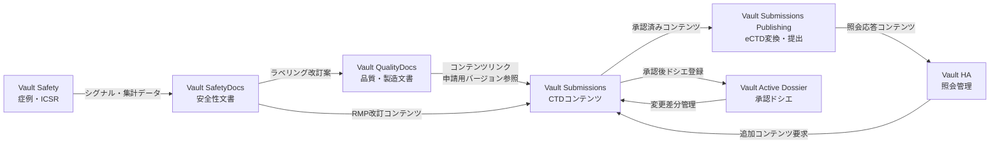
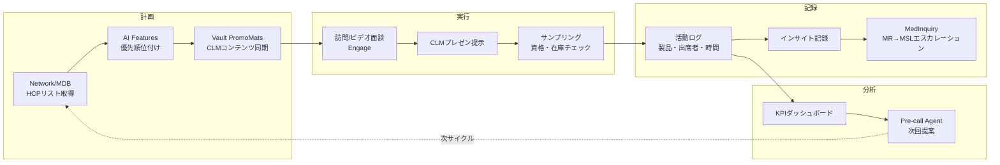
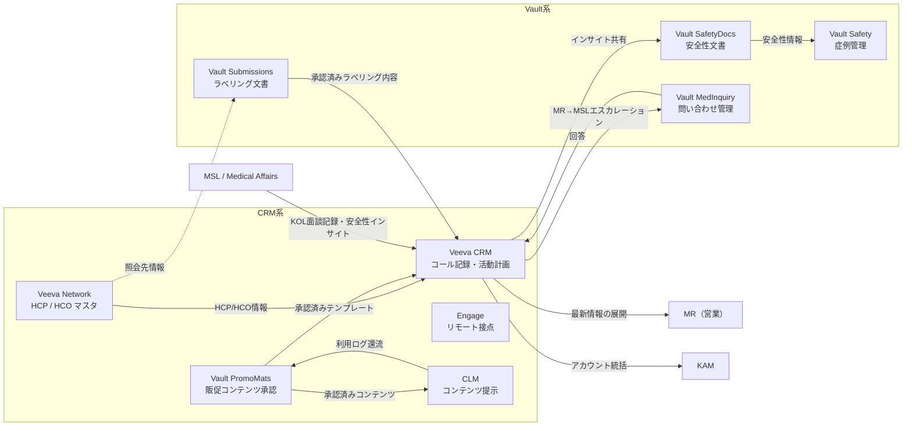

# 第三部：Veevaプラットフォームのデータ連携

本資料は、Veeva Vault および Veeva CRM を中心とした製品群において、どのようなデータがどこで生まれ、どこに流れ、誰が使うのかを整理したものです。

対象読者は、ヘルスケア部門のビジネス要件をシステム要件に変換する **ビジネスパートナー**、および実装・統合を担う **社内エンジニア** です。創薬プロセスとの対応関係は第一部、上市後の商業活動との対応関係は第二部を参照してください。

---

## 3-1 Veeva Platform全体像

Veevaは製薬・ライフサイエンス業界向けのクラウドプラットフォームで、大きく **Vault（コンテンツ・プロセス管理）** と **CRM（顧客接点管理）** の2系統に分かれます。それぞれが独立したシステムでありながら、マスタデータ（Veeva Network）を介して接続されます。

### 製品カテゴリと主な製品

| カテゴリ | 製品名 | 主な役割 |
|----------|--------|----------|
| **Vault — 品質・製造** | Vault QualityDocs | GMP文書（SOP・バッチ記録・分析法）の一元管理 |
| **Vault — 規制申請** | Vault Submissions | CTDコンテンツ収集・レビュー・承認ワークフロー |
| | Vault Submissions Publishing | eCTD形式への変換・PMDA/FDA電子提出 |
| | Vault RIM Active Dossier | 承認済みドシエのライフサイクル管理 |
| | Vault HA | 当局照会・コミットメント管理 |
| **Vault — 安全性** | Vault Safety | 症例（ICSR）管理・E2B送信・シグナル検出 |
| | Vault SafetyDocs | RMP・PSUR・PVAなど安全性文書管理 |
| **Vault — コンテンツ** | Vault PromoMats | 販促資料のMLRレビュー・承認・配布管理 |
| | Vault MedInquiry | 医療問い合わせの受付・追跡・回答管理 |
| **CRM** | Veeva CRM / Vault CRM | MR・MSL・KAMの活動記録、コール記録、CLM配信 |
| | Engage | HCPとのビデオ・チャット接点管理 |
| | Approved Email | 承認済みメールの配信・追跡 |
| | CLM | 承認済み資料のオフライン閲覧・インタラクション記録 |
| | Events Management | 学術イベント・講演会の招待・参加管理 |
| **マスタデータ** | Veeva Network | HCP（医師）・HCO（医療機関）のマスタデータ管理 |
| **分析** | Veeva Compass / Nitro | 処方データ分析・KPIモニタリング |
| **AI** | Veeva AI / Link | KOLインサイト・次回提案・優先度予測 |

### 2系統の関係性

- **Vault** は「文書・データの品質と規制遵守」を担います。承認申請・安全性監視・品質管理など、規制当局とのやり取りが中心です。
- **CRM** は「フィールドでの顧客接点」を担います。MR・MSLが医師・KOLと面談した記録、活動計画、インサイトの管理が中心です。

両者が交差するのは主に **上市後フェーズ** で、MSLがCRMに記録したKOLとの交流内容がPVチームへの安全性インサイトとして連携されたり、ラベリング変更の情報がCRM経由でMRに展開されたりします。加えて、**Vault PromoMatsで承認されたコンテンツがCRM/CLMに同期配信される** フローが、両系統をつなぐ最も日常的な接点です。

---

## 3-2 データ責任分界（System of Record）

Veeva Platform内では「どのシステムがその情報の主（マスタ）か」を明確にすることが設計の基本です。

| データ領域 | System of Record（正） | 備考 |
|---|---|---|
| 製造・品質文書 | **Vault QualityDocs** | SOP・バッチ記録・分析法などGxP日常文書 |
| 申請コンテンツ | **Vault Submissions** | CTDモジュール3〜5のコンテンツ（申請用バージョン） |
| 承認後ドシエ | **Vault Active Dossier** | 現在有効なドキュメントセットのライフサイクル管理 |
| 症例データ・ICSR | **Vault Safety** | 個別症例・E2B送信・シグナルデータ |
| 安全性文書 | **Vault SafetyDocs** | PSUR・RMP・PVAなど安全性文書 |
| 販促コンテンツ | **Vault PromoMats** | ライフサイクル状態・版管理・監査証跡を正として管理 |
| HCP/HCOマスタ | **Veeva Network** | 外部ソース（MDB・Ultmarc等）との同期管理 |
| フィールド活動記録 | **Veeva CRM** | 面談・コール・サンプリング・CLM利用履歴 |
| コンテンツ利用統計 | **CRM → Vault 還流** | 閲覧回数・到達率等をVault側にフィードバック |

端的に言えば、**「Vault は regulated content の system of record、CRM は field engagement の system of action」** です。

複数システムに同じデータが存在する場合、どちらが正であるかを業務ルールとして定義しないと、バージョン不整合・更新漏れが発生します。

---

## 3-3 開発フェーズのデータフロー（CMC〜承認申請）

CMC（Chemistry, Manufacturing and Controls）チームが生成する製造・品質データが、最終的にPMDA/FDAへのCTD提出につながる流れです。



### QualityDocs と Submissions の役割分担

QualityDocsは「GxP業務の真実のソース」であり、日常の製造・品質業務で使われる生きた文書を管理します。一方、Submissionsは「申請用に整形・バージョン固定されたコンテンツ」を管理します。同じ文書でも目的が異なるため、両者をリンクさせながら管理することが重要です。

| 観点 | Vault QualityDocs | Vault Submissions |
|------|-------------------|-------------------|
| 管理対象 | SOP・バッチ記録・分析法など日常GxP文書 | CTDモジュール3〜5のコンテンツ |
| 更新頻度 | 高い（製造・品質業務に連動） | 申請タイミング中心 |
| 主なユーザー | CMCチーム・QA/QC | 規制担当者（RA）・CMCチーム |
| 承認ワークフロー | 社内品質承認 | 申請前レビュー・承認 |
| 外部提出 | なし（内部文書） | PMDA/FDA（eCTD） |

---

## 3-4 市販後フェーズのデータフロー（PVと安全性データ）

承認後は、副作用報告（ICSR）を起点とする安全性データが中心になります。



### Safety と SafetyDocs の役割分担

| 観点 | Vault Safety | Vault SafetyDocs |
|------|--------------|------------------|
| 管理対象 | 個別症例（ICSR）・E2B送信・シグナルデータ | PSUR・RMP・PVAなど安全性文書 |
| 主なユーザー | PVチーム（症例処理担当） | PVチーム・規制担当者 |
| 外部連携 | E2B Gateway経由で当局へ電子送信 | 当局への定期報告提出 |
| 位置づけ | 「ケース処理のエンジン」 | 「安全性コンテンツの管理庫」 |

---

## 3-5 Vault製品間のデータ接続パターン

各Vault製品は独立したアプリケーションですが、コンテンツリンクやAPI連携によってデータが横断的に流れます。



### 主なデータ接続パターン

**① QualityDocs → Submissions（コンテンツリンク）**
QualityDocs上で管理されている製造SOP・分析法などを、Submissions側が「参照リンク」として取り込みます。文書を二重管理せず、QualityDocsを単一ソースとして保ちながら申請コンテンツに含められる設計です。

**② Active Dossier ↔ Submissions（ライフサイクル管理）**
一度承認されたドシエ（例：モジュール3の特定文書）はActive Dossierで管理されます。変更管理（一部変更申請・軽微変更など）が発生した際、差分コンテンツがSubmissionsに登録され、再申請フローに乗ります。

**③ Safety → SafetyDocs（シグナルから文書へ）**
個別症例の累積から検出されたシグナルは、SafetyDocs上でPSURやRMPの更新内容として文書化されます。「ケース処理」から「当局報告文書」への変換がこの連携ポイントです。

**④ SafetyDocs → Submissions（ラベリング変更）**
新たなリスクが確認された場合、添付文書の改訂コンテンツがSafetyDocsからSubmissionsに流れ、当局への一部変更申請として処理されます。

---

## 3-6 CRM系コンポーネントのデータフロー

### 一般CRMとの根本的な違い

Veeva CRMは、一般的な消費財CRMとは根本的に目的が異なります。

| 観点 | 一般CRM（消費財等） | Veeva CRM（ライフサイエンス） |
|------|---------------------|-------------------------------|
| 主な顧客概念 | Customer / Lead / Opportunity | HCP（医療従事者）/ HCO（医療機関） |
| 目的 | 売上最大化・チャネル最適化 | 規制遵守下での情報提供・活動管理 |
| コンテンツ制御 | 自由な販促 | 承認済みコンテンツのみ配信可能（Vault統制） |
| データモデルの特徴 | 商談・購買履歴中心 | 資格情報・サンプル適格性・面談記録・コンプライアンス属性中心 |
| コンプライアンス | 業界任意 | サンプリング規制・州法・承認外資料不可がシステムで強制 |

### CRM系コンポーネント構成

| コンポーネント | 主な機能 | 依存関係 |
|----------------|----------|----------|
| **Core CRM** | HCP/HCO管理、活動記録、サンプリング、テリトリー管理 | Vault CRM 基盤 |
| **Veeva Network（MDM）** | マスタデータ管理（MDB/OpenData連携）、重複統合 | 外部データソース（MDB/Ultmarc等） |
| **Vault PromoMats** | 販促コンテンツのMLRレビュー・承認・版管理 | Vault ライフサイクル |
| **CLM** | 承認済みスライド・資料のオフライン閲覧・共有 | Vault PromoMats |
| **Approved Email** | 承認済みメールテンプレートの配信・追跡 | Vault PromoMats |
| **Engage** | ビデオ・チャットによるリモート接点、予約管理 | Core CRM |
| **Events Management** | 学術イベント・講演会の招待・参加・コンプライアンス管理 | Core CRM + Network |
| **Vault MedInquiry** | MR → MSL への医療問い合わせエスカレーション・追跡 | Vault + CRM連携 |
| **AI Features** | Pre-call Agent、次回提案、優先度予測 | Core CRM + Network |
| **Reporting** | KPIダッシュボード、コンプライアンスレポート、Standard Metrics | 全コンポーネント |

アーキテクチャ上の考え方：**Core が基盤、Network がデータ、Vault が統制、Engage/CLM が実行** というレイヤー構造。

### 標準営業活動のデータフロー



---

## 3-7 VaultとCRMの接続点（上市後フェーズ）

VaultとCRMが接続する主なポイントを整理します。この接続点は、ビジネスパートナーが要件を設計する際の境界線（バウンダリー）として重要です。



### 接続点の詳細

| 接続点 | 方向 | データ内容 | 備考 |
|---|---|---|---|
| Network → CRM | CRM方向 | HCP/HCO識別子・属性 | マスタデータの同期。CRM上の医師情報の正はNetworkが担う |
| Network → Submissions | Vault方向 | 照会先医療機関情報 | 限定的。申請書類上の施設情報参照 |
| PromoMats → CLM | CRM方向 | 承認済みコンテンツ・CLMプレゼン | ライフサイクル状態連動で自動同期・撤回 |
| CLM → PromoMats | Vault方向 | コンテンツ利用ログ | 閲覧時間・クリック・反応データのフィードバック |
| CRM → SafetyDocs | Vault方向 | MSLインサイト（安全性関連） | 現状は手動連携が多い。自動化時はAPI検討 |
| CRM → MedInquiry | Vault方向 | MR→MSL医療問い合わせ | 自動エスカレーション、追跡・回答管理 |
| Submissions → CRM | CRM方向 | 承認済みラベリング・製品情報 | 更新タイミングの同期管理が課題になりやすい |

---

## 3-8 マスターデータ（Veeva Network・Ultmarc）

### Veeva Networkの位置づけ

Veeva Networkは、HCP/HCOのマスタデータ管理（MDM）を担うコンポーネントです。CRMやVaultの各コンポーネントから参照されるデータの「単一ソース」であり、外部データソースとの同期・重複統合・変更管理を行います。

グローバルでは **Veeva OpenData** がリファレンスデータサービスとして提供され、HCPのVeeva ID・名前・住所・NPI/License ID・専門分野・所属アフィリエーション等をCDA（Common Data Architecture）準拠の標準フィールドで管理します。

### 日本市場の特殊性：Ultmarc（日本アルトマーク）

日本ではVeeva OpenDataは提供されていません。代わりに **Ultmarc（日本アルトマーク）** がローカルプロバイダとしてHCP/HCOデータを提供しており、Veeva NitroやJitsushoka経由でCRMに連携されます。

**Ultmarcの主要マスタファイル（MDB）**

| ファイル名 | 正式名称 | カバー範囲 |
|------------|----------|-----------|
| **DCF** | Doctor Computer File | 全国の医療施設（病院・診療所）＋所属医師の基本情報 |
| **DSF** | Drug Store File | 全国の薬局・薬店の基本情報 |
| **PCF** | Pharmacist Computer File | 全国の病院内薬剤師の基本情報 |

MDBは195社以上の製薬・医療機器企業が会員として参加する業界共同メンテナンスモデルで、カバー範囲は **病院約8,000件、診療所約106,000件、福祉施設約65,000件** です。有料のサブスクリプション制（基本料金＋従量課金）で、Veeva経由で利用する場合もUltmarc利用料が別途発生します。

### HCP/HCO識別子の重要性

CRMとVaultの間では、氏名よりも **Global ID・External ID・NPI・License ID・Account ID・DCFコード** のような一意識別子で同一人物・同一施設を突き合わせる考え方が重要です。識別子のマッピングルールを事前に定義しないと、グローバル-ローカル間でデータ不整合が発生します。

### 日本の補完データソース

| データソース | 内容 |
|---|---|
| Veeva HCP Access | CRM内の活動データに基づくアクセス指標。四半期ごと、ブリックレベル（5人グループ集計）で提供 |
| Veeva Jitsushoka / Nitro | UltmarcデータとのコネクタによるCRM連携・処方データ分析 |
| 自社活動データ | CRMに蓄積された訪問・面談ログ、反応データ |

---

## 3-9 Vaultデータ構造（エンジニア向け）

VaultはCMS（コンテンツ管理システム）としての側面と、ワークフローエンジンとしての側面を持ちます。エンジニアが意識すべき主なオブジェクトは以下の通りです。

### 主要データオブジェクト

| オブジェクト | 説明 | 主な属性 |
|---|---|---|
| **Document** | コンテンツの基本単位。バージョン管理・ライフサイクルを持つ | Document Type, Status, Lifecycle State, Version |
| **Document Version** | 同一Documentの版管理単位。メジャー/マイナーバージョンを持つ | Version Number, Created Date, Author |
| **Workflow** | 承認・レビューなどのプロセスを定義 | Workflow Type, Tasks, Participants |
| **Binder** | 複数DocumentをグルーピングするCTD構造などに使用 | Sections, Referenced Documents |
| **Object Record** | ドキュメント以外の構造化データ（症例・申請・製品など） | Object Typeによって異なる |

### ライフサイクル設計

Vaultの各ドキュメントはライフサイクルステート（Draft → In Review → Approved など）を持ちます。ワークフロー設計では「誰がどのステートでどのアクションを実行できるか（ロールと権限）」を業務フローと対応させる必要があります。

CRM連携においては、**ライフサイクル状態遷移が連携条件** になる点が重要です。PromoMatsでApprovedになった瞬間にCLMへ同期、Expiredになった瞬間にCLMから撤回、というように、単純なデータコピーではなく **状態遷移に応じた制御付き同期** として設計する必要があります。

### 変更管理との連動

承認後の文書変更（CMC変更・ラベリング変更など）は、規制当局への届け出要否を判断するプロセスと連動して設計します。Active Dossierが「現在有効なドキュメントセット」を管理し、Submissionsが「変更申請コンテンツ」を管理するという役割分担を崩さないことが重要です。

---

## 3-10 Vault API・VQL・外部連携パターン

VaultはRESTful APIを提供しており、外部システムとの統合が可能です。認証にはVeeva独自の `Authorization` ヘッダを使用します。

### 主なAPIエンドポイント

| カテゴリ | 用途 |
|---|---|
| **Documents API** | 文書のCRUD・バージョン取得・ダウンロード |
| **Objects API** | Object Recordの検索・作成・更新 |
| **Workflows API** | ワークフローの開始・タスク完了 |
| **Loader API** | 大量データの一括インポート/エクスポート |
| **Query (VQL)** | Vault独自クエリ言語によるデータ検索 |

### VQL（Vault Query Language）

VQLはVault固有のクエリ言語で、SQL類似の構文でドキュメント・オブジェクトを検索できます。

```sql
-- 承認済みドキュメントの一覧取得
SELECT id, name__v, status__v, lifecycle_state__v
FROM documents
WHERE status__v = 'Approved'
  AND document_type__v = 'SOP'
```

### 外部連携パターン

| シナリオ | 推奨方式 |
|---|---|
| 社内ERP・LIMSからのデータ連携（バッチ） | Loader API または Documents API による非同期バッチ処理 |
| リアルタイム連携（状態変化通知） | Vault Spark Messaging / Vault SDK（イベント通知） |
| CLM同期（PromoMats → CRM） | Vault-to-Vault接続 + ライフサイクル状態連動の自動プッシュ |
| データ移行 | Loader APIによる一括インポート |

### データ移行・統合時の主な注意点

- **文書メタデータの正規化**：Document Type・Lifecycle・ClassificationはVault側の設定と事前に合わせる
- **バージョン整合性**：既存バージョン履歴を保持するか否かを業務側と合意する
- **E2B送信の冪等性**：SafetyからのICSR電子送信は重複送信しないよう、送信ステータス管理を厳密に行う
- **権限設計**：統合ユーザーに必要最小限のVaultロールを割り当て、監査ログが追跡できる状態にする
- **HCP/HCO識別子マッピング**：CRM-Vault間、グローバル-ローカル間でDCFコード・Veeva ID・NPI等のキー突合ルールを事前定義する
- **コンテンツ配布状態の整合性**：PromoMats-CLM間の同期設計では、ライフサイクル状態遷移タイミングとCRM側のキャッシュ更新タイミングのずれを考慮する

---

## 3-11 CRUDマトリクス（全Veevaコンポーネント）

データエンジニアが統合設計を行う際に、「どのシステムがどのデータをどう操作するか」を把握するための参照表です。

| タスク | Core CRM | Network | PromoMats | QualityDocs | RIM | Safety | CTMS | MedInquiry | Nitro | Events | AI/Link | Reporting |
|--------|----------|---------|-----------|-------------|-----|--------|------|------------|-------|--------|---------|-----------|
| コンテンツ作成 | | | **C R U D** | | | | | | | | | |
| MLRレビュー | | | R U | | | | | | | | | |
| コンテンツ承認 | | | R U D | R | | | | | | | | |
| HCP特定 | R | **C R U D** | | | | | R | | C R | | R | R |
| 活動計画 | **C R U** | R | | | | | | | | R | C R U | R |
| 活動実行 | **C R U** | R | R | | | | | R | | C R U | R | |
| 活動記録 | **C U** | R | R U | | | R | R | C U | R | R | R | R |
| KPI分析 | R | R | R | R | R | R | R | R | R | R | R | **C R U D** |
| 次回計画 | **C R U** | R | | | | | | | | C R U | C R U | R |

**PromoMatsがコンテンツCRUDの中心、NetworkがHCP/HCOデータCRUDの中心**。Core CRMは活動データの生成・記録を担い、Reportingが全データを集約して分析に使用します。

### 全連携コンポーネント一覧

| カテゴリ | コンポーネント | 連携内容 |
|---|---|---|
| **データ** | Veeva Network (MDM) | HCP/HCOマスターデータ、ID同期 |
| **コンテンツ** | Vault PromoMats | MLR承認コンテンツ、CLM配信 |
| **品質** | Vault QualityDocs | SOP/GMP文書参照 |
| **薬事** | Vault RIM / Submissions | 申請資料共有、規制情報 |
| **安全性** | Vault Safety | AE報告連携 |
| **臨床** | Vault CTMS | 治験サイト情報共有 |
| **医療** | Vault MedInquiry | MR→MSL問い合わせエスカレーション |
| **AI/分析** | Veeva Nitro | 日本ローカルデータ（Ultmarc）連携 |
| **イベント** | Events Management | 招待/参加管理 |
| **AI** | Veeva AI / Link | KOL/KAMインサイト |

---

## 3-12 RACIマトリクス（ロール別責任分担）

CRM活動の責任分担をRACIで整理します。（R: Responsible＝実行責任、A: Accountable＝最終責任、C: Consulted＝相談、I: Informed＝情報共有）

| タスク | Marketing | MLR | MR | MSL | KAM |
|--------|-----------|-----|-----|-----|------|
| コンテンツ作成 | **R** | | | | |
| MLRレビュー | C | **R** | | | |
| コンテンツ承認 | I | **R A** | | | |
| HCP特定 | | | C | C | **A** |
| 活動計画 | | | **R** | **R** | **A** |
| 活動実行 | | | **R A** | **R** | **R** |
| 活動記録 | | | **R A** | **R A** | **R** |
| KPI分析 | **R** | | I | I | **R A** |
| 次回計画 | C | | I | I | **R A** |

**KAMが統括責任（Accountable）、MLRが承認ゲート** という構造です。

### CRM統合設計の追加考慮点

データの主系と方向性を整理した設計ガイドラインです。

| 連携パターン | 主系 | 方向 | 設計上の注意 |
|---|---|---|---|
| HCP/HCOマスタ | Network | Network → CRM | CRM側はリードオンリー参照。変更はNetworkで管理 |
| コンテンツ配布 | PromoMats | PromoMats → CLM | ライフサイクル連動。CLM側は受信のみ |
| 利用ログ | CRM | CRM → PromoMats | 非同期バッチ。リアルタイム性は不要 |
| 安全性インサイト | CRM | CRM → SafetyDocs | 手動連携が多い。自動化時は慎重に設計 |
| ラベリング変更 | Submissions | Submissions → CRM | 更新タイミングの同期管理が課題 |

**監査証跡の設計**：CRMの活動記録は、サンプリング記録・承認コンテンツ利用記録は21 CFR Part 11の対象となり得ます。「誰が、いつ、何を、どの版で使ったか」を追跡可能にすることが重要です。
