# ベンダーマネジメント実践ガイド

---

## 目次（Index）

- [はじめに](#はじめに)
- [第1章：役割と位置づけ](#第1章役割と位置づけ)
- [第2章：調達プロセス](#第2章調達プロセス)
- [第3章：ベンダーライフサイクル管理](#第3章ベンダーライフサイクル管理)
- [第4章：クラウド/SaaS・運用保守委託でのVMOの特別な注意点](#第4章クラウドsaas運用保守委託でのvmoの特別な注意点)
- [第5章：VMOの組織内での役割と連携](#第5章vmoの組織内での役割と連携)
- [第6章：成果を測る指標（KPI）](#第6章成果を測る指標kpi)
- [第7章：VMOの実践チェックリスト](#第7章vmoの実践チェックリスト)
- [付録A：VMOが使えるテンプレート集](#付録avmoが使えるテンプレート集)
- [付録B：Q&A](#付録bqa)
- [付録C：ITIL準拠 L1-L3問題解決フロー](#付録citil準拠l1-l3問題解決フロー)
- [付録D：Follow-the-sun モデル](#付録dfollow-the-sun-モデル)

---

## はじめに

- このガイドは、VMO（企業IT組織のベンダーマネジメント担当者）が日々直面する業務を体系的に整理し、効果的にベンダーを管理するための実践的な手引きです。
- VMOの役割は、ベンダーとの関係を通じて、IT投資の価値を最大化し、リスクを最小化することです。
- 企業IT支出の大部分を外部ベンダーに依存する企業において、VMOの業務は経営に直結する重要な機能です。

<br>

---

## 第1章：役割と位置づけ

### 1.1 ベンダーマネジメントの責任

VMOは以下の責任を担っています：

- **ベンダー台帳の管理**：全ITベンダー・SaaSの一元管理
- **ベンダー分類とリスク評価**：重要度に応じた管理レベルの設定
- **パフォーマンスレビューの実施**：SLA遵守状況の監視と評価
- **契約交渉の主導**：更新時の条件改善とコスト最適化
- **関係性の構築**：戦略的ベンダーとの協創関係の維持

<br>

### 1.2 VMOが関わる組織とその関係

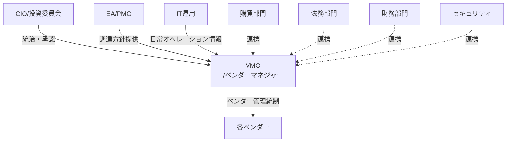
```mermaid
graph TD
    A[CIO/投資委員会] -->|統治・承認| B[VMO<br>/ベンダーマネジャー]
    C[EA/PMO] -->|調達方針提供| B
    D[IT運用] -->|日常オペレーション情報| B
    B -->|ベンダー管理統制| E[各ベンダー]
    F[購買部門] -.連携.-> B
    G[法務部門] -.連携.-> B
    H[財務部門] -.連携.-> B
    I[セキュリティ] -.連携.-> B
```

**VMOと他部門との関係**：

- **EA/PMO**：技術スタックやアーキテクチャ方針を受け取り、調達方針に反映
- **IT運用（ITサービスマネージャ）**：日常のSLA監視データを受け取り、ベンダー評価に活用
- **購買部門**：RFP発行や入札プロセスで協働
- **法務・財務・セキュリティ**：契約レビュー、予算確保、リスク評価で連携

<br>

### 1.3 VMOの業務とCOBIT 2019フレームワークの対応

VMOの業務は、COBIT 2019の以下のプロセスに対応しています：

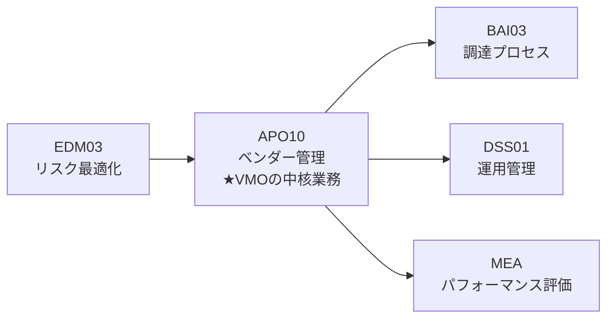
```mermaid
graph LR
    A[EDM03<br/>リスク最適化] --> B[APO10<br/>ベンダー管理<br/>★VMOの中核業務]
    B --> C[BAI03<br/>調達プロセス]
    B --> D[DSS01<br/>運用管理]
    B --> E[MEA<br/>パフォーマンス評価]
```

**APO10（ベンダー管理）** がVMOの中核プロセスです。ここでベンダー分類、評価、パフォーマンス管理、契約統制を実施します。

---

## 第2章：調達プロセス

### 2.1 調達プロセス全体の流れ（VMOの視点）

VMOは調達プロセス全体を通じて、以下の役割を果たします：

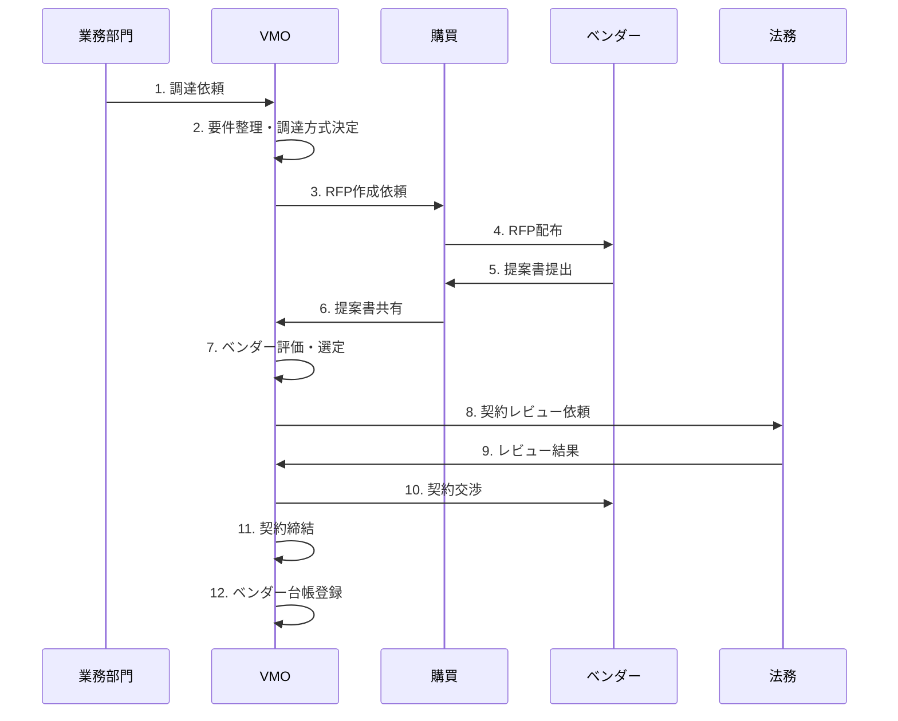
```mermaid
sequenceDiagram
    participant 業務部門
    participant VMO
    participant 購買
    participant ベンダー
    participant 法務
    
    業務部門->>VMO: 1. 調達依頼
    VMO->>VMO: 2. 要件整理・調達方式決定
    VMO->>購買: 3. RFP作成依頼
    購買->>ベンダー: 4. RFP配布
    ベンダー->>購買: 5. 提案書提出
    購買->>VMO: 6. 提案書共有
    VMO->>VMO: 7. ベンダー評価・選定
    VMO->>法務: 8. 契約レビュー依頼
    法務->>VMO: 9. レビュー結果
    VMO->>ベンダー: 10. 契約交渉
    VMO->>VMO: 11. 契約締結
    VMO->>VMO: 12. ベンダー台帳登録
```

<br>

### 2.2 調達の8ステップとVMOのアクション

#### ステップ1：申請・要求定義
**VMOのアクション**：
- 業務部門から受け取った要件を機能要件と非機能要件に整理
- セキュリティレベル、可用性、RTO/RPOを明確化
- 予算と期間の妥当性を検証

#### ステップ2：調達計画・方式決定
**VMOのアクション**：
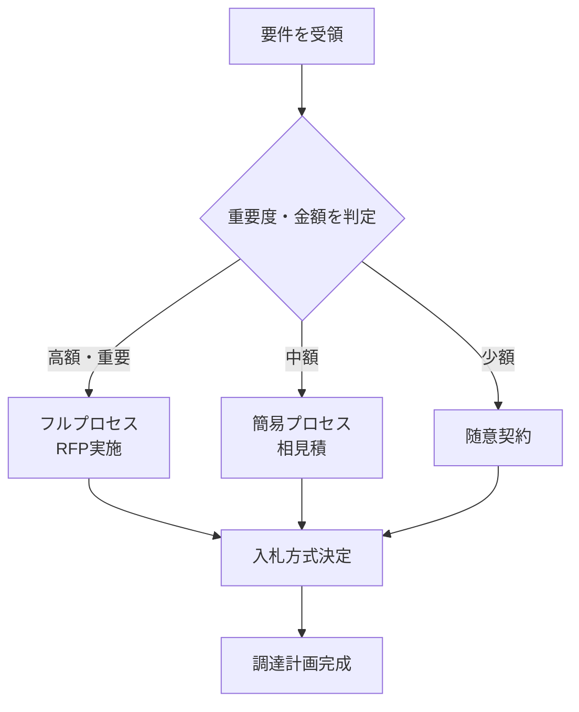
```mermaid
flowchart TD
    A[要件を受領] --> B{重要度・金額を判定}
    B -->|高額・重要| C[フルプロセス<br/>RFP実施]
    B -->|中額| D[簡易プロセス<br/>相見積]
    B -->|少額| E[随意契約]
    C --> F[入札方式決定]
    D --> F
    E --> F
    F --> G[調達計画完成]
```

- 重要度・金額に応じて調達方式（競争入札/随意契約）を決定
- 新規契約か更新かを判断
- RFI/RFPの実施要否を決定

#### ステップ3：ベンダー選定（RFI/RFP）
**VMOのアクション**：
- 購買部門と協力してRFP文書を作成
- 候補ベンダーリストを準備（既存台帳から抽出）
- 提案書を評価マトリクスでスコアリング

**評価マトリクス例**（VMOが使用）：

| 評価項目 | 配点 | ベンダーA | ベンダーB | ベンダーC |
|---------|------|----------|----------|----------|
| 機能適合度 | 30点 | 25 | 28 | 22 |
| 実績・信頼性 | 20点 | 18 | 15 | 19 |
| セキュリティ姿勢 | 20点 | 16 | 18 | 14 |
| サポート体制 | 15点 | 12 | 13 | 10 |
| 価格競争力 | 15点 | 10 | 12 | 13 |
| **合計** | **100点** | **81** | **86** | **78** |

#### ステップ4：社内承認・稟議
**VMOのアクション**：
- 選定結果をまとめた稟議書を作成
- EA/PMO、セキュリティ、法務の承認を取得
- 最終的にCIOの承認を得る

#### ステップ5：契約・発注
**VMOのアクション**：
- ベンダーと契約条件を交渉（SLA、セキュリティ条項、データ保護など）
- 法務と協力して契約書をレビュー
- 契約締結後、購買部門に発注書（PO）発行を依頼

**VMOが確認すべき契約条項**：
- SLA（可用性、応答時間、回復時間）
- データ保護（暗号化、バックアップ、削除手順）
- 監査権と再委託条件
- 終了時のデータ返却・移管支援

#### ステップ6：納品・検収
**VMOのアクション**：
- ITサービスマネージャと協力して受入テストを実施
- 検収基準を満たしているか確認
- 問題があれば差し戻し、再納品を要求

#### ステップ7：検収照合・支払処理
**VMOのアクション**：
- 発注書、検収記録、請求書の3点照合を確認
- 財務部門に支払承認を依頼
- 会計システムへの計上を確認

#### ステップ8：ベンダー評価・契約更新/終了
**VMOのアクション**：
- SLA達成度、品質、コミュニケーションを評価
- 継続、条件見直し、終了の判断を実施
- 次年度の契約条件を協議

<br>

### 2.3 VMOが作成・管理すべき主要文書

| 文書名 | 目的 | 更新頻度 |
|--------|------|----------|
| ベンダー台帳 | 全ベンダーの一元管理 | 月次 |
| RFP文書 | ベンダー選定時の要件定義 | 案件毎 |
| 評価マトリクス | 客観的なベンダー評価 | 案件毎 |
| 契約書 | 双方の権利義務を明文化 | 契約毎 |
| SLAレポート | パフォーマンス監視 | 月次 |
| ベンダー評価シート | 定期レビュー結果 | 四半期/年次 |

---

## 第3章：ベンダーライフサイクル管理

ベンダーマネジメントは「選定して終わり」ではありません。VMOは契約締結から終了まで、継続的にベンダーを管理する責任があります。

### 3.1 ベンダー台帳の作成と管理（VMOの最重要業務）

**VMOが管理すべきベンダー台帳の項目**：

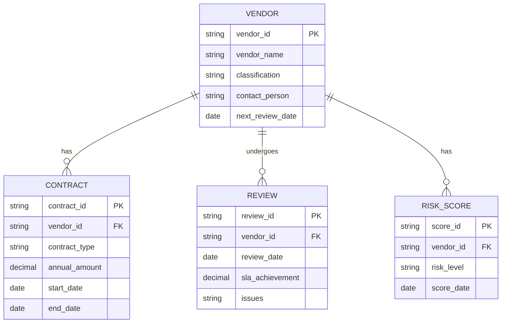
```mermaid
erDiagram
    VENDOR ||--o{ CONTRACT : has
    VENDOR ||--o{ REVIEW : undergoes
    VENDOR ||--o{ RISK_SCORE : has
    
    VENDOR {
        string vendor_id PK
        string vendor_name
        string classification
        string contact_person
        date next_review_date
    }
    
    CONTRACT {
        string contract_id PK
        string vendor_id FK
        string contract_type
        decimal annual_amount
        date start_date
        date end_date
    }
    
    REVIEW {
        string review_id PK
        string vendor_id FK
        date review_date
        decimal sla_achievement
        string issues
    }
    
    RISK_SCORE {
        string score_id PK
        string vendor_id FK
        string risk_level
        date score_date
    }
```

**ベンダー分類（VMOが決定）**：

| 分類 | 定義 | レビュー頻度 | 管理レベル |
|------|------|---------------------|-----------|
| 戦略ベンダー | IT支出10%以上 or 事業継続必須 | 四半期毎 | 最高 |
| 重要ベンダー | 単一依存 or 機密データ取扱 | 半期毎 | 高 |
| 一般ベンダー | 代替可能・低額 | 年次 | 標準 |

**VMOが実施する分類基準**：
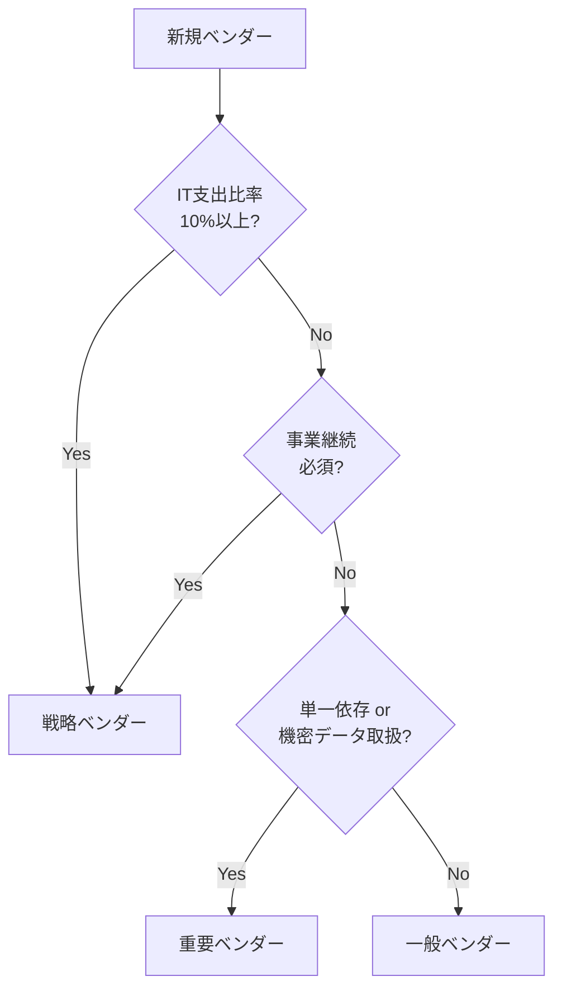
```mermaid
flowchart TD
    A[新規ベンダー] --> B{IT支出比率<br/>10%以上?}
    B -->|Yes| C[戦略ベンダー]
    B -->|No| D{事業継続<br/>必須?}
    D -->|Yes| C
    D -->|No| E{単一依存 or<br/>機密データ取扱?}
    E -->|Yes| F[重要ベンダー]
    E -->|No| G[一般ベンダー]
```

<br>

### 3.2 オンボーディング（VMOが主導）

契約締結後、VMOがベンダーを組織に迎え入れるプロセスです。

**VMOのオンボーディングチェックリスト**：

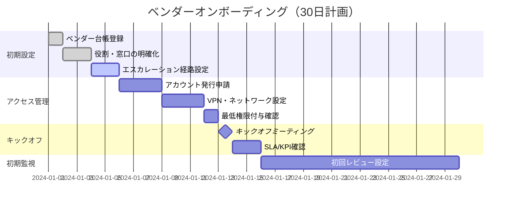
```mermaid
gantt
    title ベンダーオンボーディング（30日計画）
    dateFormat  YYYY-MM-DD
    section 初期設定
    ベンダー台帳登録           :done, a1, 2024-01-01, 1d
    役割・窓口の明確化         :done, a2, after a1, 2d
    エスカレーション経路設定   :active, a3, after a2, 2d
    section アクセス管理
    アカウント発行申請         :a4, after a3, 3d
    VPN・ネットワーク設定      :a5, after a4, 3d
    最低権限付与確認           :a6, after a5, 1d
    section キックオフ
    キックオフミーティング     :milestone, a7, after a6, 1d
    SLA/KPI確認               :a8, after a7, 2d
    section 初期監視
    初回レビュー設定           :a9, after a8, 14d
```

**VMOが実施すべき項目**：
1. ベンダー台帳への登録（ベンダーID、分類、連絡先）
2. ビジネスオーナー、技術オーナーの任命
3. エスカレーション経路の整備
4. アクセス権・VPN・アカウント発行のワークフロー化
5. キックオフミーティングの開催

<br>

### 3.3 パフォーマンス/リスクモニタリング（VMOの日常業務）

**月次レビュー（VMOが主催）**：

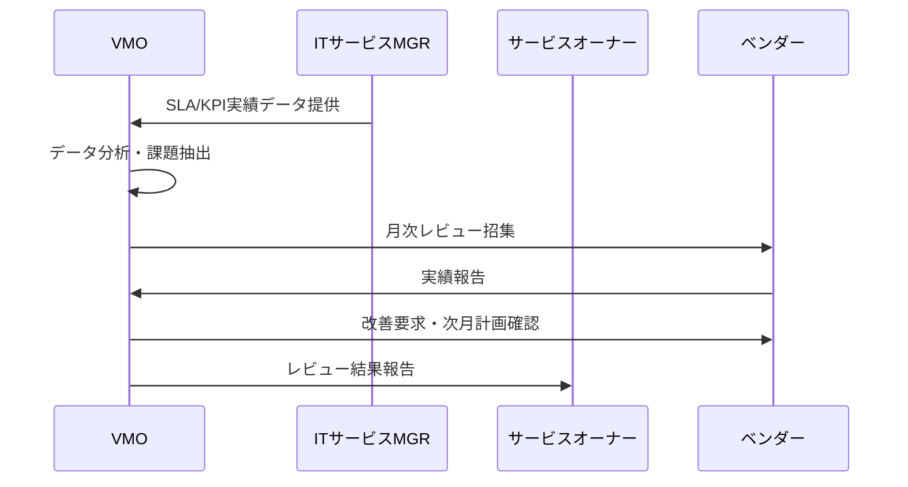
```mermaid
sequenceDiagram
    participant VMO
    participant ITサービスMGR
    participant サービスオーナー
    participant ベンダー
    
    ITサービスMGR->>VMO: SLA/KPI実績データ提供
    VMO->>VMO: データ分析・課題抽出
    VMO->>ベンダー: 月次レビュー招集
    ベンダー->>VMO: 実績報告
    VMO->>ベンダー: 改善要求・次月計画確認
    VMO->>サービスオーナー: レビュー結果報告
```

**VMOがモニタリングすべきKPI**：

| カテゴリ | KPI | 目標値 | データ取得元 | VMOの対応 |
|----------|-----|--------|-------------|-------------|
| サービス品質 | 可用性 | 99.9% | ITサービスMGR | 未達時に料金減額交渉 |
| サービス品質 | MTTR（平均復旧時間） | 4時間 | ITサービスMGR | 未達時に改善計画要求 |
| 関係性 | CSATスコア | 4.0/5 | サービスオーナー | 低評価時にエスカレーション |
| コスト | TCO削減率 | 年5% | 財務部門 | 未達時に再交渉 |
| リスク | セキュリティインシデント | 0件 | セキュリティ担当 | 発生時に契約解除検討 |

**四半期戦略レビュー（戦略・重要ベンダー向け、VMOが主導）**：

**VMOが準備すべき資料**：
- TCO実績 vs 契約時見込み
- ライセンス使用率分析
- ベンダーロードマップと自社IT戦略の整合性
- リスク変化（財務、体制、セキュリティ）

**VMOが協議すべき内容**：
- 契約更新に向けた改善提案
- 価格交渉・ボリュームディスカウント
- 共創企画・イノベーション機会
- 次年度のサービスレベル見直し

<br>

### 3.4 関係性・コスト最適化（VMOの価値創出）

**VMOが実施するコスト最適化手法**：

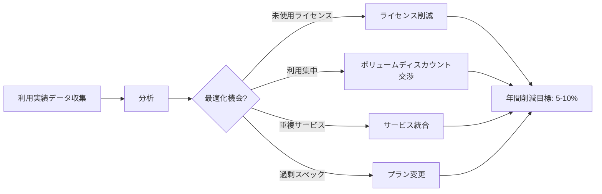
```mermaid
flowchart LR
    A[利用実績データ収集] --> B[分析]
    B --> C{最適化機会?}
    C -->|未使用ライセンス| D[ライセンス削減]
    C -->|利用集中| E[ボリュームディスカウント交渉]
    C -->|重複サービス| F[サービス統合]
    C -->|過剰スペック| G[プラン変更]
    D --> H[年間削減目標: 5-10%]
    E --> H
    F --> H
    G --> H
```

**VMOが戦略的ベンダーと実施すべき活動**：
- ロードマップ共有会議（四半期毎）
- 共創企画ワークショップ（年2回）
- エグゼクティブレビュー（CIO参加、年1回）
- イノベーションラボ参加（継続）

<br>

### 3.5 リスク管理とエスカレーション（VMOの危機管理）

**VMOが監視すべきリスクトリガー**：
- SLA連続未達（2ヶ月連続）
- 重大インシデント発生（事業影響大）
- ベンダー財務悪化（決算短信確認）
- セキュリティ事案・法令違反
- 主要担当者の離職・体制変更

**VMOが実行するエスカレーション**：

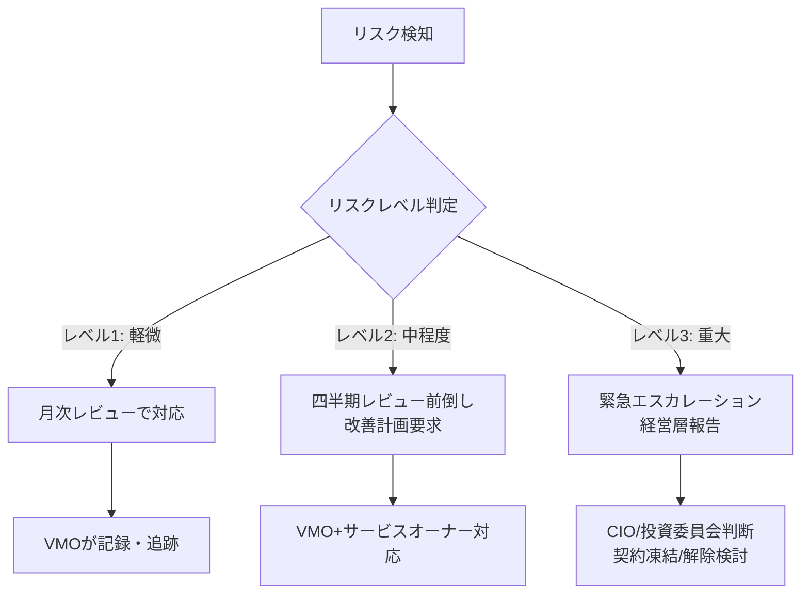
```mermaid
graph TD
    A[リスク検知] --> B{リスクレベル判定}
    B -->|レベル1: 軽微| C[月次レビューで対応]
    B -->|レベル2: 中程度| D[四半期レビュー前倒し<br/>改善計画要求]
    B -->|レベル3: 重大| E[緊急エスカレーション<br/>経営層報告]
    C --> F[VMOが記録・追跡]
    D --> G[VMO+サービスオーナー対応]
    E --> H[CIO/投資委員会判断<br/>契約凍結/解除検討]
```

<br>

### 3.6 オフボーディング（VMOが完遂する最終プロセス）

契約終了時、VMOが混乱なくベンダーを退出させる責任を負います。

**VMOのオフボーディング計画（90日前開始）**：

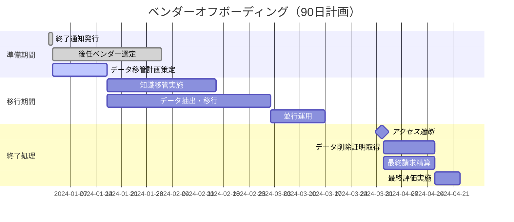
```mermaid
gantt
    title ベンダーオフボーディング（90日計画）
    dateFormat  YYYY-MM-DD
    section 準備期間
    終了通知発行               :done, o1, 2024-01-01, 1d
    後任ベンダー選定           :done, o2, after o1, 30d
    データ移管計画策定         :active, o3, after o1, 15d
    section 移行期間
    知識移管実施               :o4, after o3, 30d
    データ抽出・移行           :o5, after o3, 45d
    並行運用                   :o6, after o5, 15d
    section 終了処理
    アクセス遮断               :milestone, o7, 2024-04-01, 1d
    データ削除証明取得         :o8, after o7, 14d
    最終請求精算               :o9, after o7, 14d
    最終評価実施               :o10, after o9, 7d
```

**VMOのオフボーディングチェックリスト**：

- [ ] **90日前**：ベンダーに終了通知を正式発行
- [ ] **60日前**：データ移管計画完成（フォーマット、移管先確認）
- [ ] **30日前**：知識移管完了（運用マニュアル、設定情報、トラブルシューティングDB）
- [ ] **契約終了日**：全アカウント無効化、VPN切断
- [ ] **14日以内**：データ削除証明書取得
- [ ] **14日以内**：最終請求精算（未払・前払調整、ペナルティ）
- [ ] **30日以内**：最終評価レビュー実施、ベンダー台帳更新
- [ ] **30日以内**：事後検証（新ベンダー稼働確認、移行完了報告）

---

## 第4章：クラウド/SaaS・運用保守委託でのVMOの特別な注意点

### 4.1 クラウド/SaaS調達でのVMOの追加業務

**VMOがRFPに追加すべき項目**：

| 一般調達での確認事項 | VMOがクラウド/SaaSで追加確認すべき事項 |
|-------------------|-----------------------------------|
| 機能適合度 | マルチテナント分離、データ所在地（日本リージョン指定） |
| セキュリティ | Shared Responsibility Model明記、CSP認証（ISO27017/27701） |
| 出口戦略 | データポータビリティ（API/CSV出力）、ベンダーロックイン回避策 |
| 価格 | 従量課金の上限設定、予約インスタンス割引の活用 |

**VMOが評価すべきクラウド/SaaS特有のリスク**：

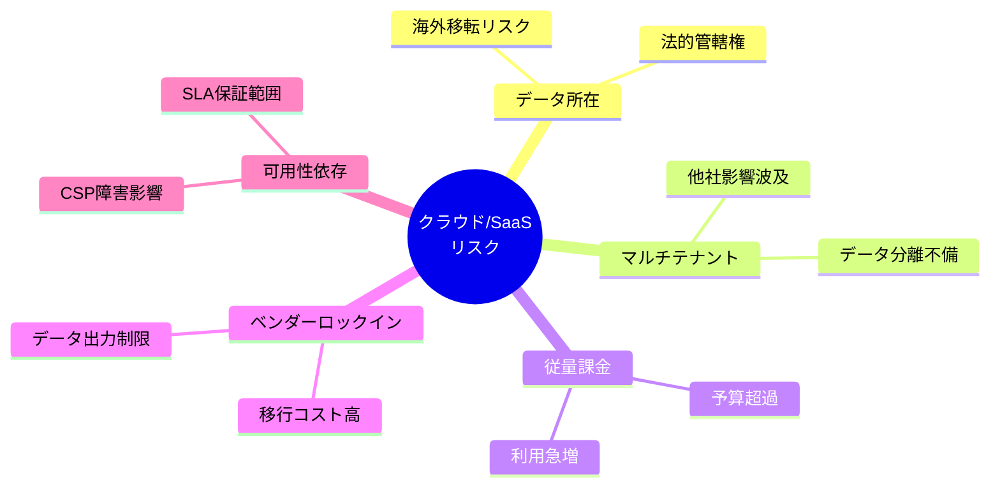
```mermaid
mindmap
    root((クラウド/SaaS<br/>リスク))
        データ所在
            海外移転リスク
            法的管轄権
        マルチテナント
            データ分離不備
            他社影響波及
        従量課金
            予算超過
            利用急増
        ベンダーロックイン
            移行コスト高
            データ出力制限
        可用性依存
            CSP障害影響
            SLA保証範囲
```

**VMOが契約に盛り込むべき条項例**：

```markdown
【データ所在地条項（VMOが要求）】
第X条（データ所在）
1. ベンダーは、契約者データを日本国内のデータセンターに保管するものとする
2. データの国外移転には契約者の事前書面承認を必要とする
3. データレジデンシー違反時は契約解除権を発動できる

【データポータビリティ条項（VMOが要求）】
第Y条（データエクスポート）
1. 契約者はいつでも全データをエクスポート可能とする
2. エクスポート形式は標準フォーマット（CSV/JSON）とする
3. エクスポート完了は30日以内とし、追加費用は発生しない
```

<br>

### 4.2 運用保守委託でのVMOの管理ポイント

**VMOが設計すべきL1-L4サポート体制**：

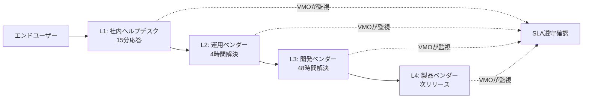
```mermaid
graph LR
    A[エンドユーザー] --> B[L1: 社内ヘルプデスク<br/>15分応答]
    B --> C[L2: 運用ベンダー<br/>4時間解決]
    C --> D[L3: 開発ベンダー<br/>48時間解決]
    D --> E[L4: 製品ベンダー<br/>次リリース]
    
    B -.VMOが監視.-> F[SLA遵守確認]
    C -.VMOが監視.-> F
    D -.VMOが監視.-> F
    E -.VMOが監視.-> F
```

**VMOが契約で明確化すべき責任分界**：

| レベル | 担当 | VMOが契約に記載すべき業務範囲 | SLA目標 |
|--------|------|-------------------------------|---------|
| L1 | 社内ヘルプデスク | 受付、初期トリアージ、FAQ対応 | 15分応答 |
| L2 | 運用ベンダー | 標準障害復旧、ログ解析、パッチ適用 | 4時間解決 |
| L3 | 開発ベンダー | カスタムコード修正、設計変更 | 48時間解決 |
| L4 | 製品ベンダー | プロダクトバグ修正、機能追加 | 次リリース対応 |

<br>

**VMOが防ぐべきブラックボックス化対策**：

- 運用ドキュメント常時更新義務（契約条項化）
- 月次レビューで最新化確認
- 人材派遣契約禁止、固定メンバー制
- ナレッジ共有必須化（Confluenceなど）
- 契約前3ヶ月のPoC実施

<br>

### 4.3 VMOが交渉すべきSLA設計

**可用性SLA（VMOが重要度別に設定）**：

| 重要度 | VMOが設定する可用性目標 | 未達時の補償率（VMOが交渉） | VMOが要求するベンダー対応 |
|--------|-------------------------|---------------------------|-------------------------|
| ミッションクリティカル | 99.99% | 未達1%につき月額2%返金 | 即時復旧＋根本原因分析報告 |
| クリティカル | 99.95% | 未達1%につき月額1%返金 | 48時間復旧＋月次報告 |
| 一般 | 99.90% | 超過時ディスカウント | 四半期レビューで改善協議 |

**インシデント対応SLA（VMOが定義）**：

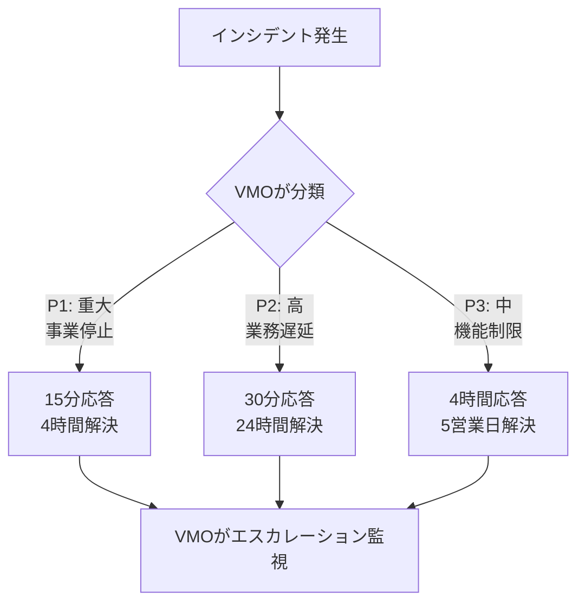
```mermaid
graph TD
    A[インシデント発生] --> B{VMOが分類}
    B -->|P1: 重大<br/>事業停止| C[15分応答<br/>4時間解決]
    B -->|P2: 高<br/>業務遅延| D[30分応答<br/>24時間解決]
    B -->|P3: 中<br/>機能制限| E[4時間応答<br/>5営業日解決]
    
    C --> F[VMOがエスカレーション監視]
    D --> F
    E --> F
```

<br>

### 4.4 セキュリティ・データ保護（VMOの重要責任）

**VMOが契約に組み込むべきShared Responsibility Model**：

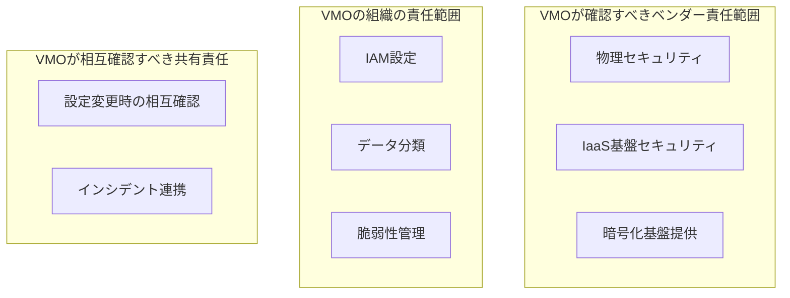
```mermaid
graph TB
    subgraph "VMOが確認すべきベンダー責任範囲"
    A1[物理セキュリティ]
    A2[IaaS基盤セキュリティ]
    A3[暗号化基盤提供]
    end
    
    subgraph "VMOの組織の責任範囲"
    B1[IAM設定]
    B2[データ分類]
    B3[脆弱性管理]
    end
    
    subgraph "VMOが相互確認すべき共有責任"
    C1[設定変更時の相互確認]
    C2[インシデント連携]
    end
```

**ベンダーに要求すべきデータ保護条項**：

| 論点 | 契約に記載すべき内容 |
|------|---------------------------|
| データ分類 | 機密・内部・公開データの取扱範囲を明記 |
| 暗号化 | 静止時＋送信時AES256以上、顧客管理鍵（BYOK）対応 |
| バックアップ | 14日間保持、暗号化、顧客自己取得可能 |
| 削除 | 論理削除＋物理削除証明書（NIST 800-88準拠） |
| 監査権 | 年1回の監査実施権、SOC2レポート提出義務 |

**VMOが要求すべきセキュリティインシデント対応フロー**：

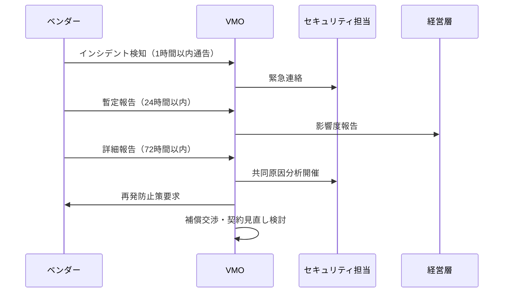
```mermaid
sequenceDiagram
    participant ベンダー
    participant VMO
    participant セキュリティ担当
    participant 経営層
    
    ベンダー->>VMO: インシデント検知（1時間以内通告）
    VMO->>セキュリティ担当: 緊急連絡
    ベンダー->>VMO: 暫定報告（24時間以内）
    VMO->>経営層: 影響度報告
    ベンダー->>VMO: 詳細報告（72時間以内）
    VMO->>セキュリティ担当: 共同原因分析開催
    VMO->>ベンダー: 再発防止策要求
    VMO->>VMO: 補償交渉・契約見直し検討
```

<br>

### 4.5 継続監視ダッシュボード

**VMOが月次で確認すべきKPI**（ServiceNow等で自動化）：

```markdown
■ サービス品質
□ 可用性実績: 前月99.92%（目標99.95% → 未達）
□ P1インシデント遅延: 0/2件（目標0件 → 達成）
□ セキュリティ更新適用率: 95%（目標100% → 要改善）

■ コスト
□ 利用率乖離: ライセンス-15%（未使用削減機会）
□ 従量課金予算比: +8%（予算超過リスク）

■ リスク
□ セキュリティインシデント: 0件（目標0件 → 達成）
□ SLA違反: 1件（改善計画要求）
```

**VMOの四半期ガバナンス実施項目**：
1. コスト超過要因分析 → 削減案策定
2. セキュリティ態勢評価 → 改善計画
3. サービスカタログ見直し → 不要サービス削減
4. 次年度契約条件交渉 → 自動更新停止判断

---

## 第5章：VMOの組織内での役割と連携

### 5.1 VMOの組織上の位置づけ

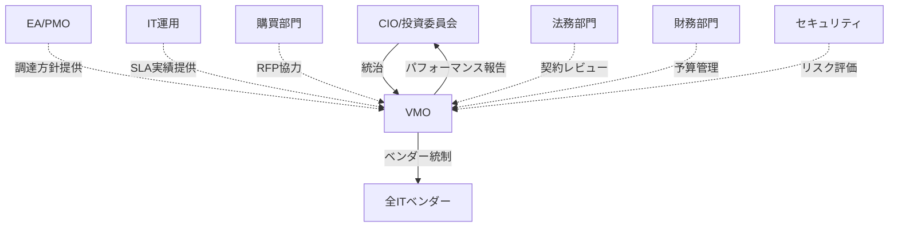
```mermaid
graph TB
    A[CIO/投資委員会] -->|統治| B[VMO]
    C[EA/PMO] -.調達方針提供.-> B
    D[IT運用] -.SLA実績提供.-> B
    B -->|ベンダー統制| E[全ITベンダー]
    
    F[購買部門] -.RFP協力.-> B
    G[法務部門] -.契約レビュー.-> B
    H[財務部門] -.予算管理.-> B
    I[セキュリティ] -.リスク評価.-> B
    
    B -->|パフォーマンス報告| A
```

<br>

### 5.2 VMOの主要な連携先と役割分担（RACI）

**調達プロセスでのVMOの役割**：

| 活動 | VMO | EA/PMO | ITサービスMGR | サービスオーナー | 購買 | 財務 | 法務 | セキュリティ |
|------|------------|---------|---------------|-----------------|------|------|------|--------------|
| 要件定義 | I | C | R | **A** | I | I | I | C |
| RFP作成 | **C** | R | C | C | **R** | I | C | C |
| ベンダー評価 | **R** | C | R | C | C | I | I | C |
| 契約交渉 | **A** | I | I | C | R | C | R | C |
| SLA監視 | **C** | I | A | R | I | I | I | C |
| 月次レビュー | **R** | I | R | **A** | C | I | I | C |
| 契約更新 | **R** | C | C | C | **A** | R | R | C |

**凡例**：
- **R: Responsible（VMOが実行）**
- **A: Accountable（VMOが最終責任）**
- **C: Consulted（VMOが相談を受ける）**
- **I: Informed（VMOに情報共有される）**

<br>

### 5.3 運用フェーズでのVMOの役割（RACI）

| 活動 | VMO | サービスオーナー | ITサービスマネージャ | セキュリティ | 購買 | 財務 | 法務 |
|------|------------|-----------------|-------------------|-------------|------|------|------|
| SLA/KPI日常モニタリング | **R/C** | R | **A** | C | I | I | I |
| 月次/四半期レビュー・報告 | **R** | **A** | R | C | C | C | I |
| インシデントエスカレーション | **C** | C | R/A | R | I | I | I |
| 契約違反/SLA未達是正要求 | **R** | **A** | R | C | C | C | C |
| 契約更新/更改交渉 | **R** | C | C | C | **A** | R | R |
| 機能追加/チェンジ依頼 | **C** | **A** | R | C | C | C | C |
| ベンダー評価・スコアリング | **A** | C | R | C | C | I | I |
| リスク/セキュリティ監査 | **R** | C | I | R/**A** | I | I | C |
| オフボーディング/契約終了 | **R** | **A** | R | R | R | R | R/A |

**VMOが「A（最終責任）」を持つ活動**：
- 契約交渉
- ベンダー評価・スコアリング

**VMOが「R（実行責任）」を持つ活動**：
- 月次/四半期レビュー
- 契約違反是正要求
- 契約更新交渉
- リスク監査
- オフボーディング

<br>

### 5.4 エスカレーションルート

**VMOが問題をエスカレーションする経路**：

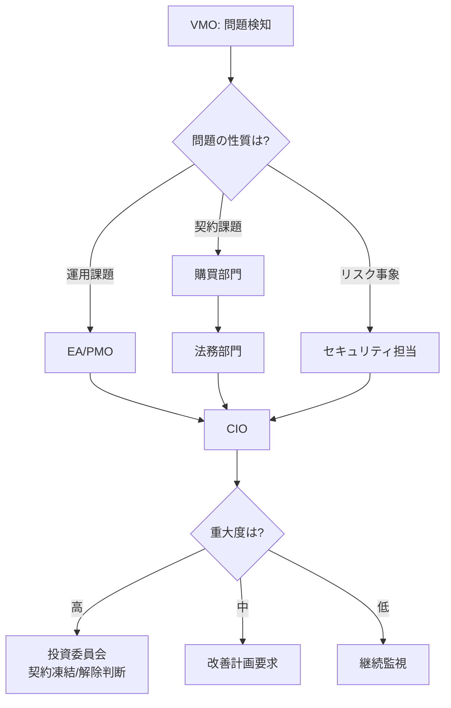
```mermaid
graph TD
    A[VMO: 問題検知] --> B{問題の性質は?}
    B -->|運用課題| C[EA/PMO]
    B -->|契約課題| D[購買部門]
    B -->|リスク事象| E[セキュリティ担当]
    
    C --> F[CIO]
    D --> G[法務部門] --> F
    E --> F
    
    F --> H{重大度は?}
    H -->|高| I[投資委員会<br/>契約凍結/解除判断]
    H -->|中| J[改善計画要求]
    H -->|低| K[継続監視]
```

**エスカレーションすべきケース**：
- SLA連続未達（2ヶ月以上）→ EA/PMO → CIO
- 契約違反・法的問題 → 購買 → 法務 → CIO
- セキュリティインシデント → セキュリティ担当 → CIO → 投資委員会
- 財務悪化・事業継続リスク → CIO → 投資委員会

---

## 第6章：成果を測る指標（KPI）

### 6.1 VMOの個人KPI

**VMOの業績評価に使われるKPI**：

| KPI分類 | 指標 | 目標値 | 測定頻度 |
|---------|------|--------|----------|
| **効率性** | ベンダーレビュー実施率 | 100% | 月次 |
| **効率性** | 契約更新リードタイム | 90日前開始率100% | 四半期 |
| **コスト** | TCO削減率 | 年7% | 年次 |
| **コスト** | 契約自動更新停止率 | 50%以上 | 年次 |
| **品質** | SLA達成ベンダー比率 | 90%以上 | 月次 |
| **品質** | ベンダー起因重大インシデント | 0件 | 月次 |
| **リスク** | リスク評価更新率 | 100% | 四半期 |
| **リスク** | オフボーディング遅延 | 0件 | 四半期 |

<br>

### 6.2 VMO組織全体のKPI

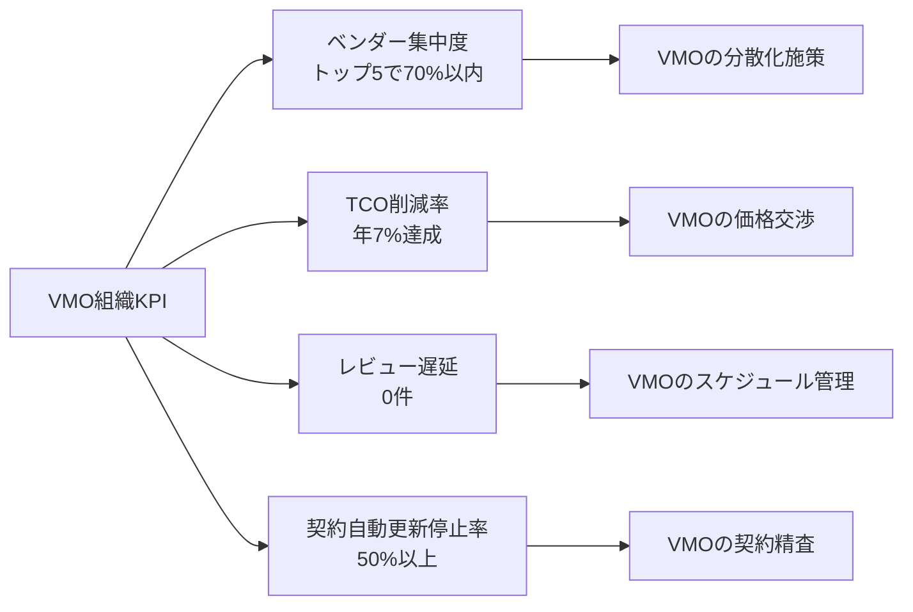
```mermaid
graph LR
    A[VMO組織KPI] --> B[ベンダー集中度<br/>トップ5で70%以内]
    A --> C[TCO削減率<br/>年7%達成]
    A --> D[レビュー遅延<br/>0件]
    A --> E[契約自動更新停止率<br/>50%以上]
    
    B --> F[VMOの分散化施策]
    C --> G[VMOの価格交渉]
    D --> H[VMOのスケジュール管理]
    E --> I[VMOの契約精査]
```

<br>

### 6.3 成熟度向上（COBIT準拠）

**VMOの組織の成熟度と、目指すべきレベル**：

| 成熟度レベル | 特徴 | VMOの主要活動 | KPI目標 |
|-------------|------|----------------|---------|
| **Level 1: 初期** | 属人的、プロセス未定義 | 基本台帳作成、緊急対応 | - |
| **Level 2: 管理** | 標準プロセス運用、RACI明確化 | 月次レビュー定着、SLA監視開始 | プロセス遵守率80% |
| **Level 3: 定義** | VMO設置、自動化ツール活用 | 四半期レビュー、TCO分析、リスク評価 | TCO削減7%、レビュー100% |
| **Level 4: 定量** | KPIダッシュボード、予測分析 | 予測モデル構築、戦略的最適化 | リスク予測精度85% |
| **Level 5: 最適化** | 継続的改善、ベンチマーク活用 | 業界ベストプラクティス導入、イノベーション | 業界トップ10%水準 |

**成熟度向上アクション**：

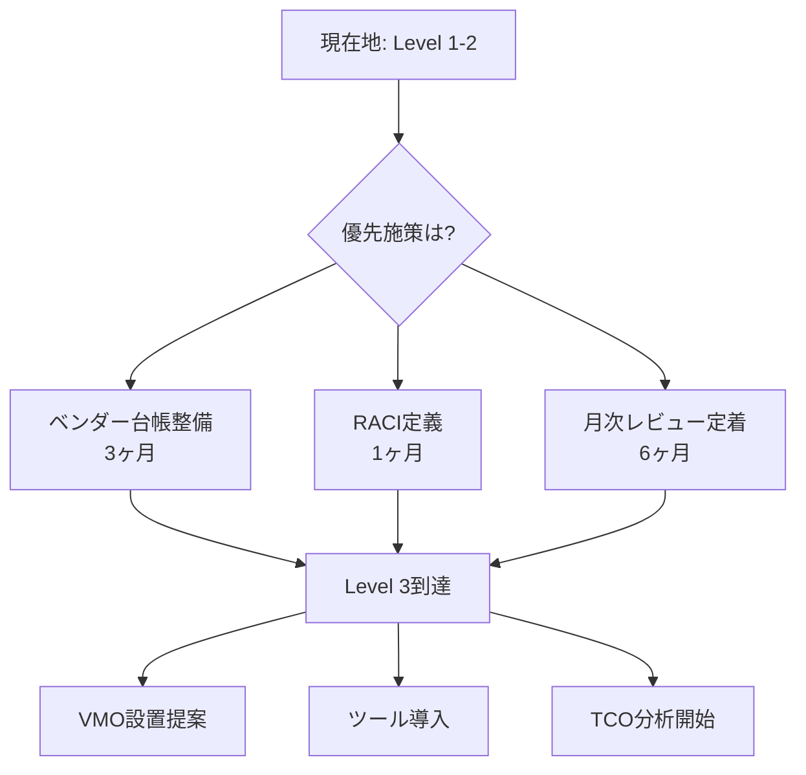
```mermaid
graph TD
    A[現在地: Level 1-2] --> B{優先施策は?}
    B --> C[ベンダー台帳整備<br/>3ヶ月]
    B --> D[RACI定義<br/>1ヶ月]
    B --> E[月次レビュー定着<br/>6ヶ月]
    
    C --> F[Level 3到達]
    D --> F
    E --> F
    
    F --> G[VMO設置提案]
    F --> H[ツール導入]
    F --> I[TCO分析開始]
```

<br>

### 6.4 VMOが活用すべきツール

**業務を効率化するツール構成**：

| カテゴリ | ツール例 | VMOの用途 |
|---------|----------|-------------|
| 契約管理 | DocuSign | 電子契約、ベンダー台帳管理、更新アラート |
| SLA監視 | ServiceNow | KPI自動収集、ダッシュボード、レポート生成 |
| 調達管理 | Ariba | RFP配布、入札管理、承認ワークフロー |
| リスク管理 | OneTrust | ベンダーリスクスコアリング、監査管理 |

**ダッシュボード例**：

```mermaid
graph LR
    A[VMOの統合ダッシュボード] --> B[契約管理<br/>DocuSign]
    A --> C[SLA監視<br/>ServiceNow]
    A --> D[コスト分析<br/>Coupa]
    A --> E[リスクスコア<br/>OneTrust]
    
    B --> F[更新期限アラート]
    C --> G[SLA達成率]
    D --> H[TCO実績]
    E --> I[リスクレベル変化]
```

<br>

### 6.5 スキル向上ロードマップ

**習得すべきスキルと推奨研修**：

```mermaid
graph TD
    A[Level 1: 基礎<br/>全関係者向け] --> B[COBIT APO10/BAI03研修<br/>4時間]
    B --> C[Level 2: 実務<br/>VMO向け]
    C --> D[ITIL契約管理・SLA設計<br/>2日間]
    C --> E[ベンダー評価・リスク管理<br/>1日間]
    E --> F[Level 3: 専門<br/>VMOの上級スキル]
    D --> F
    F --> G[交渉術・TCO分析<br/>1週間]
    F --> H[COBIT実装・監査<br/>2週間]
```

**コアスキル**：
- 契約管理（契約書レビュー、条項交渉）
- SLA設計・管理（KPI定義、モニタリング）
- ベンダー評価（スコアリング、リスク評価）
- 交渉力（価格交渉、条件改善）
- TCO分析（コスト最適化、ROI評価）
- リスク管理（COBIT、ISO準拠）
- プロジェクトマネジメント（PMBOKレベル）

---

## 第7章：VMOの実践チェックリスト

### 7.1 日常業務チェックリスト

**週次タスク**：
```markdown
□ 月曜: SLA実績レポート確認（全ベンダー）
□ 火曜: 新規インシデントレビュー、エスカレーション判断
□ 水曜: 契約更新期限90日前ベンダーリストアップ
□ 木曜: 四半期レビュー予定ベンダーとの日程調整
□ 金曜: ベンダー台帳更新、週次サマリー作成
```

**月次タスク**：
```markdown
□ 第1週: 月次レビューミーティング開催（全重要ベンダー）
□ 第2週: SLA/KPIダッシュボード更新、未達ベンダーに改善要求
□ 第3週: 新規調達案件のRFP支援、評価マトリクス準備
□ 第4週: VMO月次レポート作成、CIO報告
```

<br>

### 7.2 四半期業務チェックリスト

**四半期タスク**：
```markdown
□ 戦略・重要ベンダーの四半期レビュー実施
□ TCO実績分析、コスト削減機会抽出
□ リスクスコア再評価（全ベンダー）
□ 契約更新交渉開始（更新3ヶ月前ベンダー）
□ ベンダーポートフォリオ最適化検討（集中度、代替性）
□ VMO四半期報告書作成、投資委員会報告
```

<br>

### 7.3 年次業務チェックリスト

**年次タスク**：
```markdown
□ 全ベンダーの年次評価実施、評価シート更新
□ 年間TCO削減実績集計、目標達成度確認
□ ベンダー台帳全件監査、休眠ベンダー整理
□ 次年度のベンダーマネジメント方針策定
□ VMO組織KPI達成度評価、改善計画立案
□ 調達プロセス見直し、ツール・テンプレート更新
□ スキル向上研修計画策定、認定資格取得
```

<br>

### 7.4 緊急時対応チェックリスト

**インシデント発生時**：
```markdown
□ 1時間以内: ベンダーから状況報告受領、影響範囲確認
□ 2時間以内: サービスオーナー、ITサービスMGRに連絡
□ 4時間以内: 暫定報告受領、エスカレーション判断
□ 24時間以内: 詳細報告受領、改善計画要求
□ 1週間以内: 根本原因分析会議開催、再発防止策合意
□ 2週間以内: 契約条項見直し、補償交渉
```

---

## 付録A：VMOが使えるテンプレート集

### A.1 ベンダー台帳テンプレート

```markdown
| ベンダーID | ベンダー名 | 分類 | 契約種別 | 年額 | 契約期間 | 担当者 | リスクスコア | 次回レビュー日 |
|-----------|----------|------|---------|------|---------|--------|------------|---------------|
| V001 | XX株式会社 | 戦略 | ERP保守 | 5,000万円 | 2024/4-2027/3 | 山田太郎 | 高 | 2026/1/15 |
| V002 | YY株式会社 | 重要 | SaaS | 1,200万円 | 2025/1-2026/12 | 佐藤花子 | 中 | 2026/3/30 |
```

<br>

### A.2 RFP評価マトリクステンプレート

```markdown
| 評価項目 | 配点 | 評価基準 | ベンダーA | ベンダーB | ベンダーC |
|---------|------|---------|----------|----------|----------|
| 機能適合度 | 30点 | 要件充足率 | 25 | 28 | 22 |
| 実績・信頼性 | 20点 | 同業界導入数 | 18 | 15 | 19 |
| セキュリティ | 20点 | 認証取得状況 | 16 | 18 | 14 |
| サポート体制 | 15点 | 対応時間・体制 | 12 | 13 | 10 |
| 価格競争力 | 15点 | TCO評価 | 10 | 12 | 13 |
| **合計** | **100点** | - | **81** | **86** | **78** |
```

<br>

### A.3 月次レビューアジェンダテンプレート

```markdown
# ベンダー月次レビュー
**日時**: 2026年1月15日 14:00-15:00
**ベンダー**: XX株式会社
**参加者**: [VMO、ITサービスMGR、サービスオーナー、ベンダー担当者]

## アジェンダ
1. 前月SLA/KPI実績報告
   - 可用性: 99.92%（目標99.95% → 未達）
   - MTTR: 3.5時間（目標4時間 → 達成）
   - CSAT: 4.2/5（目標4.0 → 達成）

2. 重大インシデント振り返り
   - 1/5 データベース障害（影響: 2時間停止）
   - 原因: パッチ適用時の設定ミス
   - 再発防止策: チェックリスト強化、テスト環境検証

3. 次月アクションプラン
   - 可用性改善策実施
   - 新機能リリース予定

4. エスカレーション事案
   - なし
```

<br>

### A.4 ベンダー評価シートテンプレート

```markdown
# ベンダー年次評価シート
**ベンダー名**: XX株式会社
**評価期間**: 2025年1月-12月
**評価者**: [VMOの名前]

## 評価項目

### 1. サービス品質（40点）
- SLA達成率: 98%（目標95%） → 35/40点
- 重大インシデント: 1件（目標0件） → 減点-5点

### 2. 関係性（30点）
- CSATスコア: 4.2/5 → 25/30点
- コミュニケーション: 良好 → 加点+5点

### 3. コスト（30点）
- TCO削減貢献: 年6%削減 → 25/30点
- 価格交渉協力度: 積極的 → 加点+5点

## 総合評価: 90/100点（A評価）

## 次年度方針
- 継続契約推奨
- 可用性SLA目標引き上げ（99.95% → 99.97%）
- 共創プロジェクト検討
```

<br>

### A.5 オフボーディングチェックリストテンプレート

```markdown
# ベンダーオフボーディングチェックリスト
**ベンダー名**: YY株式会社
**契約終了日**: 2026年3月31日
**担当者**: [VMOの名前]

## 90日前（1月1日）
- [ ] 終了通知正式発行
- [ ] 後任ベンダー選定開始
- [ ] データ移管計画策定開始

## 60日前（1月31日）
- [ ] データ移管計画完成（フォーマット確定）
- [ ] 知識移管スケジュール合意

## 30日前（3月1日）
- [ ] 知識移管完了（運用マニュアル、設定情報）
- [ ] データ抽出・移行完了
- [ ] 並行運用開始

## 契約終了日（3月31日）
- [ ] 全アカウント無効化
- [ ] VPN切断
- [ ] アクセス権削除

## 14日以内（4月14日）
- [ ] データ削除証明書取得
- [ ] 最終請求精算完了

## 30日以内（4月30日）
- [ ] 最終評価レビュー実施
- [ ] ベンダー台帳更新
- [ ] 事後検証完了
```

---

## 付録B：Q&A

### Q1: ベンダーが何社以上になったらVMO設置を検討すべきですか？

**A**: VMOが管理するベンダーが**50社を超えた時点**でVMO設置を強く推奨します。専任組織により管理効率が30%向上します。

---

### Q2: SLA未達のベンダーにどう対処すればいいですか？

**A**: VMOは以下の段階的対応を実施してください：
1. **1回目未達**: 月次レビューで原因確認、改善計画要求
2. **2回目連続未達**: 四半期レビュー前倒し、ペナルティ条項発動（料金減額）
3. **3回目以上**: エスカレーション → 契約解除検討 → CIO判断

---

### Q3: 契約更新交渉で価格削減を引き出すコツは？

**A**: VMOが使える交渉カード：
- **利用実績データ提示**：「実利用率が契約の70%なので、次年度は30%削減希望」
- **競合見積提示**：「他社は同条件で20%安い提案」
- **長期契約提案**：「3年契約なら年15%削減可能か？」
- **ボリューム統合**：「複数契約を統合するので全体で10%削減」

---

### Q4: クラウドベンダーのロックインをどう避けますか？

**A**: VMOが契約前に確認すべきこと：
- データエクスポートAPI提供（標準フォーマット）
- 設定・構成情報のエクスポート可能性（Terraform対応など）
- 移行支援サービスの提供
- 契約終了時の移管費用上限設定

---

### Q5: ベンダー評価が低い場合、すぐ乗り換えるべきですか？

**A**: VMOは以下を考慮して判断してください：
- **評価60点未満**: 改善計画3ヶ月実施 → 改善なしなら乗り換え検討
- **評価60-75点**: 条件見直し交渉、サービスレベル引き上げ要求
- **評価75点以上**: 継続、戦略的関係強化

---

## 付録C：ITIL準拠 L1-L3問題解決フロー

| レベル | 担当 | VMOが契約に記載すべき業務範囲 | SLA目標 |
|--------|------|-------------------------------|---------|
| L1 | 社内ヘルプデスク | 受付、初期トリアージ、FAQ対応 | 15分応答 |
| L2 | 運用ベンダー | 標準障害復旧、ログ解析、パッチ適用 | 4時間解決 |
| L3 | 開発ベンダー | カスタムコード修正、設計変更 | 48時間解決 |
| L4 | 製品ベンダー | プロダクトバグ修正、機能追加 | 次リリース対応 |

<br>

**ITIL準拠：L1-L3問題解決フロー**：

```mermaid
sequenceDiagram
    participant User as エンドユーザー
    participant L1 as L1: 社内ヘルプデスク
    participant L2 as L2: 運用ベンダー
    participant L3 as L3: 開発ベンダー
    participant VMO as VMO（監視）
    
    Note over User,VMO: インシデント発生・受付フェーズ
    User->>L1: インシデント報告
    L1->>L1: インシデント登録（インシデントID発行）
    L1->>VMO: インシデント通知（SLA監視開始）
    
    Note over L1: 初期トリアージ・分類
    L1->>L1: 重要度判定（P1/P2/P3）
    L1->>L1: 初期調査（FAQ/ナレッジ検索）
    
    alt L1で解決可能（FAQ/既知の問題）
        L1->>User: 解決策提供（15分以内応答）
        L1->>L1: 解決確認
        L1->>User: 解決確認・クロージャ
        L1->>VMO: 解決報告（SLA達成）
    else L1で解決不可（標準手順外）
        L1->>L2: エスカレーション（インシデント情報引き継ぎ）
        
        Note over L2: L2対応フェーズ
        L2->>L2: 詳細調査（ログ解析・設定確認）
        L2->>VMO: 対応状況報告（4時間以内解決目標）
        
        alt L2で解決可能（標準復旧手順）
            L2->>L2: 復旧作業実施（パッチ適用・設定変更）
            L2->>L1: 解決報告・ナレッジ共有
            L1->>User: 解決通知
            L2->>L2: 解決確認
            L2->>VMO: 解決報告（SLA達成）
        else L2で解決不可（カスタムコード/設計変更必要）
            L2->>L3: エスカレーション（技術情報・ログ引き継ぎ）
            
            Note over L3: L3対応フェーズ
            L3->>L3: 根本原因分析（コードレビュー・設計確認）
            L3->>VMO: 対応状況報告（48時間以内解決目標）
            L3->>L3: 修正作業実施（コード修正・設計変更）
            L3->>L3: テスト・検証
            L3->>L2: 修正内容報告・引き継ぎ
            L2->>L1: 解決報告・ナレッジ共有
            L1->>User: 解決通知
            L3->>VMO: 解決報告（SLA達成）
        end
    end
    
    Note over User,VMO: クロージャ・改善フェーズ
    VMO->>VMO: SLA達成確認・ナレッジベース更新確認
    VMO->>L1: 必要に応じて改善要求
```

---

## 付録D：Follow-the-sun モデル

**JST基準のタイムゾーン対応表:**

| JST時刻 | 稼働拠点 | 現地時刻（参考） |
|---------|----------|----------------|
| 09:00-18:00 | **APAC** | JST 09:00-18:00 |
| 17:00-02:00 | **EMEA** | CET 09:00-18:00 / GMT 08:00-17:00 |
| 23:00-08:00 | **Americas** | EST 09:00-18:00 / BRT 11:00-20:00 |

<br>

**Follow the Sun：48時間カバレッジ（JST基準・2日間表示）**

```mermaid
gantt
    dateFormat YYYY-MM-DD HH:mm
    axisFormat %d日 %H:00 JST
    
    section 1日目 APAC
    APAC 09:00-18:00    :apac1, 2024-01-01 09:00, 9h
    
    section 1日目 EMEA
    EMEA 17:00-02:00    :emea1, 2024-01-01 17:00, 9h
    
    section 1日目 Americas
    Americas 23:00-08:00    :americas1, 2024-01-01 23:00, 9h
    
    section 2日目 APAC
    APAC 09:00-18:00    :apac2, 2024-01-02 09:00, 9h
    
    section 2日目 EMEA
    EMEA 17:00-02:00    :emea2, 2024-01-02 17:00, 9h
    
    section 2日目 Americas
    Americas 23:00-08:00    :americas2, 2024-01-02 23:00, 9h
    
    section 引き継ぎ（1日目）
    APAC→EMEA    :crit, 2024-01-01 17:00, 1h
    EMEA→Americas    :crit, 2024-01-02 01:00, 1h
    Americas→APAC    :crit, 2024-01-02 08:00, 1h
    
    section 引き継ぎ（2日目）
    APAC→EMEA    :crit, 2024-01-02 17:00, 1h
    EMEA→Americas    :crit, 2024-01-03 01:00, 1h
```

<br>

**3拠点同時開催の会議枠**

| タイムゾーン | 地域 | 会議時間 | 評価 | コメント |
|------------|------|---------|------|---------|
| **JST (UTC+9)** | 🇯🇵 日本 | **22:00-23:00** | ⭐ | 夜だが許容範囲内 |
| **GMT (UTC+0)** | 🇬🇧 イギリス | **13:00-14:00** | ⭐⭐⭐⭐ | ランチ後の良い時間 |
| **EST (UTC-5)** | 🇺🇸 米国東部 | **08:00-09:00** | ⭐⭐ | 朝の良い時間帯 |
| **PST (UTC-8)** | 🇺🇸 米国西海岸 | **05:00-06:00** | ❌ | 早朝すぎる |
| **IST (UTC+5:30)** | 🇮🇳 インド | **18:30-19:30** | ⭐⭐⭐ | 夕方の良い時間 |

<br>

**JST 22:00-23:00（GMT 13:00-14:00）は、以下の拠点にとって非常に良い選択:**

1. **ドイツ/イギリス（EMEA）**: 午後の理想的な時間
2. **米国東部（Americas）**: 早朝だが、DayLightSavingの時期は適切な時間
3. **インド（APAC）**: 夕方で参加しやすいが、業務時間外ではある
4. **日本/シンガポール（APAC）**: 60分会議なら許容範囲だが、インターバル制度がある場合は翌日の開始時刻に影響あり
5. ❌ **米国西海岸**: 05:00で早朝すぎて非現実的
